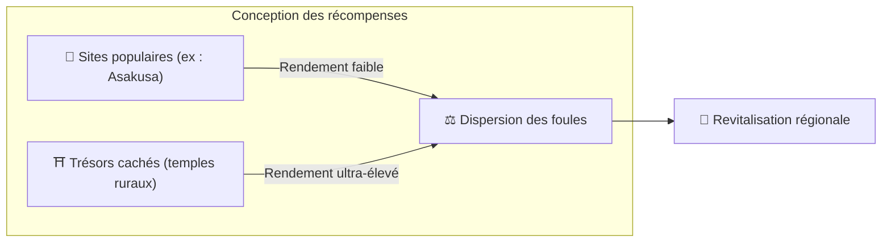

# ⛏️ Les trois piliers du mining

> **Preuve d'Action (Proof of Action)**
> Matsuri Coin ne se mine pas avec des GPU, mais avec **l'action humaine**.

L'application web et le tableau de bord administrateur sont **déjà en ligne** — commencez à gagner **dès maintenant** grâce aux activités ci-dessous.

---

## 1. 📖 Media Mining (Lire, écouter, répondre pour gagner)

**Alimenté par « J-Times », le média officiel**

La connaissance transforme radicalement la qualité du voyage.
Nous récompensons l'apprentissage — lecture, écoute **et** preuve de compréhension par des quiz.

| Action | Ce que vous faites | Récompense |
| :--- | :--- | :--- |
| **📰 Lire pour gagner** | Lire les articles J-Times sur l'histoire, le shinto, le zen | MTC attribués |
| **🎧 Écouter pour gagner** | Écouter des podcasts exclusifs sur la culture japonaise profonde | MTC attribués |
| **✅ Quiz pour gagner** | Réussir les quiz pour prouver la rétention des connaissances | MTC attribués (instantanément) |

:::tip Temps mort → Temps de mining
Trajet, pause déjeuner, vol — chaque moment libre devient une opportunité de gains.
:::

---

## 2. 🤝 Social Mining (Connecter pour gagner)

**Via le tableau de bord GCF Admin — déjà opérationnel**

Les membres GCF ont accès au **« GCF Admin Web »** dédié.

| Fonctionnalité | Ce que vous pouvez faire |
| :--- | :--- |
| **🎪 Création d'événements** | Planifier et publier vos propres événements et circuits |
| **📢 Distribution de contenu** | Amplifier les articles J-Times et le contenu à travers votre réseau |
| **📊 Suivi des parrainages** | Suivre en temps réel l'activité et les revenus des utilisateurs parrainés |

:::info Versements automatiques
Chaque fois qu'un ami parrainé effectue une transaction, le système dépose **automatiquement** votre part de revenus dans votre portefeuille.
:::

---

## 3. 🗺️ Adventure Mining (Marcher pour gagner)

**Projet « PÈLERINAGE » — prochaine phase (en développement)**

Une fonctionnalité de nouvelle génération utilisant le GPS et les incitations en tokens pour redistribuer le flux physique des touristes.

> **« Les gens vont en province parce que c'est plus rentable. »**
> Cette logique économique résout le surtourisme et accélère la revitalisation régionale.

### 🎲 Le protocole « Omikuji »

Un smart contract de type tirage au sort déclenché **gratuitement (gas uniquement)** lors de l'enregistrement.

| Résultat | Ce que vous recevez |
| :--- | :--- |
| **🎊 Grande fortune** | Airdrop bonus de MTC |
| **📜 NFT Drop** | **« Goshuin NFT »** exclusif au lieu visité |
| **🏆 Collection complète** | Compléter un set déverrouille l'accès à des événements spéciaux |

:::note Ce n'est pas du jeu d'argent
Aucune mise requise. Simplement un bonus aléatoire pour **avoir fait le déplacement**.
:::

---

## 4. 🏦 Liquidity Mining (Fournir pour gagner)

> **Devenez la banque.**

Nous proposons un programme de récompenses spécial pour les utilisateurs fournissant de la liquidité MTC/SOL sur Raydium.

| Élément | Détails |
| :--- | :--- |
| **Qui** | Fournisseurs de liquidité précoces (« partenaires fondateurs ») |
| **APY cible** | **50 %** (fixé comme prime de risque) |
| **Pourquoi** | Assurer la liquidité initiale pour un environnement de trading stable |

---

**[▶ Suivant : Feuille de route et équipe](/docs/roadmap)** ｜ **[◀ Précédent : L'économie](/docs/economy)**
