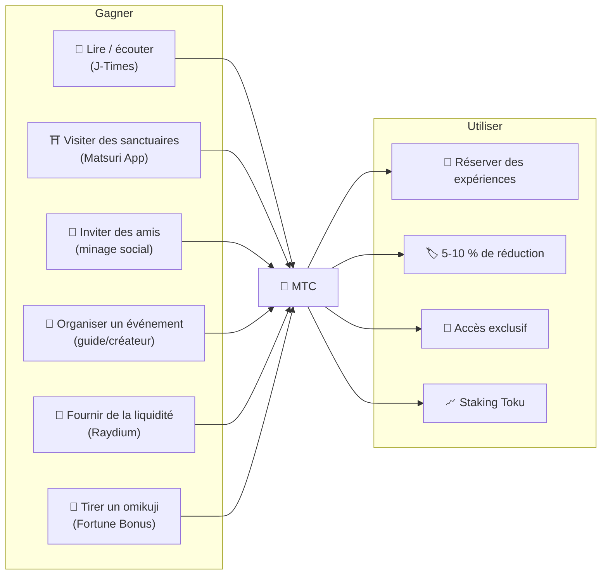
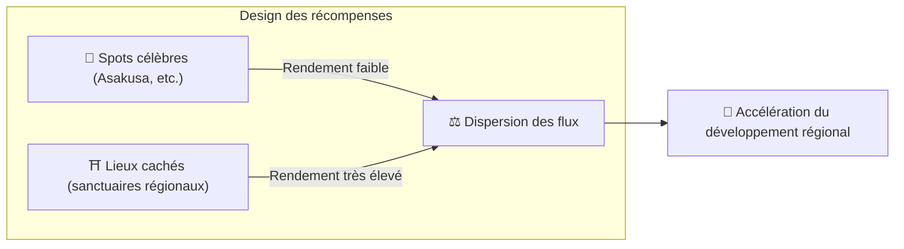
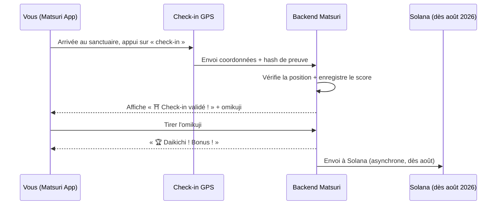
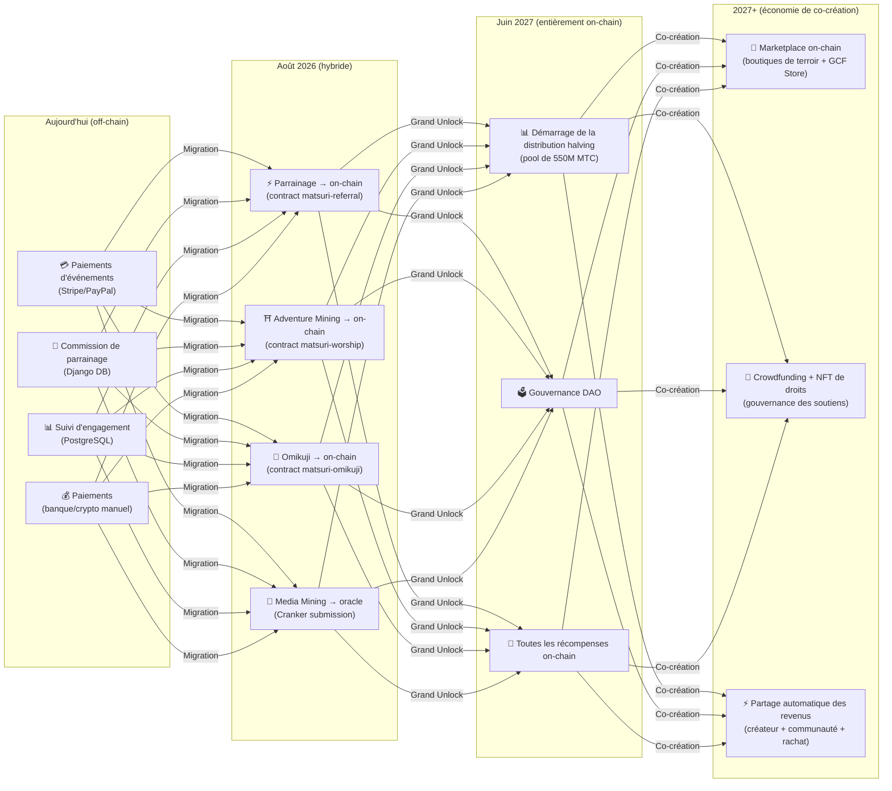

# ⛏️ Les cinq piliers du minage et comment gagner

> **Tout « lien » avec la culture devient directement de la valeur.**
> Lire, marcher, se connecter, créer, soutenir —— chacun de vos gestes génère des MTC.

<small>*※ Qu'est-ce que le « minage » ? —— Sur Bitcoin et consorts, des ordinateurs exécutent des calculs massifs et reçoivent en retour des coins : on parle de « minage ». Sur MTC, ce n'est pas la puissance de calcul qui mine mais **vos propres actions** —— lire un article, visiter un sanctuaire, organiser un événement. Au lieu d'extraire de l'or, ce sont vos liens à la culture qui produisent des MTC. Voilà notre « minage ».*</small>

> Gagner en agissant. Dépenser dans des expériences. Conserver pour grandir.

MTC n'est pas un jeton spéculatif. Chaque action produit de la valeur et circule dans une économie réelle. Le site web et le tableau de bord **fonctionnent déjà**. Pour l'instant, les scores de contribution sont enregistrés off-chain (Django) ; ils migreront progressivement on-chain à partir d'août 2026.

:::tip Vue d'ensemble
MTC possède une **économie circulaire complète** : on gagne par l'activité réelle, on dépense dans des expériences réelles, et la valeur croît à mesure que l'écosystème s'étend. Cette page en détaille le mécanisme.
:::

---

## Cycle de vie de MTC

---

## Les 5 piliers du minage

### 1. 📖 Media Mining (gagnez en lisant, écoutant et répondant)

**Intégré au média officiel « J-Times »**

Le savoir améliore radicalement la qualité du voyage. Ouvrez l'**app J-Times** et profitez de contenu sur la culture japonaise. Outre l'apprentissage par texte et audio, nous récompensons les **tests de compréhension (quizz)**. Chaque action achevée octroie automatiquement des MTC.

| Action | Condition | Récompense estimée |
| :--- | :--- | :---: |
| **📰 Lire un article** | Scroll jusqu'à 75 % | 2–30 MTC |
| **🎧 Écouter un podcast** | Lecture jusqu'à la fin | 2–30 MTC |
| **🎬 Regarder une vidéo** | Fermer les détails après visionnage | 2–30 MTC |
| **📤 Partager du contenu** | Afficher la feuille de partage | 2–30 MTC |
| **✅ Répondre à un quizz** | Réussir le test de compréhension | 2–30 MTC |

<small>*※ La récompense varie selon le type et la durée du contenu et l'équilibre global de l'offre*</small>

:::tip Les moments libres deviennent minage
Trajets et pauses se transforment en temps qui produit de la récompense.
:::

:::info Support hors ligne
Pas de réseau dans un sanctuaire rural ? Pas de problème. J-Times enregistre l'activité localement et **la synchronise automatiquement au retour de la connexion** (file d'attente hors ligne de 7 jours). Vous ne perdez aucun MTC.
:::

**Ce qui se passe en coulisses :**
1. L'app J-Times détecte votre action (lecture achevée, visionnage complet, partage…)
2. Elle est enregistrée localement, même hors ligne (7 jours)
3. Au retour du réseau, elle est envoyée au serveur pour vérification
4. Elle apparaît comme score de contribution dans votre solde
5. À partir d'août 2026 : les scores vérifiés sont enregistrés on-chain via oracle et vérifiables sur la blockchain

---

### 2. ⛩️ Adventure Mining (gagnez en marchant)

**Projet « Pèlerinage » ── Smart contract finalisé, déploiement mainnet en août 2026**

Fonction de nouvelle génération qui exploite le GPS et des incitations en jeton pour piloter physiquement le « flux des personnes ». La carte des sites sacrés **est déjà active** dans la Matsuri Web App. Pour l'instant, les scores de contribution sont en off-chain ; le versement des récompenses on-chain démarrera après le déploiement du smart contract en août 2026.

>**On gagne, donc on part en région.**
> Cette rationalité économique résout le surtourisme et accélère la revitalisation régionale.

**Comment fonctionne le check-in :**

**Principe fondamental — moins il y a de visiteurs, plus on gagne :**

| Type de site | Exemple | Récompense par check-in |
| :--- | :--- | :---: |
| 🏙️ **Majeur** | Sensō-ji, Kiyomizu-dera, Fushimi Inari | 30–50 MTC |
| 🌆 **Régional central** | Ichinomiya des préfectures, grands sanctuaires régionaux | 50–100 MTC |
| 🏞️ **Régional** | Sanctuaires historiques des régions | 100–150 MTC |
| ⛰️ **Frontière** | Temples de montagne, sites sacrés insulaires | 150–200 MTC |

<small>*※ Valeurs de base. Les multiplicateurs d'omikuji peuvent multiplier plusieurs fois*</small>

**Facteurs additionnels :**
- **Multiplicateur d'omikuji** — Bonus aléatoire par check-in. Avec un daikichi, la récompense est multipliée plusieurs fois
- **Fréquence de visite** — Les visiteurs réguliers gagnent davantage avec le temps
- **Sites sponsorisés** — Des collectivités peuvent booster des sites spécifiques

:::info Score de contribution → MTC
Votre activité s'accumule en **score de contribution**. À chaque époque de halving (à partir de juin 2027), les scores sont convertis en MTC à partir du pool de minage de 550 M. Plus votre contribution à la communauté est élevée, plus vous recevez de MTC. Les coefficients de boost exacts seront fixés progressivement et implémentés dans le smart contract ── garantissant une répartition équitable cohérente avec la taille réelle du pool.
:::

---

### 3. 🤝 Minage social (gagnez en vous connectant)

Il suffit de parrainer des amis pour gagner des MTC.

#### Récompense de parrainage pour utilisateurs standard

Le principe est simple. Lorsqu'un ami s'inscrit via votre lien, vous recevez **300 MTC par parrainage direct**.

| Condition | Récompense |
| :--- | :--- |
| Un ami que vous avez invité s'inscrit | **300 MTC** |

C'est tout. Pas de récompense multi-niveaux.

#### Récompenses de parrainage pour les agents GCF

Les [membres GCF](/docs/gcf) sont des **agents officiels** chargés d'étendre l'écosystème et bénéficient d'une structure plus profonde.

| Couche | Relation | Commission |
| :---: | :--- | :---: |
| **L1** | Parrainage direct | **20 %** |
| **L2** | Parrainage du parrainé | **5 %** |
| **L3** | Troisième niveau | **5 %** |
| **L4** | Quatrième niveau | **5 %** |

:::note À propos du système d'agents GCF
Ces récompenses multi-niveaux s'appliquent uniquement aux agents officiels disposant d'une adhésion GCF (sur invitation). Les utilisateurs standard ne perçoivent que la récompense de parrainage direct (300 MTC).
Les commissions des agents GCF sont calculées sur l'**activité économique réelle des filleuls** (achats d'expériences, participation à des événements, etc.). Rassembler des gens sans impact réel ne rapporte rien.
:::

**Calcul du score En-Mining (pour les agents GCF) :**

Le score de contribution repose sur deux composantes :
- **Étendue du réseau** (30 %) — Combien de personnes avez-vous amenées
- **Activité économique** (70 %) — Les achats réels issus de votre réseau

Le score s'accumule dans le temps et se convertit en MTC à chaque époque de halving.

#### Tableau de bord GCF ── version web en marche

Les membres GCF accèdent à un tableau de bord dédié.

| Fonction | Ce que vous pouvez faire |
| :--- | :--- |
| **🎪 Créer des événements** | Concevoir et publier vos propres événements et tours |
| **📢 Distribuer du contenu** | Diffuser les articles et contenus J-Times |
| **📊 Suivi des parrainages** | Suivre en temps réel le comportement et les revenus de vos filleuls |

:::warning Aujourd'hui off-chain → migration on-chain en août 2026
Les commissions de parrainage sont suivies dans Django (PostgreSQL) et payées par virement ou crypto. À partir d'**août 2026**, migration vers le **smart contract Matsuri Referral** sur Solana, avec paiements auditables on-chain.
:::

  

*Rencontre communautaire à Golden Gai —— les liens deviennent puissance de minage.*

---

### 4. 🎓 Minage de créateurs et de guides (gagnez en créant)

Au-delà de la consommation, sur la plateforme Matsuri **tout le monde** peut produire du contenu et le monétiser. Membres GCF, guides et créateurs, voici vos voies de revenus :

| Activité | Mode de revenu |
| :--- | :--- |
| **🗺️ Organiser un tour** | Commission de guide (par événement) + pourboires |
| **🎫 Vendre des billets** | Partage de revenus via EventPurchase |
| **📚 Publier des cours** | Commission par inscription (partage au créateur) |
| **🎙️ Produire des podcasts** | Revenus d'abonnement |
| **🤝 Lancer une campagne de crowdfunding** | Suivi on-chain des contributions (Solana) |
| **🛍️ Ouvrir une boutique utilisateur** | Vente directe d'artisanat et merchandising |

**Système de pourboire :** après l'événement, les invités peuvent laisser un pourboire au guide (style Uber). Les pourboires sont traités via Stripe et affichés sur un classement public.

:::tip Création assistée par IA
Les hôtes peuvent utiliser l'**assistant IA intégré (GPT-4 Turbo)** pour rédiger les descriptions, traduire automatiquement en 5 langues et générer des métadonnées optimisées SEO depuis le tableau de bord.
:::

---

### 5. 🏦 Minage de liquidité (gagnez en déposant)

>**Devenez la banque.**

Apportez de la liquidité à la paire MTC/SOL sur Raydium DEX et soutenez la base de trading initiale de l'écosystème. Les apporteurs initiaux bénéficient d'un programme spécial « partenaires fondateurs ».

| Élément | Détail |
| :--- | :--- |
| **Cible** | Tout utilisateur détenant MTC et SOL |
| **APR visé** | **20 %** (incitation initiale, prime de risque) |
| **DEX** | Raydium (Solana) |
| **Sens** | Sécuriser la liquidité initiale et bâtir un environnement de trading stable |

---

## 🎲 Bonus Omikuji

Chaque check-in d'Adventure Mining inclut un Omikuji (chance) gratuit. Smart contract façon tirage, exécuté **sans frais (gas seulement)** à la validation du check-in.

| Fortune | Multiplicateur | Bonus supplémentaire |
| :--- | :---: | :--- |
| 🏆 **Daikichi** | Base × multiplicateur max | NFT Goshuin |
| ✨ **Kichi** | Base × multiplicateur élevé | — |
| 🌸 **Shōkichi** | Base × petit multiplicateur | — |
| 🍃 **Suekichi** | Base × 1,0 | — |
| 💀 **Kyō** | Base × 1,0 | — |

Probabilités et multiplicateurs sont pilotables depuis le tableau de bord GCF et ajustés selon l'équilibre global de l'offre. Le résultat est décidé par un **protocole commit-reveal infalsifiable** sur Solana ; une fois la phase de commit passée, personne ne peut le modifier.

<small>*※ Même avec un Kyō, la récompense de base est reçue. L'acte de visiter est récompensé en soi*</small>

:::note Ce n'est pas un jeu d'argent
Aucune mise monétaire. C'est un bonus aléatoire attaché à **l'action de visiter**. Collecter certains NFT peut débloquer l'accès à des événements spéciaux.
:::

---

## Utilisations de MTC

| Cas d'usage | Avantage | Disponibilité |
| :--- | :--- | :---: |
| **🎫 Réserver des expériences** | Payer tours, événements et activités culturelles en MTC | ✅ Disponible |
| **🏷️ Réduction** | 5-10 % de remise sur le prix en yens avec paiement MTC | ✅ Disponible |
| **🔑 Accès exclusif** | Événements NFT-gated, rites VIP, tours privés | ✅ Disponible |
| **📈 Staking Toku** | Bloquer des MTC pour booster le score de contribution (jusqu'à ~50 %) | 🔜 Août 2026 |
| **🗳️ Gouvernance DAO** | Voter sur trésorerie, mises à jour et certification de sites | 🔜 2027 |
| **🛍️ Boutiques partenaires** | Payer dans les commerces et restaurants associés | 🔜 En expansion |

:::info MTC comme moyen de paiement
Sur Matsuri App, MTC est un moyen de paiement de premier rang aux côtés de la carte bancaire et de Solana Pay. Aucune conversion requise : à la caisse, choisissez « Payer en MTC » et le débit est immédiat.
:::

### À propos de la conversion de MTC

:::warning Important : nous ne proposons aucun service d'échange ou de conversion de MTC
Matsuri Operations n'est pas enregistrée comme crypto-exchange ; **aucun échange direct entre MTC et devise fiat (yen, dollar, etc.) n'est proposé**.

Pour échanger MTC contre d'autres cryptos ou du fiat, vous pouvez procéder ainsi :
1. Gérer vos MTC dans un wallet Solana tel que **Phantom Wallet**
2. Échanger MTC → SOL sur **Raydium (DEX)**
3. Convertir les SOL en fiat sur un exchange centralisé (CEX)

Un listing sur CEX est envisagé à l'avenir, ce qui simplifiera davantage la conversion.
:::

---

## Exemple : une journée dans l'économie MTC

> **Matin :** Dans le train, vous lisez 3 articles J-Times → vous gagnez des MTC.
> **Après-midi :** Via Matsuri App, vous visitez un sanctuaire régional → check-in, tirage d'omikuji, vous obtenez kichi (×1,5) → encore plus de MTC.
> **Soir :** Avec les MTC gagnés, vous réservez un tour culturel à Golden Gai à 9 000 ¥ avec 10 % de remise (vous payez l'équivalent de 8 100 ¥).
> **Résultat :** Votre curiosité culturelle s'est muée en expérience réelle et le guide, le sanctuaire et la communauté ont été payés directement. Aucune OTA n'a pris 20 %.

---

## Durabilité économique

:::warning Que se passe-t-il si le pool de minage s'épuise ?
Le pool de halving de 550 M MTC est conçu pour durer **des décennies**. L'émission étant divisée par deux tous les deux ans, 100 % n'est jamais atteint mathématiquement et les récompenses se poursuivent sur le long terme (voir [Tokenomics](/docs/tokenomics)). Même lorsque l'émission devient infime :

- Les **frais de transaction** continuent à rétribuer les participants du réseau
- Le **protocole de rachat** (20-25 % des revenus business) génère une pression d'achat permanente
- Le **staking Toku** bloque l'offre en circulation et réduit la pression vendeuse
- Les **revenus réels** (événements, adhésions, cours) soutiennent l'écosystème indépendamment de l'émission

MTC est adossé à une **économie réelle** —— ce n'est pas de la pure émission.
:::

---

## Feuille de route de migration on-chain

L'économie Matsuri migre progressivement d'off-chain (Django/PostgreSQL) vers on-chain (smart contracts Solana). Cette migration rend les opérations **trustless, auditables et sans permissions**.

| Phase | Calendrier | Ce qui passe on-chain |
| :--- | :--- | :--- |
| **Phase 1 (actuelle)** | En marche | Jeton MTC (SPL), LP Raydium, vérification Solana Pay |
| **Phase 2 (août 2026)** | Déploiement des smart contracts sur mainnet | Commissions de parrainage, récompenses Adventure Mining, tirage Omikuji, Media Mining via oracle |
| **Phase 3 (juin 2027)** | Grand Unlock | Distribution halving de 550 M MTC, gouvernance DAO, décentralisation totale |
| **Phase 4 (2027+)** | Économie de co-création | Marketplace on-chain (boutiques de terroir + GCF Store), crowdfunding avec NFT de droits, partage automatique créateur + communauté + rachat |

:::warning Pourquoi ne pas tout basculer on-chain maintenant ?
**Tant que l'audit de sécurité n'est pas terminé, nous n'activons aucune fonction on-chain qui déplace des fonds utilisateurs.** C'est notre principe.

Situation actuelle :
- **Risque pour les fonds utilisateurs : aucun** —— toutes les récompenses et scores sont gérés off-chain (Django) et aucune fonction smart contract déplaçant des fonds utilisateurs n'est active
- **Calendrier d'audit : T2–T3 2026** —— après un audit de sécurité professionnel, les contrats jugés sûrs seront déployés sur mainnet progressivement
- **L'audit est une condition préalable au déploiement** —— aucun smart contract non audité ne sera activé sur mainnet

Les récompenses de la période off-chain sont également vérifiables : chaque transaction inclut une `solana_signature` comme preuve de paiement.
:::

---

**[▶ Suivant : Tokenomics](/docs/tokenomics)** ｜ **[◀ Précédent : Écosystème](/docs/ecosystem)**
