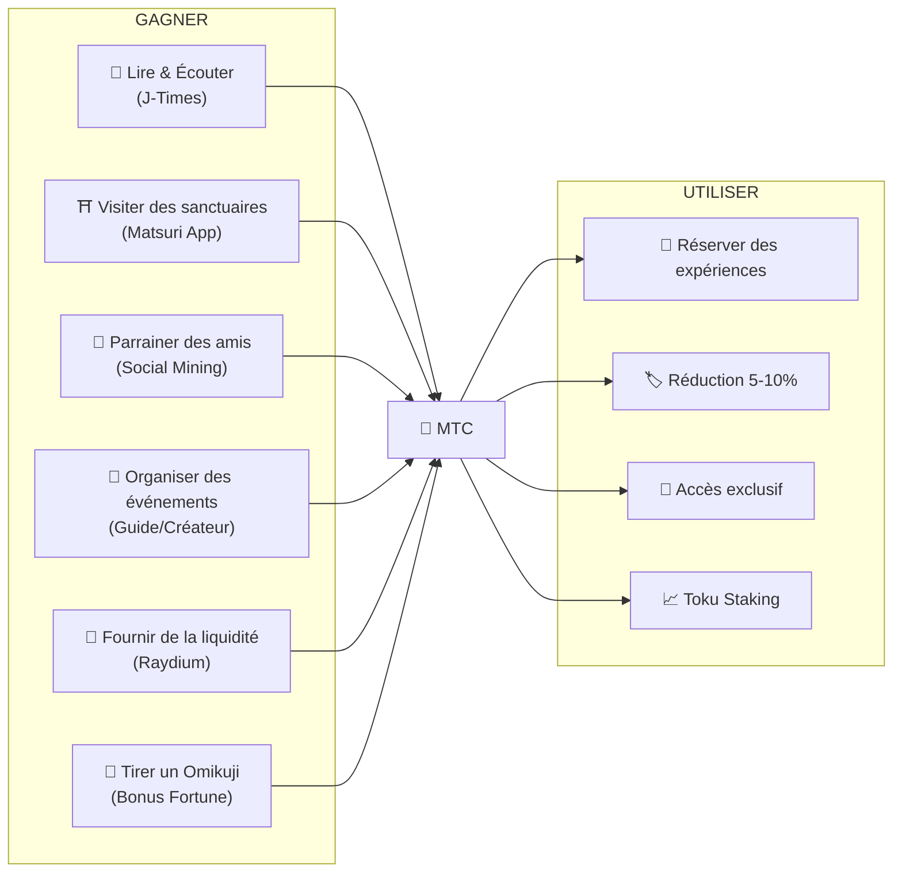
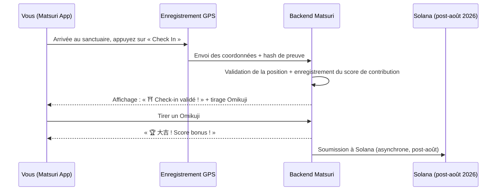
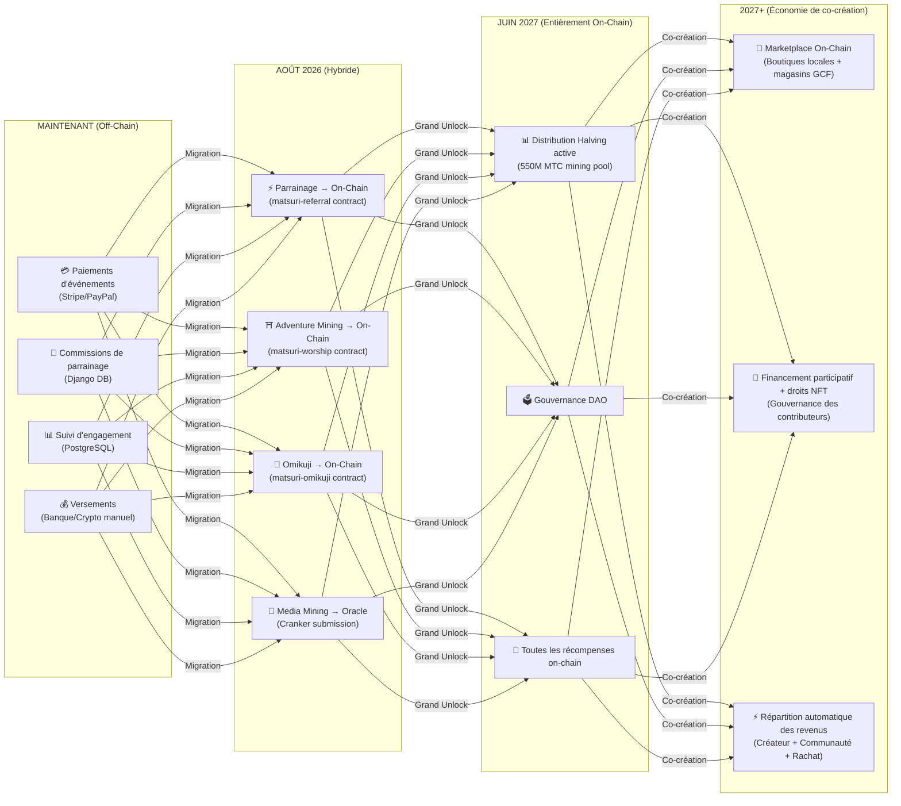

# 💎 Comment gagner et utiliser des MTC

> **Gagnez par l'action. Dépensez pour l'expérience. Détenez pour la croissance.**
> Le MTC n'est pas un simple jeton spéculatif — il circule dans une économie réelle où chaque action crée et capture de la valeur.

:::tip Vue d'ensemble
Le MTC dispose d'une **économie circulaire complète** : vous le gagnez grâce à des activités réelles, vous le dépensez pour des expériences réelles, et sa valeur augmente à mesure que l'écosystème se développe. Cette page vous montre exactement comment.
:::

---

## Le cycle de vie du MTC

---

## Comment gagner des MTC

### 1. 📖 Media Mining — Lire, écouter et regarder sur J-Times

Ouvrez l'application **J-Times** et consultez du contenu sur la culture japonaise. Chaque action complétée rapporte automatiquement des MTC.

| Action | Critère de validation | Récompense |
| :--- | :--- | :---: |
| **Lire un article** | Défiler jusqu'à 75 % du contenu | MTC |
| **Écouter un podcast** | Écoute complète jusqu'à la fin | MTC |
| **Regarder une vidéo** | Quitter l'écran de détail après visionnage | MTC |
| **Partager du contenu** | Feuille de partage présentée | MTC |
| **Compléter un quiz** | Réussir le test de compréhension | MTC (instantané) |

:::info Fonctionnement hors ligne
Pas de connexion internet dans un sanctuaire rural ? Pas de problème. J-Times enregistre votre activité localement et **synchronise automatiquement lorsque vous êtes de nouveau en ligne** (file d'attente hors ligne avec rétention de 7 jours). Vous ne perdez jamais les MTC gagnés.
:::

**Fonctionnement technique :**
1. `EngagementTracker` dans l'application détecte les événements de complétion
2. Les actions sont mises en file d'attente localement (même hors ligne)
3. Au rétablissement du réseau, les actions sont regroupées et envoyées à l'API Django
4. L'API valide et crédite les MTC sur votre solde
5. Après août 2026 : les actions seront soumises on-chain via l'oracle Cranker

---

### 2. ⛩️ Adventure Mining — Visiter des sites sacrés avec Matsuri App

Ouvrez l'application **Matsuri**, trouvez un sanctuaire ou un temple sur la carte des sites sacrés, rendez-vous sur place et enregistrez votre visite. Votre activité est enregistrée comme un **score de contribution**.

**Fonctionnement :**

**Principe fondamental — les sites moins fréquentés rapportent davantage :**

| Type de site | Exemples | Score |
| :--- | :--- | :---: |
| 🏙️ **Majeur** | Sensoji, Kiyomizu-dera, Fushimi Inari | Standard |
| 🌆 **Régional** | Ichinomiya préfectoraux, grands sanctuaires régionaux | Plus élevé |
| 🏞️ **Rural** | Sanctuaires historiques de campagne | Beaucoup plus élevé |
| ⛰️ **Frontière** | Temples de montagne, sites sacrés d'îles éloignées | Le plus élevé |

**Facteurs de score supplémentaires :**
- **Fréquence de visite** — les visiteurs réguliers accumulent davantage au fil du temps
- **Omikuji** — tirage aléatoire de fortune ajoutant un score bonus (大吉 est le meilleur !)
- **Sites Sponsorisés** — les municipalités peuvent booster des sites spécifiques

:::info Score de contribution → MTC
Votre activité s'accumule sous forme de **score de contribution**. À chaque époque de halving (à partir de juin 2027), les scores sont convertis en MTC depuis le pool de minage de 550M. Plus vous contribuez par rapport à la communauté, plus vous recevez de MTC. Les coefficients de boost exacts seront finalisés progressivement et implémentés dans les smart contracts — garantissant une distribution équitable alignée sur la taille réelle du pool.
:::

---

### 3. 🤝 Social Mining — Parrainez des amis et développez votre réseau

Partagez votre code de parrainage. Lorsque votre réseau effectue des transactions, vous gagnez automatiquement.

| Niveau | Relation | Commission |
| :---: | :--- | :---: |
| **L1** | Vous → Ami (direct) | **20 %** |
| **L2** | Ami → Son ami | **5 %** |
| **L3** | 3e degré | **5 %** |
| **L4** | 4e degré | **5 %** |

**Fonctionnement du score En-Mining :**

Votre score de contribution est calculé selon deux facteurs :
- **Portée du réseau** (30 %) — combien de personnes vous amenez
- **Activité économique** (70 %) — achats réels depuis votre réseau de parrainage

> **Point clé :** La majorité de votre score provient de **l'activité économique réelle** de votre réseau, pas simplement des inscriptions. Inviter 1 000 personnes qui ne dépensent jamais rapporte moins qu'inviter 10 utilisateurs actifs.

Les scores s'accumulent au fil du temps et sont convertis en MTC à chaque époque de halving. Les multiplicateurs de boost (ex. staking de MTC, classements saisonniers) seront introduits progressivement via les smart contracts.

:::warning Actuellement Off-Chain → Migration On-Chain en août 2026
Les commissions de parrainage sont actuellement suivies dans Django (PostgreSQL) et versées par virement bancaire ou en crypto. À partir d'**août 2026**, l'intégralité du système de commissions de parrainage migrera vers le **smart contract Matsuri Referral** sur Solana — rendant les paiements trustless, instantanés et auditables on-chain.
:::

---

### 4. 🎪 Creator & Guide Mining — Organisez des événements, créez du contenu

Si vous êtes membre GCF, guide ou créateur de contenu :

| Activité | Comment vous gagnez |
| :--- | :--- |
| **Organiser une visite guidée** | Commission de guide (définie par événement) + pourboires |
| **Vendre des billets d'événement** | Partage de revenus via EventPurchase |
| **Publier un cours** | Frais par inscription |
| **Créer des épisodes de podcast** | Revenus d'abonnement |
| **Lancer une campagne de financement participatif** | Contributions sur Solana |

**Système de pourboires :** Après chaque événement, les participants peuvent donner un pourboire aux guides (style Uber). Les pourboires sont traités via Stripe et suivis sur un classement public.

---

### 5. 🏦 Liquidity Mining — Fournir de la liquidité sur Raydium

Fournissez de la liquidité MTC/SOL sur le DEX Raydium et gagnez des récompenses.

| Élément | Détails |
| :--- | :--- |
| **APY cible** | 20% (incitation à la liquidité précoce) |
| **DEX** | Raydium (Solana) |
| **Qui** | Toute personne détenant des MTC et des SOL |

---

### 6. 🎲 Bonus Omikuji — Tirage de Fortune

Chaque enregistrement Adventure Mining inclut un tirage Omikuji (fortune) gratuit — un bonus qui s'ajoute à votre score habituel.

| Fortune | Rareté | Bonus |
| :--- | :---: | :--- |
| 🏆 **大吉** (Grande Bénédiction) | Rare | Score bonus le plus élevé + NFT |
| ✨ **吉** (Bénédiction) | Peu commun | Bon score bonus |
| 🌸 **小吉** (Petite Bénédiction) | Commun | Petit bonus |
| 🍃 **末吉** (Bénédiction Future) | Commun | Participation enregistrée |
| 💀 **凶** (Malchance) | Peu commun | Participation enregistrée |

Le résultat est déterminé par un **protocole commit-reveal inviolable** sur Solana. Même le serveur ne peut pas modifier votre résultat après la phase de commit. Les probabilités exactes et les montants de bonus seront finalisés dans l'implémentation du smart contract.

---

## Comment dépenser vos MTC

| Cas d'utilisation | Avantage | Disponibilité |
| :--- | :--- | :---: |
| **🎫 Réserver des expériences** | Payez des visites, événements et activités culturelles avec des MTC | ✅ Maintenant |
| **🏷️ Réduction** | 5–10 % de réduction par rapport au prix en yens lors d'un paiement en MTC | ✅ Maintenant |
| **🔑 Accès exclusif** | Événements NFT-gated, cérémonies VIP, visites privées | ✅ Maintenant |
| **📈 Toku Staking** | Verrouillez vos MTC pour booster votre score de contribution (jusqu'à ~50 % de boost) | 🔜 Août 2026 |
| **🗳️ Gouvernance DAO** | Votez sur la trésorerie, les mises à jour du protocole et la certification des sites | 🔜 2027 |
| **🛍️ Boutiques partenaires** | Payez dans les commerces et restaurants partenaires | 🔜 En expansion |

:::info MTC comme moyen de paiement
Dans l'application Matsuri, le MTC est un moyen de paiement de premier ordre aux côtés des cartes bancaires et de Solana Pay. Aucune conversion nécessaire — sélectionnez « Payer avec MTC » au moment du paiement et le solde est débité instantanément.
:::

### Exemple : Une journée dans l'économie MTC

> **Matin :** Lisez 3 articles J-Times dans le train → gagnez des MTC.
> **Après-midi :** Visitez un sanctuaire rural avec l'application Matsuri → enregistrez votre visite, tirez 吉 (×1.5) → gagnez encore plus de MTC.
> **Soir :** Utilisez vos MTC gagnés pour réserver une visite culturelle à Golden Gai à ¥9 000 avec 10 % de réduction (payez l'équivalent de ¥8 100).
> **Résultat :** Votre curiosité culturelle a financé une expérience réelle — et le guide, le sanctuaire et la communauté ont tous reçu un paiement direct. Aucune OTA n'a prélevé 20 % de commission.

### Durabilité économique

:::warning Que se passe-t-il lorsque le pool de minage est épuisé ?
Le pool de halving de 550M MTC est conçu pour durer **des décennies** (20 époques × 2 ans = 40 ans théoriques). Mais même après l'épuisement du pool :

- Les **frais de transaction** des opérations on-chain continuent de récompenser les participants du réseau
- Le **protocole de rachat** (20-25 % du chiffre d'affaires) crée une pression d'achat perpétuelle
- Le **Toku Staking** verrouille l'offre en circulation, réduisant la pression de vente
- Les **revenus réels** (événements, adhésions, cours) soutiennent l'écosystème indépendamment de la distribution de jetons

Le MTC est adossé à une **économie réelle** — pas uniquement à des émissions de jetons.
:::

---

## Feuille de route de la migration On-Chain

L'économie Matsuri migre progressivement de l'off-chain (Django/PostgreSQL) vers l'on-chain (smart contracts Solana). Cette transition rend toutes les opérations **trustless, auditables et sans permission**.

| Phase | Calendrier | Ce qui migre On-Chain |
| :--- | :--- | :--- |
| **Phase 1 (Maintenant)** | En production | Token MTC (SPL), LP Raydium, vérification Solana Pay |
| **Phase 2 (Août 2026)** | Déploiement mainnet des smart contracts | Commissions de parrainage, récompenses Adventure Mining, tirages Omikuji, Media Mining via oracle |
| **Phase 3 (Juin 2027)** | Grand Unlock | Distribution halving de 550M MTC, gouvernance DAO, décentralisation complète |
| **Phase 4 (2027+)** | Économie de co-création | Marketplace on-chain (boutiques locales + magasins GCF), financement participatif avec droits NFT, répartition automatique des revenus vers créateurs + communauté + rachat |

:::warning Pourquoi pas tout on-chain dès aujourd'hui ?
Migrer l'ensemble on-chain avant un **audit de sécurité professionnel** (prévu T2 2026) serait irresponsable. L'approche hybride actuelle nous permet d'itérer en toute sécurité tout en préparant les opérations on-chain trustless. Les récompenses off-chain restent vérifiables — chaque transaction dispose d'une `solana_signature` comme preuve de règlement.
:::

---

**[▶ Suivant : Applications mobiles](/docs/mobile-apps)** ｜ **[◀ Précédent : Écosystème & Mining](/docs/ecosystem)**
