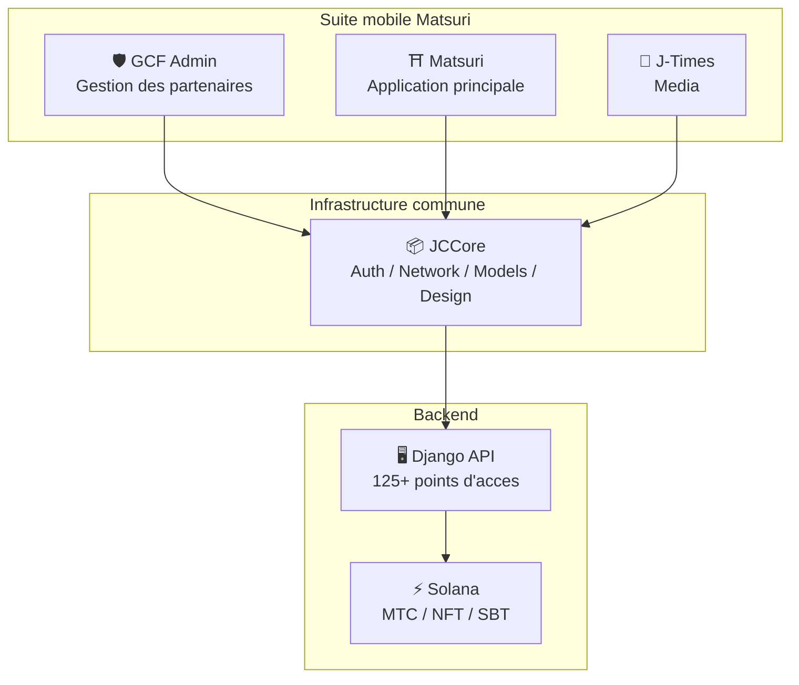
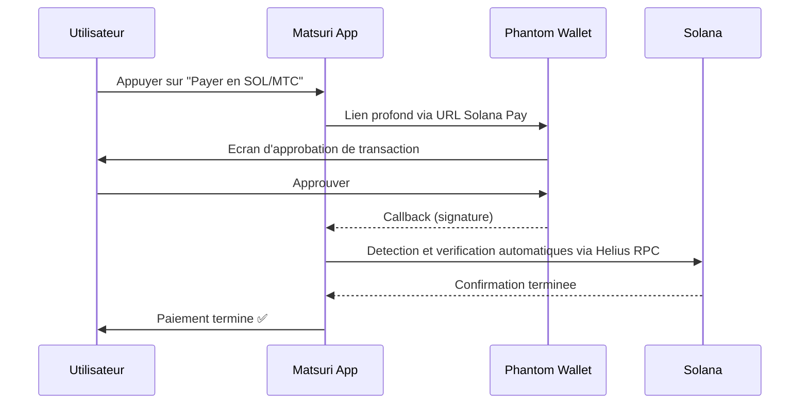
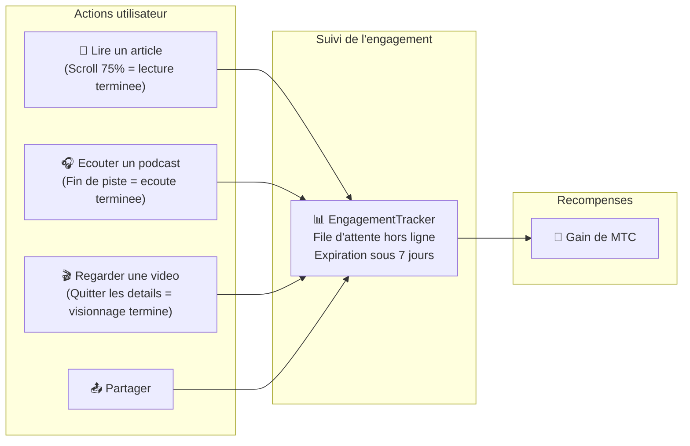
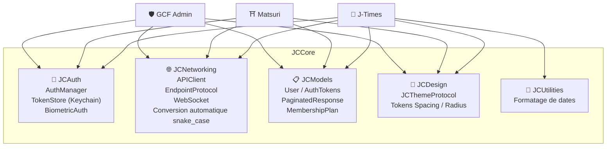

# 📱 Suite d'applications mobiles

> **Trois applications iOS natives couvrant chaque couche de l'ecosysteme Matsuri.**
> Entierement construites avec Swift 6 / iOS 17+. Authentification, reseau et design unifies via la bibliotheque partagee **JCCore**.

:::tip Pourquoi c'est important pour les investisseurs
La plupart des projets Web3 ont un site web et un livre blanc. Matsuri dispose de **3 applications iOS en production avec plus de 827 tests automatises**, une infrastructure partagee et une integration native Solana. C'est une profondeur d'execution rare dans l'espace des tokens.
:::

---

## Apercu des applications

| Application | Objectif | Statut | Langues |
| :--- | :--- | :---: | :--- |
| **GCF Admin** | Gestion des partenaires et operations | ✅ Publiee | 🇯🇵🇬🇧🇨🇳🇹🇭🇳🇴 |
| **Matsuri** | Application principale grand public | 🔜 Fin avril 2026 | 🇯🇵🇬🇧🇨🇳🇹🇭🇳🇴 |
| **J-Times** | Media culturel et apprentissage | 🔜 Fin avril 2026 | 🇯🇵🇬🇧 |

---

## 1. 🛡️ GCF Admin — Application de gestion des partenaires

:::info Statut : Publiee sur l'App Store (v1.0)
Application de gestion operationnelle pour les membres GCF (Global Community Friends). Toutes les fonctionnalites du panneau d'administration web regroupees sur mobile.
:::

  
  
  

### Fonctionnalites de cette application

| Categorie | Fonctionnalite |
| :--- | :--- |
| **📊 Tableau de bord** | Cartes KPI, graphiques de ventes, actions rapides |
| **👥 Gestion des membres** | Liste, details, edition, gestion des niveaux |
| **💰 Gestion des revenus** | Suivi des commissions, gestion des retraits MTC, gestion des paiements |
| **📝 Gestion de contenu** | Creation, edition et publication d'evenements, articles, podcasts et videos |
| **🎫 Creneaux de guide** | Gestion des places de guide, suivi des revenus |
| **🖼️ Tableau de bord NFT** | Founder's Collection, verification on-chain, transfert de NFT |
| **⛩️ Gestion des lieux sacres** | CRUD des sites, configuration des balises |
| **🎲 Configuration du minage AR** | Table de probabilites omikuji, gestion des parametres de recompense |
| **📊 Analytique** | Rapports d'erreurs, analyse d'utilisation |
| **🔗 Parrainage** | Generation de QR codes personnalises, gestion du programme de parrainage |

### Specifications techniques

| Element | Details |
| :--- | :--- |
| **Architecture** | Clean Architecture + MVVM + `@Observable` (iOS 17) |
| **Langage / SDK** | Swift 6.0 / Xcode 16+ / iOS 17.0+ |
| **Integration API** | Plus de 125 points d'acces |
| **Tests** | 226 tests / 45 classes de test |
| **Localisation** | 5 langues (JP/EN/ZH/TH/NO) / Plus de 957 cles de traduction |
| **Swift Concurrency** | Conformite Strict Concurrency / zero avertissement de build |

### Integration QR code

GCF Admin permet de generer des QR codes personnalises avec le logo Matsuri. Compatible avec les invitations evenementielles, les liens de parrainage, les demandes de paiement et bien plus.

---

## 2. ⛩️ Matsuri — Application principale

:::info Statut : Lancement prevu fin avril 2026 (v3.0)
L'application principale pour les utilisateurs. Reservation d'evenements, paiements, portefeuille Web3, minage AR — tout dans une seule application.
:::

  
  
  

### Fonctionnalites de cette application

| Categorie | Fonctionnalite |
| :--- | :--- |
| **🎪 Reservation d'evenements** | Recherche, reservation, paiement Stripe, gestion des QR de billets |
| **💳 4 moyens de paiement** | Carte de credit / Carte enregistree / Solde MTC / Cryptomonnaie (SOL/MTC) |
| **👛 Portefeuille Web3** | Affichage du solde MTC, envoi et reception, historique des transactions |
| **🖼️ Galerie NFT** | Liste des NFT/SBT detenus, verification on-chain |
| **🗺️ Carte des lieux sacres** | Affichage cartographique des sanctuaires et temples, check-in |
| **🎲 Minage AR** | Experience omikuji en WebAR, gain de MTC |
| **💬 Chat** | Messagerie avec menu contextuel |
| **⭐ Liste de souhaits** | Sauvegarde d'evenements et d'experiences favoris |
| **🔍 Recherche avancee** | Recherche vocale prise en charge |
| **🤝 Parrainage** | Participation au programme de parrainage, suivi des recompenses |
| **📊 Tableau de bord GCF** | Interface de gestion simplifiee pour les membres GCF |

### Integration Phantom Wallet — Paiement crypto sans saisie

> **Zero copier-coller d'adresse.** Phantom Wallet s'ouvre automatiquement, l'utilisateur approuve, et le paiement est termine. Les signatures de transaction sont detectees automatiquement via Helius RPC — l'experience de paiement crypto la plus fluide du marche.

:::tip Pourquoi c'est important
La plupart des applications Web3 obligent les utilisateurs a copier des adresses de portefeuille, saisir manuellement des montants et attendre les confirmations. L'integration Solana Pay de Matsuri reduit tout cela a **un seul appui** — egalant l'experience utilisateur d'Apple Pay tout en effectuant le reglement on-chain.
:::

### Specifications techniques

| Element | Details |
| :--- | :--- |
| **Architecture** | Clean Architecture + MVVM + Swift Concurrency |
| **Langage / SDK** | Swift 6.0 / Xcode 16+ / iOS 17.0+ |
| **Paiement** | Stripe PaymentSheet + MTC Balance + Phantom (Solana Pay) |
| **Integration API** | 72 points d'acces / 16 categories |
| **Tests** | Plus de 230 (Model, ViewModel, Network, Security, DeepLink, E2E) |
| **Localisation** | 5 langues (JP/EN/ZH/TH/NO) / 406 cles de traduction |
| **Nombre de ViewModels** | 25 (MVVM complet — zero appel API direct depuis les Views) |
| **Authentification** | Apple Sign In / Google Sign In (PKCE) |

---

## 3. 📰 J-Times — Application media culturel

:::info Statut : Lancement prevu fin avril 2026
Une plateforme media transmettant la profondeur de la culture japonaise. Lisez des articles, ecoutez des podcasts, regardez des videos — chaque action vous fait gagner des MTC.
:::

  

### Fonctionnalites de cette application

| Categorie | Fonctionnalite |
| :--- | :--- |
| **📖 Articles** | Image hero en parallaxe, lettrine, barre de progression de lecture, contenu riche (Markdown, tableaux, citations) |
| **🎧 Podcasts** | Navigation par serie, lecteur avec forme d'onde, minuterie de sommeil, AirPlay, controles sur ecran verrouille |
| **🎬 Videos** | Affichage grille/liste adaptatif, videos courtes (style TikTok, double tap) |
| **🔍 Recherche** | Multi-filtres, tags tendance, recherche vocale |
| **🧭 Decouverte** | Carrousel de mise en avant, choix de la redaction, populaire cette semaine |
| **📚 Bibliotheque** | Favoris, historique (par date), telechargements, playlists |
| **🎵 Lecteur audio** | Mini lecteur (geste de balayage), lecteur complet (forme d'onde, paroles, repetition) |
| **👤 Adhesion** | Comparaison des 3 niveaux (Free / Premium / Pro), restauration d'achats |

### Media Mining — Lire, ecouter, regarder devient du minage

> **Enregistre meme hors ligne.** Meme si vous lisez un article dans un sanctuaire au fond des montagnes sans signal, l'engagement est automatiquement envoye a la reconnexion et les MTC sont credites.

### Systeme de design — Les « Quatre Piliers » de l'esthetique japonaise

J-Times adopte un systeme de design unique qui integre l'esthetique traditionnelle japonaise dans une interface moderne.

| Pilier | Concept | Application UI |
| :--- | :--- | :--- |
| **墨 (Sumi)** | Gris neutre chaleureux | Couleurs de fond, hierarchie textuelle |
| **朱 (Shu)** | Rouge japonais (#C53030) | Couleur d'accentuation, actions importantes |
| **間 (Ma)** | Espacement sur grille de 4pt | Espacement, sensation de respiration |
| **紙 (Kami)** | Texture subtile, glassmorphisme | Surfaces de cartes, expression de profondeur |

### Specifications techniques

| Element | Details |
| :--- | :--- |
| **Architecture** | Clean Architecture + MVVM + Swift Concurrency |
| **Langage / SDK** | Swift 6.0 / Xcode 16+ / iOS 17.0+ |
| **Dependances externes** | **Zero** — Uniquement les frameworks natifs Apple |
| **Integration API** | Plus de 40 points d'acces |
| **Tests** | 371 tests / 20 fichiers |
| **Localisation** | 2 langues (JP/EN) / Plus de 310 cles de traduction |
| **Support hors ligne** | ContentCache (50MB) + ImageDiskCache (200MB) + gestionnaire de telechargement |
| **Authentification** | Apple Sign In / Google Sign In (PKCE) |

---

## Infrastructure commune : Bibliotheque JCCore

Bibliotheque Swift Package partagee par les trois applications.

| Module | Role |
| :--- | :--- |
| **JCAuth** | Gestion des tokens basee sur Keychain, authentification biometrique (Face ID / Touch ID) |
| **JCNetworking** | Client API type-safe, WebSocket, conversion automatique JSON snake_case |
| **JCModels** | Modeles de donnees partages entre applications (User, AuthTokens, etc.) |
| **JCDesign** | Protocole de theme, tokens de design (espacement, arrondi des coins) |
| **JCUtilities** | Utilitaires pour dates et chaines de caracteres |

---

## Securite et confidentialite

| Element | Implementation |
| :--- | :--- |
| **Tokens d'authentification** | Stockage chiffre dans iOS Keychain (TokenStore) |
| **Authentification biometrique** | Authentification a deux facteurs via Face ID / Touch ID |
| **Communication API** | HTTPS + Certificate Pinning |
| **Cle privee du portefeuille** | Aucune cle privee stockee dans l'application — deleguee a Phantom Wallet |
| **Minage AR** | Aucune image de camera envoyee au serveur (VisionProof) |
| **Donnees hors ligne** | Chiffrement SwiftData + expiration automatique |
| **Swift Concurrency** | Prevention des conditions de concurrence par isolation Actor |

---

## Qualite du developpement

Plus de **827 tests automatises** implementes pour les trois applications combinees.

| Application | Nb de tests | Domaines couverts |
| :--- | :---: | :--- |
| **GCF Admin** | 226 | Model, ViewModel, Repository, API, Localization, Navigation |
| **Matsuri** | 230+ | Model, ViewModel, Network, Security, DeepLink, Regression, Performance, E2E |
| **J-Times** | 371 | Model, ViewModel, API, Repository, Navigation, Localization, Security, Performance |

---

**[▶ Suivant : Feuille de route & Equipe](/docs/roadmap)** ｜ **[◀ Precedent : Ecosysteme & Minage](/docs/ecosystem)**
