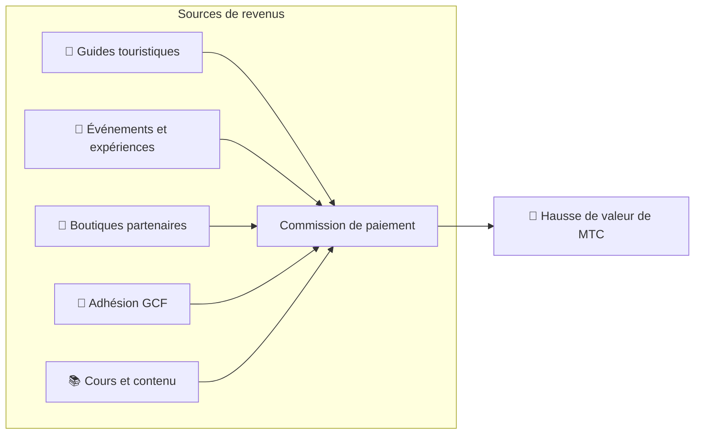

# 💰 Tokenomics — le design économique de MTC

> **La confiance est gravée dans le code.**
> Le design économique de MTC ne repose pas sur la promesse de qui que ce soit : il est garanti par les mathématiques et la blockchain.


> **« Un système économique où le statu quo ne peut être altéré par la force » —— voilà la tokenomics de MTC.**

Le design économique de Matsuri Coin (MTC) repose sur une conviction :
**les règles que même l'équipe ne peut manipuler constituent la meilleure garantie pour l'investisseur**.

Offre figée pour toujours. Émission additionnelle et gel impossibles. La croissance de l'activité se reflète mathématiquement dans le prix ——
ce n'est pas une « promesse » : c'est un **fait** inscrit dans la blockchain.

Cette page expose en toute transparence le mécanisme économique de MTC.

---

## Spécifications du jeton

Pour garantir la sécurité des investisseurs, nous avons **renoncé à titre définitif** aux permissions « Mint » et « Freeze » sur Solana.
Émission additionnelle impossible pour toujours, gel de wallet impossible. **Design entièrement trustless**.

| Élément | Détail |
| :--- | :--- |
| **Nom du jeton** | Matsuri Coin |
| **Ticker** | MTC |
| **Chaîne** | Solana |
| **Adresse de mint** | `DRENpzmRWM4TwECrCPCfS1k5VBPmanhQg9bcCWP8EZXF` [Solscan →](https://solscan.io/token/DRENpzmRWM4TwECrCPCfS1k5VBPmanhQg9bcCWP8EZXF) |
| **Offre totale** | **900 millions** (900 000 000 MTC) figée |
| **Mint Authority** | 🚫 Renoncée ([vérifiable on-chain](https://solscan.io/token/DRENpzmRWM4TwECrCPCfS1k5VBPmanhQg9bcCWP8EZXF)) |
| **Freeze Authority** | 🚫 Renoncée ([vérifiable on-chain](https://solscan.io/token/DRENpzmRWM4TwECrCPCfS1k5VBPmanhQg9bcCWP8EZXF)) |
| **Gestion des locks** | Streamflow Finance (vérifiée) |

:::info Pourquoi c'est important
Renoncer au Mint Authority signifie que « l'équipe ne peut pas imprimer des jetons à sa guise pour diluer votre part ». Renoncer au Freeze Authority signifie que « personne ne peut geler votre wallet ». Ce sont les fondements du modèle trustless (sans besoin de confiance).
:::

---

## Distribution du jeton

La distribution des 900 M MTC est la suivante.

<div className="mtc-alloc">
  <div className="mtc-alloc__donut" role="img" aria-label="Distribution de MTC: Pool de minage 61%, Opération de l'écosystème 39%">
    <div className="mtc-alloc__hole">
      <span className="mtc-alloc__total">900M</span>
      <span className="mtc-alloc__unit">MTC</span>
    </div>
  </div>
  <div className="mtc-alloc__legend">
    <div className="mtc-alloc__row mtc-alloc__row--mining">
      <span className="mtc-alloc__dot"></span>
      <span className="mtc-alloc__pct">61%</span>
      <span className="mtc-alloc__amount">⛏️ 550M MTC</span>
    </div>
    <div className="mtc-alloc__row mtc-alloc__row--ecosystem">
      <span className="mtc-alloc__dot"></span>
      <span className="mtc-alloc__pct">39%</span>
      <span className="mtc-alloc__amount">🌐 350M MTC</span>
    </div>
  </div>
</div>

| Catégorie | % | Quantité | Usage |
| :--- | :---: | :--- | :--- |
| **⛏️ Pool de minage** | **61 %** | 550 millions | Pool de récompenses pour contributeurs. Déblocage en juin 2027, halving tous les deux ans. Répartition selon le score de contribution |
| **🌐 Opération de l'écosystème** | **39 %** | 350 millions | Marketing, distribution GCF, opérations, liquidité (LP), développement, publicité, organisation d'événements, etc. |

:::note Libération du pool de minage
Les 550 M MTC ne sont pas libérés d'un coup. Selon un calendrier de halving biennal, ils sont **répartis progressivement selon le score de contribution**. Les règles de libération/répartition seront implémentées dans des smart contracts à partir de fin 2026 et deviendront vérifiables on-chain.
:::

:::note À propos de la part d'opération d'écosystème
Les 39 % constituent un fonds polyvalent indispensable à la croissance. Ses usages concrets incluent le marketing, la distribution initiale aux membres GCF, l'apport au pool de liquidité Raydium, la rémunération de l'équipe de développement, la publicité et l'organisation d'événements culturels. La transparence d'utilisation passera sous gouvernance communautaire après la transition DAO.
:::

---

## Structure des revenus

Ce qui soutient la valeur de MTC, ce sont **les revenus d'activités réelles**. Pas de spéculation : l'activité économique réelle étaye la valeur du jeton.



| Source | Contenu |
| :--- | :--- |
| **🏯 Expériences et guides** | Commissions de paiement des guides touristiques et des événements culturels |
| **🤝 Adhésion GCF** | Frais d'adhésion |
| **📚 Contenu** | Frais de cours, abonnements médias |
| **🏪 Marketplace** | Commissions des boutiques partenaires (expansion progressive) |

:::tip Une croissance adossée à la demande réelle
Plus il y a de touristes entrants, plus de devises entrent et plus l'écosystème s'étend. La valeur de MTC n'est pas décidée par la spéculation mais par **le nombre de personnes qui vivent la culture**.
:::

---

## Résultats actuels de l'activité

L'économie MTC en est à ses débuts, mais l'activité réelle a démarré.

| Indicateur | Résultat |
| :--- | :--- |
| **Événements organisés** | Plus de 50 (phase de test) |
| **Membres GCF Platinum** | 20 intégrés (sur 50) |
| **Membres GCF Gold** | Ouverture des inscriptions à venir |
| **Plateforme web** | En marche, avec utilisateurs recrutés à des fins de test |
| **App iOS** | Développement terminé, sortie prévue en avril 2026 |

:::note Honnêtement
Nous n'avons pas encore de « succès retentissant ». 50 événements et opération de test —— voilà la réalité. Mais le produit tourne, la communauté existe et nous entrons en phase d'expansion réelle.
:::

---

## Protocole de rachat

Nous ne « gardons pas dans nos poches » ce que l'activité génère.
Nous allouons un pourcentage déterminé des revenus au rachat de MTC sur le marché.

| Source | Ratio | Action |
| :--- | :---: | :--- |
| **Ventes Matsuri HQ** (guides / événements) | **20 %** | **Rachat** sur le marché + apport au pool de liquidité |
| **Adhésion GCF** (cotisations) | **25 %** | **Rachat** sur le marché |

:::info État actuel des rachats
Le protocole de rachat **entrera en opération** au fur et à mesure que les revenus se consolident. Au début, exécuté off-chain (manuellement) ; à partir de fin 2026, migration progressive vers une exécution automatique par smart contract. Après bascule on-chain, l'historique sera vérifiable par quiconque sur la blockchain.
:::

Le rachat n'est pas une promesse « un jour ». C'est une règle programmée comme protocole. À chaque ventes, des MTC sont automatiquement aspirés du marché —— c'est la **tranquillité structurelle** pour l'investisseur.

---

## Logique de formation du prix

Le mécanisme de valorisation de MTC ne repose pas sur du souhait mais sur **la formule de l'AMM (Automated Market Maker)**.

```
Prix = Liquidité (SOL) ÷ Offre (MTC)
```

| Étape | Ce qui se passe | Résultat |
| :---: | :--- | :--- |
| **①** | Les revenus business (SOL) alimentent le pool | **Le numérateur augmente** |
| **②** | Avec ce capital, des MTC sont rachetés et brûlés | **Le dénominateur diminue** |
| **③** | Numérateur ↑ × Dénominateur ↓ | **Les conditions de rareté se mettent en place** |

:::info Description du mécanisme, pas garantie de prix
Cette formule décrit un design structurel : « si les revenus business continuent et que le rachat est exécuté, l'équilibre offre-demande évolue vers la rareté ». Le prix réel dépend de la demande, de l'environnement externe, de la liquidité et de nombreux autres facteurs.
:::

---

## Calendrier de halving

Les **550 millions de MTC (~61 % de l'offre)** débloqués le 1ᵉʳ juin 2027 ne seront pas vendus sur le marché mais réservés comme **pool de récompenses pour contributeurs**.

Nous appliquons un **halving tous les deux ans**, plus rapide que le cycle de quatre ans de Bitcoin.
Tous les deux ans, l'émission est divisée par deux et, en théorie, les récompenses continuent sur des décennies.

| Période | % d'émission | Quantité émise | Cumul |
| :--- | :---: | :--- | :---: |
| **Ère 1** 2027 – 2029 | **50 %** | ~275 millions | 50 % |
| **Ère 2** 2029 – 2031 | **25 %** | ~137 millions | 75 % |
| **Ère 3** 2031 – 2033 | **12,5 %** | ~68 millions | 87,5 % |
| **Ère 4** 2033 – 2035 | **6,25 %** | ~34 millions | 93,75 % |
| **Ère 5+** | Halving continu | Décroissance progressive | → tend vers 100 % |

<small>*※ Mathématiquement, 100 % n'est jamais atteint ; l'émission tend vers zéro. Même principe que Bitcoin.*</small>

:::tip Plus tôt vous contribuez, plus vous recevez de MTC
Du fait du halving, l'émission de l'Ère 1 (2027–2029) est la plus élevée ; à mesure que les époques avancent, la quantité par tour diminue. Autrement dit, **ceux qui accumulent des scores de contribution dès le début reçoivent plus de MTC**.

Exemples d'activités qui comptent dans le score :
- Création et promotion d'événements
- Opération de cours de guide populaires
- Recrutement et formation de guides de talent
- Vues et partages de contenu J-Times
- Check-ins de pèlerinage aux lieux sacrés

Les récompenses ne sont pas décidées par « l'ordre d'arrivée » mais par **« la quantité et la qualité de la contribution »**.
:::

---

:::note Page suivante
Une fois le design économique de MTC compris, découvrez **comment participer en tant que partenaire**.
**[Adhésion GCF →](/docs/gcf)**
:::
