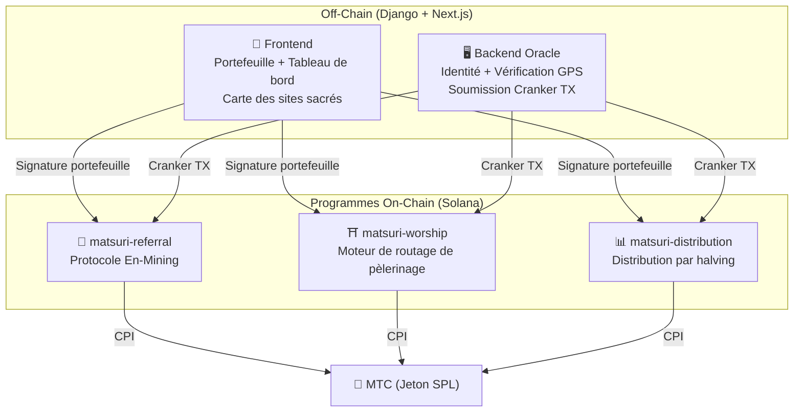
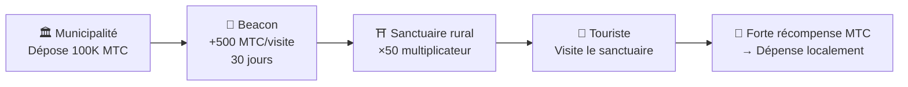
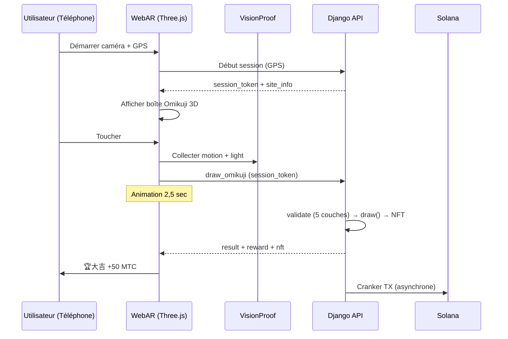

# ⚡ Contrats intelligents — Architecture open source

> **Conception sans confiance (Trustless).**
> Toute la logique de récompenses, les arbres de parrainage et les calendriers de halving sont exécutés **on-chain** via des programmes Rust auditables.
> Code source : [GitHub](https://github.com/Cootakahashi/matsuri-contracts)

---

## Vue d'ensemble

Matsuri déploie **trois programmes Anchor (Rust)** sur Solana, chacun gérant un pilier distinct de l'écosystème :



---

## 1. 📣 Protocole En-Mining (縁マイニング)

**Objectif :** Un moteur de croissance hybride qui récompense à la fois la *largeur* (portée du parrainage) et la *profondeur* (impact économique). Pas un simple programme d'affiliation — un protocole de minage complet où l'activité économique réelle génère de la valeur on-chain.

### Conception du scoring

Le score de contribution repose sur deux composantes pondérées :

| Composant | Poids | Objectif |
| :--- | :---: | :--- |
| **Largeur** (nombre de parrainages) | 30% | Portée du réseau — combien de personnes vous amenez |
| **Profondeur** (volume de règlement) | 70% | Impact économique — achats réels, pas seulement des inscriptions |

Les scores s'accumulent au fil du temps et sont convertis en MTC à chaque époque de halving. Des mécanismes de boost supplémentaires sont prévus :

| Boost | Description | Statut |
| :--- | :--- | :---: |
| **Toku (徳) Staking** | Verrouillez du MTC pour booster votre score de contribution (jusqu'à ~50 % de boost). Les niveaux et multiplicateurs exacts seront calibrés selon le calendrier de libération du pool de halving | Coefficients à déterminer |
| **Classements saisonniers** | Les meilleurs performeurs de chaque époque obtiennent le titre **Évangéliste** (SBT permanent) et un boost de score. Les pourcentages exacts seront déterminés via la gouvernance | Coefficients à déterminer |

:::info Conception progressive des paramètres
Les coefficients de boost (niveaux de staking, bonus de classement) sont intentionnellement laissés ajustables. Ils seront finalisés sur la base de données réelles de l'écosystème — nombre total d'utilisateurs actifs, rythme de libération du pool de halving et objectifs de stabilité des prix — puis verrouillés dans les smart contracts. Cette approche garantit une **distribution équitable** sans promettre des rendements fixes.
:::

### Défense anti-Sybil (3 couches)

| Couche | Mécanisme | Emplacement |
| :--- | :--- | :--- |
| **Porte d'identité** | X/Twitter OAuth + SMS | Off-chain (Django) |
| **Porte on-chain** | Seuls les profils `is_verified = true` gagnent | Contrat intelligent |
| **Pondération profondeur** | 70 % du score = paiements réels → les bots ne gagnent rien | Moteur de scoring |

---

## 2. ⛩️ Moteur de routage de pèlerinage (Worship Routing Engine)

**Objectif :** Le premier **protocole ReFi au monde qui résout le surtourisme grâce à l'économie des tokens.** Visitez des sites sacrés → gagnez du MTC. Mais voici l'astuce : *les sites les moins visités rapportent exponentiellement plus.*

:::tip L'idée clé
C'est le « surge pricing inversé d'Uber » — les sites bondés sont pénalisés, les sites pionniers sont récompensés. Les touristes se dirigent d'eux-mêmes vers des lieux moins visités parce que **c'est plus rentable.**
:::

### Principes de conception des récompenses

Le score de contribution pour chaque visite est déterminé par plusieurs facteurs :

| Facteur | Principe | Effet |
| :--- | :--- | :--- |
| **Popularité du site** | Les sites moins visités obtiennent des scores plus élevés | Détourne les touristes des zones surpeuplées |
| **Heure de visite** | Les visiteurs plus tôt dans la journée obtiennent un score plus élevé | Encourage les visites hors pointe |
| **Niveau régional** | Les sites ruraux et pionniers sont les mieux classés | Favorise la revitalisation régionale |
| **Fréquence de visite** | Les visiteurs réguliers accumulent des scores bonus | Récompense l'engagement constant |
| **Fortune Omikuji** | Tirage aléatoire de bonus à chaque check-in | Couche de gamification ludique |
| **Boosts sponsorisés** | Les municipalités peuvent booster des sites spécifiques | Modèle de revenus B2B/B2G |

:::info Les coefficients sont ajustables
Les multiplicateurs exacts pour chaque facteur (ex. combien un site rural rapporte de plus qu'un site majeur) seront **calibrés selon le calendrier du pool de halving** et les données d'utilisation réelles, puis progressivement verrouillés dans les smart contracts. Le principe de conception est fixe — les coefficients évoluent avec l'écosystème.
:::

### Beacons sponsorisés (B2B/B2G)

Les municipalités, les compagnies ferroviaires et les offices de tourisme peuvent **déposer du MTC** pour créer des zones à forte récompense temporaires sur des sites spécifiques.



---

## 3. 📊 Distribution par halving

**Objectif :** 550M MTC distribués sur des décennies via un **cycle de halving de 2 ans** — plus rapide que le cycle de 4 ans de Bitcoin.

### Calendrier de halving

```
Pool total : 550 000 000 MTC

Époque 0 (2027–2029) :  275 000 000 MTC  (50 %)
Époque 1 (2029–2031) :  137 500 000 MTC  (25 %)
Époque 2 (2031–2033) :   68 750 000 MTC  (12,5 %)
Époque 3 (2033–2035) :   34 375 000 MTC  (6,25 %)
∑ → 550 000 000 MTC (total asymptotique)
```

### Formule de récompense individuelle

```
your_reward = epoch_budget × (your_score / total_score)
```

Arithmétique en **128 bits intermédiaire** — dépassement mathématiquement impossible.

### Sources de score de performance

| Activité | Poids |
| :--- | :--- |
| **Sessions de guide** | Élevé |
| **Ventes de billets** | Élevé |
| **Réseau de parrainage** | Moyen |
| **Visites de pèlerinage** | Moyen |
| **Engagement médias** | Faible |

:::info Avance d'époque sans permission
L'instruction `advance_epoch` peut être appelée par **n'importe qui** — aucun admin requis.
:::

---

## 4. 🎴 Minage AR — WebAR Omikuji Mining

**Objectif :** Faites apparaître des Omikuji AR dans l'espace réel avec le navigateur du smartphone pour miner du MTC. **Aucun téléchargement d'app requis.** La première infrastructure WebAR × Blockchain au monde fusionnant la spiritualité Shinto et la technologie de pointe.

### Architecture



### Optimistic UI (zéro attente)

| Étape | Temps | Traitement |
|---------|------|------|
| Toucher → Effet | 0ms | Animation immédiate |
| API draw_omikuji | ~50ms | Django tire + NFT |
| Effet terminé | 2500ms | Résultat → Affichage |
| Solana TX | ~400ms | En arrière-plan |

### Paramètres Omikuji (Admin GCF)

Points de base (10000 = 100 %) avec précision de 0,01 %. Ajustable depuis l'interface Admin GCF.

| Grade | Rareté | Bonus | NFT |
|------|-----------|---------|-----|
| 🏆 大吉 | Rare | Bonus maximum | ✅ |
| ✨ 吉 | Peu commun | Bon bonus | Optionnel |
| 🌸 小吉 | Commun | Petit bonus | — |
| 🍃 末吉 | Commun | Participation enregistrée | — |
| 💀 凶 | Peu commun | Participation enregistrée | — |

Les probabilités et coefficients de récompense seront finalisés progressivement en fonction de la taille de l'écosystème et du volume de libération du halving, puis implémentés dans les smart contracts.

### ZK-Proof of Vision (5 couches)

Élimine le spoofing GPS et les attaques par rejeu. **Aucune donnée caméra transmise** au serveur.

| Couche | Vérification | Points |
|-------|---------|------|
| Temporal | Session 5-120 sec | /20 |
| Motion | Gyroscope 0,005-0,5 | /20 |
| Light | Lumière × heure du jour | /20 |
| HMAC | Signature proof_hash | /20 |
| Fingerprint | Unicité de l'appareil | /20 |
| **Total** | **Seuil PASS** | **60/100** |

### Conception des récompenses

Les récompenses sont enregistrées sous forme de **score de contribution** basé sur de multiples facteurs : type de site, résultat Omikuji, niveau régional, etc. Les coefficients exacts seront finalisés progressivement en fonction du calendrier de libération du halving et de la croissance de l'écosystème, puis implémentés dans les smart contracts.

---

## Modules mathématiques (Noyau open source)

Tous les programmes séparent la logique de scoring/récompense dans des **modules `math.rs` purs et auditables** avec :

- **Zéro effets de bord** — pas d'I/O, pas d'allocations, pas d'appels externes
- **Formules documentées** — notation LaTeX dans rustdoc
- **Analyse de dépassement** — valeurs intermédiaires u128 avec bornes prouvées
- **Tests exhaustifs** — cas limites, conditions aux bornes, vérification des ratios
- **Coefficients ajustables** — les paramètres de récompense sont conçus pour être modifiables via la gouvernance, permettant une calibration progressive à mesure que l'écosystème grandit

---

## Modèle de sécurité (Open source)

Contrats **entièrement open source.** La sécurité repose sur des garanties mathématiques.

| Principe | Implémentation |
| :--- | :--- |
| **Coffres PDA uniquement** | Contrôlés par PDA — aucune clé humaine ne peut les vider |
| **Arithmétique vérifiée** | `checked_*` — dépassement impossible |
| **Séparation d'autorité** | Admin (multisig) ≠ Cranker ≠ Utilisateur |
| **Pause d'urgence** | L'admin peut tout suspendre ; ne peut pas voler les fonds |
| **Tokenomics immuables** | Halving, pool total et durée d'époque fixés une fois |
| **Modules mathématiques purs** | Logique de scoring séparée en bibliothèques auditables |
| **Vision Proof** | Anti-spoofing 5 couches sans données caméra |

---

**[◀ Retour à la feuille de route](/docs/roadmap)** ｜ **[Voir le code source](https://github.com/Cootakahashi/matsuri-contracts)**
