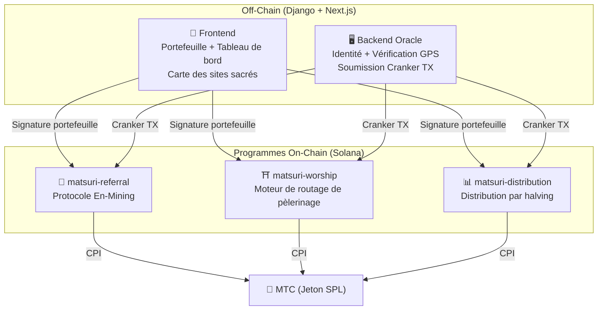
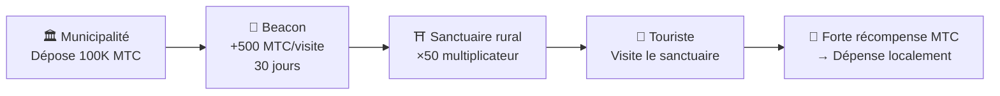
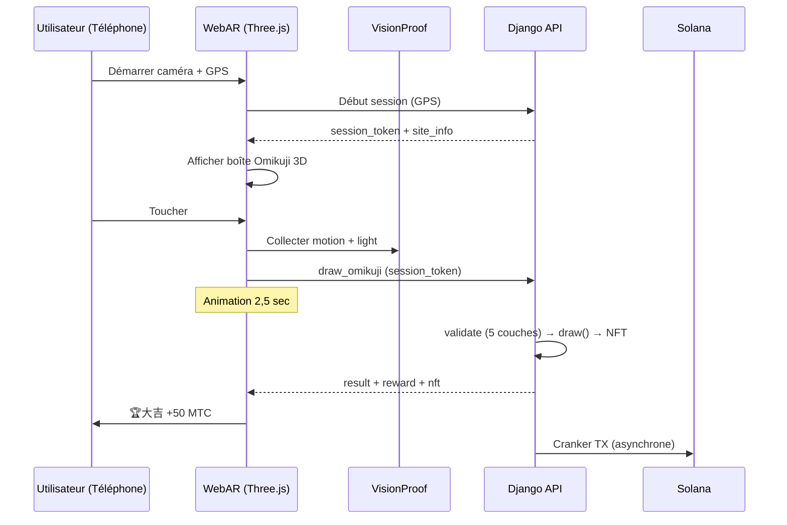

# ⚡ Contrats intelligents — Architecture open source

> **Conception sans confiance (Trustless).**
> Toute la logique de récompenses, les arbres de parrainage et les calendriers de halving sont exécutés **on-chain** via des programmes Rust auditables.
> Code source : [GitHub](https://github.com/matsuri-protocol/contracts)

---

## Vue d'ensemble

Matsuri déploie **trois programmes Anchor (Rust)** sur Solana, chacun gérant un pilier distinct de l'écosystème :



---

## 1. 📣 Protocole En-Mining (縁マイニング)

**Objectif :** Un moteur de croissance hybride qui récompense à la fois la *largeur* (portée du parrainage) et la *profondeur* (impact économique). Pas un simple programme d'affiliation — un protocole de minage complet où l'activité économique réelle génère de la valeur on-chain.

### Formule de score

```
S_final = S_raw × M_toku × B_title

where:
  S_raw   = 0.30 × parrainages + 0.70 × (volume / 10^9)
  M_toku  = f(mtc_staké) ∈ [1.0×, 10.0×]
  B_title = 1.0 + min(saisons_classées × 0.05, 0.50)
```

| Composant | Poids | Objectif |
| :--- | :---: | :--- |
| **Largeur** (nombre de parrainages) | 30% | Portée du réseau — combien de personnes vous amenez |
| **Profondeur** (volume de règlement) | 70% | Impact économique — achats réels, pas seulement des inscriptions |
| **Multiplicateur Toku** | ×1–10 | Verrouillez du MTC pour augmenter la puissance de minage |
| **Boost de titre** | +5%/saison | Récompense permanente pour les meilleurs performeurs constants |

### Niveaux de staking Toku (徳)

| MTC staké | Multiplicateur | Niveau |
| :--- | :---: | :--- |
| 0 | 1.0× | — |
| 1 000+ | 1.5× | Bronze |
| 10 000+ | 3.0× | Argent |
| 100 000+ | 5.0× | Or |
| 1 000 000+ | 10.0× | Diamant |

### En no Banzuke (Classement saisonnier)

Chaque saison (époque), les meilleurs performeurs sont classés. Avantages :
- Le top 10 % obtient le titre **Évangéliste** (drapeau SBT permanent)
- Chaque saison classée octroie **+5 % de boost de minage** (cumulatif, plafond : 50 %)

### Défense anti-Sybil (3 couches)

| Couche | Mécanisme | Emplacement |
| :--- | :--- | :--- |
| **Porte d'identité** | X/Twitter OAuth + SMS | Off-chain (Django) |
| **Porte on-chain** | Seuls les profils `is_verified = true` gagnent | Contrat intelligent |
| **Pondération profondeur** | 70 % du score = paiements réels → les bots ne gagnent rien | Moteur de scoring |

---

## 2. ⛩️ Moteur de routage de pèlerinage (Worship Routing Engine)

**Objectif :** Le premier **protocole ReFi au monde qui résout le surtourisme grâce à l'économie des tokens.** Visitez des sites sacrés → gagnez du MTC. Mais voici l'astuce : *les sites les moins visités rapportent exponentiellement plus.*

:::tip L'idée clé
C'est le « surge pricing inversé d'Uber » — les sites bondés sont pénalisés, les sites pionniers sont récompensés. Les touristes se dirigent d'eux-mêmes vers des lieux moins visités parce que **c'est plus rentable.**
:::

### Formule de récompenses à 6 couches

```
R_final = R_pioneer × M_dynamic × M_regional × M_streak × M_omikuji

where:
  R_pioneer  = daily_pool / visit_order     (décroissance harmonique 1/n)
  M_dynamic  = contrôlé par admin ∈ [0.1×, 50×]
  M_regional = tier_table[tier] ∈ {1×, 2×, 5×, 10×}
  M_streak   = 1.0 + min(days × 0.02, 0.50)
  M_omikuji  = loterie ∈ {1.0, 1.2, 1.5, 3.0}
```

### Couche 1 : Bonus pionnier

| Ordre de visite | Récompense vs 1er | Exemple réel (pool 1000 MTC) |
| :---: | :---: | :--- |
| 1er | 100 % | 1 000 MTC |
| 5e | 20 % | 200 MTC |
| 10e | 10 % | 100 MTC |
| 100e | 1 % | 10 MTC |

> **1er visiteur = 100× plus de récompense que le 100e.**

### Couche 2 : Multiplicateur dynamique

| Scénario | Multiplicateur | Effet |
| :--- | :---: | :--- |
| **Surtourisme** | 0.1× | 90 % pénalité |
| **Normal** | 1.0× | Standard |
| **Peu visité** | 10× | 10× boost |
| **Campagne pionnière** | 50× | Incitation maximale |

### Couche 3 : Niveau régional

| Niveau | Étiquette | Mult. | Exemples |
| :---: | :--- | :---: | :--- |
| 0 | 🏙️ Majeur | 1× | 浅草寺, 清水寺, 伏見稲荷 |
| 1 | 🌆 Moyen | 2× | Sanctuaires principaux régionaux |
| 2 | 🏞️ Rural | 5× | Temples historiques à la campagne |
| 3 | ⛰️ Caché | 10× | Temples de montagne, sanctuaires insulaires |

### Couche 4 : Bonus de série

+2 % par jour consécutif, plafond +50 %.

### Couche 5 : 🎲 Protocole Omikuji

| Résultat | Probabilité | Multiplicateur |
| :--- | :---: | :---: |
| 🏆 **大吉** | 5 % | 3.0× |
| ✨ **吉** | 15 % | 1.5× |
| 🌸 **小吉** | 30 % | 1.2× |
| 🍃 **末吉** | 35 % | 1.0× |
| 💀 **凶** | 15 % | 1.0× |

### Couche 6 : Beacons sponsorisés (B2B/B2G)

Les municipalités et les offices de tourisme peuvent **déposer du MTC** pour créer des zones à forte récompense temporaires.



---

## 3. 📊 Distribution par halving

**Objectif :** 550M MTC distribués sur des décennies via un **cycle de halving de 2 ans** — plus rapide que le cycle de 4 ans de Bitcoin.

### Calendrier de halving

```
Pool total : 550 000 000 MTC

Époque 0 (2027–2029) :  275 000 000 MTC  (50 %)
Époque 1 (2029–2031) :  137 500 000 MTC  (25 %)
Époque 2 (2031–2033) :   68 750 000 MTC  (12,5 %)
Époque 3 (2033–2035) :   34 375 000 MTC  (6,25 %)
∑ → 550 000 000 MTC (total asymptotique)
```

### Formule de récompense individuelle

```
your_reward = epoch_budget × (your_score / total_score)
```

Arithmétique en **128 bits intermédiaire** — dépassement mathématiquement impossible.

### Sources de score de performance

| Activité | Poids |
| :--- | :--- |
| **Sessions de guide** | Élevé |
| **Ventes de billets** | Élevé |
| **Réseau de parrainage** | Moyen |
| **Visites de pèlerinage** | Moyen |
| **Engagement médias** | Faible |

:::info Avance d'époque sans permission
L'instruction `advance_epoch` peut être appelée par **n'importe qui** — aucun admin requis.
:::

---

## 4. 🎴 Minage AR — WebAR Omikuji Mining

**Objectif :** Faites apparaître des Omikuji AR dans l'espace réel avec le navigateur du smartphone pour miner du MTC. **Aucun téléchargement d'app requis.** La première infrastructure WebAR × Blockchain au monde fusionnant la spiritualité Shinto et la technologie de pointe.

### Architecture



### Optimistic UI (zéro attente)

| Étape | Temps | Traitement |
|---------|------|------|
| Toucher → Effet | 0ms | Animation immédiate |
| API draw_omikuji | ~50ms | Django tire + NFT |
| Effet terminé | 2500ms | Résultat → Affichage |
| Solana TX | ~400ms | En arrière-plan |

### Probabilités Omikuji (Admin GCF)

Points de base (10000 = 100 %) avec précision de 0,01 %.

| Grade | Valeur | Mult. | NFT |
|------|-----------|---------|-----|
| 🏆 大吉 | 5,00 % | ×3.0 | ✅ |
| ✨ 吉 | 15,00 % | ×1.5 | Optionnel |
| 🌸 小吉 | 30,00 % | ×1.2 | — |
| 🍃 末吉 | 35,00 % | ×1.0 | — |
| 💀 凶 | 15,00 % | ×1.0 | — |

### ZK-Proof of Vision (5 couches)

Élimine le spoofing GPS et les attaques par rejeu. **Aucune donnée caméra transmise** au serveur.

| Couche | Vérification | Points |
|-------|---------|------|
| Temporal | Session 5-120 sec | /20 |
| Motion | Gyroscope 0,005-0,5 | /20 |
| Light | Lumière × heure du jour | /20 |
| HMAC | Signature proof_hash | /20 |
| Fingerprint | Unicité de l'appareil | /20 |
| **Total** | **Seuil PASS** | **60/100** |

### Formule de récompenses

```
Reward = Base(10 MTC) × SiteMultiplier × OmikujiMult × TierMult

TierMult = { Majeur: 1.0, Moyen: 2.0, Rural: 5.0, Caché: 10.0 }
```

---

## Modules mathématiques (Noyau open source)

Modules `math.rs` purs et auditables :

- **Zéro effets de bord** — pas d'I/O, pas d'allocations
- **Formules documentées** — notation LaTeX dans rustdoc
- **Analyse de dépassement** — valeurs intermédiaires u128
- **Tests exhaustifs** — cas limites et conditions aux bornes

```rust
// Exemple : Bonus Pionnier (worship/math.rs)
#[inline]
pub fn pioneer_reward(daily_pool: u64, visit_order: u32) -> u64 {
    if visit_order == 0 { return 0; }
    (daily_pool as u128 / visit_order as u128) as u64
}
```

---

## Modèle de sécurité (Open source)

Contrats **entièrement open source.** La sécurité repose sur des garanties mathématiques.

| Principe | Implémentation |
| :--- | :--- |
| **Coffres PDA uniquement** | Contrôlés par PDA — aucune clé humaine ne peut les vider |
| **Arithmétique vérifiée** | `checked_*` — dépassement impossible |
| **Séparation d'autorité** | Admin (multisig) ≠ Cranker ≠ Utilisateur |
| **Pause d'urgence** | L'admin peut tout suspendre ; ne peut pas voler les fonds |
| **Tokenomics immuables** | Halving, pool total et durée d'époque fixés une fois |
| **Modules mathématiques purs** | Logique de scoring séparée en bibliothèques auditables |
| **Vision Proof** | Anti-spoofing 5 couches sans données caméra |

---

**[◀ Retour à la feuille de route](/docs/roadmap)** ｜ **[Voir le code source](https://github.com/matsuri-protocol/contracts)**
