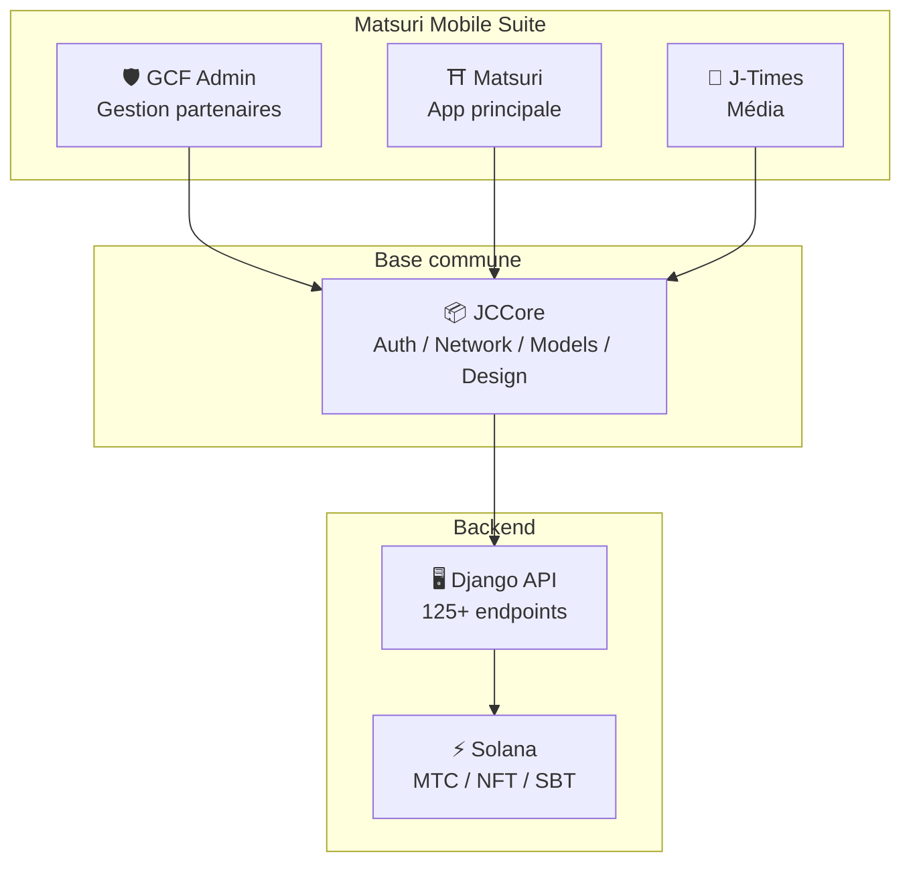
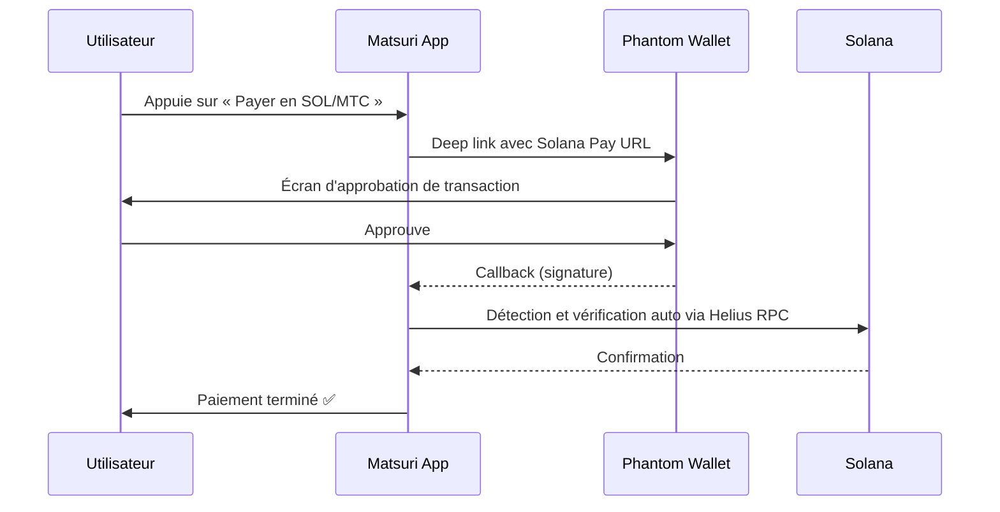
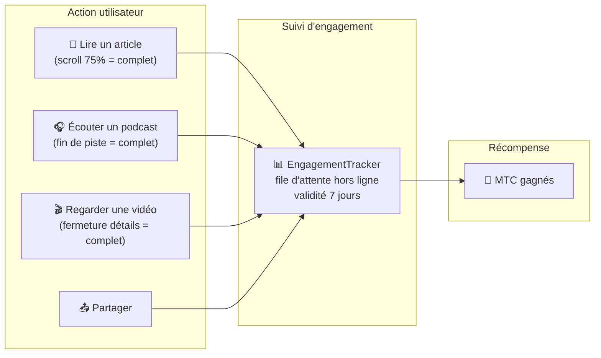
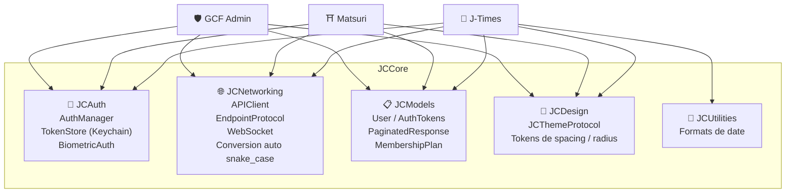
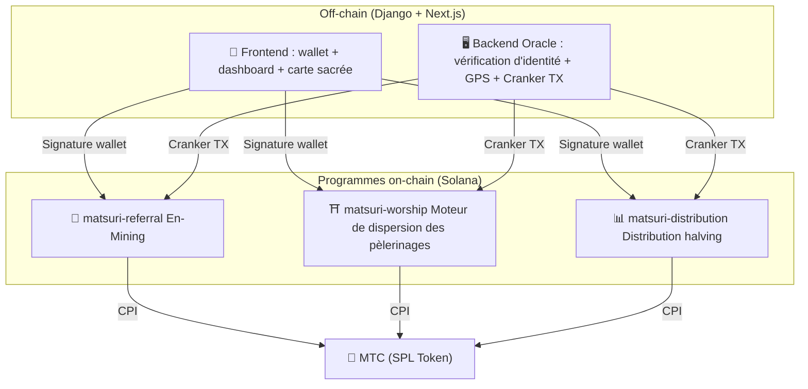
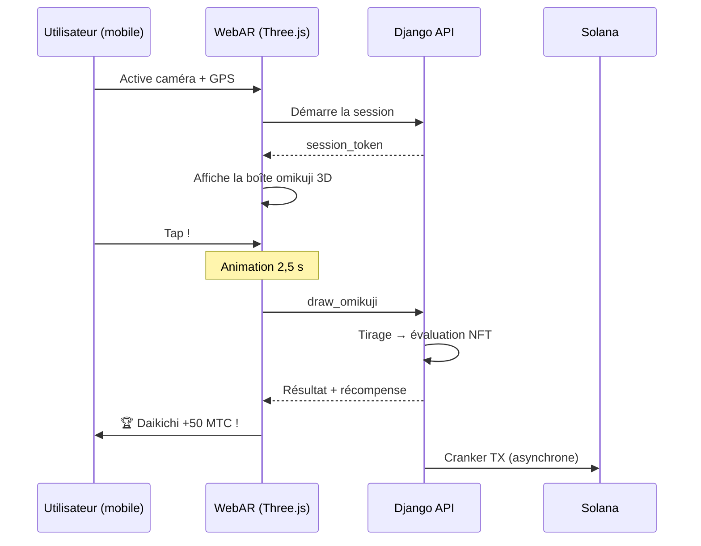

import useBaseUrl from '@docusaurus/useBaseUrl';

# 🔧 Produit et technologie —— ce qui fonctionne vaut toutes les preuves

> **Ce qui fonctionne vaut toutes les preuves.**
> Notre ambition ne s'arrête pas aux mots. La plateforme web fonctionne déjà et les apps iOS sont en phase finale.

L'app web et le tableau de bord sont **en production**. Les trois apps iOS natives sont prêtes et seront lancées en avril 2026. Les smart contracts sur Solana sont open source —— nous ne parlons pas avec des maquettes mais avec **du code en fonctionnement et un produit imminent**.

---

## Liste des apps

| App | Usage | Statut | Langues |
| :--- | :--- | :---: | :--- |
| **GCF Admin** | Gestion des partenaires / opérations | ✅ Publiée | 🇯🇵🇬🇧🇨🇳🇹🇭🇳🇴 |
| **Matsuri** | App principale grand public | ✅ Publiée | 🇯🇵🇬🇧🇨🇳🇹🇭🇳🇴 |
| **J-Times** | Média culturel et apprentissage | 🔜 Avril 2026 | 🇯🇵🇬🇧 |

---

## 1. 🛡️ GCF Admin — app de gestion des partenaires

:::info Statut : publiée sur App Store (v1.0)
App de gestion métier destinée aux membres GCF (Global Community Friends). Toutes les fonctions du tableau de bord web concentrées sur mobile.
:::

  

  
  
  

### Ce que l'app permet

| Catégorie | Fonction |
| :--- | :--- |
| **📊 Dashboard** | Cartes KPI, graphiques de ventes, actions rapides |
| **👥 Gestion des membres** | Liste, détail, édition, gestion de niveau |
| **💰 Gestion des revenus** | Suivi des commissions, retraits MTC, gestion des payouts |
| **📝 Gestion du contenu** | Créer, éditer et publier événements, articles, podcasts et vidéos |
| **🎫 Slots de guides** | Gestion des créneaux, suivi des revenus |
| **🖼️ Dashboard NFT** | Founder's Collection, vérification on-chain, transferts |
| **⛩️ Gestion des lieux sacrés** | CRUD des sites, paramétrage de balises |
| **🎲 Paramètres AR Mining** | Tables de probabilités omikuji et paramètres de récompense |
| **📊 Analytics** | Rapports d'erreur, analyse d'usage |
| **🔗 Parrainage** | Génération de QR personnalisés, gestion du programme |

### Spécifications techniques

| Élément | Détail |
| :--- | :--- |
| **Architecture** | Clean Architecture + MVVM + `@Observable` (iOS 17) |
| **Langage / SDK** | Swift 6.0 / Xcode 16+ / iOS 17.0+ |
| **API** | Plus de 125 endpoints |
| **Tests** | 226 tests / 45 classes de test |
| **Localisation** | 5 langues (ja/en/zh/th/no) / plus de 957 clés |
| **Swift Concurrency** | Conformité Strict / zéro warning au build |

### Intégration QR

GCF Admin permet de générer des QR personnalisés avec le logo Matsuri. Usage polyvalent : invitations d'événements, liens de parrainage, demandes de paiement, etc.

---

## 2. ⛩️ Matsuri — app principale

:::info Statut : publiée sur App Store (v3.0)
App principale pour le grand public. Réservation d'événements, paiement, wallet Web3 et minage AR : tout dans une seule app. **Désormais disponible sur l'App Store.**
:::

  

  
  
  

### Ce que l'app permet

| Catégorie | Fonction |
| :--- | :--- |
| **🎪 Réservation d'événements** | Recherche, réservation, paiement Stripe, gestion QR de billets |
| **💳 4 moyens de paiement** | Carte / carte enregistrée / solde MTC / crypto (SOL/MTC) |
| **👛 Wallet Web3** | Solde MTC, envoi/réception, historique |
| **🖼️ Galerie NFT** | Liste des NFT/SBT, vérification on-chain |
| **🗺️ Carte sacrée** | Affichage de temples et sanctuaires, check-in |
| **🎲 Minage AR** | Expérience omikuji WebAR, gain de MTC |
| **💬 Chat** | Messagerie avec menu contextuel |
| **⭐ Wishlist** | Favoris d'événements et d'expériences |
| **🔍 Recherche avancée** | Support de recherche vocale |
| **🤝 Parrainage** | Participation au programme et suivi |
| **📊 Dashboard GCF** | Panneau allégé pour les membres GCF |

### Intégration avec Phantom Wallet — paiement crypto sans saisie

>**Sans copier-coller d'adresse.** Phantom Wallet s'ouvre tout seul ; vous approuvez et le paiement est fait. La signature est détectée automatiquement via Helius RPC.

### Spécifications techniques

| Élément | Détail |
| :--- | :--- |
| **Architecture** | Clean Architecture + MVVM + Swift Concurrency |
| **Langage / SDK** | Swift 6.0 / Xcode 16+ / iOS 17.0+ |
| **Paiements** | Stripe PaymentSheet + solde MTC + Phantom (Solana Pay) |
| **API** | 72 endpoints / 16 catégories |
| **Tests** | Plus de 230 (Model, ViewModel, Network, Security, DeepLink, E2E) |
| **Localisation** | 5 langues (ja/en/zh/th/no) / 406 clés |
| **Nombre de ViewModels** | 25 (MVVM complet — zéro appel API direct depuis la vue) |
| **Authentification** | Apple Sign In / Google Sign In (PKCE) |

---

## 3. 📰 J-Times — app média culturelle

:::info Statut : sortie prévue fin avril 2026
Plateforme média qui transmet la profondeur de la culture japonaise. Lire des articles, écouter des podcasts, regarder des vidéos —— chaque action permet de gagner des MTC.
:::

  

  
  

### Ce que l'app permet

| Catégorie | Fonction |
| :--- | :--- |
| **📖 Articles** | Hero parallax, lettrines, barre de progression, contenu riche (Markdown, tables, citations) |
| **🎧 Podcast** | Navigation par séries, lecteur avec onde, minuterie, AirPlay, contrôles écran de verrouillage |
| **🎬 Vidéo** | Grille/liste adaptatives, shorts (style TikTok, double tap) |
| **🔍 Recherche** | Multi-filtres, tags tendances, recherche vocale |
| **🧭 Découverte** | Carrousel en vedette, sélections de l'équipe, populaires de la semaine |
| **📚 Bibliothèque** | Favoris, historique par date, téléchargements, playlists |
| **🎵 Lecteur audio** | Mini player (gestes), full player (onde, paroles, répétition) |
| **👤 Adhésion** | 3 niveaux (Free/Premium/Pro), comparatif, restauration |

### Media Mining —— lire, écouter et regarder devient du minage

>**L'enregistrement se fait aussi hors ligne.** Lisez un article dans un sanctuaire reculé sans réseau : au retour de la connexion, l'engagement est envoyé et les MTC sont crédités.

### Design system —— les « quatre piliers » du goût japonais

J-Times adopte un design system propre qui traduit l'esthétique traditionnelle japonaise en UI moderne.

| Pilier | Concept | Application UI |
| :--- | :--- | :--- |
| **墨 (Sumi)** | Gris neutre chaleureux | Fonds, hiérarchie de texte |
| **朱 (Shu)** | Rouge japonais (#C53030) | Couleur d'accent, actions clés |
| **間 (Ma)** | Espace sur grille de 4pt | Espacement, respiration |
| **紙 (Kami)** | Texture subtile, glassmorphism | Surfaces, profondeur |

### Spécifications techniques

| Élément | Détail |
| :--- | :--- |
| **Architecture** | Clean Architecture + MVVM + Swift Concurrency |
| **Langage / SDK** | Swift 6.0 / Xcode 16+ / iOS 17.0+ |
| **Dépendances externes** | **Aucune** —— frameworks Apple uniquement |
| **API** | Plus de 40 endpoints |
| **Tests** | 371 tests / 20 fichiers |
| **Localisation** | 2 langues (ja/en) / plus de 310 clés |
| **Hors ligne** | ContentCache (50 Mo) + ImageDiskCache (200 Mo) + gestionnaire de téléchargements |
| **Authentification** | Apple Sign In / Google Sign In (PKCE) |

---

## Base commune : la librairie JCCore

Swift Package partagé par les trois apps.

| Module | Rôle |
| :--- | :--- |
| **JCAuth** | Gestion de jetons avec Keychain, biométrie (Face ID / Touch ID) |
| **JCNetworking** | Client API typé, WebSocket, conversion JSON en snake_case |
| **JCModels** | Modèles communs aux apps (User, AuthTokens, etc.) |
| **JCDesign** | Protocoles de thème, design tokens (spacing, radius) |
| **JCUtilities** | Utilitaires de date et de chaîne |

---

## Sécurité et confidentialité

| Élément | Implémentation |
| :--- | :--- |
| **Jetons d'authentification** | Chiffrés dans iOS Keychain (TokenStore) |
| **Biométrie** | 2FA via Face ID / Touch ID |
| **Communication API** | HTTPS + Certificate Pinning |
| **Clé privée du wallet** | Non conservée dans l'app —— déléguée à Phantom Wallet |
| **Minage AR** | Les images caméra ne sont pas envoyées au serveur (VisionProof) |
| **Données hors ligne** | SwiftData chiffré + expiration automatique |
| **Swift Concurrency** | Isolation par acteurs pour éviter les race conditions |

---

## Qualité de développement

### Apps mobiles : plus de **827 tests automatiques** au total sur les 3 apps.

| App | Tests | Couverture |
| :--- | :---: | :--- |
| **GCF Admin** | 226 | Model, ViewModel, Repository, API, Localization, Navigation |
| **Matsuri** | 230+ | Model, ViewModel, Network, Security, DeepLink, Regression, Performance, E2E |
| **J-Times** | 371 | Model, ViewModel, API, Repository, Navigation, Localization, Security, Performance |

### Smart contracts : couverture en expansion progressive

Pour les programmes Rust sur Solana, nous avons commencé par les tests unitaires de la logique nucléaire (module mathématique) et élargissons progressivement la couverture de tests en vue de l'audit de sécurité (T2–T3 2026).

---

## Smart contracts — design open source

>**Philosophie trustless.**
> Calcul de récompenses, arbre de parrainage, calendrier de halving —— toute la logique s'exécute **on-chain** et est auditable par quiconque.
> Code source : [GitHub](https://github.com/Cootakahashi/matsuri-contracts)

---

### Contributors

| Membre | Rôle |
| :--- | :--- |
| **Ko Takahashi** | Founder / Lead Developer — design d'architecture, smart contracts, full-stack |

> 🌏**À l'avenir, des membres GCF et la communauté mondiale de développeurs participeront au développement.**
> Matsuri Protocol, en tant qu'« infrastructure culturelle » destinée à durer, pose la transparence et la copropriété comme principes.

---

### Architecture globale

Matsuri déploie **trois programmes Anchor (Rust)** sur Solana, chacun portant un pilier de l'écosystème.

---

### 1. 📣 En-Mining (縁 minage)

**Objectif :** un moteur de croissance hybride qui récompense à la fois la « largeur » (réseau de parrainage) et la « profondeur » (impact économique). Pas une simple affiliation : un protocole de minage complet où l'activité économique réelle crée de la valeur on-chain.

#### Scoring

Le score de contribution s'appuie sur deux composantes pondérées :

| Composante | Poids | Objectif |
| :--- | :---: | :--- |
| **Largeur** (nombre de parrainages) | 30 % | Portée du réseau — combien de personnes amenées |
| **Profondeur** (volume de paiement) | 70 % | Impact économique — achats réels, pas de simples inscriptions |

Le score s'accumule dans le temps et se convertit en MTC à chaque époque de halving. Des mécanismes de boost supplémentaires sont prévus :

| Boost | Description | Statut |
| :--- | :--- | :---: |
| **Staking Toku (徳)** | Bloquer des MTC pour booster le score de contribution (jusqu'à ~50 %). Niveaux et multiplicateurs ajustés selon le plan de libération du pool de halving | ⬜ Coefficient à déterminer |
| **Classement saisonnier** | Les top performers de chaque époque obtiennent le titre « Évangéliste » (SBT permanent) et un boost de score. Les % exacts seront décidés par la gouvernance | ⬜ Coefficient à déterminer |

:::info Design de paramètres progressif
Les coefficients de boost (niveaux de staking, bonus de classement) sont volontairement ajustables. Ils seront fixés sur la base de données réelles de l'écosystème — utilisateurs actifs, cadence de libération du pool, objectifs de stabilité de prix — puis verrouillés dans le smart contract. Cette approche garantit une **répartition équitable** sans promettre à l'excès des rendements fixes.
:::

#### Anti-Sybil en 3 couches

| Couche | Mécanisme | Lieu |
| :--- | :--- | :--- |
| **Gate d'identité** | X/Twitter OAuth + SMS | Off-chain (Django) |
| **Gate on-chain** | Seuls les profils `is_verified = true` obtiennent des récompenses | Smart contract |
| **Pondération de profondeur** | 70 % du score = paiements réels → les bots ne gagnent rien | Moteur de scoring |

---

### 2. ⛩️ Moteur de dispersion des pèlerinages (Worship Routing Engine)

**Objectif :** le tout premier **protocole ReFi** qui utilise la tokenomics pour résoudre le surtourisme. Visitez un lieu sacré et gagnez des MTC —— l'essentiel : *moins un site est visité, plus la récompense croît exponentiellement*.

:::tip Insight central
« Surge pricing inversé » façon Uber : les sites saturés pénalisent, les sites-frontière boostent. Les touristes se dirigent volontairement vers les lieux moins fréquentés **parce que c'est plus rentable**.
:::

#### Principes du design des récompenses

Le score de chaque visite dépend de plusieurs facteurs :

| Facteur | Principe | Effet |
| :--- | :--- | :--- |
| **Popularité du site** | Moins de visiteurs → score plus élevé | Disperse les touristes hors des zones saturées |
| **Heure de visite** | Visites matinales → score plus élevé | Encourage les visites en dehors des pics |
| **Tier géographique** | Sites régionaux/frontière au sommet | Stimule la revitalisation régionale |
| **Fréquence** | Les visiteurs réguliers cumulent un bonus | Récompense l'engagement durable |
| **Chance de l'omikuji** | Tirage aléatoire à chaque check-in | Élément ludique |
| **Boost sponsorisé** | Les collectivités peuvent booster des sites | Modèle B2B/B2G |

:::info Coefficients ajustables
Les multiplicateurs exacts (ex. : combien un site régional rapporte de plus qu'un site majeur) sont ajustés selon le **calendrier du pool de halving** et les données réelles d'usage, puis verrouillés progressivement dans le smart contract. Le principe reste fixe —— les coefficients évoluent avec l'écosystème.
:::

---

### 3. 📊 Distribution halving (Halving Distribution)

**Objectif :** inspiré de Bitcoin, la distribution de MTC est divisée par deux par époque, de manière automatique. Rareté mathématiquement garantie.

| Instruction | Description |
| :--- | :--- |
| `initialize` | Initialiser le pool de distribution |
| `register_miner` | Enregistrer un mineur |
| `update_score` | Mettre à jour le score |
| `advance_epoch` | Avancer l'époque (exécuter le halving) |
| `claim_distribution` | Réclamer les récompenses |

---

### 4. 🎴 Minage AR — expérience omikuji WebAR

**Objectif :** faire apparaître un omikuji AR dans l'espace réel avec le seul navigateur mobile, et miner des MTC. **Sans téléchargement d'app**. Une infrastructure WebAR × blockchain inédite, à la jonction de la spiritualité shintō et de la technologie de pointe.

#### Architecture

#### Réglage des probabilités (admin GCF)

Contrôle fin à 0,01 % en Basis Points (10 000 = 100 %). Ajustable depuis le tableau de bord GCF.

| Grade | Rareté | Bonus | NFT |
|------|-----------|---------|-----|
| 🏆 Daikichi | Rare | Bonus max | ✅ |
| ✨ Kichi | Peu commun | Bonus élevé | Optionnel |
| 🌸 Shōkichi | Commun | Petit bonus | — |
| 🍃 Suekichi | Commun | Enregistrement | — |
| 💀 Kyō | Peu commun | Enregistrement | — |

Probabilités et coefficients de récompense sont fixés progressivement en fonction de la taille de l'écosystème et de l'émission du halving, puis implémentés dans le smart contract.

#### ZK-Proof of Vision (5 couches de sécurité)

Élimine en couches le spoofing GPS et les attaques de replay. **Pour protéger la vie privée, les images caméra ne sont pas envoyées au serveur.**

| Couche | Vérification | Points |
| :--- | :--- | :--- |
| Temporal | Durée de session 5-120 s | /20 |
| Motion | Naturalité du gyroscope (vibration manuelle) | /20 |
| Light | Cohérence lumière ambiante × horaire | /20 |
| HMAC | Vérification de signature proof_hash | /20 |
| Fingerprint | Unicité de l'appareil | /20 |
| **Total** | **≥ 60/100 = PASS** | |

#### Design de récompense

La récompense est enregistrée comme **score de contribution** combinant type de site, résultat de l'omikuji, tier géographique, etc. Les coefficients concrets sont fixés progressivement selon le calendrier de halving et la croissance de l'écosystème, puis implémentés dans le smart contract.

---

### Pure Math Modules (logique nucléaire auditable)

Tous les programmes isolent le scoring et le calcul des récompenses dans un **module `math.rs` pur et auditable** :

- **Sans effets de bord** —— pas d'I/O, pas d'allocations, pas d'appels externes
- **Formules documentées** —— notation LaTeX dans rustdoc
- **Analyse d'overflow** —— intermédiaires u128 avec plages prouvées
- **Tests exhaustifs** —— cas limites, conditions aux bornes, vérification des ratios
- **Coefficients ajustables** —— paramètres de récompense modifiables par la gouvernance ; conçus pour évoluer avec l'écosystème

---

### Modèle de sécurité

Les contrats sont **entièrement open source**. La sécurité ne repose pas sur l'opacité mais sur des garanties mathématiques.

| Principe | Implémentation |
| :--- | :--- |
| **Vault exclusivement PDA** | Les vaults sont contrôlés par des PDA (Program Derived Addresses) —— aucune clé humaine ne peut extraire de fonds |
| **Arithmétique vérifiée** | Usage de `checked_*` sur tous les calculs —— overflow impossible |
| **Séparation des rôles** | Admin (multisig) ≠ Cranker (opérations limitées) ≠ Utilisateur (autogestion) |
| **Pause d'urgence** | L'admin peut mettre le programme en pause uniquement face à une menace de sécurité. **Impossible de déplacer ou confisquer des fonds** —— la pause est un « bouclier pour protéger » et non un levier pour changer les règles |
| **Tokenomics immuable** | Taux de halving, pool total et durée d'époque immuables après le paramétrage initial |
| **Module math pur** | Logique de récompense/score dans une librairie mathématique isolée et testable |
| **Vision Proof** | Détection de spoofing en 5 couches sans envoi de données caméra (confidentialité) |

---

**[▶ Suivant : Feuille de route et équipe](/docs/roadmap)**｜**[◀ Précédent : Tokenomics](/docs/tokenomics)**
