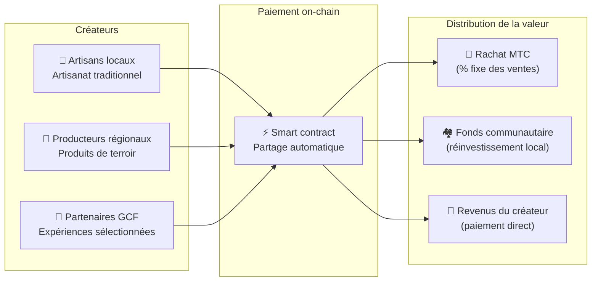

# 🗓️ Feuille de route et équipe

>**À ceux qui ont lu jusqu'ici —— la vision, le design économique et la base technique sont au complet.**
> Nous ne sommes pas un projet spéculatif de court terme.
>**Le gros du développement de plateforme est déjà bouclé** et nous sommes entrés en phase d'expansion.

---

## Jalons stratégiques

### 🔥 Phase 1 : Réveil (premier semestre 2026 ── présent)

**Thème : consolider la base et le flux de trésorerie**

La plateforme web est opérationnelle. Les apps iOS (Matsuri et J-Times) sortent en avril 2026. Concentration sur la monétisation et la liquidité initiale dans le cadre du système financier supervisé par le CEO.

| Statut | Jalon | Détail |
| :---: | :--- | :--- |
| ✅ | **Plateforme web opérationnelle** | Matsuri Web App et tableau de bord GCF (web) en marche |
| ✅ | **Paiements et croissance** | Paiement MTC + airdrop de parrainage implémentés |
| ✅ | **Lancement média** | Infrastructure J-Times (web et podcast) construite |
| ✅ | **Genèse** | Émission du jeton MTC sur Solana |
| ✅ | **Liquidité sécurisée** | Pool de liquidité initial créé sur Raydium |
| ⬜ | **Début des incitations** | Démarrage du minage de liquidité à APR cible 20 % |
| ⬜ | **Paiement on-chain** | Vérification Solana Pay en production |
| ⬜ | **Recrutement VIP** | Sélection des 20 premiers VIP du GCF |

### 🚀 Phase 2 : Expansion (second semestre 2026)

**Thème : actifs réels et Adventure Mining**

Exploitation de la webapp aboutie, extension des bases physiques et de la fonction « pèlerinage ».

| Statut | Jalon | Détail |
| :---: | :--- | :--- |
| ⬜ | **Nouvelle fonctionnalité** | Lancement d'Adventure Mining (pèlerinage) |
| ⬜ | **Déploiement international** | Ouverture de hubs partenaires et d'événements VIP en Asie (Thaïlande, Taïwan…) |
| ⬜ | **Gestion de patrimoine** | Constitution d'un portefeuille immobilier, actions et crypto |
| ⬜ | **Objectif atteint** | Actifs totaux de l'écosystème de **1 Md ¥** |

### 🌊 Phase 3 : Circulation (à partir de 2027)

**Thème : adoption massive, économie de co-création et décentralisation**

Ouverture au grand public, marketplace on-chain et phase d'écosystème complet en marche.

| Statut | Jalon | Détail |
| :---: | :--- | :--- |
| ⬜ | **Grand Opening** | Lancement mondial officiel de Matsuri App |
| ⬜ | **Grand déblocage (1/6/2027)** | Déblocage des fondateurs + pool de minage (550 M) actif + début du cycle de halving |
| ⬜ | **Marketplace de co-création** | Boutiques de terroir + GCF Partner Store ── paiement on-chain avec rachat automatique de MTC |
| ⬜ | **Crowdfunding (NFT de droits)** | Les utilisateurs financent des projets culturels sur Solana. Les soutiens reçoivent des NFT représentant propriété, partage de revenus et droits de gouvernance |
| ⬜ | **Paiement on-chain** | Toutes les transactions du marketplace réglées par smart contract ── un % fixe alimente le pool de rachat |
| ⬜ | **Objectif atteint** | Actifs totaux de l'écosystème de **10 Md ¥ (~65 M$)** |
| ⬜ | **Transition DAO** | Transfert d'une part des pouvoirs décisionnels à la communauté GCF |

#### 🏪 Concept du marketplace de co-création

L'expression ultime de « l'OS culturel » ── un marketplace décentralisé où **créateurs et amateurs de culture échangent directement**, sans intermédiaires extractifs.

| Fonction | Description | Statut |
| :--- | :--- | :---: |
| **🏺 Boutiques de terroir** | Artisans et producteurs vendent directement à une clientèle mondiale. 5-10 % de remise avec paiement MTC | ⬜ Concept |
| **🎫 Crowdfunding + NFT de droits** | Financer des projets culturels (restauration de sanctuaires, revival de matsuri, ateliers d'artisans). Recevoir un NFT attestant la contribution, pouvant conférer partage de revenus et gouvernance | ⬜ Concept |
| **⚡ Paiement on-chain** | Toutes les transactions du marketplace réglées par smart contract Solana. Partage automatique : paiement au créateur + fonds communautaire + rachat MTC ── sans comptabilité manuelle | ⬜ Concept |
| **🗳️ Gouvernance des soutiens** | Les détenteurs de NFT votent sur l'allocation des ressources des projets financés ── pas un simple don, une véritable co-création | ⬜ Concept |

:::info Pourquoi c'est important
Aujourd'hui, les touristes achètent des souvenirs dans des boutiques qui paient un loyer au « propriétaire plateforme ». Demain, **un artisan rural de Kyoto vend directement à un fan à Copenhague** et une part de cette vente alimente automatiquement l'économie MTC. C'est la forme la plus aboutie du flywheel.
:::

---

## 👤 Équipe

### Ko Takahashi ── Fondateur / CEO et architecte en chef

| Élément | Détail |
| :--- | :--- |
| **Rôle** | Direction générale du projet. Conception de la plateforme, smart contracts, développement full-stack |
| **Vision** | Porteur de « l'OS culturel » : exporter la culture, importer la richesse |
| **Posture** | Écrit lui-même le code et va sur le terrain (Golden Gai) —— adepte du « skin in the game » |

### Jon Anders Jensen ── Directeur / Opérations GCF et événements

| Élément | Détail |
| :--- | :--- |
| **Rôle** | Direction de la communauté GCF. Conception opérationnelle et pilotage de terrain des événements et tours |
| **Force** | Vision internationale et relations de confiance avec les membres GCF, soutenant le « cycle humain » de l'écosystème |

### Ryunosuke Honda ── Directeur / Ambassadeur culturel régional

| Élément | Détail |
| :--- | :--- |
| **Rôle** | Pont entre les cultures et communautés locales du Japon et l'écosystème Matsuri |
| **Force** | Découvre les ressources culturelles régionales et les porte sur la plateforme pour concrétiser une expérience « Japon profond » |

### 🌏 Communauté GCF ── membres de développement à travers le monde

Matsuri Protocol n'est pas construit que par l'équipe fondatrice.
**Les membres GCF répartis dans le monde** contribuent à son évolution par les tests, les retours, les traductions et le déploiement local.

| Domaine | Structure |
| :--- | :--- |
| **💼 Finance globale** | Réseau d'investisseurs privés en Asie |
| **⚙️ Ingénierie** | Équipe distribuée de développement blockchain et mobile |
| **🏮 Opérations** | Canal solide avec les communautés locales de Golden Gai et des sites touristiques majeurs |
| **🌐 Communauté** | Membres GCF multinationaux : Japon, Norvège, Thaïlande, Taïwan, etc. |

:::tip Une infrastructure culturelle bâtie ensemble
Rejoindre le GCF, c'est aussi devenir co-développeur de Matsuri Protocol.
Contribuer, ce n'est pas seulement coder. Présenter un lieu sacré local, traduire la documentation, organiser un événement ——
chaque geste est une force qui porte ce protocole dans le monde.
:::

---

## 🏛️ Gouvernance (DAO)

Matsuri Protocol passe progressivement de la centralisation vers une **organisation autonome décentralisée (DAO)**.
Les membres GCF (Platinum/Gold) auront à terme un **droit de vote** sur les questions clés suivantes.

| Vote | Contenu |
| :--- | :--- |
| **💰 Allocation de fonds** | Quels nouveaux projets et quelles opérations marketing financer |
| **⚙️ Mise à jour du protocole** | Ajustements fins des commissions et des taux de minage |
| **⛩️ Certification culturelle** | Quels matsuri, temples et sanctuaires sont reconnus comme « sites officiels de pèlerinage » et soutenus financièrement |

:::info Rejoignez la révolution
Nous ne construisons pas qu'une app.
Nous bâtissons une **économie culturelle sans frontières**.
:::

---

**[◀ Précédent : Produit et technologie](/docs/product-tech)**｜**[⛩️ Retour au début du whitepaper](/docs/intro)**
