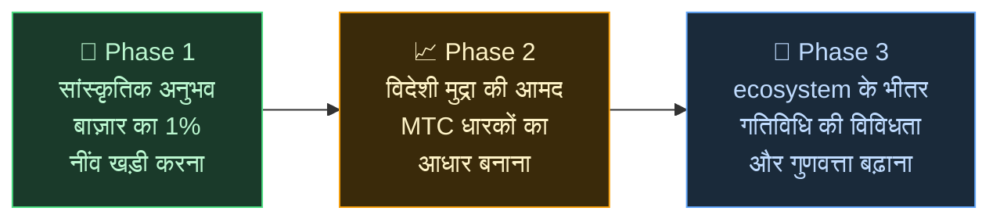

# 🌏 चुनौतियाँ और समाधान — असुविधाजनक सच, और उम्मीद

> **मिशन सुंदर है। हक़ीक़त उसके आड़े खड़ी है।**

---

## पर इस मिशन के सामने कुछ असुविधाजनक सच्चाइयाँ खड़ी हैं

:::info ¥10 खरब (~$66B) का बाज़ार, और ऊर्जा उन लोगों तक नहीं पहुँच रही जो संस्कृति ढो रहे हैं
जापान का इनबाउंड बाज़ार **प्रति वर्ष ¥10 खरब (~$66 बिलियन)** की ओर बढ़ रहा है।
फिर भी उसका बहुत कम हिस्सा ज़मीन तक पहुँच पाता है।
:::

### वह बाज़ार जिसे MTC लक्ष्य बनाता है

हम एक ही झटके में पूरे ¥10 खरब पर दावा नहीं कर रहे।

उस बाज़ार के भीतर हमारा पहला निशाना है — **सांस्कृतिक अनुभव, गाइड और स्थानीय टूर का खंड।** हम उसी खंड के **1% (लगभग ¥100 अरब / ~$660M)** को शुरुआती लक्ष्य मानते हैं : छोटे से शुरू, मज़बूत होकर बड़े।

| चरण | रणनीति | लक्ष्य |
| :--- | :--- | :--- |
| **छोटे से शुरुआत** | सांस्कृतिक अनुभवों और गाइडेड टूर पर ध्यान। ट्रैक-रिकॉर्ड बनाकर मुँह-से-मुँह विकास | राजस्व-आधार स्थापित करना |
| **मज़बूती से विकास** | विदेशी मुद्रा (इनबाउंड आय) लाना और MTC धारकों के साथ राजस्व बाँटने का तंत्र सिद्ध करना | MTC अर्थव्यवस्था में भरोसा गढ़ना |
| **गुणवत्ता में छलाँग** | एक स्तर के बाद वृद्धि के पीछे भागना बंद; ecosystem के भीतर अनुभव की गहराई, गतिविधि की विविधता और समुदाय को समृद्ध करना | एक टिकाऊ सांस्कृतिक अर्थव्यवस्था |

> **मात्रा से नहीं — जुड़े लोगों की गुणवत्ता और अनुभव की गहराई से विकास।** यही MTC की विस्तार-रणनीति है।

Web2 प्लेटफ़ॉर्मों ने यात्रा के आनंद को दुनिया भर तक पहुँचाया है, और उन्होंने जो खड़ा किया उसके लिए हम सचमुच आभारी हैं। पर केंद्रीकृत ढाँचे के कुछ अनिवार्य दुष्प्रभाव होते हैं।

Algorithms तय करते हैं क्या दिखेगा। संचालक रैंकिंग के लिए लड़ने को मजबूर हो जाते हैं। एक समीक्षा बिक्री को हिला देती है। कमीशन की दरें प्लेटफ़ॉर्म की मर्ज़ी से बदलती हैं — और ज़मीन पर खड़े लोग इस डर में जीते हैं कि वे चुने जाएँगे या ग़ायब हो जाएँगे।

यह ढाँचा जो पैदा करता है — वह है संचालकों के बीच विभाजन और अदृश्य नियमों का भय।
पड़ोस की दुकान प्रतिद्वंदी बन जाती है; सहयोग के बजाय ग्राहक को घेर लेना ज़्यादा समझदारी लगता है। यात्री भी सिर्फ़ "स्टार रेटिंग" और "रैंकिंग" में समतल किए हुए विकल्प देखते हैं, और सचमुच मूल्यवान अनुभव कहीं नीचे दब जाते हैं।

:::danger ज़मीन पर तीन समस्याएँ जीवित हैं
💸 **राजस्व का बहाव** — अधिकांश राजस्व विदेशी OTAs और बिचौलियों के कमीशन के रूप में देश से बाहर बह जाता है

😤 **स्थानीय थकावट** — ओवरटूरिज़्म का बोझ भर रह जाता है; वह राजस्व जो सचमुच मायने रखता है, समुदाय तक नहीं लौटता

🚧 **अनुभव की दीवार** — algorithm के चुने समरूप टूर ही दिखते हैं, और आगंतुक "असली जापान" से कभी नहीं मिल पाते
:::

> **जापानी लोग जूझते हैं, यात्री असली चीज़ से मिल नहीं पाते, और दौलत प्लेटफ़ॉर्मों में ओझल हो जाती है।**

---

## तो फिर इसे बदलें कैसे?

आज, इस ढाँचे को जड़ से बदल देने वाली तकनीक आख़िरकार हमारे सामने है।

:::tip Smart contracts — ऐसे साझा नियम जिन्हें दोबारा नहीं लिखा जा सकता
कमीशन की दरें और शर्तें कोड में तराश दी जाती हैं। कोई मनमर्ज़ी से उन्हें बदल नहीं सकता। सब एक ही नियम के नीचे, स्वतः।
:::

:::tip Blockchain — पारदर्शिता जो सचमुच दिखाई दे
हर लेन-देन एक सार्वजनिक बही पर दर्ज होता है जिसे कोई भी जाँच सकता है। डेटा किसी कंपनी के अंदर क़ैद रहने का युग ख़त्म हो चुका है।
:::

:::tip Solana — 0.4 सेकंड का निपटान, ~$0.0003 शुल्क
बिचौलियों के ढेरों शुल्क नहीं, कई दिनों की क्लीयरिंग नहीं। लोग सीधे लोगों से जुड़ते हैं।
:::

:::tip AI — प्रबंधन की लागत ख़ुद घुल जाती है
उत्पादकता का विस्फोटक छलाँग विशाल प्लेटफ़ॉर्मों को चलाने के लिए ज़रूरी लागत-ढाँचे को पुरानी बात बना देती है।
:::

अब वह दौर नहीं रहा जब लोगों को जोड़ने के लिए बिचौलियों की ज़रूरत हो।

इस तकनीक से हम इनबाउंड अर्थव्यवस्था को एकाधिकार से मुक्त करते हैं और राजस्व को जापान व विदेश दोनों में ज़मीन पर खड़े लोगों तक लौटाते हैं।
और सिर्फ़ जापान में नहीं — हम **दुनिया की संस्कृतियों की रक्षा और उन्हें जोड़ने की संरचना** गढ़ रहे हैं।

---

**[◀ पिछला : दृष्टि और मिशन](/docs/vision)** | **[▶ अगला : वह भविष्य जो MTC देखता है](/docs/future)**
