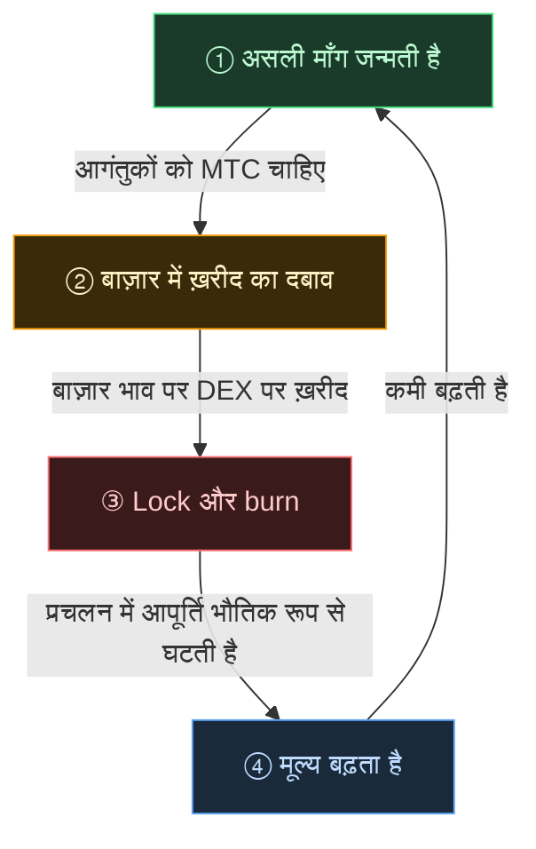

# 🔄 आर्थिक flywheel — विकास-चक्र और सांस्कृतिक OS

> **जितना अधिक आगंतुक जापान का आनंद उठाते हैं, उतनी ही अधिक माँग ecosystem पैदा करता है।**
> यही आपूर्ति-माँग का तंत्र इस परियोजना का धड़कता हुआ हृदय है।

---

## MTC का आपूर्ति-माँग तंत्र

Matsuri Protocol के डिज़ाइन के अनुसार — **बढ़ती वास्तविक माँग ख़रीद का दबाव पैदा करती है, और सिकुड़ती आपूर्ति के साथ मिलकर मूल्य बढ़ने की स्थितियाँ तैयार करती है।**
यह भावुकता नहीं है — यह **आपूर्ति और माँग का तंत्र** है।

यह तंत्र नीचे दिए गए **चार-चरणीय चक्र** पर चलता है।

| चरण | नाम | तंत्र |
| :---: | :--- | :--- |
| **①** | **असली माँग जन्मती है** | गाइड बुक करने या टिकट NFT ख़रीदने के लिए आगंतुकों को MTC चाहिए |
| **②** | **बाज़ार में ख़रीद का दबाव** | DEX (विकेंद्रीकृत एक्सचेंज) पर बाज़ार भाव पर MTC ख़रीदा जाता है। सट्टेबाज़ी नहीं, उपभोग पर टिका मज़बूत दबाव |
| **③** | **Lock और burn** | निपटान में प्रयुक्त MTC का एक हिस्सा smart contract द्वारा तुरंत locked या burn कर दिया जाता है। प्रचलन में आपूर्ति भौतिक रूप से घटती है |
| **④** | **कमी बढ़ती है** | ख़रीद की माँग बढ़ती है, बिक्री की आपूर्ति सिकुड़ती है। आपूर्ति-माँग के संतुलन में यह झुकाव हर टोकन को और दुर्लभ बनाता है |

---

---

:::note इस समीकरण के पीछे की दृष्टि
इस flywheel के परे जो बड़ी तस्वीर है — वह "सांस्कृतिक OS" — अगले पृष्ठ पर विस्तार से खुलती है : [वह भविष्य जो MTC देखता है](/docs/future)।
:::

---

**[◀ पिछला : चुनौतियाँ और समाधान](/docs/challenges)** | **[▶ अगला : वह भविष्य जो MTC देखता है](/docs/future)**
