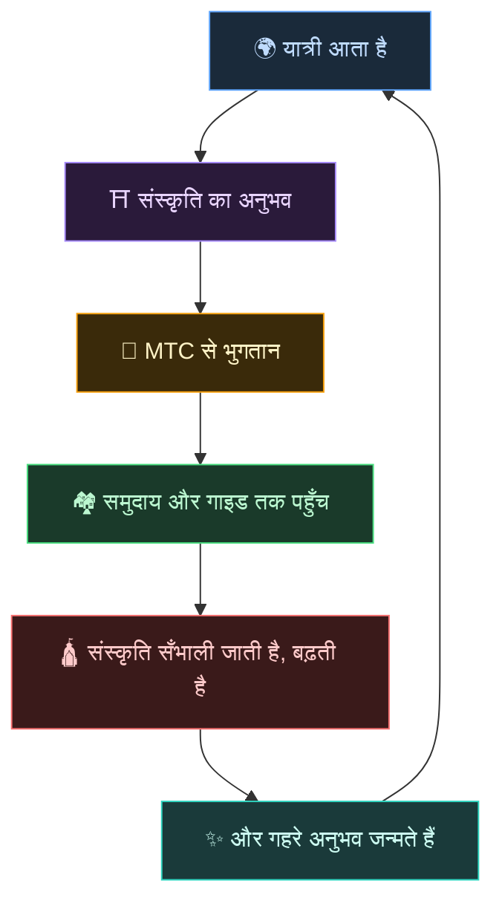
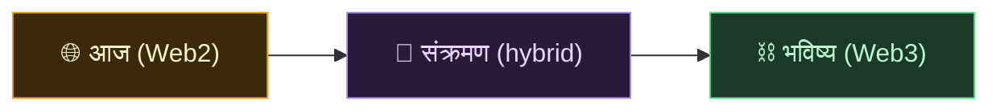
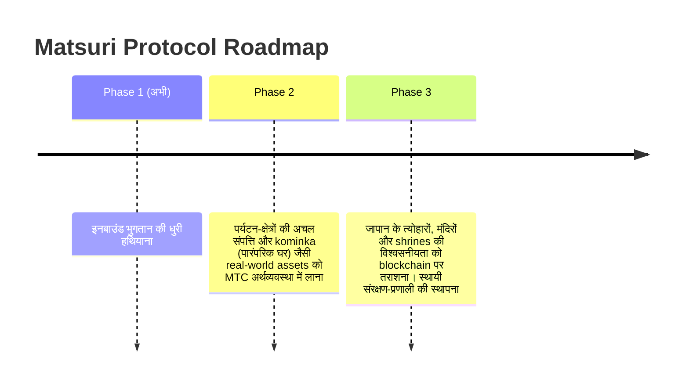

# 🌀 वह भविष्य जो MTC देखता है — एक अर्थव्यवस्था जहाँ हर तरह की भागीदारी प्रवाहित होती है

> **जो अनुभव करते हैं, जो पहुँचाते हैं, जो रक्षा करते हैं — हर भाव अर्थव्यवस्था बनकर घूमता है और संस्कृति को अगली पीढ़ी तक ले जाता है।**

---

## हम जो संचार गढ़ना चाहते हैं

MTC सट्टेबाज़ी का टोकन नहीं है।

यात्री जापानी संस्कृति से मिलते हैं और हिल उठते हैं।
गाइड उस भाव को पहुँचाते हैं और पुरस्कृत होते हैं।
समुदाय फलते-फूलते हैं और अपनी संस्कृति की रक्षा करते रहते हैं।
और वही संस्कृति अगले यात्री को बुलाती है।

यही संचार वह कारण है जिसके लिए MTC है।

---

## एक अर्थव्यवस्था जिसमें तीनों पक्ष पुरस्कृत होते हैं

पुराने पर्यटन मॉडल में यात्री भुगतान करता है, प्लेटफ़ॉर्म लाभ लेता है, और ज़मीन पर कुछ नहीं बचता।
MTC की अर्थव्यवस्था में हर भागीदार पुरस्कृत होता है।

| भागीदार | क्या होता है | पुरस्कार कैसे |
| :--- | :--- | :--- |
| **🌍 जो अनुभव करते हैं** | जापानी संस्कृति से मिलते हैं, MTC में भुगतान करते हैं | येन से सस्ता और असली अनुभवों तक सच्ची पहुँच। घर लौटकर भी MTC के ज़रिए जुड़ाव बना रहता है |
| **⛩️ जो पहुँचाते हैं** | गाइड के रूप में आयोजन करते हैं, J-Times पर प्रकाशित होते हैं | सीधा पुरस्कार, बीच में कोई बिचौलिया नहीं। जितना अधिक कर्म, उतना अधिक MTC |
| **🏘️ जो रक्षा करते हैं** | स्थानीय समुदाय के रूप में संस्कृति को सँभालते और आगे ले जाते हैं | राजस्व सीधे पहुँचता है। समुदाय ओवरटूरिज़्म से कराहने के बजाय टिकाऊ तरीक़े से फलते-फूलते हैं |

---

## अर्थव्यवस्था जितनी फैलेगी, संस्कृति उतनी ही मज़बूत होगी

MTC की अर्थव्यवस्था अनुभव की बुकिंग से शुरू होकर जीवन के हर हिस्से में फैलती है।

- **अनुभव** — असली सांस्कृतिक अनुभव, तीर्थ-यात्रा माइनिंग
- **वस्त्र, भोजन, आश्रय** — अतिथिगृह, दुकानें, व्यंजन, फ़ैशन
- **सह-सर्जन की परियोजनाएँ** — संस्कृति की रक्षा में निवेश के लिए crowdfunding
- **क्रॉस-कल्चरल अंतरराष्ट्रीय समझ** — सरहदों के पार आदान-प्रदान और समझ के स्थल

अर्थव्यवस्था जितनी फैलती है, उतनी ही MTC की धारा उसमें बहती है, और संस्कृति को सँभालने की उसकी शक्ति उतनी ही बढ़ती है।
यह महज़ एक व्यावसायिक मॉडल नहीं है। यह संस्कृति की **जीवन-रक्षा प्रणाली** है।

---

## Web2 से Web3 की ओर — चरणबद्ध, बिना ज़ोर-ज़बरदस्ती के

हम यह नहीं कह रहे कि "पहले ही दिन सब कुछ blockchain पर डाल दो।"

आज भी ज़्यादातर लोग Web3 से अपरिचित हैं। इसीलिए हमने डिज़ाइन ऐसा किया है कि **लोग उन परिचित रूपों से शुरू करें जिन्हें वे पहले से जानते हैं, और Web3 के फ़ायदे धीरे-धीरे महसूस करें।**

| चरण | उपयोगकर्ता का अनुभव | भीतर क्या हो रहा है |
| :--- | :--- | :--- |
| **आज** | किसी आम वेब ऐप की तरह बुकिंग और भुगतान। क्रेडिट कार्ड ठीक है | Django + Stripe। शुरू करने के लिए wallet की कोई ज़रूरत नहीं |
| **संक्रमण** | ऐप के भीतर MTC कमाएँ और ख़र्च करें। wallet connect सिर्फ़ एक टैप | off-chain scores क्रमशः on-chain में स्थानांतरित |
| **भविष्य** | हर लेन-देन और अधिकार पारदर्शी रूप से on-chain दर्ज। आपका योगदान हमेशा के लिए प्रमाणित | smart contracts पर चलती, पूरी तरह स्वचालित, छेड़छाड़-रोधी अर्थव्यवस्था |

:::tip Web3 को मुश्किल नहीं होना चाहिए
शुरू में न wallet सेटअप, न seed phrase सँभालने की ज़रूरत। ऐप का उपयोग करते-करते आप स्वाभाविक रूप से Web3 में क़दम रखते हैं। **अनजाने में ही आप Web3 के नागरिक बन चुके होते हैं।** हम यही अनुभव गढ़ रहे हैं।
:::

---

## वह अर्थव्यवस्था जो ज़ोर से नहीं, सहानुभूति से चलती है

और यह अर्थव्यवस्था smart contracts पर चलती है।
नियम किसी की मर्ज़ी से एकतरफ़ा नहीं बदले जा सकते — **एक ऐसी अर्थव्यवस्था जहाँ यथास्थिति को बलपूर्वक नहीं बदला जा सकता।**

इसी नींव पर हम पुरातन विवेक से सीखते हैं और नया मूल्य रचते जाते हैं। 温故知新, और उसके आगे सर्जन।

> **एक ऐसी दुनिया जहाँ जीवन येन या डॉलर के बिना भी संस्कृति के इर्द-गिर्द थम सके।**
>
> मुद्रा का अर्थ किसी और को सौंपने के बजाय, अपनी "भागीदारी" से मूल्य उपजाना और ख़र्च करना।
> यही वह स्वतंत्रता है जो MTC आप तक पहुँचाना चाहता है।

---

## 🏁 अंतिम गंतव्य : "सांस्कृतिक OS"

हमारा चरम लक्ष्य कोई भुगतान-ऐप भर नहीं है।
हम चाहते हैं कि **संस्कृति स्वयं एक OS (आधार-स्तर) बन जाए।**

> पुरातन विवेक की रक्षा हम नवीनतम blockchain से करते हैं।
> यही वह भविष्य है जो Matsuri Protocol रच रहा है।

---

:::note कथा खंड का अंत
यहाँ तक पढ़ चुकने के बाद आपको समझ आ गया होगा कि MTC क्यों है।
आगे है **[व्यवहार]** — आइए देखें कि MTC से आप सचमुच क्या कर सकते हैं।
:::

**[◀ पिछला : आर्थिक flywheel](/docs/flywheel)** | **[▶ अगला : Ecosystem](/docs/ecosystem)**
