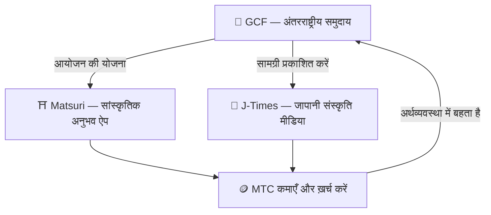

# 🏗️ MTC ecosystem — एक अर्थव्यवस्था जहाँ अनुभव, मीडिया और समुदाय एक साथ बहते हैं

> **मिशन को ज़मीन पर उतारने के तीन "स्थल।"**
> अनुभव का स्थल, सीखने का स्थल, जुड़ाव का स्थल — हर एक अपने आप में खड़ा है, और MTC उन्हें एक प्रवाहमान अर्थव्यवस्था में बाँधता है।

MTC महज़ एक टोकन नहीं है। तीन उत्पाद और एक अंतरराष्ट्रीय समुदाय मिलकर ऐसी अर्थव्यवस्था बनाते हैं जो संस्कृति की रक्षा करती है।

:::tip 🤝 GCF — ecosystem को चलाने वाला अंतरराष्ट्रीय समुदाय
सरहदों के पार जापानी संस्कृति से प्रेम करने वाले लोगों का मिलन-स्थल। GCF गाइडों की भर्ती करता है, और वही GCF गाइड Matsuri पर अनुभव चलाते हैं। वे J-Times पर असरदार सामग्री भी प्रकाशित करते हैं — समुदाय की गतिविधि ही वह इंजन है जो पूरे ecosystem को हिलाती है।
:::

:::tip ⛩️ Matsuri — सांस्कृतिक अनुभव ऐप
सांस्कृतिक अनुभवों की बुकिंग से शुरू होकर धीरे-धीरे **अतिथिगृहों**, **दुकानों** और **crowdfunding** तक फैलता है। अर्थव्यवस्था अनुभव से बढ़कर वस्त्र, भोजन, आश्रय और सह-सर्जन-निवेश तक पहुँचती है।

**तीर्थाटन माइनिंग (seichi junrei — पवित्र तीर्थयात्रा)** — shrines, मंदिरों और सांस्कृतिक धरोहरों पर शारीरिक रूप से पहुँचकर MTC कमाइए। यात्री प्रसिद्ध hotspots से स्वाभाविक रूप से छुपे हुए स्थानीय रत्नों की ओर बहते हैं, और इससे ओवरटूरिज़्म भी घुलता है और क्षेत्रीय पुनरुद्धार भी होता है।
:::

:::tip 📰 J-Times — जापानी संस्कृति मीडिया
एक मीडिया प्लेटफ़ॉर्म जो जापानी संस्कृति का आकर्षण दुनिया तक पहुँचाता है। पढ़ने और साझा करने जैसे जुड़ाव से आप MTC कमाते हैं।
:::

---

## 🤝 सोशल माइनिंग (जोड़िए और कमाइए)

**GCF admin dashboard से जुड़ा हुआ — web संस्करण live (iOS ऐप अप्रैल 2026 के लिए निर्धारित)।**

GCF सदस्यों को एक समर्पित **GCF admin web** इंटरफ़ेस तक पहुँच मिलती है।

| सुविधा | आप क्या कर सकते हैं |
| :--- | :--- |
| **🎪 आयोजन बनाएँ** | अपने आयोजन और टूर की योजना बनाकर सूचीबद्ध करें |
| **📢 सामग्री वितरित करें** | J-Times के लेख और सामग्री प्रकाशित और प्रसारित करें |
| **📊 Referral ट्रैकिंग** | Referral से जुड़े उपयोगकर्ताओं की गतिविधि और राजस्व रीयल-टाइम में देखें |

:::info स्वचालित पुरस्कार
आपके referred friend जब भी भुगतान करते हैं, सिस्टम **स्वतः** आपके wallet में पुरस्कार (राजस्व हिस्सा) जमा कर देता है।
:::

---

## 🎓 Creator economy (रचिए और कमाइए)

आप सिर्फ़ सामग्री का उपभोग नहीं करते — Matsuri पर **कोई भी** उसे रचकर उससे कमा सकता है।

| प्लेटफ़ॉर्म | Creators क्या कर सकते हैं | राजस्व मॉडल |
| :--- | :--- | :--- |
| **📚 Course marketplace** | जापानी संस्कृति, भाषा या शिल्प पर वीडियो / टेक्स्ट courses प्रकाशित करें | प्रति-enrollment शुल्क (creator को हिस्सा) |
| **🎙️ Podcast studio** | Spotify, Apple Podcasts और RSS पर वितरित होने वाली ऑडियो सीरीज़ बनाएँ | Subscription-only एपिसोड |
| **🤝 Crowdfunding** | सांस्कृतिक परियोजनाओं के लिए Solana-आधारित fundraising अभियान चलाएँ | On-chain contribution ट्रैकिंग |
| **🛍️ User shops** | प्लेटफ़ॉर्म के भीतर अपनी निजी दुकान खोलें (शिल्प, सामान) | उत्पाद / समीक्षा प्रणाली के साथ सीधी बिक्री |

:::tip AI से सज्जित निर्माण-सहायता
आयोजन-कर्ता admin dashboard के भीतर **अंतर्निहित AI assistant (GPT-4 Turbo)** का उपयोग करके event विवरण लिख सकते हैं, 5 भाषाओं में स्वतः अनुवाद कर सकते हैं, और SEO-अनुकूलित metadata उत्पन्न कर सकते हैं।
:::

---

  

*Golden Gai में समुदाय-मिलन — जुड़ाव ही माइनिंग की शक्ति बन जाता है।*

---

:::note अगला पृष्ठ
यह देखने के लिए कि माइनिंग सचमुच कैसे काम करती है और कैसे कमाएँ, आगे बढ़िए **[माइनिंग और कमाई →](/docs/mining)**।
:::
