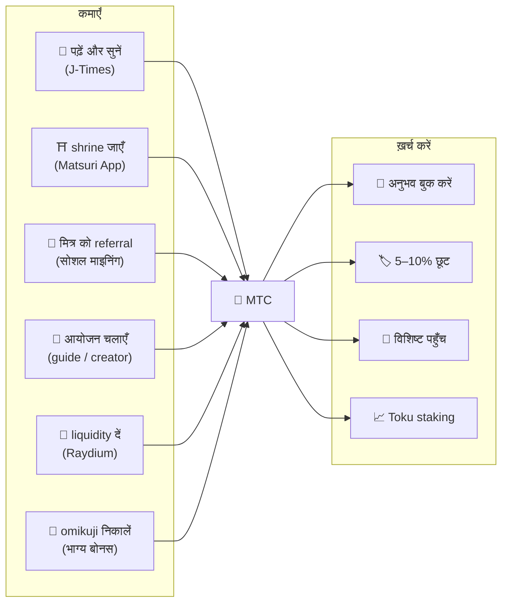
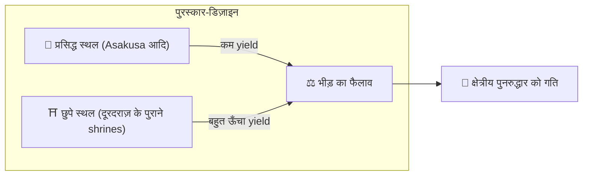
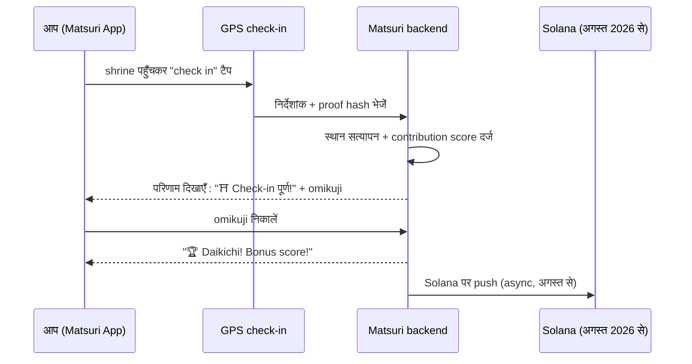
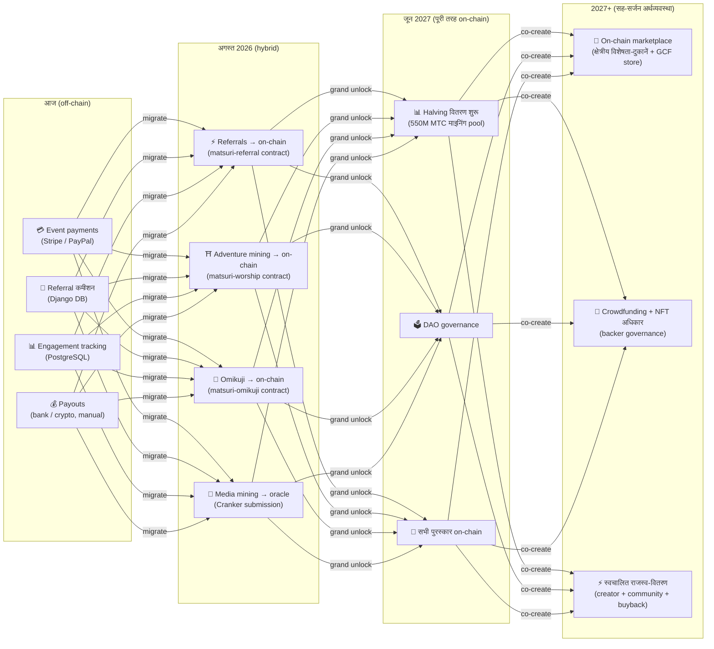

import useBaseUrl from '@docusaurus/useBaseUrl';

# ⛏️ माइनिंग के पाँच स्तंभ और कमाई के तरीक़े

> **संस्कृति में हर तरह की "भागीदारी" मूल्य बन जाती है।**
> पढ़ना, चलना, जुड़ना, रचना, समर्थन देना — आपकी हर गतिविधि MTC पैदा करती है।

<small>*"माइनिंग" क्या है? — Bitcoin जैसी नेटवर्कों में कंप्यूटर भारी-भरकम गणनाएँ करते हैं और उसके बदले नए सिक्के पाते हैं; इसे "माइनिंग" कहा जाता है। MTC में माइनिंग का काम कंप्यूटिंग-शक्ति नहीं, बल्कि **आपके अपने कर्म** करते हैं — लेख पढ़ना, shrine जाना, आयोजन चलाना। सोना खोदने के बजाय, संस्कृति से जुड़ाव MTC पैदा करता है। यहाँ "माइनिंग" का यही अर्थ है।*</small>

> कर्म से कमाइए। अनुभव पर ख़र्च कीजिए। सँभाले रखिए और उसे बढ़ते देखिए।

MTC सट्टेबाज़ी का टोकन नहीं है। यह एक असली अर्थव्यवस्था में बहता है जहाँ हर क्रिया मूल्य पैदा करती है और उसे पकड़ लेती है। web application और admin dashboard **पहले से live हैं**। अभी contribution scores off-chain (Django में) दर्ज होते हैं और अगस्त 2026 से चरणबद्ध ढंग से on-chain आते जाएँगे।

:::tip समग्र चित्र
MTC में **एक पूरी तरह बंद-चक्रीय अर्थव्यवस्था** है : आप असली गतिविधि से कमाते हैं, असली अनुभवों पर ख़र्च करते हैं, और ecosystem के बढ़ने के साथ मूल्य बढ़ता है। यह पृष्ठ उसकी कार्यविधि विस्तार से समझाता है।
:::

---

## MTC का जीवन-चक्र

---

## माइनिंग के पाँच स्तंभ

### 1. 📖 मीडिया माइनिंग (पढ़िए, सुनिए, उत्तर दीजिए — और कमाइए)

**आधिकारिक "J-Times" मीडिया प्लेटफ़ॉर्म से जुड़ा हुआ**

ज्ञान यात्रा की गुणवत्ता को ज़बरदस्त ढंग से बढ़ा देता है। **J-Times ऐप** खोलिए और जापानी संस्कृति से जुड़ी सामग्री का आनंद लीजिए। टेक्स्ट और ऑडियो के साथ हम **समझ की जाँच (quizzes)** के लिए भी पुरस्कार देते हैं। हर पूर्ण की गई क्रिया स्वतः आपके खाते में MTC जमा करती है।

| क्रिया | पूर्णता की शर्त | सामान्य पुरस्कार |
| :--- | :--- | :---: |
| **📰 लेख पढ़ना** | 75% तक स्क्रॉल | 2–30 MTC |
| **🎧 पॉडकास्ट सुनना** | अंत तक प्ले | 2–30 MTC |
| **🎬 वीडियो देखना** | देखने के बाद विवरण-स्क्रीन बंद करना | 2–30 MTC |
| **📤 सामग्री साझा करना** | share sheet खोलना | 2–30 MTC |
| **✅ quiz का उत्तर** | समझ-परीक्षा पास | 2–30 MTC |

<small>*पुरस्कार की मात्रा सामग्री के प्रकार, लंबाई और ecosystem की कुल आपूर्ति-संतुलन के अनुसार बदलती है।*</small>

:::tip फ़ुरसत के पल माइनिंग बन जाते हैं
आना-जाना और विश्राम के क्षण पुरस्कार पैदा करने वाले समय में बदल जाते हैं।
:::

:::info Offline समर्थन
किसी दूरस्थ shrine पर इंटरनेट नहीं? कोई बात नहीं। J-Times गतिविधि को स्थानीय रूप से दर्ज रखता है और **नेटवर्क लौटते ही स्वतः sync** कर देता है (7-दिन offline queue)। कमाया हुआ MTC आप नहीं खोते।
:::

**अंदर क्या होता है :**
1. J-Times ऐप आपकी क्रिया को पहचानता है (पढ़ना, देखना पूर्ण, साझा आदि)
2. Offline होने पर भी स्थानीय रूप से दर्ज करता है (7 दिनों तक सुरक्षित)
3. नेटवर्क लौटने पर सर्वर को सत्यापन के लिए भेजता है
4. contribution score के रूप में balance में दिखाता है
5. अगस्त 2026 से : सत्यापित scores oracle के ज़रिए on-chain दर्ज होंगे और blockchain पर सत्यापन-योग्य बनेंगे

---

### 2. ⛩️ Adventure माइनिंग (चलिए और कमाइए)

**प्रोजेक्ट "Junrei" — smart contract पूर्ण, mainnet deployment अगस्त 2026**

एक अगली पीढ़ी की सुविधा जो GPS और टोकन प्रोत्साहनों से लोगों की भौतिक "गति-धारा" को गढ़ती है। सैकरेड-साइट मैप Matsuri web ऐप में **पहले से live है**। फ़िलहाल contribution scores off-chain दर्ज हैं; अगस्त 2026 में smart contract deployment के बाद on-chain पुरस्कार वितरण शुरू होगा।

>**क्योंकि वहाँ कमाई ज़्यादा होती है, लोग गाँव की ओर बढ़ते हैं।**
> यही सीधा-सा आर्थिक तर्क ओवरटूरिज़्म को घोलता है और क्षेत्रीय पुनरुद्धार को तेज़ करता है।

**Check-in कैसे काम करता है :**

  
  

    
<strong>Worship Mining</strong> — shrine के पास check in कीजिए, AR कैमरे से ऊर्जा पकड़िए, omikuji निकालिए और bonus MTC पाइए। Tier multipliers 1.0× (Major) से 10.0× (Hidden Gem) तक।

  

**मूल सिद्धांत — जितने कम आगंतुक, उतनी ज़्यादा कमाई :**

| स्थल का प्रकार | उदाहरण | प्रति check-in सामान्य पुरस्कार |
| :--- | :--- | :---: |
| 🏙️ **Major** | Sensōji, Kiyomizudera, Fushimi Inari | 30–50 MTC |
| 🌆 **क्षेत्रीय केंद्र** | हर प्रांत का Ichinomiya, क्षेत्रीय महान shrines | 50–100 MTC |
| 🏞️ **क्षेत्रीय** | ऐतिहासिक क्षेत्रीय shrines | 100–150 MTC |
| ⛰️ **दुर्गम** | पर्वतीय मंदिर, द्वीपीय पवित्र स्थल | 150–200 MTC |

<small>*ऊपर दिए मान आधार-पुरस्कार के अनुमान हैं। Omikuji multipliers उन्हें कई गुना बढ़ा सकते हैं।*</small>

**अतिरिक्त स्कोरिंग कारक :**
- **Omikuji multiplier** — हर check-in पर यादृच्छिक bonus। Daikichi पुरस्कार को कई गुना कर देता है
- **यात्रा की आवृत्ति** — नियमित रूप से आने वाले समय के साथ अधिक जमा करते हैं
- **Sponsored sites** — नगर निगम विशेष स्थलों को boost कर सकते हैं

:::info Contribution score → MTC
आपकी गतिविधि **contribution score** के रूप में जमा होती है। हर halving epoch (जून 2027 से शुरू) पर scores 550M माइनिंग पूल से MTC में परिवर्तित होते हैं। समुदाय में आपका योगदान जितना अधिक, उतना अधिक MTC आपको मिलता है। Exact boost गुणांक चरणबद्ध ढंग से अंतिम रूप पाते हैं और smart contracts में लागू होते हैं — यह असली pool आकार के अनुरूप न्यायसंगत वितरण सुनिश्चित करता है।
:::

---

### 3. 🤝 सोशल माइनिंग (जोड़िए और कमाइए)

सिर्फ़ मित्रों को परिचित कराकर आप MTC कमाते हैं।

#### साधारण उपयोगकर्ताओं के लिए referral पुरस्कार

बहुत सीधा है। जब कोई मित्र आपके referral link से sign up करता है, आपको **हर सीधे referral पर 300 MTC** मिलते हैं।

| शर्त | पुरस्कार |
| :--- | :--- |
| Referred मित्र sign up करे | **300 MTC** |

बस इतना ही। multi-tier पुरस्कार नहीं है।

#### GCF agent referral पुरस्कार

[GCF सदस्य](/docs/gcf) **आधिकारिक agents** हैं जो ecosystem के विस्तार के लिए ज़िम्मेदार हैं, और उनके लिए गहरी पुरस्कार-संरचना है।

| Layer | संबंध | कमीशन |
| :---: | :--- | :---: |
| **L1** | सीधा referral | **20%** |
| **L2** | उनके referrals | **5%** |
| **L3** | तीसरा स्तर | **5%** |
| **L4** | चौथा स्तर | **5%** |

:::note GCF agent कार्यक्रम के बारे में
यह multi-tier पुरस्कार सिर्फ़ उन्हीं आधिकारिक agents पर लागू होता है जिनके पास GCF membership है (केवल आमंत्रण पर)। साधारण उपयोगकर्ताओं को सिर्फ़ सीधा referral पुरस्कार (300 MTC) मिलता है।
GCF agent कमीशन उनके referrals की **असली आर्थिक गतिविधि** (अनुभव की ख़रीद, आयोजन में भागीदारी आदि) पर गणना की जाती है। सिर्फ़ लोगों को जोड़ लेना पुरस्कार नहीं देता।
:::

**En-Mining score कैसे काम करता है (GCF agents के लिए) :**

Contribution score दो घटकों से निकलता है :
- **Network breadth** (30%) — आपने कितने लोगों को जोड़ा
- **Economic activity** (70%) — आपके referral network से असली ख़रीदें

Scores समय के साथ जमा होते हैं और हर halving epoch पर MTC में परिवर्तित होते हैं।

#### GCF admin dashboard — web संस्करण live

GCF सदस्यों को समर्पित admin dashboard तक पहुँच मिलती है।

| सुविधा | आप क्या कर सकते हैं |
| :--- | :--- |
| **🎪 आयोजन बनाएँ** | अपने आयोजन और टूर की योजना बनाकर सूचीबद्ध करें |
| **📢 सामग्री वितरित करें** | J-Times के लेख और सामग्री प्रकाशित और प्रसारित करें |
| **📊 Referral ट्रैकिंग** | Referral से जुड़े उपयोगकर्ताओं की गतिविधि और राजस्व रीयल-टाइम में देखें |

:::warning अभी off-chain → अगस्त 2026 में on-chain में स्थानांतरित
Referral कमीशन फ़िलहाल Django (PostgreSQL) में ट्रैक होते हैं और bank transfer या crypto द्वारा भुगतान किए जाते हैं। **अगस्त 2026 से** ये Solana पर **Matsuri Referral smart contract** पर आ जाएँगे, जिससे on-chain, auditable payouts मिलेंगे।
:::

  

*Golden Gai में समुदाय-मिलन — जुड़ाव ही माइनिंग की शक्ति बन जाता है।*

---

### 4. 🎓 Creator और guide माइनिंग (रचिए और कमाइए)

आप सिर्फ़ सामग्री का उपभोग नहीं करते — Matsuri पर **कोई भी** उसे रच और monetize कर सकता है। यदि आप GCF सदस्य हैं, guide हैं या content creator हैं — यहाँ कमाई का तरीक़ा है।

| गतिविधि | कैसे कमाएँ |
| :--- | :--- |
| **🗺️ tour चलाना** | guide कमीशन (हर event के लिए तय) + tips |
| **🎫 event ticket बेचना** | EventPurchase से राजस्व हिस्सा |
| **📚 course प्रकाशित करना** | प्रति-enrollment शुल्क (creator को हिस्सा) |
| **🎙️ podcast episodes बनाना** | Subscription राजस्व |
| **🤝 crowdfunding अभियान चलाना** | Solana-आधारित on-chain contribution ट्रैकिंग |
| **🛍️ user shop खोलना** | शिल्प और वस्तुओं की सीधी बिक्री |

**Tipping प्रणाली :** event के बाद अतिथि guide को tip दे सकते हैं (Uber-शैली)। Tips Stripe से प्रसंस्कृत होते हैं और एक सार्वजनिक leaderboard पर ट्रैक होते हैं।

:::tip AI से सज्जित निर्माण-सहायता
आयोजन-कर्ता admin dashboard के भीतर **अंतर्निहित AI assistant (GPT-4 Turbo)** का उपयोग करके event विवरण लिख सकते हैं, 5 भाषाओं में स्वतः अनुवाद कर सकते हैं, और SEO-अनुकूलित metadata उत्पन्न कर सकते हैं।
:::

---

### 5. 🏦 Liquidity माइनिंग (जमा कीजिए और कमाइए)

>**आप ही बैंक बनिए।**

Raydium DEX पर MTC/SOL liquidity प्रदान कीजिए और ecosystem की शुरुआती trading infrastructure का सहारा बनिए। शुरुआती liquidity providers को एक विशेष पुरस्कार कार्यक्रम में "founding partners" माना जाता है।

| मद | विवरण |
| :--- | :--- |
| **पात्र** | MTC और SOL रखने वाला कोई भी व्यक्ति |
| **Target APY** | **20%** (शुरुआती liquidity incentive, risk premium के रूप में तय) |
| **DEX** | Raydium (Solana) |
| **उद्देश्य** | शुरुआती liquidity सुरक्षित करना और स्थिर trading वातावरण बनाना |

---

## 🎲 Omikuji bonus

हर adventure-mining check-in के साथ एक निःशुल्क Omikuji (भाग्य-पर्ची) मुफ़्त में। यह check-in पूरी होते ही **निःशुल्क (केवल gas)** चलने वाला omikuji-शैली का smart contract है।

| भाग्य | पुरस्कार multiplier | अतिरिक्त बोनस |
| :--- | :---: | :--- |
| 🏆 **Daikichi (महाशुभ)** | आधार × शीर्ष multiplier | Goshuin NFT |
| ✨ **Kichi (शुभ)** | आधार × उच्च multiplier | — |
| 🌸 **Shōkichi (अल्पशुभ)** | आधार × छोटा multiplier | — |
| 🍃 **Suekichi (भावी शुभ)** | आधार × 1.0 | — |
| 💀 **Kyō (अशुभ)** | आधार × 1.0 | — |

संभावनाएँ और multipliers GCF admin dashboard से समायोजित किए जा सकते हैं और ecosystem की समग्र MTC आपूर्ति-संतुलन के अनुसार संचालक द्वारा प्रबंधित होते हैं। परिणाम Solana पर एक **छेड़छाड़-रोधी commit-reveal protocol** से तय होते हैं — commit चरण के बाद कोई परिणाम नहीं बदल सकता।

<small>*Kyō आने पर भी आपको आधार-पुरस्कार मिलता ही है। डिज़ाइन "आने" के कर्म को ही पुरस्कार देता है।*</small>

:::note यह जुआ नहीं है
कोई पैसा दाँव पर नहीं लगता। यह केवल "आने के कर्म" के ऊपर एक यादृच्छिक bonus है। कुछ NFT sets इकट्ठा करने से विशेष आयोजनों में शामिल होने का अधिकार भी खुल सकता है।
:::

---

## MTC किस काम आता है

| उपयोग | लाभ | उपलब्धता |
| :--- | :--- | :---: |
| **🎫 अनुभव बुक करना** | tours, events और सांस्कृतिक गतिविधियों का MTC में भुगतान | ✅ उपलब्ध |
| **🏷️ छूट** | येन-मूल्य पर MTC में भुगतान करने पर 5–10% छूट | ✅ उपलब्ध |
| **🔑 विशिष्ट पहुँच** | NFT-gated events, VIP-only rituals, निजी tours | ✅ उपलब्ध |
| **📈 Toku staking** | MTC lock करके contribution score boost करें (लगभग 50% तक) | 🔜 अगस्त 2026 |
| **🗳️ DAO governance** | treasury, protocol उन्नयन और site accreditation पर वोट | 🔜 2027 |
| **🛍️ Partner shops** | भागीदार दुकानों और रेस्तराओं पर भुगतान | 🔜 विस्तार हो रहा है |

:::info भुगतान-माध्यम के रूप में MTC
Matsuri App के भीतर MTC credit card और Solana Pay के साथ एक प्रथम-श्रेणी भुगतान-माध्यम है। कोई रूपांतरण-चरण नहीं — checkout पर "Pay with MTC" चुनिए और आपका balance तुरंत घट जाता है।
:::

### MTC के रूपांतरण के बारे में

:::warning महत्वपूर्ण : हम MTC रूपांतरण / एक्सचेंज सेवाएँ नहीं देते
Matsuri crypto asset exchange business के रूप में पंजीकृत नहीं है, इसलिए **हम किसी भी परिस्थिति में MTC को fiat currency (येन, डॉलर आदि) में सीधे नहीं बदलते।**

यदि आप MTC को अन्य crypto assets या fiat में बदलना चाहते हैं, तो आप ख़ुद कर सकते हैं :
1. MTC को **Phantom Wallet** जैसे Solana-अनुरूप wallet में रखें
2. **Raydium (DEX)** पर MTC → SOL swap करें
3. केंद्रीकृत एक्सचेंज (CEX) पर SOL को fiat में बदलें

भविष्य में CEX listings पर भी विचार चल रहा है, जिसके बाद और आसान रूपांतरण-मार्ग उपलब्ध होंगे।
:::

---

## उदाहरण : MTC अर्थव्यवस्था में एक दिन

> **सुबह :** आप ट्रेन में J-Times के तीन लेख पढ़ते हैं → MTC कमाते हैं।
> **दोपहर :** Matsuri App के ज़रिए एक क्षेत्रीय shrine जाते हैं → check in, kichi (×1.5) निकलता है → और MTC कमाते हैं।
> **शाम :** अपने MTC से शिंजुकू Golden Gai का ¥9,000 (~$63) का सांस्कृतिक tour 10% छूट पर बुक करते हैं (यानी ¥8,100 / ~$57 के बराबर भुगतान)।
> **नतीजा :** आपकी जिज्ञासा असली अनुभव में बदली, और guide, shrine तथा समुदाय तक भुगतान सीधे पहुँचा। किसी OTA ने 20% नहीं काटा।

---

## आर्थिक टिकाऊपन

:::warning माइनिंग pool ख़त्म हो गया तो क्या होगा?
550M MTC halving pool इस तरह डिज़ाइन किया गया है कि **दशकों तक टिके**। हर दो साल में release rate आधी होने के कारण यह गणितीय रूप से 100% तक कभी नहीं पहुँचता, और पुरस्कार बहुत लंबे दौर तक चलते हैं (देखें [टोकनॉमिक्स](/docs/tokenomics))। जब release बहुत छोटे होने लगेंगे :

- **Transaction fees** on-chain गतिविधि से network प्रतिभागियों को पुरस्कृत करते रहेंगे
- **Buyback protocol** (व्यावसायिक राजस्व का 20–25%) स्थिर ख़रीद-दबाव बनाता है
- **Toku staking** प्रचलन में आपूर्ति को lock करता है और बिक्री-दबाव घटाता है
- **असली व्यावसायिक राजस्व** (events, memberships, courses) ecosystem को टोकन वितरण से स्वतंत्र रूप से सँभालता है

MTC महज़ टोकन उत्सर्जन से नहीं, एक **असली अर्थव्यवस्था** से समर्थित है।
:::

---

## On-chain migration roadmap

Matsuri की अर्थव्यवस्था off-chain (Django/PostgreSQL) से on-chain (Solana smart contracts) की ओर चरणबद्ध ढंग से स्थानांतरित हो रही है। इसी बदलाव से पूरा संचालन **trustless, auditable और permissionless** बनता है।

| चरण | समयरेखा | क्या on-chain आता है |
| :--- | :--- | :--- |
| **Phase 1 (अभी)** | Live | MTC token (SPL), Raydium LP, Solana Pay verification |
| **Phase 2 (अगस्त 2026)** | Smart contract mainnet deployment | Referral कमीशन, adventure-mining पुरस्कार, Omikuji draws, oracle-आधारित media mining |
| **Phase 3 (जून 2027)** | Grand unlock | 550M MTC halving वितरण, DAO governance, पूर्ण विकेंद्रीकरण |
| **Phase 4 (2027+)** | सह-सर्जन अर्थव्यवस्था | On-chain marketplace (क्षेत्रीय विशेषता-दुकानें + GCF store), NFT अधिकारों सहित crowdfunding, creator + community + buyback को स्वचालित राजस्व-वितरण |

:::warning अभी हम सब कुछ on-chain क्यों नहीं डालते?
**जब तक security audit पूरा न हो, हम कोई ऐसा on-chain फ़ीचर सक्रिय नहीं करते जो उपयोगकर्ता धन को हिलाए।** यह हमारा सिद्धांत है।

वर्तमान स्थिति :
- **उपयोगकर्ता धन को जोखिम : शून्य** — आज के सभी पुरस्कार और scores off-chain (Django) में संचालित हैं। धन को हिलाने वाला कोई smart-contract फ़ीचर live नहीं है
- **Audit समय-सीमा : Q2–Q3 2026** — पेशेवर security audits पास होने के बाद ही contracts एक-एक करके mainnet पर तैनात होंगे
- **Audit पूर्णता deployment की पूर्व-शर्त है** — हम कभी भी बिना audit वाले smart contract को mainnet पर सक्रिय नहीं करेंगे

Off-chain अवधि में कमाए गए पुरस्कार भी सत्यापन-योग्य हैं — हर लेन-देन में निपटान के प्रमाण के रूप में `solana_signature` होता है।
:::

---

**[▶ अगला : टोकनॉमिक्स](/docs/tokenomics)** | **[◀ पिछला : Ecosystem](/docs/ecosystem)**
