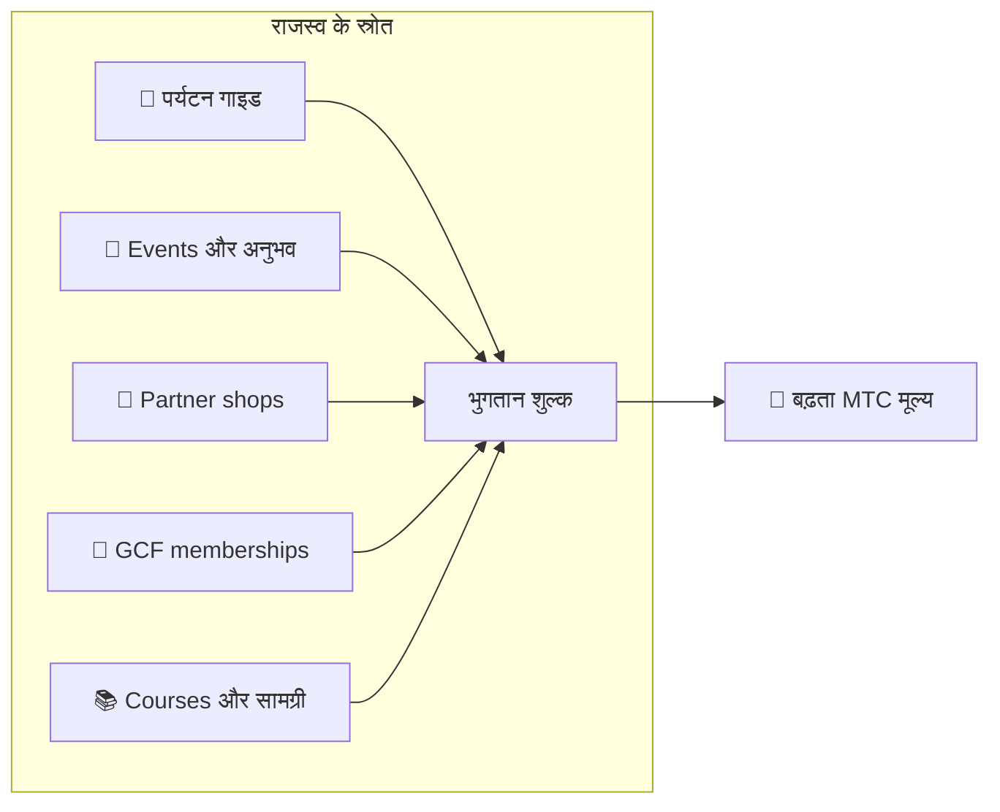

# 💰 टोकनॉमिक्स — MTC का आर्थिक डिज़ाइन

> **भरोसा कोड में तराशा गया है।**
> MTC का आर्थिक डिज़ाइन किसी के वादे से नहीं, गणित और blockchain से सुनिश्चित है।


> **"एक अर्थव्यवस्था जहाँ यथास्थिति को बलपूर्वक नहीं बदला जा सकता" — यही MTC का टोकनॉमिक्स है।**

Matsuri Coin (MTC) का आर्थिक डिज़ाइन एक दृढ़ विश्वास पर टिका है :
**वह नियम जिसे संचालक भी नहीं छेड़ सकता — निवेशक के लिए सबसे बड़ा आश्वासन वही है।**

आपूर्ति स्थायी रूप से तय है। अतिरिक्त जारी करना और धन को ज़ब्त करना असंभव है। व्यवसाय की वृद्धि एक समीकरण के स्तर पर मूल्य में परिलक्षित होती है —
कोई "वादा" नहीं, बल्कि blockchain पर तराशा गया **तथ्य**।

यह पृष्ठ MTC की सारी आर्थिक कार्यविधि को पारदर्शी ढंग से सामने रखता है।

---

## टोकन विशेष-विवरण

निवेशक सुरक्षा की गारंटी के लिए, हमने Solana पर "mint authority" और "freeze authority" — दोनों को स्थायी रूप से **त्याग (renounce) कर दिया** है।
अतिरिक्त जारी करना स्थायी रूप से असंभव है। धन को ज़ब्त नहीं किया जा सकता। यह एक **पूरी तरह trustless डिज़ाइन** है।

| मद | विवरण |
| :--- | :--- |
| **टोकन नाम** | Matsuri Coin |
| **Ticker** | MTC |
| **Chain** | Solana |
| **Mint address** | `DRENpzmRWM4TwECrCPCfS1k5VBPmanhQg9bcCWP8EZXF` [Solscan →](https://solscan.io/token/DRENpzmRWM4TwECrCPCfS1k5VBPmanhQg9bcCWP8EZXF) |
| **कुल आपूर्ति** | **900 मिलियन** (900,000,000 MTC), स्थिर |
| **Mint authority** | 🚫 त्यागी गई ([on-chain सत्यापन-योग्य](https://solscan.io/token/DRENpzmRWM4TwECrCPCfS1k5VBPmanhQg9bcCWP8EZXF)) |
| **Freeze authority** | 🚫 त्यागी गई ([on-chain सत्यापन-योग्य](https://solscan.io/token/DRENpzmRWM4TwECrCPCfS1k5VBPmanhQg9bcCWP8EZXF)) |
| **Lock प्रबंधन** | Streamflow Finance (सत्यापित) |

:::info यह मायने क्यों रखता है
Mint authority त्यागने का मतलब है "संचालक और टोकन नहीं बना सकता और आपकी हिस्सेदारी को पतला नहीं कर सकता।" Freeze authority त्यागने का मतलब है "कोई भी आपके wallet को frozen नहीं कर सकता।" यही trustlessness की नींव है।
:::

---

## टोकन आवंटन

900M MTC इस प्रकार आवंटित हैं।

<div className="mtc-alloc">
  <div className="mtc-alloc__donut" role="img" aria-label="MTC आवंटन : 61% Mining Pool, 39% Ecosystem Operations">
    <div className="mtc-alloc__hole">
      <span className="mtc-alloc__total">900M</span>
      <span className="mtc-alloc__unit">MTC</span>
    </div>
  </div>
  <div className="mtc-alloc__legend">
    <div className="mtc-alloc__row mtc-alloc__row--mining">
      <span className="mtc-alloc__dot"></span>
      <span className="mtc-alloc__pct">61%</span>
      <span className="mtc-alloc__amount">⛏️ 550M MTC</span>
    </div>
    <div className="mtc-alloc__row mtc-alloc__row--ecosystem">
      <span className="mtc-alloc__dot"></span>
      <span className="mtc-alloc__pct">39%</span>
      <span className="mtc-alloc__amount">🌐 350M MTC</span>
    </div>
  </div>
</div>

| श्रेणी | हिस्सा | मात्रा | उद्देश्य |
| :--- | :---: | :--- | :--- |
| **⛏️ Mining pool** | **61%** | 550 मिलियन | योगदानकर्ताओं के लिए पुरस्कार-pool। जून 2027 में unlock, दो-वर्षीय halving चक्र पर release। Contribution score के अनुसार वितरण |
| **🌐 Ecosystem operations** | **39%** | 350 मिलियन | मार्केटिंग, GCF वितरण, संचालन-व्यय, liquidity pool (LP) निधि, विकास-लागत, विज्ञापन, event-आयोजन और अन्य |

:::note Mining pool कैसे release होता है
550M MTC एक ही झटके में release नहीं होगा। यह दो-वर्षीय halving समय-सारणी पर चलता है और **contribution score के अनुसार चरणबद्ध ढंग से वितरित** होता है। Release और वितरण के नियम 2026 के अंत से चरणबद्ध ढंग से smart contracts के रूप में लागू होंगे और on-chain सत्यापन-योग्य बनेंगे।
:::

:::note Ecosystem operations आवंटन के बारे में
39% operations आवंटन ecosystem को बढ़ाने के लिए ज़रूरी बहुउद्देशीय निधि है। ठोस उपयोगों में शामिल हैं — मार्केटिंग गतिविधि, GCF सदस्यों को शुरुआती वितरण, Raydium pool में liquidity, विकास-टीम के लिए पारिश्रमिक, विज्ञापन और सांस्कृतिक-अनुभव events के लिए निधि। DAO में स्थानांतरण के बाद उपयोग की पारदर्शिता समुदाय-शासन के अधीन होगी।
:::

---

## राजस्व-संरचना

MTC के मूल्य को सँभालने वाली चीज़ है **असली व्यावसायिक गतिविधि से आय।** सट्टेबाज़ी नहीं — असली आर्थिक गतिविधि टोकन के मूल्य के पीछे खड़ी है।



| राजस्व-स्रोत | विवरण |
| :--- | :--- |
| **🏯 अनुभव और गाइड** | Tour guides और सांस्कृतिक-अनुभव events से भुगतान शुल्क |
| **🤝 GCF membership** | सदस्यता शुल्क |
| **📚 सामग्री** | Course enrollment शुल्क, मीडिया subscriptions |
| **🏪 Marketplace** | भागीदार दुकानों से लेन-देन शुल्क (चरणबद्ध विस्तार) |

:::tip असली माँग से पोषित विकास
जितने अधिक इनबाउंड आगंतुक आते हैं, उतनी अधिक विदेशी मुद्रा बहती है और ecosystem उतना बड़ा होता है। MTC का मूल्य सट्टेबाज़ी से नहीं, बल्कि **संस्कृति का अनुभव करने वाले लोगों की संख्या** से तय होता है।
:::

---

## वर्तमान व्यावसायिक गति

MTC की अर्थव्यवस्था अभी शुरुआती चरण में है, पर असली गतिविधि शुरू हो चुकी है।

| मापदंड | स्थिति |
| :--- | :--- |
| **आयोजित events** | 50+ (परीक्षण संचालन) |
| **GCF Platinum सदस्य** | 50 में से 20 सीटें भरी |
| **GCF Gold सदस्य** | भर्ती जल्द खुलेगी |
| **Web प्लेटफ़ॉर्म** | Live, अभी परीक्षण-उपयोगकर्ता जुटाए जा रहे हैं |
| **iOS ऐप्स** | विकास पूर्ण, अप्रैल 2026 के लिए निर्धारित |

:::note ईमानदार बयान
अभी हमारे पास "विशाल सफलता" का कोई रिकॉर्ड नहीं है। 50 events और परीक्षण-संचालन — आज की वास्तविकता यही है। पर उत्पाद चल रहा है, समुदाय है, और हम यहाँ से गंभीरता से विस्तार के चरण में हैं।
:::

---

## Buyback protocol

हम लाभ को सिर्फ़ जेब में नहीं डाल लेते।
व्यावसायिक राजस्व का एक निश्चित प्रतिशत **बाज़ार से MTC ख़रीदने** के लिए रख दिया जाता है।

| राजस्व-स्रोत | आवंटन | क्रिया |
| :--- | :---: | :--- |
| **Matsuri HQ राजस्व** (गाइड, events) | **20%** | बाज़ार से **Buyback** + liquidity pool में जोड़ |
| **GCF membership** (सदस्यता शुल्क) | **25%** | बाज़ार से **Buyback** |

:::info Buyback की वर्तमान स्थिति
व्यावसायिक राजस्व के बढ़ने के साथ buyback protocol **संचालन शुरू करेगा**। शुरुआत में यह off-chain (हस्तचालित) चलेगा; 2026 के अंत से चरणबद्ध ढंग से smart contract द्वारा स्वचालित निष्पादन तक पहुँचेगा। On-chain आने पर buybacks का पूरा निष्पादन-इतिहास blockchain पर कोई भी सत्यापित कर सकेगा।
:::

Buybacks "कभी बाद में" किया गया वादा नहीं हैं। ये protocol के रूप में प्रोग्राम किया गया नियम हैं। जब भी व्यावसायिक राजस्व बढ़ता है, MTC स्वतः बाज़ार से अवशोषित होता है — निवेशक के लिए **संरचनात्मक आश्वासन।**

---

## मूल्य-निर्माण का तर्क

MTC की ऊपर उठती मूल्य-यंत्रणा आशा पर नहीं, बल्कि **AMM (automated market maker) के समीकरण** पर टिकी है।

```
Price = Liquidity (SOL) ÷ Supply (MTC)
```

| चरण | क्या होता है | परिणाम |
| :---: | :--- | :--- |
| **①** | व्यावसायिक राजस्व (SOL) pool में डाला जाता है | **अंश बढ़ता है** |
| **②** | वह धन बाज़ार से MTC वापस ख़रीदकर burn कर देता है | **हर बढ़ता है** |
| **③** | अंश ↑ × हर ↓ | **बढ़ती दुर्लभता की स्थितियाँ बनती हैं** |

:::info मूल्य की गारंटी नहीं, तंत्र का विवरण
यह समीकरण एक संरचनात्मक डिज़ाइन का वर्णन है : यदि व्यावसायिक राजस्व चलता रहा और buybacks निष्पादित होते रहे, तो आपूर्ति-माँग का संतुलन दुर्लभता की दिशा में खिसकता है। असली मूल्य बाज़ार की माँग, बाहरी परिस्थितियों, liquidity और कई अन्य कारकों पर निर्भर करता है।
:::

---

## Halving समय-सारणी

**1 जून 2027** को unlock होने वाले **550 मिलियन MTC (कुल आपूर्ति का लगभग 61%)** बाज़ार में नहीं बहा दिए जाएँगे। वे **योगदानकर्ताओं के लिए पुरस्कार-pool** के रूप में आरक्षित हैं।

हमने Bitcoin के चार-वर्षीय चक्र से तेज़, **दो-वर्षीय halving चक्र** अपनाया है।
Release rate हर दो साल में आधी होती है, जिससे सैद्धांतिक रूप से पुरस्कार दशकों तक बहते रहते हैं।

| अवधि | Release हिस्सा | Released मात्रा | संचित |
| :--- | :---: | :--- | :---: |
| **अवधि 1** 2027–2029 | **50%** | ~275M | 50% |
| **अवधि 2** 2029–2031 | **25%** | ~137M | 75% |
| **अवधि 3** 2031–2033 | **12.5%** | ~68M | 87.5% |
| **अवधि 4** 2033–2035 | **6.25%** | ~34M | 93.75% |
| **अवधि 5 और आगे** | Halving चलती रहती है | घटती जाती है | → 100% की ओर asymptote |

<small>*गणितीय रूप से यह 100% तक कभी नहीं पहुँचता, और releases शून्य की ओर asymptotic रूप से घटते हैं। Bitcoin वाला ही सिद्धांत।*</small>

:::tip जितने पहले योगदान दोगे, उतना अधिक MTC
Halving के कारण अवधि 1 (2027–2029) में सबसे बड़ी release होती है, और हर बाद की epoch में प्रति-event release घटता है। यानी **जो शुरुआत में contribution score बनाते हैं, उन्हें अधिक MTC मिलता है।**

Contribution score में गिनी जाने वाली गतिविधियों के उदाहरण :
- Event निर्माण और उपस्थिति का रिकॉर्ड
- लोकप्रिय guided courses चलाना
- उत्कृष्ट guides को referral और विकास
- J-Times सामग्री के views और shares
- पवित्र-स्थल तीर्थयात्रा check-ins

पुरस्कार "कब जुड़े" से नहीं, **"कितना और कैसा योगदान दिया"** से तय होते हैं।
:::

---

:::note अगला पृष्ठ
अब जब आप MTC का आर्थिक डिज़ाइन समझ चुके हैं, आगे देखिए **भागीदार के रूप में कैसे जुड़ें।**
**[GCF सदस्यता →](/docs/gcf)**
:::
