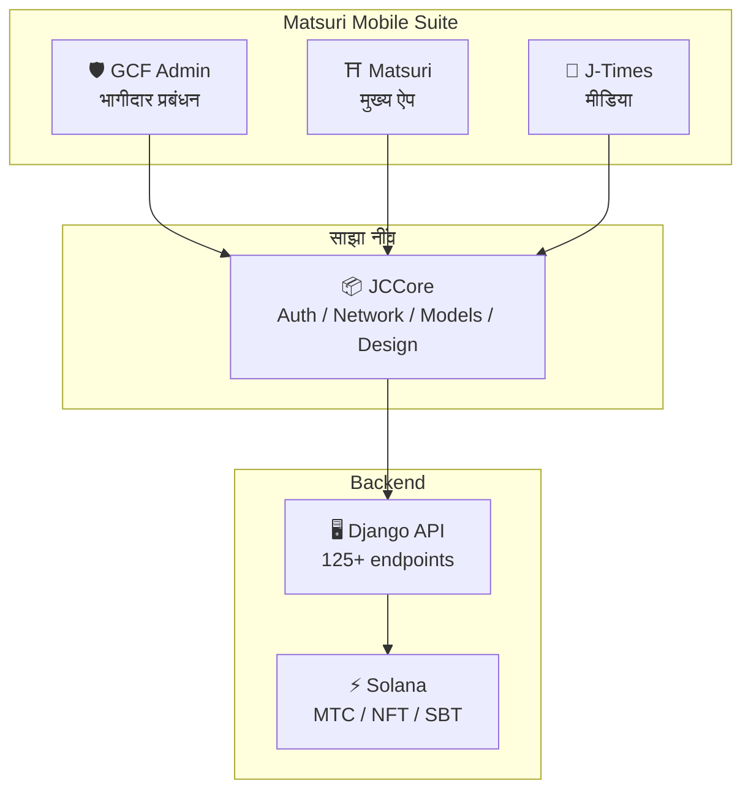
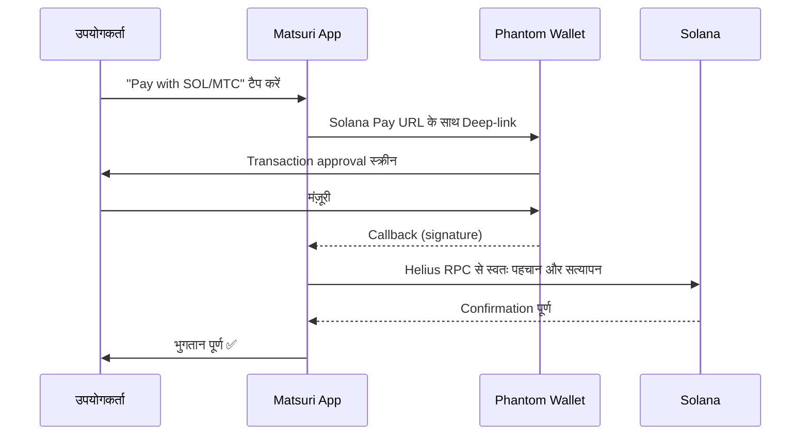
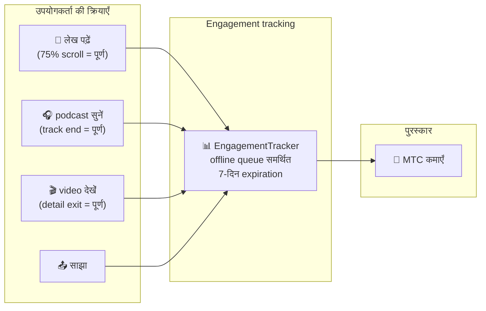
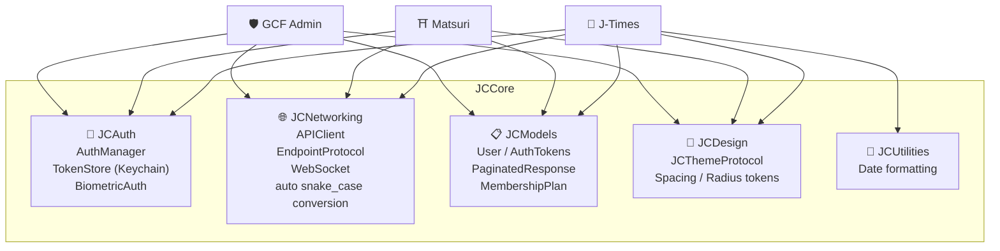
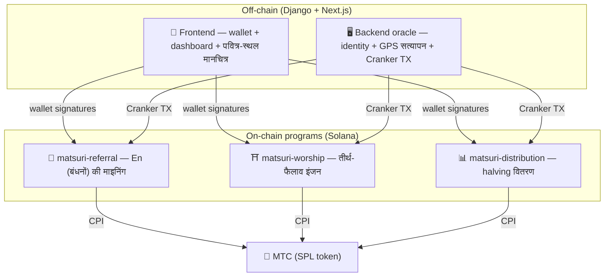
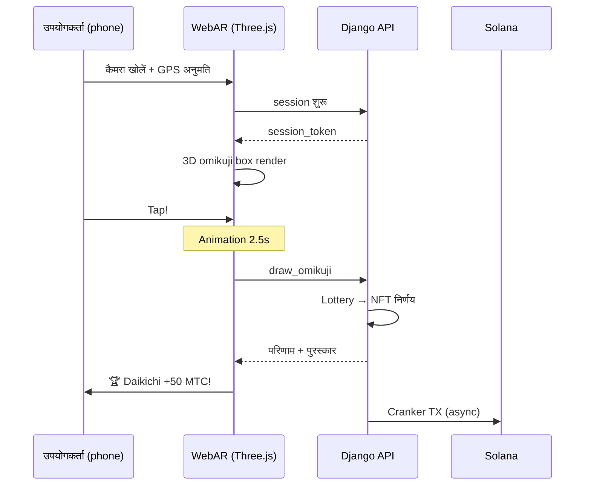

import useBaseUrl from '@docusaurus/useBaseUrl';

# 🔧 उत्पाद और तकनीक — जो चल रहा है वही सब कुछ सिद्ध करता है

> **जो चल रहा है वही सब कुछ सिद्ध करता है।**
> हमारा मिशन केवल शब्द नहीं है। web platform पहले से live है, और iOS ऐप्स अंतिम चरण में हैं।

Web app और admin dashboard **production में** हैं। तीन native iOS ऐप्स पूरे हो चुके हैं और अप्रैल–मई 2026 के बीच जारी हो रहे हैं (Matsuri मई की शुरुआत में)। Solana पर smart contracts open source हैं — हम अवधारणाओं में नहीं, **चलती हुई कोड और क़रीब आते उत्पाद** में बात करते हैं।

---

## ऐप्स का ख़ाका

| ऐप | उद्देश्य | स्थिति | समर्थित भाषाएँ |
| :--- | :--- | :---: | :--- |
| **GCF Admin** | भागीदार प्रबंधन और संचालन-उपकरण | ✅ Released | 🇯🇵🇬🇧🇨🇳🇹🇭🇳🇴 |
| **Matsuri** | मुख्य उपभोक्ता ऐप | ✅ Released | 🇯🇵🇬🇧🇨🇳🇹🇭🇳🇴 |
| **J-Times** | सांस्कृतिक मीडिया और सीखना | ✅ Released | 🇯🇵🇬🇧 |

---

## 1. 🛡️ GCF Admin — भागीदार प्रबंधन ऐप

:::info स्थिति : App Store पर जारी (v1.0)
GCF (Global Community Friends) सदस्यों के लिए एक संचालन-प्रबंधन ऐप। Web admin स्क्रीन की पूरी कार्यक्षमता mobile पर एक साथ।
:::

  

  
  
  

### ऐप क्या कर सकता है

| श्रेणी | सुविधाएँ |
| :--- | :--- |
| **📊 Dashboard** | KPI cards, revenue charts, quick actions |
| **👥 सदस्य प्रबंधन** | सूची, विवरण, संपादन, tier प्रबंधन |
| **💰 राजस्व प्रबंधन** | कमीशन ट्रैकिंग, MTC withdrawal प्रबंधन, payout प्रबंधन |
| **📝 सामग्री प्रबंधन** | Events, articles, podcasts और videos का निर्माण, संपादन व प्रकाशन |
| **🎫 Guide slots** | Guide slots का प्रबंधन और राजस्व ट्रैकिंग |
| **🖼️ NFT dashboard** | Founder's Collection, on-chain सत्यापन, NFT transfers |
| **⛩️ पवित्र-स्थल प्रबंधन** | Site CRUD, beacon configuration |
| **🎲 AR mining configuration** | Omikuji probability tables, reward parameter प्रबंधन |
| **📊 Analytics** | Error reports, usage analytics |
| **🔗 Referrals** | Custom QR code generation, referral program प्रबंधन |

### तकनीकी विनिर्देश

| मद | विवरण |
| :--- | :--- |
| **Architecture** | Clean Architecture + MVVM + `@Observable` (iOS 17) |
| **Language / SDK** | Swift 6.0 / Xcode 16+ / iOS 17.0+ |
| **API integration** | 125+ endpoints |
| **Tests** | 226 tests / 45 test classes |
| **Localization** | 5 भाषाएँ (JP/EN/CN/TH/NO) / 957+ translation keys |
| **Swift Concurrency** | Strict Concurrency अनुरूप / शून्य build warnings |

### QR code integration

GCF Admin Matsuri-ब्रांडेड custom QR codes बना सकता है। बहुमुखी उपयोग — event आमंत्रण, referral links, payment requests आदि।

---

## 2. ⛩️ Matsuri — मुख्य ऐप

:::info स्थिति : App Store पर जारी (v3.0)
साधारण उपयोगकर्ताओं के लिए मुख्य ऐप। Event booking, payment, Web3 wallet, AR mining — सब कुछ एक ही ऐप में पूरा। **अब App Store पर उपलब्ध।**
:::

  

  
  
  

### ऐप क्या कर सकता है

| श्रेणी | सुविधाएँ |
| :--- | :--- |
| **🎪 Event booking** | खोज, बुकिंग, Stripe भुगतान, ticket QR प्रबंधन |
| **💳 चार भुगतान-विधियाँ** | क्रेडिट कार्ड / सुरक्षित कार्ड / MTC balance / crypto (SOL/MTC) |
| **👛 Web3 wallet** | MTC balance, भेजना/प्राप्त करना, transaction इतिहास |
| **🖼️ NFT gallery** | धारित NFTs/SBTs की सूची, on-chain सत्यापन |
| **🗺️ पवित्र-स्थल मानचित्र** | Shrines और मंदिरों का map, check-ins |
| **🎲 AR mining** | WebAR omikuji अनुभव, MTC कमाएँ |
| **💬 Chat** | Context menus सहित messaging |
| **⭐ Wishlist** | पसंदीदा events और अनुभव सहेजें |
| **🔍 उन्नत खोज** | Voice search समर्थित |
| **🤝 Referrals** | Referral कार्यक्रम से जुड़ाव, पुरस्कार ट्रैकिंग |
| **📊 GCF dashboard** | GCF सदस्यों के लिए हल्का admin view |

### Phantom Wallet integration — शून्य-इनपुट crypto भुगतान

>**Addresses को copy-paste करने की ज़रूरत नहीं।** Phantom Wallet स्वतः खुलता है और एक अनुमोदन पर भुगतान पूरा हो जाता है। Transaction signature Helius RPC से स्वतः पहचान ली जाती है।

### तकनीकी विनिर्देश

| मद | विवरण |
| :--- | :--- |
| **Architecture** | Clean Architecture + MVVM + Swift Concurrency |
| **Language / SDK** | Swift 6.0 / Xcode 16+ / iOS 17.0+ |
| **Payments** | Stripe PaymentSheet + MTC Balance + Phantom (Solana Pay) |
| **API integration** | 72 endpoints / 16 श्रेणियाँ |
| **Tests** | 230+ (Model, ViewModel, Network, Security, DeepLink, E2E) |
| **Localization** | 5 भाषाएँ (JP/EN/CN/TH/NO) / 406 translation keys |
| **ViewModels** | 25 (पूर्णतः MVVM — Views से कोई सीधी API call नहीं) |
| **Authentication** | Apple Sign In / Google Sign In (PKCE) |

---

## 3. 📰 J-Times — सांस्कृतिक मीडिया ऐप

:::info स्थिति : जारी — App Store पर live
एक मीडिया प्लेटफ़ॉर्म जो जापानी संस्कृति की गहराइयों को पहुँचाता है। लेख पढ़िए, podcasts सुनिए, videos देखिए — हर क्रिया MTC कमाती है।
:::

  

  
  

### ऐप क्या कर सकता है

| श्रेणी | सुविधाएँ |
| :--- | :--- |
| **📖 लेख** | Parallax hero, drop caps, reading progress bar, rich सामग्री (Markdown, tables, quotes) |
| **🎧 Podcasts** | श्रृंखला-ब्राउज़िंग, waveform player, sleep timer, AirPlay, lock-screen नियंत्रण |
| **🎬 वीडियो** | अनुकूलनशील grid/list view, short-form video (TikTok-शैली, double-tap) |
| **🔍 खोज** | Multi-filter, trending tags, voice search |
| **🧭 Discovery** | Feature carousel, staff picks, weekly top |
| **📚 Library** | पसंदीदा, इतिहास (तारीख़ के अनुसार), downloads, playlists |
| **🎵 Audio player** | Mini player (swipe-नियंत्रित), full player (waveform, lyrics, repeat) |
| **👤 Membership** | 3 tiers (Free / Premium / Pro) की तुलना, खरीद-पुनर्स्थापना |

### Media Mining — पढ़ना, सुनना और देखना ही माइनिंग

>**Offline होने पर भी दर्ज।** किसी पर्वतीय shrine पर जहाँ signal नहीं पहुँचता, लेख पढ़ लीजिए — network लौटते ही engagement स्वतः जमा हो जाता है और MTC credit हो जाता है।

### Design system — जापानी सौंदर्य के "चार स्तंभ"

J-Times एक मौलिक design system का उपयोग करता है जो पारंपरिक जापानी सौंदर्य को आधुनिक UI में लाता है।

| स्तंभ | अवधारणा | UI में उपयोग |
| :--- | :--- | :--- |
| **墨 (sumi — स्याही)** | गर्म neutral grey | Background, text पदानुक्रम |
| **朱 (shu — सिंदूर)** | जापानी लाल (#C53030) | Accent color, महत्वपूर्ण actions |
| **間 (ma — अवकाश)** | 4pt grid पर negative space | Spacing, साँस लेने की जगह |
| **紙 (kami — काग़ज़)** | सूक्ष्म बनावट, glassmorphism | Card सतहें, गहराई |

### तकनीकी विनिर्देश

| मद | विवरण |
| :--- | :--- |
| **Architecture** | Clean Architecture + MVVM + Swift Concurrency |
| **Language / SDK** | Swift 6.0 / Xcode 16+ / iOS 17.0+ |
| **बाहरी निर्भरताएँ** | **शून्य** — केवल Apple first-party frameworks |
| **API integration** | 40+ endpoints |
| **Tests** | 371 tests / 20 फ़ाइलें |
| **Localization** | 2 भाषाएँ (JP/EN) / 310+ translation keys |
| **Offline समर्थन** | ContentCache (50MB) + ImageDiskCache (200MB) + download manager |
| **Authentication** | Apple Sign In / Google Sign In (PKCE) |

---

## साझा नींव : JCCore library

तीनों ऐप्स के बीच साझा एक Swift Package library।

| Module | भूमिका |
| :--- | :--- |
| **JCAuth** | Keychain-आधारित token प्रबंधन, biometric auth (Face ID / Touch ID) |
| **JCNetworking** | Type-safe API client, WebSocket, स्वचालित JSON snake_case conversion |
| **JCModels** | ऐप्स के बीच साझा data models (User, AuthTokens आदि) |
| **JCDesign** | Theme protocol, design tokens (spacing, corner radius) |
| **JCUtilities** | Date और string utilities |

---

## सुरक्षा और गोपनीयता

| मद | कार्यान्वयन |
| :--- | :--- |
| **Auth tokens** | iOS Keychain में एन्क्रिप्टेड और संग्रहीत (TokenStore) |
| **Biometric auth** | Face ID / Touch ID के साथ दो-चरणीय |
| **API संचार** | HTTPS + certificate pinning |
| **Wallet private key** | ऐप में कभी संग्रहीत नहीं — Phantom Wallet को सौंपा गया |
| **AR mining** | कैमरा images server को नहीं भेजी जातीं (VisionProof) |
| **Offline data** | SwiftData encryption + स्वचालित expiration |
| **Swift Concurrency** | Actor isolation race conditions रोकता है |

---

## विकास की गुणवत्ता

### Mobile ऐप्स : तीनों ऐप्स में **827+ स्वचालित tests।**

| ऐप | Tests | Coverage क्षेत्र |
| :--- | :---: | :--- |
| **GCF Admin** | 226 | Model, ViewModel, Repository, API, Localization, Navigation |
| **Matsuri** | 230+ | Model, ViewModel, Network, Security, DeepLink, Regression, Performance, E2E |
| **J-Times** | 371 | Model, ViewModel, API, Repository, Navigation, Localization, Security, Performance |

### Smart contracts : tests चरणबद्ध ढंग से विस्तृत हो रहे

Solana पर Rust programs के लिए हमने core logic (math modules) के unit tests से शुरुआत की है, और security audit (Q2–Q3 2026) की तैयारी में test coverage चरणबद्ध ढंग से बढ़ा रहे हैं।

---

## Smart contracts — open-source डिज़ाइन

>**एक trustless डिज़ाइन-दर्शन।**
> पुरस्कार-गणना, referral trees, halving समय-सारणी — हर logic **on-chain** चलता है और कोई भी उसकी जाँच कर सकता है।
> Source : [GitHub](https://github.com/Cootakahashi/matsuri-contracts)

---

### Contributors

| सदस्य | भूमिका |
| :--- | :--- |
| **Ko Takahashi** | Founder / Lead Developer — architecture, smart contracts, full-stack विकास |

> 🌏**आगे चलकर GCF सदस्य और एक विश्व-व्यापी डेवलपर समुदाय भी सह-विकास में जुड़ेंगे।**
> "संस्कृति की आधारभूत संरचना" के रूप में लंबे दौर तक टिकने के लिए बना Matsuri Protocol पारदर्शिता और सह-स्वामित्व पर खड़ा है।

---

### समग्र संरचना

Matsuri Solana पर **तीन Anchor (Rust) programs** तैनात करता है, हर एक ecosystem के एक स्तंभ को सँभालता है।

---

### 1. 📣 En-Mining (縁 — बंधन / जुड़ाव)

**उद्देश्य :** एक hybrid विकास-इंजन जो "चौड़ाई" (referral network) और "गहराई" (आर्थिक प्रभाव) — दोनों को पुरस्कृत करता है। साधारण affiliate marketing नहीं, बल्कि एक पूर्ण माइनिंग protocol जहाँ असली आर्थिक गतिविधि on-chain मूल्य पैदा करती है।

#### Scoring डिज़ाइन

Contribution score दो weighted घटकों पर टिका है :

| घटक | Weight | उद्देश्य |
| :--- | :---: | :--- |
| **चौड़ाई** (referrals की संख्या) | 30% | Network पहुँच — आपने कितने लोगों को जोड़ा |
| **गहराई** (भुगतान की मात्रा) | 70% | आर्थिक प्रभाव — असली ख़रीदें, सिर्फ़ sign-ups नहीं |

Scores समय के साथ जमा होते हैं और हर halving epoch पर MTC में परिवर्तित होते हैं। अतिरिक्त boost तंत्र योजना में हैं :

| Boost | विवरण | स्थिति |
| :--- | :--- | :---: |
| **Toku (徳 — सद्गुण) staking** | MTC lock करके contribution score boost (लगभग 50% तक)। Tiers और exact multipliers halving pool release समय-सारणी के अनुरूप अंशांकित | ⬜ गुणांक तय होने बाक़ी |
| **Season ranking** | हर epoch के शीर्ष प्रदर्शनकारी **Evangelist** उपाधि (स्थायी SBT) और score boost पाते हैं। Exact दरें governance तय करती है | ⬜ गुणांक तय होने बाक़ी |

:::info Progressive parameter डिज़ाइन
Boost गुणांक (staking tiers, ranking bonuses) जानबूझकर समायोज्य हैं। ये असली ecosystem डेटा — कुल सक्रिय उपयोगकर्ता, halving pool release दर, मूल्य-स्थिरता लक्ष्य — के आधार पर तय होंगे और smart contracts में lock होंगे। यह दृष्टिकोण तय रिटर्न का ज़्यादा वादा किए बिना **न्यायसंगत वितरण** सुनिश्चित करता है।
:::

#### Anti-sybil सुरक्षा (तीन परतें)

| परत | तंत्र | स्थान |
| :--- | :--- | :--- |
| **Identity gate** | X/Twitter OAuth + SMS | Off-chain (Django) |
| **On-chain gate** | केवल वे profiles जिनमें `is_verified = true` हो, पुरस्कार कमाते हैं | Smart contract |
| **गहराई-भार** | Score का 70% = असली भुगतान → bots कुछ नहीं कमाते | Scoring engine |

---

### 2. ⛩️ तीर्थ-फैलाव इंजन (Worship Routing Engine)

**उद्देश्य :** दुनिया का पहला **ReFi protocol** जो token economics से ओवरटूरिज़्म का समाधान करता है। पवित्र स्थलों पर जाकर MTC कमाइए। अहम मोड़ : *किसी स्थल पर जितने कम आगंतुक, उतना अधिक (exponentially) पुरस्कार।*

:::tip Core insight
"उलटा Uber surge pricing" — भीड़ वाले स्थल दंडित, दुर्गम स्थल प्रोत्साहित। पर्यटक स्वेच्छा से कम-देखे स्थानों की ओर बढ़ते हैं **क्योंकि वहाँ लाभ अधिक है।**
:::

#### पुरस्कार-डिज़ाइन के सिद्धांत

हर यात्रा का contribution score कई कारकों से तय होता है :

| कारक | सिद्धांत | प्रभाव |
| :--- | :--- | :--- |
| **स्थल की लोकप्रियता** | कम आगंतुक = ऊँचा score | भीड़ वाले इलाक़ों से पर्यटकों को फैलाना |
| **यात्रा का समय** | दिए गए दिन पर पहले आने वाले अधिक कमाते हैं | Off-peak यात्राओं को बढ़ावा |
| **क्षेत्रीय tier** | क्षेत्रीय और दुर्गम स्थल शीर्ष पर | क्षेत्रीय पुनरुद्धार को गति |
| **यात्रा की आवृत्ति** | नियमित आगंतुक bonus score जमा करते हैं | निरंतर भागीदारी का पुरस्कार |
| **Omikuji भाग्य** | हर check-in पर यादृच्छिक bonus | मज़ेदार gamification तत्व |
| **Sponsored boost** | नगर निगम विशेष स्थलों को boost कर सकते हैं | B2B/B2G राजस्व मॉडल |

:::info गुणांक समायोज्य हैं
हर कारक के exact multipliers (जैसे कि एक क्षेत्रीय स्थल major स्थल से कितना अधिक कमाता है) **halving pool समय-सारणी** और असली उपयोग-डेटा पर ट्यून होते हैं और चरणबद्ध ढंग से smart contracts में lock होते हैं। डिज़ाइन-सिद्धांत तय हैं — गुणांक ecosystem के साथ विकसित होते हैं।
:::

---

### 3. 📊 Halving वितरण

**उद्देश्य :** Bitcoin की halving समय-सारणी से प्रेरित, MTC वितरण प्रति epoch स्वतः आधा होता है। गणितीय रूप से सुनिश्चित दुर्लभता।

| Instruction | विवरण |
| :--- | :--- |
| `initialize` | वितरण pool initialize करें |
| `register_miner` | miner पंजीकृत करें |
| `update_score` | score अद्यतन करें |
| `advance_epoch` | epoch आगे बढ़ाएँ (halving निष्पादित) |
| `claim_distribution` | वितरण पुरस्कार का दावा करें |

---

### 4. 🎴 AR mining — WebAR omikuji अनुभव

**उद्देश्य :** केवल phone browser से असली जगह में एक AR omikuji प्रकट करना, और उसके ज़रिए MTC माइन करना। **किसी ऐप डाउनलोड की ज़रूरत नहीं।** दुनिया का पहला WebAR × blockchain आधार, Shinto आध्यात्मिकता और अत्याधुनिक तकनीक का मिलन।

#### Architecture

#### Omikuji probability configuration (GCF admin)

Basis Points (10000 = 100%) 0.01% सटीकता के साथ। GCF admin स्क्रीन से समायोज्य।

| Grade | Rarity | Bonus | NFT |
|------|-----------|---------|-----|
| 🏆 Daikichi | Rare | अधिकतम bonus | ✅ |
| ✨ Kichi | Uncommon | उच्च bonus | Optional |
| 🌸 Shōkichi | Common | छोटा bonus | — |
| 🍃 Suekichi | Common | भागीदारी-अभिलेख | — |
| 💀 Kyō | Uncommon | भागीदारी-अभिलेख | — |

संभावनाएँ और पुरस्कार-गुणांक ecosystem के आकार और halving release मात्रा के आधार पर चरणबद्ध ढंग से अंतिम रूप पाएँगे, और smart contracts में लागू होंगे।

#### ZK-Proof of Vision (5-परत सुरक्षा)

GPS spoofing और replay attacks को कई परतों में मिटाता है। **गोपनीयता के लिए कैमरा images server को कभी नहीं भेजी जातीं।**

| परत | क्या सत्यापित | Weight |
| :--- | :--- | :--- |
| Temporal | Session time 5–120s | /20 |
| Motion | Gyro स्वाभाविकता (हाथ में कम्पन की पहचान) | /20 |
| Light | Ambient light × time-of-day संगति | /20 |
| HMAC | proof_hash signature सत्यापन | /20 |
| Fingerprint | Device विशिष्टता | /20 |
| **कुल** | **60/100 या उससे ऊपर = PASS** | |

#### पुरस्कार-डिज़ाइन

पुरस्कार स्थल के प्रकार, omikuji परिणाम और क्षेत्रीय tier सहित कई कारकों के आधार पर **contribution score** के रूप में दर्ज होते हैं। विशिष्ट गुणांक halving release समय-सारणी और ecosystem की वृद्धि के अनुरूप चरणबद्ध ढंग से तय होंगे, और smart contracts में लागू होंगे।

---

### शुद्ध गणित modules (auditable core logic)

हर program scoring और reward गणना को एक **शुद्ध, auditable `math.rs` module** में अलग रखता है :

- **शून्य side effects** — कोई I/O नहीं, कोई memory allocation नहीं, कोई बाहरी call नहीं
- **दस्तावेज़ीकृत formulas** — rustdoc के भीतर LaTeX-शैली notation
- **Overflow analysis** — u128 intermediates सिद्ध range के साथ
- **व्यापक tests** — edge cases, boundary conditions, ratio सत्यापन
- **समायोज्य गुणांक** — पुरस्कार parameters को governance के ज़रिए अद्यतन करने योग्य डिज़ाइन, जिससे ecosystem के बढ़ने पर चरणबद्ध अंशांकन किया जा सके

---

### सुरक्षा मॉडल

ये contracts **पूरी तरह open source** हैं। सुरक्षा अपारदर्शिता पर नहीं, गणितीय गारंटियों पर टिकी है।

| सिद्धांत | कार्यान्वयन |
| :--- | :--- |
| **केवल PDA vaults** | Token vaults PDAs (program-derived addresses) से नियंत्रित — कोई मानव key निकाल नहीं सकती |
| **Checked arithmetic** | सभी गणनाएँ `checked_*` arithmetic पर — overflow असंभव |
| **प्राधिकार का पृथक्करण** | Admin (multisig) ≠ Cranker (सीमित actions) ≠ User (self-custody) |
| **आपातकालीन pause** | Admin केवल सुरक्षा-ख़तरे की स्थिति में program को pause कर सकता है। पर **धन की कोई गति या ज़ब्ती संभव नहीं** — pause "रक्षा की ढाल" है, नियम बदलने का रास्ता नहीं |
| **अपरिवर्तनीय tokenomics** | Halving rate, कुल pool और epoch length प्रारंभिक configuration के बाद नहीं बदले जा सकते |
| **शुद्ध गणित modules** | पुरस्कार/scoring logic एक अलग, testable math library में रहता है |
| **Vision Proof** | 5-परत spoof पहचान जो कैमरा डेटा कभी नहीं भेजती (privacy-preserving) |

---

**[▶ अगला : Roadmap और टीम](/docs/roadmap)** | **[◀ पिछला : टोकनॉमिक्स](/docs/tokenomics)**
