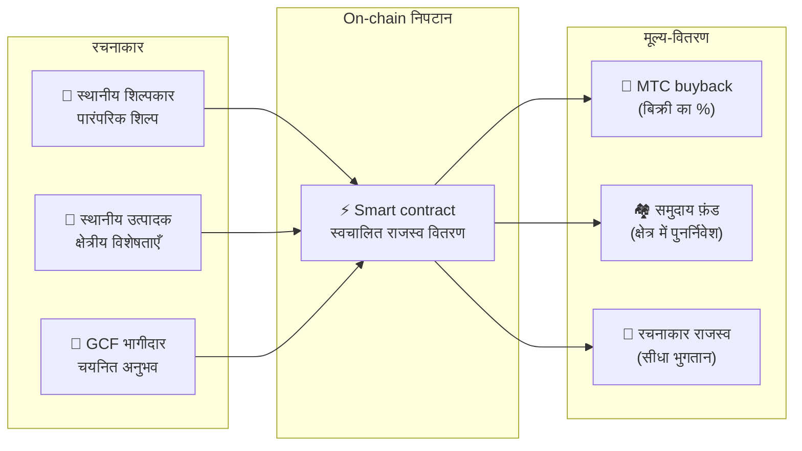

import useBaseUrl from '@docusaurus/useBaseUrl';

# 🗓️ Roadmap और टीम

>**जो यहाँ तक पढ़ चुके हैं उनके लिए — दृष्टि, आर्थिक डिज़ाइन और तकनीकी नींव, सब जगह पर हैं।**
> हम अल्पकालिक सट्टेबाज़ी की परियोजना नहीं हैं।
>**मुख्य प्लेटफ़ॉर्म का विकास पहले ही पूरा हो चुका है,** और अब हम उसे बड़ा करने के चरण में क़दम रख रहे हैं।

---

## सामरिक milestones

### 🔥 Phase 1 : जागरण (2026 की पहली छमाही — अभी)

**विषय : नींव और नगदी प्रवाह**

Web platform live है। iOS ऐप्स (Matsuri, J-Times) अप्रैल 2026 में release के लिए निर्धारित हैं। हम CEO-के-नेतृत्व में वित्तीय प्रणाली के ज़रिए monetization और शुरुआती liquidity सुरक्षित करने पर केंद्रित हैं।

| स्थिति | Milestone | विवरण |
| :---: | :--- | :--- |
| ✅ | **Web platform live** | Matsuri web app और GCF admin dashboard (web) चल रहे |
| ✅ | **भुगतान और वृद्धि** | MTC भुगतान-फ़ीचर और referral airdrop फ़ीचर लागू |
| ✅ | **Media launch** | J-Times (web & podcast) वितरण-आधार तैयार |
| ✅ | **Genesis** | Solana chain पर MTC token जारी |
| ✅ | **Liquidity सुरक्षित** | Raydium पर शुरुआती liquidity pool बनाया गया |
| ⬜ | **Incentives शुरू** | लक्षित 20% APY के साथ liquidity mining का आरंभ |
| ⬜ | **On-chain भुगतान** | Solana Pay verification production में |
| ⬜ | **VIP भर्ती** | पहले 20 GCF VIP सदस्यों का चयन पूर्ण |

### 🚀 Phase 2 : विस्तार (2026 की दूसरी छमाही)

**विषय : असली सम्पत्तियाँ और adventure mining**

पूर्ण webapp का पूरा उपयोग करते हुए, भौतिक आधारों और "तीर्थाटन" फ़ीचर का विस्तार।

| स्थिति | Milestone | विवरण |
| :---: | :--- | :--- |
| ⬜ | **नया फ़ीचर release** | Adventure mining (तीर्थाटन) का कार्यान्वयन और release |
| ⬜ | **विदेशी विस्तार** | एशिया (थाईलैंड, ताइवान आदि) में भागीदार आधार व VIP events |
| ⬜ | **सम्पत्ति-प्रबंधन** | Real estate, equities और crypto का portfolio बनाना |
| ⬜ | **लक्ष्य** | ecosystem-व्यापी सम्पत्ति-पैमाना **¥1 बिलियन (~$6.5M)** |

### 🌊 Phase 3 : परिसंचरण (2027 और आगे)

**विषय : बड़े पैमाने पर अपनाव, सह-सर्जन अर्थव्यवस्था, विकेंद्रीकरण**

जनता के लिए खुला, on-chain marketplace, और पूर्ण ecosystem संचालन।

| स्थिति | Milestone | विवरण |
| :---: | :--- | :--- |
| ⬜ | **Grand opening** | Matsuri App का विश्व-व्यापी आधिकारिक release |
| ⬜ | **Great unlock (2027/6/1)** | Founder lockup unlock + mining pool (550M) सक्रिय + halving चक्र शुरू |
| ⬜ | **सह-सर्जन marketplace** | क्षेत्रीय विशेषता-दुकानें + GCF भागीदार store — on-chain भुगतान के साथ स्वचालित MTC buyback |
| ⬜ | **Crowdfunding (NFT अधिकार)** | उपयोगकर्ता Solana पर सांस्कृतिक परियोजनाओं को funding देते हैं। Backers को स्वामित्व, राजस्व-हिस्सा और governance अधिकार के NFTs मिलते हैं |
| ⬜ | **On-chain भुगतान** | सारे marketplace लेन-देन smart contract से निपटाए जाते हैं — बिक्री का एक निश्चित प्रतिशत स्वतः MTC buyback pool की ओर जाता है |
| ⬜ | **लक्ष्य** | ecosystem-व्यापी सम्पत्ति-पैमाना **¥10 बिलियन (~$65M)** |
| ⬜ | **DAO संक्रमण** | निर्णय-अधिकार धीरे-धीरे GCF समुदाय को सौंपना |

#### 🏪 सह-सर्जन marketplace की अवधारणा

"सांस्कृतिक OS" की परम अभिव्यक्ति — एक विकेंद्रीकृत marketplace जहाँ **सांस्कृतिक रचनाकार और संस्कृति-प्रेमी सीधे लेन-देन करते हैं**, किसी शोषक बिचौलिए के बिना।

| सुविधा | विवरण | स्थिति |
| :--- | :--- | :---: |
| **🏺 क्षेत्रीय विशेषता-दुकान** | शिल्पकार और स्थानीय उत्पादक दुनिया भर के ग्राहकों को सीधे बेचते हैं। MTC में भुगतान पर 5–10% छूट | ⬜ अवधारणा |
| **🎫 Crowdfunding + NFT अधिकार** | सांस्कृतिक परियोजनाओं (shrine की मरम्मत, त्योहार पुनरुद्धार, शिल्पकार कार्यशालाएँ) को funding दीजिए। अपने योगदान को प्रमाणित करने वाले और राजस्व-हिस्सा या governance अधिकार देने वाले NFTs पाइए | ⬜ अवधारणा |
| **⚡ On-chain निपटान** | हर marketplace लेन-देन Solana smart contract से निपटता है। राजस्व स्वतः विभाजित : रचनाकार भुगतान + समुदाय फ़ंड + MTC buyback — मैनुअल बहीख़ाते की ज़रूरत नहीं | ⬜ अवधारणा |
| **🗳️ Backer governance** | NFT धारक वोट देते हैं कि उनके funded project संसाधन कैसे आवंटित करें — महज़ दान नहीं, सच्ची सह-सर्जना | ⬜ अवधारणा |

:::info यह मायने क्यों रखता है
आज, पर्यटक उन दुकानों से स्मृति-चिह्न ख़रीदते हैं जो अपने मकान-मालिक — यानी प्लेटफ़ॉर्म — को "किराया" देती हैं। कल, **क्योटो का एक ग्रामीण शिल्पकार Copenhagen के प्रशंसक को सीधे बेचेगा**, और उस बिक्री का एक हिस्सा स्वतः MTC अर्थव्यवस्था को मज़बूत करेगा। यह flywheel का सबसे पूर्ण रूप है।
:::

---

## 👤 टीम

  

### Ko Takahashi — founder / CEO और lead architect

| मद | विवरण |
| :--- | :--- |
| **भूमिका** | परियोजना का समग्र नेतृत्व। Platform design, smart contracts, full-stack विकास |
| **दृष्टि** | "सांस्कृतिक OS" के प्रवक्ता — "संस्कृति निर्यात करो, धन आयात करो" |
| **रुख़** | ख़ुद कोड लिखते हैं और ख़ुद ज़मीन पर खड़े होते हैं (Golden Gai) — "skin in the game" के प्रयोगकर्ता |

  

### Jon Anders Jensen — director / GCF और event संचालन

| मद | विवरण |
| :--- | :--- |
| **भूमिका** | GCF संचालन। Events और tours के संचालन का डिज़ाइन और ज़मीनी काम |
| **ताक़त** | अंतरराष्ट्रीय दृष्टिकोण और GCF सदस्यों के साथ भरोसे के संबंधों से ecosystem की "मानवीय" धारा को सँभालते हैं |

  

### Ryunosuke Honda — director / क्षेत्रीय संस्कृति ambassador

| मद | विवरण |
| :--- | :--- |
| **भूमिका** | जापान भर की क्षेत्रीय संस्कृतियों और समुदायों तथा Matsuri ecosystem के बीच का सेतु |
| **ताक़त** | क्षेत्रीय सांस्कृतिक सम्पत्तियों की खोज कर उन्हें Matsuri प्लेटफ़ॉर्म पर लाते हैं और "Deep Japan" अनुभव पहुँचाते हैं |

### 🌏 GCF समुदाय — दुनिया भर में फैले विकास-सदस्य

Matsuri Protocol केवल founding team द्वारा नहीं बना।
**दुनिया भर के GCF सदस्य** testing, feedback, अनुवाद और क्षेत्रीय deployment के ज़रिए protocol के विकास में योगदान करते हैं।

| क्षेत्र | संरचना |
| :--- | :--- |
| **💼 Global finance** | एशिया भर के निजी निवेशक नेटवर्कों के साथ भागीदारी |
| **⚙️ Engineering** | Blockchain और mobile ऐप विकास के बीच फैली एक वितरित engineering टीम |
| **🏮 Operations** | शिंजुकू Golden Gai और मुख्य पर्यटन-स्थलों के स्थानीय समुदायों के साथ मज़बूत pipelines |
| **🌐 समुदाय** | जापान, नॉर्वे, थाईलैंड और ताइवान सहित एक बहुराष्ट्रीय GCF सदस्य-आधार |

:::tip सांस्कृतिक आधारभूत संरचना जो हम साथ बनाते हैं
अगर आप GCF से जुड़ते हैं, तो आप भी Matsuri Protocol के सह-विकासकर्ता बनते हैं।
योगदान का मतलब सिर्फ़ कोड लिखना नहीं। अपने इलाक़े के पवित्र स्थल परिचित कराना, दस्तावेज़ों का अनुवाद, events की योजना —
ये सब वही शक्ति हैं जो इस protocol को दुनिया तक पहुँचाती हैं।
:::

---

## 🏛️ Governance (DAO)

Matsuri Protocol केंद्रीकरण से क्रमशः एक **DAO (विकेंद्रीकृत स्वायत्त संगठन)** की ओर बढ़ता है।
GCF सदस्यों (Platinum / Gold) को आख़िरकार निम्न अहम मुद्दों पर **मतदान के अधिकार** मिलेंगे।

| वोट का विषय | सामग्री |
| :--- | :--- |
| **💰 निधि का आवंटन** | व्यावसायिक राजस्व को किन नए व्यवसायों और मार्केटिंग में लगाना है |
| **⚙️ Protocol उन्नयन** | ऐप के शुल्क-दरों और माइनिंग पुरस्कार-दरों का सूक्ष्म अंशांकन |
| **⛩️ सांस्कृतिक मान्यता** | किन त्योहारों और shrines को "आधिकारिक तीर्थ-स्थल" के रूप में मान्यता देकर वित्तीय सहयोग देना है |

:::info क्रांति में शामिल हों
हम केवल एक ऐप नहीं बना रहे।
हम एक **सरहद-रहित सांस्कृतिक अर्थव्यवस्था** बना रहे हैं।
:::

---

**[◀ पिछला : उत्पाद और तकनीक](/docs/product-tech)** | **[⛩️ श्वेतपत्र के शीर्ष पर लौटें](/docs/intro)**
