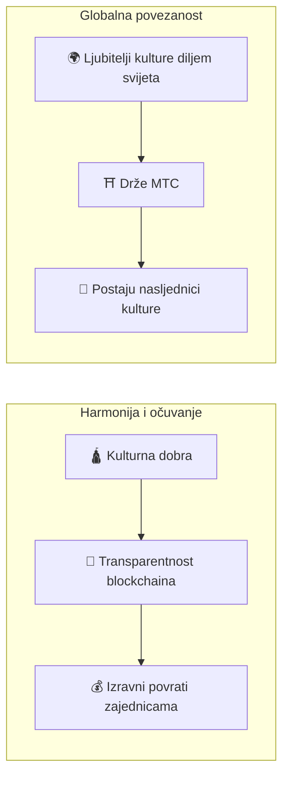

# ⛩️ Dobrodošli u Matsuri Coin

> **Kod za harmoniju. Vrijednost za mir.**
> Most "Wa" u razjedinjenom svijetu. MTC je kompas koji vodi od natjecanja prema sustvaranju.

**Matsuri Coin (MTC)** je decentralizirani uslužni token izgrađen na Solana blockchainu.
Osmišljen kao **"kulturni OS"**, povezuje japansko duhovno nasljeđe — "Duboki Japan" — s globalnom ekonomijom.

Ne gradimo samo još jedan platni sustav.
Gradimo **most između Japana i svijeta** — novi okvir sustvaranja u kojem ljudi koji vole kulturu surađuju preko granica.

---

## 📖 Vodič kroz Whitepaper

| | Poglavlje | Što ćete naučiti | Najbolje za |
| :---: | :--- | :--- | :--- |
| **1** | [**Vizija i strategija**](/docs/vision) | Zašto japansko turističko tržište od ¥10T treba Web3. Ekonomski zamašnjak koji MTC čini deflatornim | Razumijevanje prilike |
| **2** | [**Ekonomija i GCF**](/docs/economy) | 6 izvora prihoda, provizije, tokenomika, raspored prepolovljavanja, platna infrastruktura | Procjena poslovnog modela |
| **3** | [**Ekosustav i rudarenje**](/docs/ecosystem) | 5 stupova rudarenja (Mediji, Društveno, Avantura, Kreatori, Likvidnost), Proof of Action | Kako korisnici zarađuju MTC |
| **4** | [**Kako zaraditi i koristiti MTC**](/docs/how-to-earn) | Vodič za zaradu korak po korak, opcije potrošnje i plan migracije na lanac | Razumijevanje korisnosti tokena |
| **5** | [**Mobilne aplikacije**](/docs/mobile-apps) | 3 nativne iOS aplikacije, 827+ testova, Phantom Wallet integracija, offline-first arhitektura | Procjena zrelosti proizvoda |
| **6** | [**Plan razvoja i tim**](/docs/roadmap) | Prekretnice faza 1-3, plan DAO upravljanja, pozadine članova tima | Vremenski okvir i rizik izvršenja |
| **7** | [**Pametni ugovori**](/docs/smart-contracts) | 4 Anchor/Rust programa, sigurnosni model, status revizije, verifikacija plaćanja na lancu | Tehničko dubinsko ispitivanje |

:::tip Brza navigacija
**Investitor?** Počnite s [Vizija](/docs/vision) → [Ekonomija](/docs/economy) → [Plan razvoja](/docs/roadmap).
**Korisnik?** Idite na [Kako zaraditi i koristiti MTC](/docs/how-to-earn) — potpuni vodič za zaradu i potrošnju.
**Programer?** Idite na [Pametni ugovori](/docs/smart-contracts) → [Mobilne aplikacije](/docs/mobile-apps).
**Partner?** Pročitajte [Ekosustav](/docs/ecosystem) → [Ekonomija (GCF odjeljak)](/docs/economy).
:::

---

## 🎯 Naša misija

:::info Usmjeravanje ¥10 trilijuna tržišne energije u budućnost kulture
Japansko tržište dolaznog turizma ubrzano raste prema **¥10 trilijuna** godišnje.
No ispod tog naslova krije se **neugodna istina.**
:::

### Problemi o kojima nitko ne govori

| Problem | Što se zapravo događa |
| :--- | :--- |
| 💸 **Odljev prihoda** | Lavovski dio prihoda od dolaznog turizma curi u inozemstvo kao provizije stranim OTA platformama i posrednicima |
| 😤 **Iscrpljenost zajednice** | Pretjerani turizam preplavljuje lokalna područja gužvama, a nijedan profit ne vraća se zajednicama koje nose taj teret |
| 🚧 **Zid iskustva** | Paket-aranžmani samo zagrebu površinu — putnici se nikada ne povežu sa *pravim* Japanom |

> **"Lokalno stanovništvo se muči, putnici vide fasadu, a bogatstvo nestaje u provizijama platformi."**

Koristimo Web3 za rušenje ovog pokvarenog sustava.
Vaše plaćanje dolazi do lokalnih zajednica i očuvanja baštine **izravno** — potpuno transparentno, bez posrednika.

---

## 📊 Platforma na prvi pogled

Matsuri platforma **nije obećanje iz whitepapera — to je produkcijski sustav.**

| Metrika | Vrijednost |
| :--- | :--- |
| **Modeli podataka** | 80+ produkcijskih modela baze podataka |
| **API krajnje točke** | 100+ REST API-ja koji opslužuju web, iOS i partnerske aplikacije |
| **Načini plaćanja** | 4 (Stripe, PayPal, Solana Pay, MTC stanje) |
| **Autentikacija** | 6 pružatelja (E-pošta, Google, Apple, Facebook, LINE, Twitter) |
| **Mobilne aplikacije** | 3 nativne iOS aplikacije (GCF Admin objavljen na App Storeu; Matsuri i J-Times izlaze krajem travnja 2026.) |
| **Jezici** | 5 (japanski, engleski, kineski, tajlandski, norveški) |
| **Pametni ugovori** | 4 Anchor/Rust programa na Solana |
| **Automatizirani zadaci** | 15+ Celery pozadinskih poslova (oporavak košarice, podsjetnici, analitika) |
| **Pokrivenost testovima** | 841+ backend testova + 827+ mobilnih testova |

---

## 🏗️ Hibridni model: Kultura × Tehnologija

Većina kripto projekata juri za profitom i tretira kulturu kao jednokratnu.
MTC okreće priču: gradimo **"ekonomiju koja štiti kulturu"** — hibridnu strukturu koja je trebala postojati od prvog dana.

| Stup | Što to znači |
| :--- | :--- |
| **🛕 Harmonija i očuvanje** | Plaćanja turista teku kroz blockchain kanale izravno u očuvanje kulture i potporu obrtnicima. Zajednice (GCF) zadržavaju suverenitet nad vlastitom baštinom — bez izrabljivačkih posrednika |
| **🌍 Globalna povezanost** | Infrastruktura koja omogućuje svakome, bilo gdje, da podrži japanski duh "Wa." Držanje MTC-a znači sudjelovanje u živoj japanskoj povijesti — postajete dio njezine priče |

---

## 💎 Zašto koristiti MTC?

MTC ekosustav pruža i **duhovno ispunjenje** i **opipljivu financijsku korist.**

### ✨ Vrijednost iskustva

| Prednost | Detalji |
| :--- | :--- |
| **🎌 Značajna iskustva** | Otključajte "Duboki Japan" — sveta mjesta zatvorena za javnost, privatne ceremonije u hramovima, kulturni događaji samo za pozvane |
| **🌐 Doživotna veza** | Ostanite povezani s Japanom putem MTC-a dugo nakon što odletite kući. Mjesto na koje se uvijek možete "vratiti" |
| **⚖️ Pravedna razmjena** | Pametni ugovori eliminiraju posrednike. Vaša zahvalnost (i novac) ide izravno ljudima koji su to zaslužili |

### 💰 Financijska korist

| Prednost | Detalji |
| :--- | :--- |
| **🏷️ Povlaštene cijene** | Plaćajte s MTC i uštedite **5%–10%** u odnosu na cijene u jenima. Npr. tura od ¥30.000 → ~¥27.000 ekvivalent |
| **🔑 Ekskluzivni pristup** | NFT ulaznice za mjesta samo za pozvane i ograničene događaje — samo za MTC držatelje |
| **🛡️ Zaštita od valutnog rizika** | Zaključajte vrijednost iskustva prije putovanja — bez brige o promjenama tečaja |

---

## ⚡ Zašto Solana?

Opsluživanje i "stvarne turističke potražnje" i "visokofrekventnog financijskog trgovanja" ostavilo nas je s točno **jednim održivim blockchainom.**

| Metrika | Ethereum | Solana |
| :--- | :---: | :---: |
| **Naknada za transakciju** | ¥100-e–¥1.000-e | **~¥0,04** |
| **Konačnost** | 12 s – minute | **0,4 sekunde** |
| **Propusnost** | ~15 TPS | **Tisuće TPS** |

:::tip Test hramskog darovanja
Mikroplaćanje malo poput "bacanja ¥100 u kutiju za darove" zahtijeva naknade **ispod ¥1.** Samo Solana prolazi taj test.
:::

---

---

## 🔑 Zašto upravo sada?

| Čimbenik | Kontekst |
| :--- | :--- |
| **Tržište od ¥10T** | Japanski dolazni turizam dosegao je rekordne razine 2024.–2025. bez znakova usporavanja. Infrastruktura za hvatanje te vrijednosti na lancu još ne postoji |
| **Slabi jen** | Povijesno slabi jen čini Japan globalno najpovoljnijom destinacijom — pokrećući neviđen broj stranih posjetitelja |
| **Zrelost Solane** | Infrastruktura Solane (konačnost ispod sekunde, naknade od $0,001, Metaplex, SPL tokeni) dosegla je produkcijsku razinu tek u posljednjih 18 mjeseci |
| **Prednost prvog pokretača** | Nijedan drugi projekt ne kombinira ReFi turističko usmjeravanje, očuvanje kulture i rudarenje odnosa na jednom blockchainu. Matsuri ima **nula izravnih konkurenata** |
| **Dvogodišnje prepolovljavanje** | Fond za rudarenje pokreće se u lipnju 2027. s dvogodišnjim ciklusom prepolovljavanja — brže od Bitcoina. Rani sudionici trajno osiguravaju najviše stope nagrada |

:::note Spremni za početak
MTC završava eru turizma koji samo *konzumira* kulturu. Dobrodošli na putovanje **sustvaranja** — izgradimo budućnost zajedno.
:::

**[▶ Vizija: Zašto upravo sada?](/docs/vision)** ｜ **[▶ Pridružite se GCF-u (VIP članstvo)](/docs/economy)**
