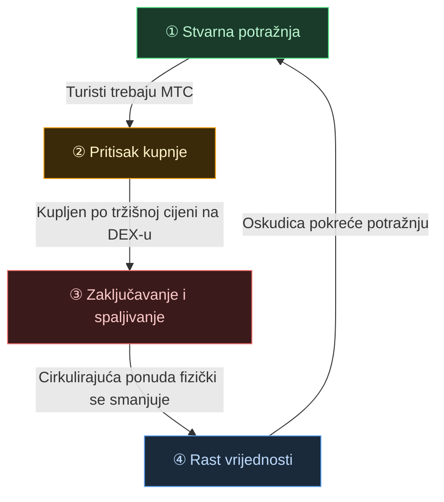
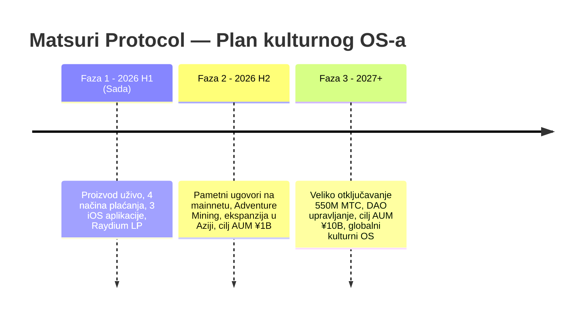

# 🎯 Vizija: Strategija "Dolazni turizam na prvom mjestu"

> **Od ovisnosti o subvencijama do suverenosti.**
> Era podupiranja ruralnih ekonomija poreznim novcem je gotova. Usmjeravamo strani kapital izravno u kulturu.

Većina projekata regionalne revitalizacije propada — jer sve što rade je preraspodjela smanjujućih domaćih proračuna.

**Matsuri Protocol zauzima potpuno suprotan pristup.**

---

## 1. Strategija: Stroj za izvoz kulture

Redefiniramo japansku turističku imovinu — ne kao "potrošnu robu", već kao **izvozive financijske instrumente.**

| Problem | Stvarnost | Utjecaj |
| :--- | :--- | :--- |
| 💸 **Odljev prihoda** | Provizije stranim OTA platformama (Booking.com, Expedia, itd.) | **15%–20% prihoda** curi u inozemstvo — gubitak na nacionalnoj razini |
| 🚧 **Nevidljivi zid** | Jezične i platne barijere | Bogati putnici ne mogu pristupiti iskustvima "Dubokog Japana" |

:::tip Uloga MTC-a
MTC je **jedini glavni ključ** koji zaustavlja odljev i ruši zid.
:::

---

## 2. Ekonomski zamašnjak

Ključna značajka Matsuri Protocola: **oduševljenje turista matematički pokreće rast cijene MTC-a.**
Ne nada — **mehanika ponude i potražnje.**

### Zašto MTC raste?

**Četverostupanjski automatski ciklus** podupire cijenu:

| Korak | Naziv | Mehanizam |
| :---: | :--- | :--- |
| **①** | **Stvarna potražnja** | Turisti trebaju MTC za rezervacije vodiča i kupnju NFT ulaznica |
| **②** | **Pritisak kupnje** | MTC se kupuje po tržišnoj cijeni na DEX-u — pokrenuto potrošnjom, ne špekulacijom |
| **③** | **Zaključavanje i spaljivanje** | Dio MTC-a korištenog u plaćanjima odmah se zaključava ili spaljuje putem pametnih ugovora — ponuda se fizički smanjuje |
| **④** | **Rast vrijednosti** | Potražnja za kupnjom raste, ponuda za prodaju se smanjuje — vrijednost oskudice matematički raste |

:::info Osnovna istina
**"Što više turisti uživaju u Japanu, to više raste imovina MTC držatelja."**
Ta jednostavna jednadžba je srce projekta.
:::

### Što stvara pritisak prema dolje?

Pošteni projekti obrađuju obje strane. MTC može izgubiti vrijednost ako:

| Rizik | Utjecaj | Ublažavanje |
| :--- | :--- | :--- |
| **Pad turizma** | Manja stvarna potražnja za MTC-om | Diversificirani prihod: MEV bot radi neovisno o turizmu |
| **Pritisak prodaje od rudara** | Zarađeni MTC se izbacuje na tržište | Toku staking (zaključajte MTC za do 10× pojačanje rudarenja) potiče držanje |
| **Regulatorna promjena** | Jurisdikcijska ograničenja | SPL standard tokena, bez klasifikacije kao vrijednosni papir, planira se pravno mišljenje |
| **Problem Solana mreže** | Privremena kašnjenja transakcija | Logika ponovnog pokušaja s eksponencijalnim odgađanjem; izvanlanačni sustav radi neovisno |

> **Ne obećavamo "broj raste." Gradimo mehanizme koji stvaraju strukturalni pritisak kupnje i smanjuju poticaje za prodaju.** Ostalo su tržišne dinamike.

---

## 3. Krajnji cilj: Kulturni OS

Naš krajnji cilj nije platna aplikacija.
Naš cilj je **pretvoriti samu kulturu u operativni sustav.**

> Štitimo **kulturu koja traje 1.000 godina** pomoću **najsuvremenije blockchain tehnologije.**
> To je budućnost koju Matsuri Protocol gradi.

  

*Matsuri tura u svetištu Hanazono — gdje kultura susreće svijet.*

---

**[▶ Dalje: Kako zapravo zarađujemo? (Ekonomija)](/docs/economy)**
