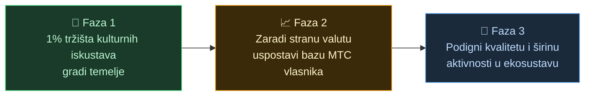

# 🌏 Izazovi i rješenja – neugodne istine i nada

> **Misija je lijepa. Ali stvarnost joj stoji na putu.**

---

## Neugodne istine koje stoje na putu

:::info 10 trilijuna jena tržišne energije ne dolazi do nositelja kulture
Japansko tržište dolaznog turizma raste prema **10 trilijuna ¥** godišnje.
No velik dio tog plijena nikada ne dolazi do onih koji zapravo pružaju iskustva.
:::

### Tržište koje MTC cilja

Ne pokušavamo uzeti svih 10 trilijuna.

Prvo ciljamo tržište **kulturnih iskustava, vodiča i lokalnih tura**. **1 % toga (oko 100 milijardi ¥)** prvi je cilj – kreni malo, ojačaj.

| Faza | Strategija | Cilj |
| :--- | :--- | :--- |
| **Kreni malo** | Fokus na kulturna iskustva i vodičke ture. Gradi iskustvo, širi se od usta do usta | Uspostavljena osnova prihoda |
| **Ojačaj** | Privuci stranu valutu (dolazni prihod), dokaži mehanizam dijeljenja profita s vlasnicima MTC-a | Povjerenje u MTC ekonomiju |
| **Podigni razinu** | Kad se dosegne određena veličina, prednost daj kvaliteti, širini i dubini zajednice prije daljnje ekspanzije | Održiva kulturna ekonomija |

> **Ne jurimo volumen – rastemo kvalitetom sudionika i dubinom iskustava.** To je strategija rasta MTC-a.

Web2 platforme donijele su čuda putovanja cijelom svijetu. Zahvaljujemo im na tome.
Ali centralizirana struktura ima neizbježne nuspojave.

Algoritmi odlučuju "što se vidi", a pružatelji su prisiljeni nadmetati se za pozicije. Jedna recenzija može odrediti prihod, a naknade se mijenjaju prema želji platforme – sve u sjeni straha "hoću li biti izabran ili nestati".

To stvara podjele među pružateljima i strah od nevidljivih pravila.
Susjedni obrt postaje rival; racionalnije je zatvoriti se nego surađivati. Putnici dobivaju samo standardizirane izbore – zvjezdice i ljestvice – a iskustva koja zaista imaju vrijednost utapaju se u masi.

:::danger Tri izazova na terenu
💸 **Prihod curi van** — najveći dio prometa završi kao naknada stranim OTA-ima i posrednicima u inozemstvu

😤 **Područja se troše** — opterećenja preturizma ostaju, a stvarni prihod ne vraća se u zajednicu

🚧 **Zid iskustva** — dominiraju ujednačene ture koje biraju algoritmi, a "pravi Japan" se ne upoznaje
:::

> **Japanci se troše, putnici nikad ne upoznaju pravi Japan, a bogatstvo nestaje u platformama.**

---

## Kako to onda promijeniti?

Ali sada je spremna tehnologija koja strukturu može promijeniti iz temelja.

:::tip Pametni ugovori – zajednička pravila koja se ne mogu iznova pisati
Naknade i uvjeti urezani su u kod i ne može ih mijenjati pojedinac. Ista pravila vrijede za sve i izvršavaju se automatski.
:::

:::tip Blockchain – sve je vidljivo
Sve transakcije bilježe se u javnoj glavnoj knjizi i svatko ih može provjeriti. Vrijeme u kojem su podaci bili zaključani unutar korporacija je gotovo.
:::

:::tip Solana – namira za 0,4 s, naknada oko 0,04 ¥
Bez slojeva posrednika, bez dana čekanja. Ljudi se mogu povezati izravno.
:::

:::tip AI – briše sam trošak administracije
Eksplozivni dobitak u produktivnosti pretvara troškovnu strukturu koja održava ogromne platforme u prošlost.
:::

Posrednici više nisu potrebni. Možemo se povezati izravno.

Ovom tehnologijom oslobađamo turističku ekonomiju od monopola i vraćamo prihode pružateljima – u Japanu i u drugim zemljama.
I gradimo ne samo za Japan, nego **mehanizam koji čuva i povezuje kulture svijeta**.

---

**[◀ Prethodno: Vizija i misija](/docs/vision)**｜**[▶ Sljedeće: Budućnost koju MTC iscrtava](/docs/future)**
