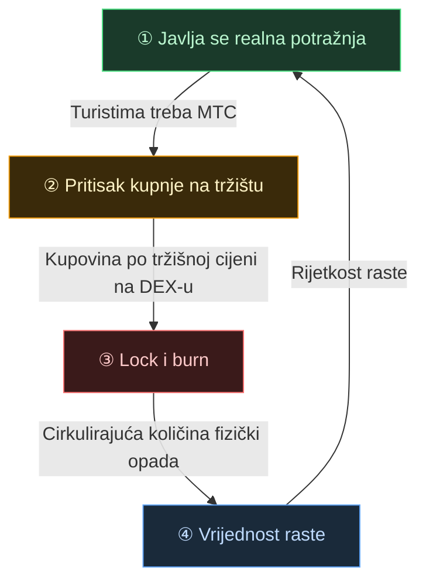

# 🔄 Ekonomski zamašnjak – krug rasta i kulturni OS

> **Što turisti više uživaju u Japanu, to više raste potražnja u ekosustavu.**
> Taj mehanizam ponude i potražnje je srce projekta.

---

## Ponuda i potražnja MTC-a

U dizajnu Matsuri Protocola mehanizam je izgrađen tako da **rast realne potražnje stvara pritisak kupnje koji, u kombinaciji s opadajućom ponudom, postavlja uvjete za rast vrijednosti**.
Nije riječ o emocijama, nego o **ponudi i potražnji**.

Sljedeći **četverokorakni krug** nosi cijeli mehanizam.

| Korak | Naziv | Mehanizam |
| :---: | :--- | :--- |
| **①** | **Javlja se realna potražnja** | Turistima treba MTC za rezervaciju vodiča i kupnju Ticket-NFT-ova |
| **②** | **Pritisak kupnje na tržištu** | MTC se kupuje po tržišnoj cijeni na DEX-u (decentralizirana burza). Nije spekulacija, nego jaka kupnja vođena potrošnjom |
| **③** | **Lock i burn** | Dio MTC-a korištenog za plaćanje pametni ugovor istog trena zaključava ili spaljuje. Cirkulirajuća količina fizički opada |
| **④** | **Rast rijetkosti** | Raste potražnja za kupnjom, opada ponuda za prodajom. Promjena ravnoteže čini svaki token rjeđim |

---

---

:::note Vizija koju formula nosi
Cijelu sliku "kulturnog OS-a" koji leži iza zamašnjaka pričamo na sljedećoj stranici [Budućnost koju MTC iscrtava](/docs/future).
:::

---

**[◀ Prethodno: Izazovi i rješenja](/docs/challenges)**｜**[▶ Sljedeće: Budućnost koju MTC iscrtava](/docs/future)**
