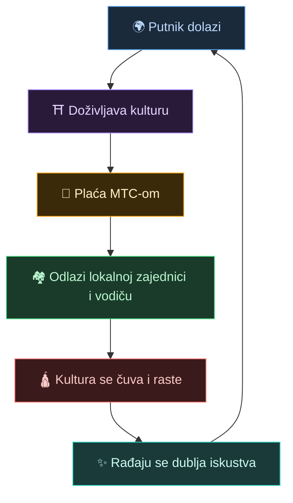
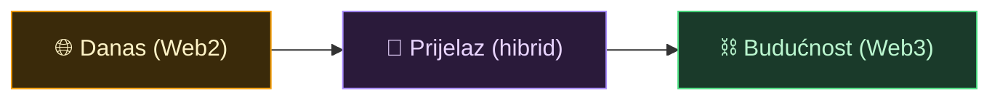
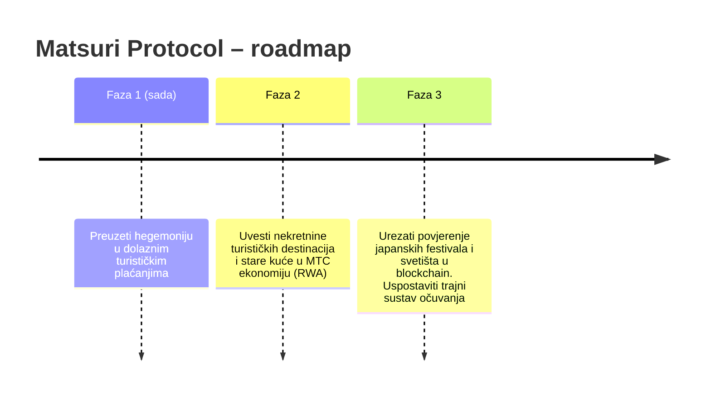

# 🌀 Budućnost koju MTC iscrtava – ekonomija u kojoj svaki oblik sudjelovanja kruži

> **Oni koji doživljavaju, oni koji prenose, oni koji čuvaju. Sve te misli kruže kao ekonomija i predaju kulturu sljedećem naraštaju.**

---

## Krug koji želimo ostvariti

MTC nije spekulativni token.

Putnik se susretne s japanskom kulturom i bude dirnut.
Vodič prenosi taj osjećaj i biva nagrađen.
Lokalna zajednica bogati se i može i dalje čuvati kulturu.
A ta kultura privlači nove putnike.

Taj krug je razlog zašto MTC postoji.

---

## Ekonomija u kojoj sva tri sudionika dobivaju

U klasičnom turizmu putnik plaća, platforma uzima profit, a lokalnoj zajednici ne ostaje ništa.
U MTC ekonomiji nagrađeni su svi sudionici.

| Sudionik | Što se događa | Kako je nagrađen |
| :--- | :--- | :--- |
| **🌍 Oni koji doživljavaju** | Dotiču se japanske kulture i plaćaju MTC-om | Jeftinije od cijene u jenima, pristup pravim iskustvima, ostaju povezani preko MTC-a i nakon povratka kući |
| **⛩️ Oni koji prenose** | Održavaju evente kao vodiči, objavljuju sadržaj na J-Timesu | Izravna naplata bez posrednika – što više rade, to ih MTC više nagrađuje |
| **🏘️ Oni koji čuvaju** | Lokalne zajednice koje održavaju i prenose kulturu | Prihodi idu izravno njima. Održivo blagostanje umjesto preturizma |

---

## Što je ekonomija šira, to je kultura jača

MTC ekonomija počinje rezervacijama iskustava i postupno se širi na sve strane života.

- **Iskustva** — autentična kulturna iskustva, hodočasnički mining
- **Stanovanje, hrana, odjeća** — guest houseovi, trgovine, hrana, moda
- **Sustvaralački projekti** — crowdfunding investicije koje čuvaju kulturu
- **Međunarodno kulturno razumijevanje** — razmjena i međusobno razumijevanje preko granica

Što je ekonomija šira, to MTC deblje kruži, i snaga koja nosi kulturu postaje veća.
To nije samo poslovni model, nego **sustav za održavanje života kulture**.

---

## Iz Web2-a u Web3 – bez naglih prijelaza

Ne kažemo "sve odmah na blockchain".

Većini je Web3 još uvijek stran. Zato je dizajn takav da **prvo koristite nešto poznato i postupno osjećate koristi Web3-a**.

| Faza | Korisničko iskustvo | Ispod haube |
| :--- | :--- | :--- |
| **Danas** | Obična web-aplikacija za rezervaciju i plaćanje. Kreditna kartica je sasvim dovoljna | Django + Stripe. Walletom nije potreban |
| **Prijelaz** | Zarađujete i trošite MTC u aplikaciji. Povezivanje walleta jednim dodirom | Off-chain bodovi postupno se sele on-chain |
| **Budućnost** | Sve transakcije i prava bilježe se transparentno na blockchainu. Vaš doprinos je zauvijek dokaziv | Potpuno automatska, neizmjenjiva ekonomija preko pametnih ugovora |

:::tip Web3 nije težak
Ne morate odmah postavljati wallete ni čuvati seed fraze. Dok koristite sustav, prirodno ulazite u Web3 svijet — **a u jednom trenutku shvatite da već živite u Web3-u.** Takvo iskustvo dizajniramo.
:::

---

## Ekonomija pokretana empatijom, a ne silom

A ova ekonomija pokreće se pametnim ugovorima.
Ničija moć ili interes ne može jednostrano promijeniti pravila — **ekonomski sustav u kojemu sila ne može promijeniti status quo**.

Povrh toga, učimo iz drevne mudrosti i nastavljamo stvarati novu vrijednost. 温故知新 (onko-chishin), pa i dalje – 創新 (sōshin – stvaranje novog).

> **Svijet u kojemu život može počivati na kulturi – i bez jena, i bez dolara.**
>
> Umjesto da vrijednost valute prepuštate nekome drugom, vrijednost stvarate i trošite vlastitim sudjelovanjem.
> To je sloboda koju želimo donijeti s MTC-om.

---

## 🏁 Krajnji cilj: "Kulturni OS"

Naš konačni cilj nije samo aplikacija za plaćanje.
To je **pretvoriti samu kulturu u OS (temelj)**.

> Drevnu mudrost čuvamo najnovijim blockchainom.
> To je slika budućnosti koju iscrtava Matsuri Protocol.

---

:::note Dovde seže priča
Ako ste stigli dovde, razumijete zašto MTC uopće postoji.
Sada idemo na **[Praksu]** — pogledajmo što zapravo možete raditi s MTC-om.
:::

**[◀ Prethodno: Ekonomski zamašnjak](/docs/flywheel)**｜**[▶ Sljedeće: Ekosustav](/docs/ecosystem)**
