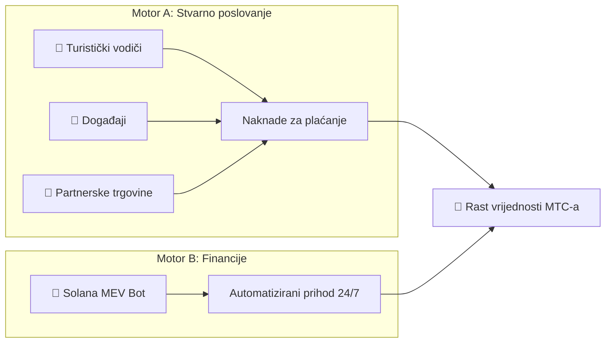
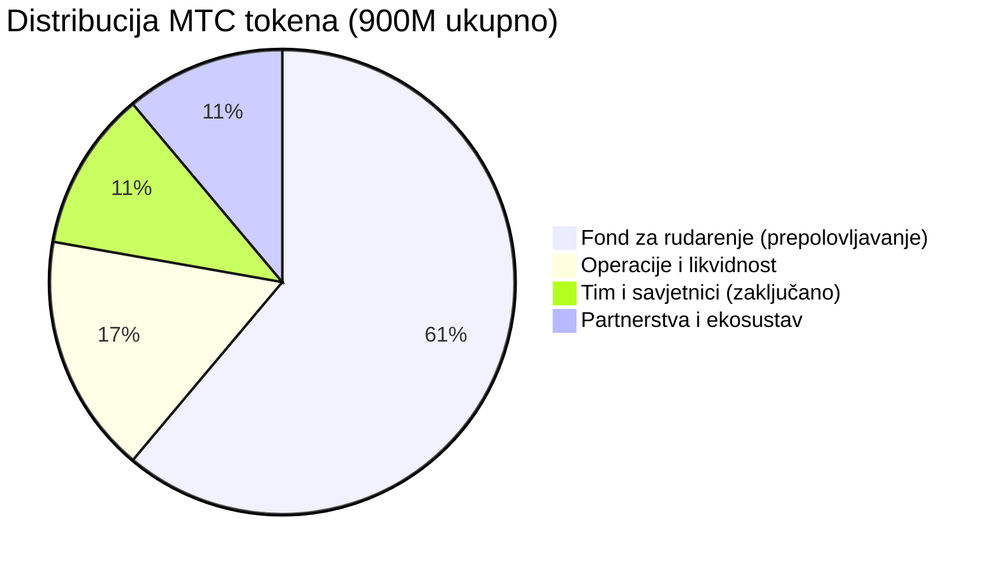

# 💰 Ekonomija

> Ekonomija Matsuri Coina (MTC) je jednostavna, ali provjerena u praksi.
> **Dva motora prihoda — stvarno poslovanje i financijski algoritmi — generiraju profit i programski ga redistribuiraju držateljima.**


---

## 1. Dvostruki motori prihoda



| Motor | Izvor prihoda | Kako funkcionira |
| :--- | :--- | :--- |
| **🏯 Motor A (Stvarno poslovanje)** | Naknade za plaćanje od turističkih vodiča, događaja i partnerskih trgovina | Više dolaznih turista → više stranog kapitala pristiže → ekosustav se širi |
| **🤖 Motor B (Financije)** | Automatizirano trgovanje Solana MEV Botom | Algoritam koji je dizajnirao CEO hvatanje prilike za arbitražu i likvidacije na lancu 24/7/365. Prihod je neovisan o sezonalnosti turizma — radi bez obzira na tržišne uvjete |

### Tokovi prihoda (Aktivni i praćeni)

Platforma prati **6 različitih kategorija prihoda** — sve s produkcijskom platnom infrastrukturom:

| # | Tok prihoda | Način plaćanja | Status |
| :---: | :--- | :--- | :---: |
| 1 | **Prodaja ulaznica za događaje** | Stripe / PayPal / Solana Pay / MTC | ✅ Aktivno |
| 2 | **GCF pretplate na članstvo** | Stripe ponavljajuća naplata | ✅ Aktivno |
| 3 | **Provizije za preporuke** | Automatski izračunate, isplata bankom / kriptom | ✅ Aktivno |
| 4 | **Napojnice za vodiče** | Stripe (napojnice nakon događaja u stilu Ubera) | ✅ Aktivno |
| 5 | **Naknade za upis na tečajeve** | Stripe | ✅ Aktivno |
| 6 | **Kampanje grupnog financiranja** | Solana na lancu | ✅ Aktivno |

---

## 2. Protokol otkupa (Mehanizam rasta vrijednosti)

Ne zadržavamo profit za sebe.
Pravila pametnih ugovora usmjeravaju prihod izravno u **rast vrijednosti MTC-a.**

| Izvor prihoda | Alokacija | Akcija |
| :--- | :---: | :--- |
| **Prodaja Matsuri sjedišta** (Vodiči i događaji) | **20%** | Tržišni **otkup** + ubrizgavanje u fond likvidnosti |
| **GCF članstvo** (Članarine) | **25%** | Tržišni **otkup** |

:::info Osnovna logika
**"Rast poslovanja = MTC se stalno kupuje na otvorenom tržištu."**
Ta jednadžba podupire vrijednost vaše imovine.
:::

---

## 3. Logika određivanja cijene

Naš mehanizam cijena radi na **AMM (Automatizirani tržišni kreator) formuli** — ne na nadanjima.

```
Cijena = Likvidnost (SOL) ÷ Ponuda (MTC)
```

| Korak | Što se događa | Rezultat |
| :---: | :--- | :--- |
| **①** | Poslovni prihod (SOL) ubrizgava se u fond | **Brojnik ↑** |
| **②** | MTC se otkupljuje s tržišta i spaljuje | **Nazivnik ↓** |
| **③** | Brojnik ↑ × Nazivnik ↓ | **Cijena matematički teži rastu** |

> **Primjer:** Ako Raydium fond drži 1.000 SOL i 10.000.000 MTC, cijena je 0,0001 SOL/MTC. Tura od ¥300.000 generira otkup od ¥60.000 (20%), što dodaje ~0,4 SOL u fond i uklanja MTC iz cirkulacije. Pomnožite to sa stotinama mjesečnih transakcija.

---

## 4. GCF (Global Community Friends)

GCF je partnerska organizacija (DAO) **samo na poziv** koja skalira Matsuri ekosustav.
Nije članski klub — nego **poslovna zajednica** koja dijeli zaradu.


<div style={{display: 'flex', gap: '2rem', justifyContent: 'center', alignItems: 'center', flexWrap: 'wrap', margin: '2rem 0'}}>
  
  
</div>

### Stupnjevi članstva

| Stupanj | Uloga | Privilegije |
| :---: | :--- | :--- |
| **👑 Platinum** | Vlasnik / VIP | Vrhunska prava. Samo prvih **50 mjesta**. Moć odlučivanja + značajan prihod od dividendi |
| **🥇 Gold** | Ambasador | Operativci. Pravo zarade **bez ograničenja** kroz aktivnost. Maksimalne stope rudarenja i preporuka |

### Pogodnost ①: Rudarenje stvarnim radom (Prava rudarenja)

**550 milijuna MTC (~61% ukupne ponude)** koji se otključavaju 1. lipnja 2027. rezervirani su kao **Fond nagrada za doprinositelje** — ne izbacuju se na tržište.

:::tip Potpuno temeljeno na učinku
MTC se automatski distribuira iz fonda na temelju vašeg učinka (prodaja, broj posjetitelja, sesije vodstva).
:::

**Raspored prepolovljavanja (dvogodišnji ciklus):**

| Razdoblje | Oslobađanje | Količina |
| :--- | :---: | :--- |
| **Epoha 1** 2027. – 2029. | **50%** | ~275 M tokena |
| **Epoha 2** 2029. – 2031. | **25%** | ~137 M tokena |
| **Epoha 3** 2031. – 2033. | **12,5%** | ~68 M tokena |

:::caution Prozor prednosti prvog pokretača
Brže od Bitcoinovog 4-godišnjeg prepolovljavanja — koristimo **dvogodišnji ciklus.**
Oni koji ulože sve u **prve dvije godine od 2027.** osiguravaju nenadmašivu prednost prvog pokretača.
:::

### Pogodnost ②: Premium provizije za preporuke

Preporučite skupe proizvode (članstva, VIP ture, partnerske nekretnine) i zaradite **premium provizije (USDC + MTC)** — višestruko veće od standardnih affiliate isplata. Isplaćuju se **trenutno** putem pametnog ugovora.

#### Implementirana struktura provizija (Spremna za lanac)

Sustav preporuka podržava do **4 sloja dubine provizija** — sve automatski izračunato pri svakoj kupnji:

| Sloj | Odnos | Stopa provizije |
| :---: | :--- | :---: |
| **L1** | Izravna preporuka | **20%** |
| **L2** | Preporuka preporuke | **5%** |
| **L3** | 3. stupanj | **5%** |
| **L4** | 4. stupanj | **5%** |

> Svaki `EventPurchase` automatski pokreće `GCFReferralCommission` zapise za sve kvalificirane uzlazne preporučitelje. Provizije se prate s tokom statusa: `pending → approved → paid`.

#### Opcije isplate

| Metoda | Detalji |
| :--- | :--- |
| **🏦 Bankovna doznaka** | Japanski bankovni računi (šifrirani Fernet šifrom) |
| **⚡ Solana** | Izravni prijenos na novčanik s dokazom TX hasha na lancu |
| **💳 Revolut** | Podrška za međunarodne isplate |

---

## 5. Platna infrastruktura

Četiri načina plaćanja su **implementirana i obrađuju transakcije** — osmišljena da služe i tradicionalnim korisnicima i Web3-nativnim korisnicima.

| Metoda | Pružatelj | Naknada | Slučaj korištenja |
| :--- | :--- | :---: | :--- |
| **💳 Kreditna kartica** | Stripe | 3,6% | Standardne kupnje, pretplate |
| **🅿️ PayPal** | PayPal | 3,9% + ¥40 | Međunarodni gosti |
| **⚡ Solana Pay** | Phantom Wallet | ~¥0,04 | Kripto-nativni korisnici, MTC kupnje |
| **🪙 MTC stanje** | Interno (CoinService) | 0% | Zarađeni MTC potrošen na iskustva |

:::info Pametno usmjeravanje
Sustav automatski preporučuje optimalni način plaćanja na temelju iznosa, lokacije korisnika i prethodnog ponašanja — transparentno za korisnika.
:::

### Automatizirane poslovne operacije

Platforma pokreće **15+ automatiziranih pozadinskih zadataka** putem Celery radnika:

| Zadatak | Učestalost | Poslovni utjecaj |
| :--- | :--- | :--- |
| **Oporavak košarice** | Svaki sat | A/B testirane e-poruke oporavljaju napuštene kupnje |
| **Podsjetnici prije događaja** | Dnevno u 9:00 JST | E-poruke podsjetnika 7 dana i 24 sata unaprijed |
| **Ankete nakon događaja** | Nakon događaja | Prikupljanje povratnih informacija za ocjene |
| **Ponude čarobnog trenutka** | Svaki sat | Angažman nakon događaja s personaliziranim ponudama |
| **Sinkronizacija MTC stanja** | Svakih 5 min | Sinkronizacija stanja tokena na lancu |
| **Rokovi kampanja** | Svakih 30 min | Provođenje rokova grupnog financiranja |
| **Grupno prevođenje** | Na zahtjev | GPT-4 Turbo automatski prevodi događaje na 5 jezika |

---

## 6. Specifikacije tokena

Trajno smo **OPOZVALI** ovlasti izdavanja i zamrzavanja na Solani.
Nema dodatnog izdavanja — nikada. Nema zamrzavanja sredstava — nikada. **Potpuno bez povjerenja po dizajnu.**

| Stavka | Detalji |
| :--- | :--- |
| **Naziv tokena** | Matsuri Coin |
| **Oznaka** | MTC |
| **Lanac** | Solana |
| **Ukupna ponuda** | **900.000.000 MTC** (fiksna) |
| **Ovlast izdavanja** | 🚫 Opozvana |
| **Ovlast zamrzavanja** | 🚫 Opozvana |
| **Ugovor zaključavanja** | Streamflow Finance (verificiran) |

:::warning Samo na poziv — Mjesta su ograničena
GCF Platinum je ograničen na **50 mjesta diljem svijeta** — kad se popune, nema novih Platinum članova. Gold članstvo se prilagođava prema kapacitetu ekosustava. Ova oskudica je namjerna: manje partnera znači veću vrijednost po članu.
:::

### Pregled distribucije tokena



| Alokacija | Iznos | Status zaključavanja |
| :--- | :--- | :--- |
| **Fond za rudarenje** | 550M MTC (61,1%) | Zaključano do lipnja 2027., distribuira se putem dvogodišnjeg prepolovljavanja |
| **Operacije i likvidnost** | 150M MTC (16,7%) | Koristi se za Raydium LP, kreiranje tržišta, operativne troškove |
| **Tim i savjetnici** | 100M MTC (11,1%) | Zaključano putem Streamflow Finance s rasporedom otpuštanja |
| **Partnerstva i ekosustav** | 100M MTC (11,1%) | Rezervirano za strateške partnere, listanja na burzama, potpore |

---

## 7. Analitika i poslovna inteligencija

Platforma prati **svaku korisničku interakciju** produkcijskim sustavom analitike — omogućujući odluke temeljene na podacima, ne na nagađanju.

| Metrika | Kako se prati |
| :--- | :--- |
| **Analitika sesija** | Uređaj, preglednik, lokacija, UTM izvor, dubina pomicanja, vrijeme na stranici |
| **Konverzijski lijevci** | Praćenje korak po korak: pregled → klik → košarica → kupnja |
| **A/B testiranje** | Eksperimentalne grupe dodijeljene po sesiji s praćenjem varijanti |
| **Prihod po izvoru** | Ukupna potrošnja po sesiji, pripisana izvoru kampanje |
| **Kohortna analiza** | Retencija po datumu registracije, stupnju članstva, izvoru preporuke |
| **Učinak vodiča** | Zarada, napojnice, rang-liste |

> Ova infrastruktura omogućuje izračun **ARPU, LTV, CAC, stope otpada i stope konverzije** — metrike koje investitori trebaju za procjenu jedinične ekonomike.

---

**[▶ Dalje: Ekosustav i rudarenje](/docs/ecosystem)** ｜ **[Pratite nas na X](https://x.com/matsuri_dao_jp)**
