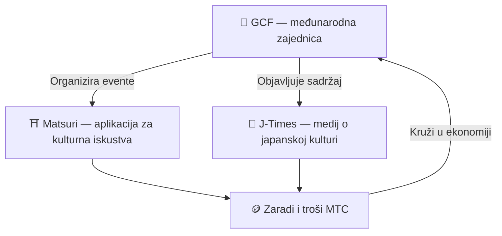

# 🏗️ MTC ekosustav – ekonomija u kojoj kruže iskustva, mediji i zajednica

> **Tri "mjesta" koja ostvaruju misiju.**
> Mjesto za doživljaj, mjesto za učenje, mjesto za susret — neovisna jedno o drugom, ali povezana u jedan krug preko MTC-a.

MTC nije samo token. Tri proizvoda i međunarodna zajednica rade zajedno na ostvarenju ekonomije koja čuva kulturu.

:::tip 🤝 GCF — međunarodna zajednica koja pokreće ekosustav
Mjesto gdje se ljudi koji vole japansku kulturu povezuju preko granica. GCF regrutira vodiče, a ti GCF vodiči vode iskustva na Matsuriju. Usto objavljuju zanimljiv sadržaj na J-Timesu — aktivnost zajednice motor je cijelog ekosustava.
:::

:::tip ⛩️ Matsuri — aplikacija za kulturna iskustva
Kreće od rezervacije kulturnih iskustava, pa se postupno širi na **guest houseove**, **trgovine** i **crowdfunding**. Ekonomija raste od iskustava prema odjeći, hrani, stanovanju i zajedničkim investicijama.

**Hodočasnički mining (sankei-mining)** — zaradite MTC fizičkim odlaskom u svetišta, hramove i kulturne lokacije. Tok posjetitelja prirodno se širi od velikih znamenitosti prema skrivenim regionalnim draguljima, pa se preturizam rješava istodobno s revitalizacijom regija.
:::

:::tip 📰 J-Times — medij o japanskoj kulturi
Medij koji japansku kulturu nosi u svijet. Zaradite MTC čitanjem, dijeljenjem i angažiranjem s člancima.
:::

  
  
  
  

*Od iskustva do hrane, robe i sustvaranja — Matsuri aplikacija već vrti cijeli krug. Slijeva nadesno: otkrijte iskustva, pronađite restorane prilagođene alergijama, kupujte rukotvorine, podržite crowdfunding projekte.*

---

## 🤝 Social Mining (zaradi povezujući)

**Integracija s GCF administracijskom pločom ── web inačica u pogonu (iOS aplikacija planirana za travanj 2026.)**

GCF članovi dobivaju pristup posvećenom **GCF admin webu**.

| Funkcija | Što možete |
| :--- | :--- |
| **🎪 Eventi** | Osmislite i objavite vlastite evente i ture |
| **📢 Sadržaj** | Objavljujte i širite J-Times članke i sadržaj |
| **📊 Praćenje preporuka** | Pratite preporuke, aktivnost korisnika i prihode u stvarnom vremenu |

:::info Automatsko dijeljenje prihoda
Svaki put kad vaš preporučeni korisnik izvrši plaćanje, sustav **automatski** uplaćuje dio prihoda u vaš wallet.
:::

---

## 🎓 Kreatorska ekonomija (zaradi stvarajući)

Ne morate samo trošiti sadržaj – na Matsuri platformi **svatko** može proizvoditi i monetizirati vlastiti sadržaj.

| Platforma | Što kreator može | Model prihoda |
| :--- | :--- | :--- |
| **📚 Tržište tečajeva** | Objavite video/tekstualne tečajeve o japanskoj kulturi, jeziku, zanatima | Naknada po upisu (udio kreatora) |
| **🎙️ Podcast studio** | Producirajte audio serije za Spotify, Apple Podcasts, RSS | Epizode ekskluzivne za pretplatnike |
| **🤝 Crowdfunding** | Pokrenite Solana kampanje za kulturne projekte | On-chain praćenje doprinosa |
| **🛍️ Korisničke trgovine** | Otvorite osobne trgovine na platformi (rukotvorine, merch) | Izravna prodaja s recenzijskim sustavom |

:::tip Proizvodnja uz AI
Domaćini eventa mogu koristiti **ugrađenog AI asistenta (GPT-4 Turbo)** za pisanje opisa eventa, automatski prijevod na pet jezika i generiranje SEO-optimiziranih metapodataka — sve iz admin ploče.
:::

---

  

*Druženje zajednice u Golden Gaiu ── povezanost kao rudarska snaga.*

---

:::note Sljedeća stranica
Ako želite znati kako konkretno funkcionira mining i kako zaraditi, idite na **[Mining i zaradu →](/docs/mining)**.
:::
