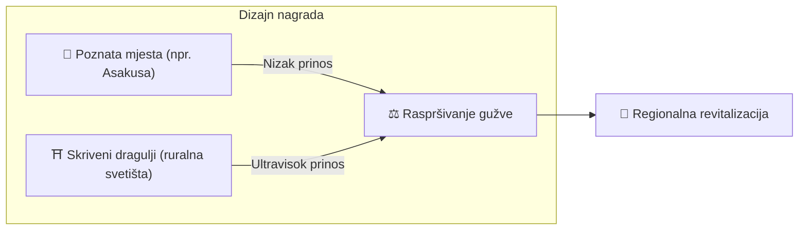

# ⛏️ Pet stupova rudarenja

> **Proof of Action (PoA)**
> Matsuri Coin se ne rudari grafičkim karticama, već **ljudskim djelovanjem.**

Web aplikacija i administratorska ploča su **već aktivne** — počnite zarađivati **odmah** kroz aktivnosti u nastavku.

---

## 1. 📖 Medijsko rudarenje (Čitaj, slušaj i rješavaj kvizove za zaradu)

**Pokreće "J-Times" službeni medij**

Znanje transformira kvalitetu putovanja.
Nagrađujemo učenje — čitanje, slušanje **i** dokazivanje razumijevanja putem kvizova.

| Akcija | Što radite | Nagrada |
| :--- | :--- | :--- |
| **📰 Čitaj za zaradu** | Čitajte J-Times članke o povijesti, šintoizmu, zenu | MTC dodijeljen |
| **🎧 Slušaj za zaradu** | Slušajte ekskluzivne podcaste o dubokoj japanskoj kulturi | MTC dodijeljen |
| **✅ Kviz za zaradu** | Riješite kvizove kako biste dokazali zadržavanje znanja | MTC dodijeljen (trenutno) |

:::tip Mrtvo vrijeme → Vrijeme rudarenja
Vaše putovanje na posao, pauza za ručak, let — svaki slobodni trenutak postaje prilika za generiranje nagrada.
:::

---

## 2. 🤝 Društveno rudarenje (Povežite se za zaradu)

**Pokreće GCF Admin nadzorna ploča — već aktivna**

GCF članovi dobivaju pristup posebnom **"GCF Admin Webu."**

| Značajka | Što možete raditi |
| :--- | :--- |
| **🎪 Kreiranje događaja** | Planirajte i objavljujte vlastite događaje i ture |
| **📢 Distribucija sadržaja** | Pojačajte J-Times članke i sadržaj preko svoje mreže |
| **📊 Praćenje preporuka** | Pratite aktivnost i prihod preporučenih korisnika u stvarnom vremenu |

:::info Automatske isplate
Svaki put kad preporučeni prijatelj obavi transakciju, sustav **automatski** polaže vaš udio prihoda izravno u vaš novčanik.
:::

  

*Druženje zajednice u Golden Gaiu, Shinjuku — gdje veze postaju snaga rudarenja.*

---

## 3. 🗺️ Avanturističko rudarenje (Kreći se za zaradu)

**Projekt "PILGRIMAGE" — Pametni ugovori završeni, implementacija na mainnet kolovoz 2026.**

Značajka sljedeće generacije koja koristi GPS i poticaje tokenima za preusmjeravanje fizičkog toka turista. Karta svetih mjesta **već je aktivna** u Matsuri aplikaciji — distribucija nagrada na lancu pokreće se s implementacijom pametnog ugovora.

> **"Ljudi odlaze u ruralna područja jer je to profitabilnije."**
> Ta ekonomska logika rješava pretjerani turizam i ubrzava regionalno oživljavanje.

### 🎲 Protokol "Omikuji"

Pametni ugovor u stilu fortune-slip koji se aktivira **besplatno (samo gas)** pri prijavi.

| Rezultat | Što dobivate |
| :--- | :--- |
| **🎊 Velika sreća** | Bonus MTC airdrop |
| **📜 NFT nagrada** | Lokacijski ekskluzivni **"Goshuin NFT"** |
| **🏆 Kolekcija završena** | Završavanje seta otključava pristup posebnim događajima |

:::note Nije kockanje
Nema novčanog uloga. Samo nasumični bonus za **pojavljivanje.**
:::

  

*Zen meditacija u Shinjuku Gyoenu — iskustva "Dubokog Japana" koja generiraju nagrade za rudarenje.*

---

## 4. 🎓 Ekonomija kreatora (Stvaraj za zaradu)

Osim konzumiranja sadržaja, Matsuri platforma omogućuje **svakome** da stvara i monetizira.

| Platforma | Što kreatori rade | Model prihoda |
| :--- | :--- | :--- |
| **📚 Tržište tečajeva** | Objavite video/tekstualne tečajeve o japanskoj kulturi, jeziku, zanatima | Naknada po upisu (udio prihoda kreatora) |
| **🎙️ Podcast studio** | Vodite audio serije distribuirane na Spotify, Apple Podcasts, RSS | Epizode zaštićene pretplatom |
| **🤝 Grupno financiranje** | Pokrenite Solana kampanje prikupljanja sredstava za kulturne projekte | Praćenje doprinosa na lancu |
| **🛍️ Korisničke trgovine** | Otvorite osobnu trgovinu unutar platforme (zanatski proizvodi, roba) | Izravna prodaja sa sustavom proizvoda/recenzija |

:::tip Stvaranje potpomognuto AI-jem
Domaćini događaja mogu koristiti **ugrađeni AI asistent (GPT-4 Turbo)** za izradu opisa događaja, automatsko prevođenje na 5 jezika i generiranje SEO-optimiziranih metapodataka — sve unutar administratorske ploče.
:::

---

## 5. 🏦 Rudarenje likvidnošću (Osigurajte za zaradu)

> **Budite banka.**

Vodimo poseban program nagrada za korisnike koji osiguravaju MTC/SOL likvidnost na Raydium.

| Stavka | Detalji |
| :--- | :--- |
| **Tko** | Rani pružatelji likvidnosti ("partneri osnivači") |
| **Ciljani APY** | **50%** (postavljen kao premija za rizik) |
| **Zašto** | Pokretanje početne likvidnosti za stabilno trgovinsko okruženje |

---

**[▶ Dalje: Kako zaraditi i koristiti MTC](/docs/how-to-earn)** ｜ **[◀ Prethodno: Ekonomija](/docs/economy)**
