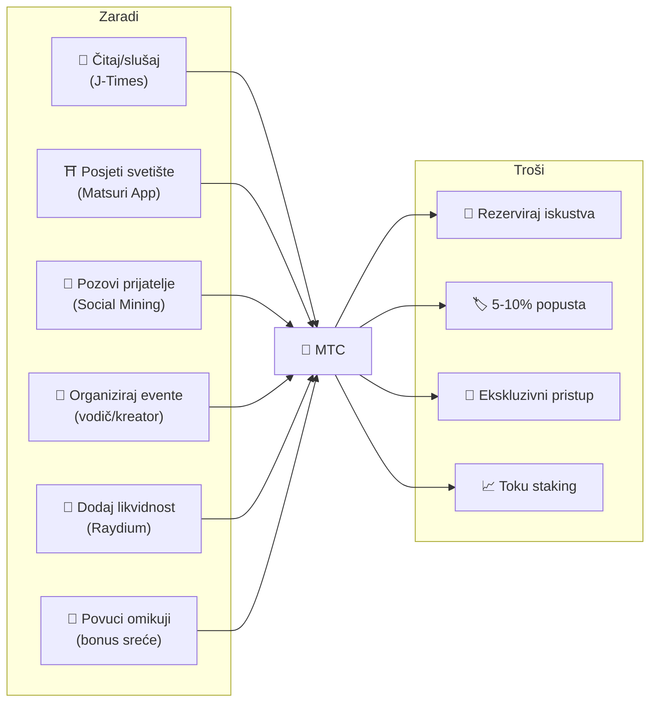
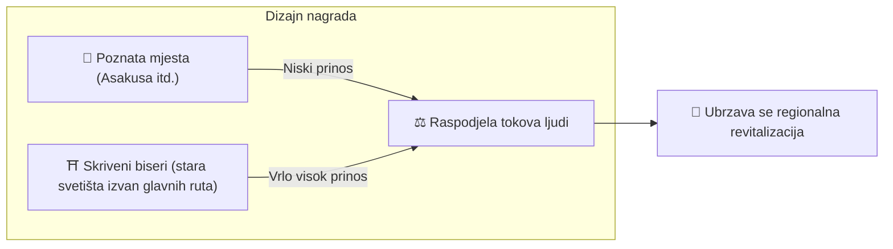
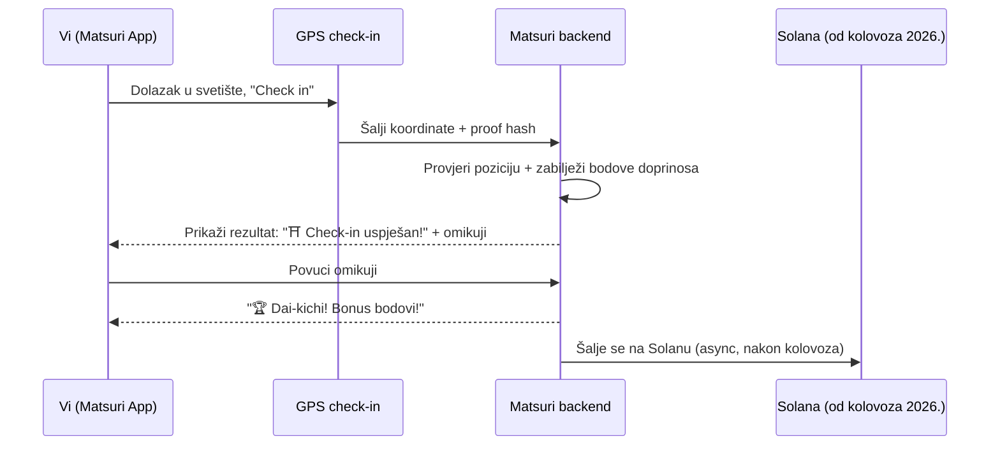
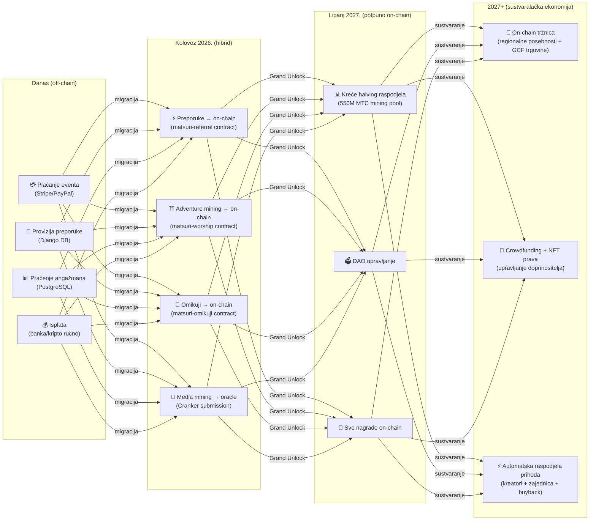

import useBaseUrl from '@docusaurus/useBaseUrl';

# ⛏️ Pet stupova mininga i kako zaraditi

> **Vaše sudjelovanje u kulturi izravno se pretvara u vrijednost.**
> Čitajte, hodajte, povezujte se, stvarajte, podržavajte — svaka pojedinačna radnja stvara MTC.

<small>*※ Što je "mining"? Kod Bitcoina i sličnih, miningom se naziva kad računalo obavlja golema izračunavanja i kao nagradu dobiva nove kovanice. Kod MTC-a nisu izračuni računala, nego **vaši vlastiti postupci** — čitanje članka, posjet svetištu, organiziranje eventa — ono što čini "mining". Umjesto da se kopa zlatna žila, sudjelovanje u kulturi iznjedri MTC. To je naš "mining".*</small>

> Zarađujte djelovanjem. Trošite na iskustva. Držite i rastite.

MTC nije spekulativni token. Sve radnje stvaraju i crpe vrijednost u realnoj ekonomiji. Web aplikacija i admin ploča **već su u pogonu**. Trenutačno se bodovi doprinosa bilježe off-chain (Django), a od kolovoza 2026. postupno se sele on-chain.

:::tip Velika slika
MTC ima **potpuno cirkularnu ekonomiju**: zarađujete stvarnom aktivnošću, trošite na stvarna iskustva, a vrijednost raste s ekosustavom. Na ovoj stranici ulazimo u mehaniku.
:::

---

## Životni ciklus MTC-a

---

## Pet stupova mininga

### 1. 📖 Media Mining (zaradi čitajući, slušajući, odgovarajući)

**Integrirano sa službenim medijem „J-Times"**

Znanje dramatično podiže kvalitetu putovanja. Otvorite **J-Times aplikaciju** i uživajte u sadržaju o japanskoj kulturi. Uz čitanje i slušanje, nagrađuju se i **provjere razumijevanja (kvizovi)**. Za svaku dovršenu radnju MTC se dodjeljuje automatski.

| Radnja | Uvjet završetka | Približna nagrada |
| :--- | :--- | :---: |
| **📰 Pročitaj članak** | Scrollaj do 75% | 2–30 MTC |
| **🎧 Odslušaj podcast** | Poslušaj do kraja | 2–30 MTC |
| **🎬 Pogledaj video** | Zatvori prikaz detalja nakon gledanja | 2–30 MTC |
| **📤 Podijeli sadržaj** | Otvori share sheet | 2–30 MTC |
| **✅ Odgovori na kviz** | Prođi provjeru razumijevanja | 2–30 MTC |

<small>*※ Nagrada ovisi o vrsti sadržaja, duljini i ravnoteži ponude u cijelom ekosustavu*</small>

:::tip Praznine u danu postaju mining
Vrijeme u prijevozu i pauze pretvaraju se u vrijeme koje donosi nagradu.
:::

:::info Offline podrška
Nema interneta u svetištu na selu? Nema problema. J-Times logira aktivnost lokalno i **automatski se sinkronizira kad se vratite online** (offline red čuva se 7 dana). Nećete izgubiti zarađeni MTC.
:::

**Ispod haube:**
1. J-Times aplikacija registrira vašu radnju (pročitano, pogledano, podijeljeno itd.)
2. Logira lokalno, i offline (čuva 7 dana)
3. Šalje na server i validira kad se mreža vrati
4. Odražava se kao bodovi doprinosa u saldu
5. Od kolovoza 2026.: validirani bod zapisuje se on-chain preko oraklea i može se provjeriti na blockchainu

---

### 2. ⛩️ Adventure Mining (zaradi hodajući)

**Projekt „Junrei (hodočašće)" ── pametni ugovor gotov, mainnet deploy kolovoz 2026.**

Funkcija sljedeće generacije koja koristi GPS i token poticaje za upravljanje fizičkim tokovima ljudi. Karta svetih mjesta **već radi u Matsuri web aplikaciji**. Bodovi doprinosa trenutačno se bilježe off-chain, a on-chain isplate kreću nakon deploya pametnog ugovora u kolovozu 2026.

>**Zarađuje se više, pa se ide u unutrašnjost**
> Ta ekonomska logika rješava preturizam i ubrzava regionalni procvat.

**Kako funkcionira check-in:**

  
  

    
<strong>Worship Mining</strong> — prijavite se blizu svetišta, otkrijte energiju AR kamerom, izvucite omikuji za MTC bonus. Multiplikatori od 1.0× do 10.0×.

  

**Osnovno načelo — manje posjećena mjesta daju više:**

| Vrsta mjesta | Primjer | Približna nagrada (po check-inu) |
| :--- | :--- | :---: |
| 🏙️ **Glavna** | Senso-ji, Kiyomizu-dera, Fushimi Inari | 30–50 MTC |
| 🌆 **Regionalna jezgra** | Ichinomiya svake prefekture, velika regionalna svetišta | 50–100 MTC |
| 🏞️ **Lokalno** | Povijesna svetišta u unutrašnjosti | 100–150 MTC |
| ⛰️ **Frontier** | Planinski hramovi, sveta mjesta na udaljenim otocima | 150–200 MTC |

<small>*※ Gore navedene vrijednosti okvirne su osnovne nagrade. Omikuji multiplikator može ih povećati i nekoliko puta*</small>

**Dodatni faktori boda:**
- **Omikuji multiplikator** — nasumični bonus po check-inu. Dai-kichi višestruko uvećava nagradu
- **Učestalost posjeta** — redoviti posjetitelji s vremenom zarađuju više
- **Sponzorirane lokacije** — općine mogu boostati određena mjesta

:::info Bodovi doprinosa → MTC
Vaša aktivnost akumulira se kao **bodovi doprinosa**. Na svakoj halving epohi (kreće lipanj 2027.) bodovi se pretvaraju u MTC iz 550M mining poola. Što više doprinosite zajednici, više MTC-a dobivate. Točni koeficijenti boostova utvrđuju se postupno i implementiraju u pametne ugovore — jamstvo pravedne raspodjele u skladu sa stvarnom veličinom poola.
:::

---

### 3. 🤝 Social Mining (zaradi povezujući)

Zaradite MTC već samim pozivanjem prijatelja.

#### Preporuke za obične korisnike

Jednostavno: kada se prijatelj registrira preko vaše preporučne poveznice, dobivate **300 MTC po izravnoj preporuci**.

| Uvjet | Nagrada |
| :--- | :--- |
| Prijatelj kojeg preporučite se registrira | **300 MTC** |

To je sve. Nema višerazinskih nagrada.

#### Preporuke za GCF agente

[GCF članovi](/docs/gcf) djeluju kao **službeni agenti** za širenje ekosustava i imaju dublju strukturu nagrada.

| Sloj | Odnos | Provizija |
| :---: | :--- | :---: |
| **L1** | Izravna preporuka | **20%** |
| **L2** | Preporuka preporuke | **5%** |
| **L3** | 3. razina | **5%** |
| **L4** | 4. razina | **5%** |

:::note O GCF agentskom sustavu
Višerazinska struktura vrijedi samo za službene agente s GCF članstvom (na poziv). Obični korisnici dobivaju samo izravnu preporuku (300 MTC).
Provizije GCF agenata izračunavaju se iz **stvarne ekonomske aktivnosti** (kupnja iskustava, sudjelovanje u eventima itd.) preporučenih korisnika. Samo okupljanje ljudi bez aktivnosti ne donosi nagradu.
:::

**Kako rade En-Mining bodovi (za GCF agente):**

Bodovi doprinosa izračunavaju se iz dvije komponente:
- **Širina mreže** (30%) — koliko ste ljudi doveli
- **Ekonomska aktivnost** (70%) — stvarne kupnje u preporučnoj mreži

Bodovi se akumuliraju s vremenom i pretvaraju u MTC svake halving epohe.

#### GCF administracijska ploča ── web inačica u pogonu

GCF članovi dobivaju pristup posvećenoj administracijskoj ploči.

| Funkcija | Što možete |
| :--- | :--- |
| **🎪 Eventi** | Osmislite i objavite vlastite evente i ture |
| **📢 Sadržaj** | Objavljujte i širite J-Times članke i sadržaj |
| **📊 Praćenje preporuka** | Pratite aktivnost preporučenih korisnika i prihode u stvarnom vremenu |

:::warning Trenutačno off-chain → od kolovoza 2026. on-chain
Provizije za preporuke trenutno se prate u Djangu (PostgreSQL) i isplaćuju bankovnim transferom ili kriptom. Od **kolovoza 2026.** sele se u **Matsuri Referral pametni ugovor** na Solani, pa isplate postaju on-chain provjerljive.
:::

  

*Druženje zajednice u Golden Gaiu ── povezanost kao rudarska snaga.*

---

### 4. 🎓 Creator & Guide Mining (zaradi stvarajući)

Ne morate samo trošiti sadržaj – na Matsuri platformi **svatko** može proizvoditi i zarađivati na vlastitom sadržaju. Ako ste GCF član, vodič ili kreator, zaraditi možete na ove načine.

| Aktivnost | Izvor prihoda |
| :--- | :--- |
| **🗺️ Vodi ture** | Vodička provizija (postavlja se po eventu) + napojnice |
| **🎫 Prodaj ulaznice za evente** | Udio u prihodu putem EventPurchase |
| **📚 Objavi tečajeve** | Naknada po upisu (udio kreatora) |
| **🎙️ Producira podcast epizode** | Pretplatnički prihod |
| **🤝 Pokreni crowdfunding** | On-chain praćenje doprinosa na Solani |
| **🛍️ Otvori korisničku trgovinu** | Izravna prodaja rukotvorina/mercha |

**Sustav napojnica:** nakon eventa gosti mogu poslati napojnicu vodiču (Uber stil). Napojnice se procesuiraju preko Stripea i prate u javnom leaderboardu.

:::tip Proizvodnja uz AI
Domaćini eventa mogu koristiti **ugrađenog AI asistenta (GPT-4 Turbo)** za pisanje opisa eventa, automatski prijevod na pet jezika i generiranje SEO-optimiziranih metapodataka — sve iz admin ploče.
:::

---

### 5. 🏦 Mining likvidnosti (zaradi deponiranjem)

>**Budite si vlastita banka.**

Osigurajte likvidnost MTC/SOL para na Raydium DEX-u i podržite trgovinsku osnovu ekosustava u ranoj fazi. Rani dobavljači likvidnosti dobivaju poseban program nagrada "osnivački partneri".

| Stavka | Detalji |
| :--- | :--- |
| **Tko** | Svi koji drže MTC i SOL |
| **Ciljani APY** | **20%** (početni poticaj likvidnosti kao premija rizika) |
| **DEX** | Raydium (Solana) |
| **Svrha** | Osigurati likvidnost u ranoj fazi i stabilno tržišno okruženje |

---

## 🎲 Omikuji bonus

Svaki adventure mining check-in uključuje besplatni omikuji. Pametni ugovor u obliku omikujija izvršava se **besplatno (samo gas)** po dovršetku check-ina.

| Sreća | Multiplikator nagrade | Dodatni bonus |
| :--- | :---: | :--- |
| 🏆 **Dai-kichi** | Osnovna × maksimalni | Goshuin NFT |
| ✨ **Kichi** | Osnovna × visoki | — |
| 🌸 **Shō-kichi** | Osnovna × mali | — |
| 🍃 **Sue-kichi** | Osnovna × 1,0 | — |
| 💀 **Kyō** | Osnovna × 1,0 | — |

Vjerojatnosti i multiplikatori podesivi su iz GCF admin ploče i njima se upravlja prema ravnoteži ponude MTC-a u cijelom ekosustavu. Ishod određuje **commit-reveal protokol otporan na manipulaciju na Solani** — nakon commit faze nitko ne može promijeniti rezultat.

<small>*※ I ako vam padne kyō, dobivate osnovnu nagradu. Sama radnja prijave nagrađuje se*</small>

:::note Ovo nije kockanje
Novac se ne ulaže. Riječ je o nasumičnom bonusu za **radnju „posjetio sam mjesto"**. Skupljanjem određenih NFT-ova možete otključati pristup posebnim eventima.
:::

---

## Kako koristiti MTC

| Uporaba | Prednost | Status |
| :--- | :--- | :---: |
| **🎫 Rezerviraj iskustva** | Plati ture, evente i kulturne aktivnosti MTC-om | ✅ Dostupno |
| **🏷️ Popust** | 5–10% popust na cijenu u jenima kod plaćanja MTC-om | ✅ Dostupno |
| **🔑 Ekskluzivni pristup** | NFT-gated eventi, VIP rituali, privatne ture | ✅ Dostupno |
| **📈 Toku staking** | Zaključaj MTC i pojačaj bodove doprinosa (boost do oko 50%) | 🔜 Kolovoz 2026. |
| **🗳️ DAO upravljanje** | Glasaj o treasuryju, nadogradnjama protokola, certifikaciji mjesta | 🔜 2027. |
| **🛍️ Partnerske trgovine** | Plaćaj u partnerskim trgovinama i restoranima | 🔜 U širenju |

:::info MTC kao sredstvo plaćanja
U Matsuri aplikaciji MTC je prvoklasno sredstvo plaćanja, ravnopravno s kreditnim karticama i Solana Payom. Nema konverzije — odaberite „Plati MTC-om" na blagajni i iznos se odmah skida sa salda.
:::

### O zamjeni MTC-a

:::warning Važno: ne nudimo zamjenu ni mjenjačnicu MTC-a
Matsuri nije registriran za usluge zamjene kripta, stoga **uopće ne vršimo izravnu zamjenu MTC-a za fiat (¥, $ itd.)**.

Ako želite zamijeniti MTC za drugu kriptu ili fiat, to sami radite ovako:
1. Upravljajte MTC-om u Solana-kompatibilnom walletu poput **Phantom Walleta**
2. Zamijenite MTC → SOL na **Raydiumu (DEX)**
3. Zamijenite SOL za fiat na kripto burzi (CEX)

U budućnosti razmatramo i listanje na CEX-ovima (centralizirane burze), što će olakšati zamjenu.
:::

---

## Primjer: dan u MTC ekonomiji

> **Jutro:** pročitate 3 članka na J-Timesu u vlaku → zaradite MTC.
> **Poslijepodne:** posjetite lokalno svetište u Matsuri aplikaciji → check in, povučete „kichi" (×1,5) → zaradite još više MTC-a.
> **Večer:** rezervirate kulturnu turu kroz Shinjuku Golden Gai za ¥9 000 s 10% MTC popusta (platite ¥8 100).
> **Rezultat:** vaša kulturna znatiželja pretvorila se u pravo iskustvo, a vodič, svetište i zajednica primili su uplatu izravno. Nijedan OTA nije uzeo 20% naknade.

---

## Održivost ekonomije

:::warning Što kad se mining pool isprazni?
Halving pool od 550M MTC dizajniran je da traje **desetljećima**. Budući da se emisija prepolovljuje svake dvije godine, matematički nikad ne doseže 100%, a nagrade traju dugo (više u [Tokenomici](/docs/tokenomics)). I kad emisija postane vrlo mala:

- **Transakcijske naknade** i dalje nagrađuju sudionike mreže iz on-chain aktivnosti
- **Buyback protokol** (20-25% poslovnog prihoda) stvara stalan pritisak kupnje
- **Toku staking** zaključava cirkulirajuću ponudu i smanjuje pritisak prodaje
- **Stvarni poslovni prihodi** (eventi, članstva, tečajevi) podupiru ekosustav neovisno o emisiji tokena

MTC je podržan **realnom ekonomijom** — a ne samo emisijom tokena.
:::

---

## Roadmap migracije on-chain

Matsuri ekonomija postupno se seli s off-chaina (Django/PostgreSQL) na on-chain (Solana pametni ugovori). Ta migracija čini sve operacije **trustless, auditabilnima, bez dopuštenja**.

| Faza | Vremenski okvir | Što ide on-chain |
| :--- | :--- | :--- |
| **Faza 1 (sada)** | U pogonu | MTC token (SPL), Raydium LP, Solana Pay verifikacija |
| **Faza 2 (kolovoz 2026.)** | Pametni ugovori se deployaju na mainnet | Provizije preporuka, nagrade za adventure mining, omikuji loterija, media mining preko oraklea |
| **Faza 3 (lipanj 2027.)** | Grand Unlock | Halving raspodjela 550M MTC, DAO upravljanje, potpuna decentralizacija |
| **Faza 4 (2027+)** | Sustvaralačka ekonomija | On-chain tržnica (regionalne posebnosti + GCF trgovine), crowdfunding s NFT pravima, automatska raspodjela prihoda kreatorima + zajednici + buybacku |

:::warning Zašto ne sve odmah on-chain?
**Dok se ne završi sigurnosni audit, ne aktiviramo on-chain funkcije u kojima se kreće novac korisnika.** To je naše načelo.

Trenutačna situacija:
- **Rizik sredstava korisnika: nema ga** — sve nagrade i bodovi sada su off-chain (Django); ne rade funkcije koje premještaju sredstva korisnika putem pametnih ugovora
- **Plan audita: Q2–Q3 2026.** — nakon profesionalnog sigurnosnog audita ugovori se postupno deployaju na mainnet
- **Dovršen audit preduvjet je za deploy** — neauditirane pametne ugovore nikad ne aktiviramo na mainnetu

Off-chain nagrade također su provjerljive — sve transakcije sadrže `solana_signature` kao dokaz plaćanja.
:::

---

**[▶ Sljedeće: Tokenomika](/docs/tokenomics)** ｜ **[◀ Prethodno: Ekosustav](/docs/ecosystem)**
