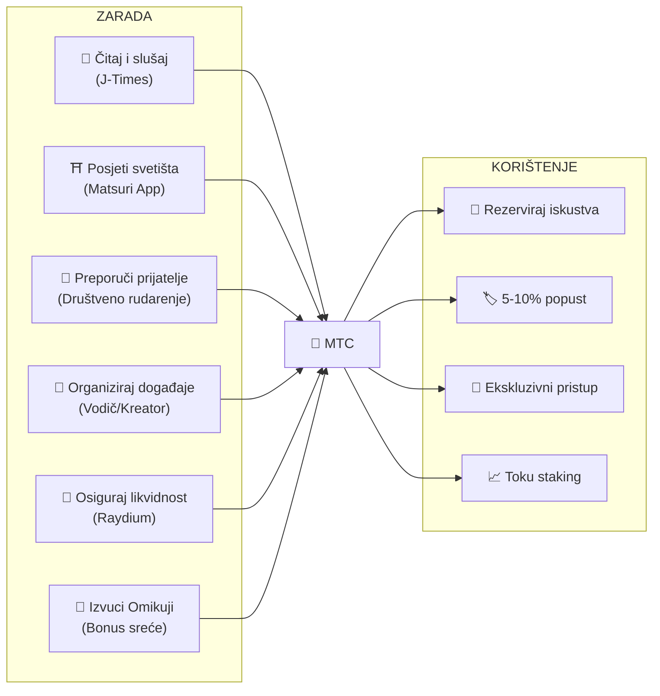
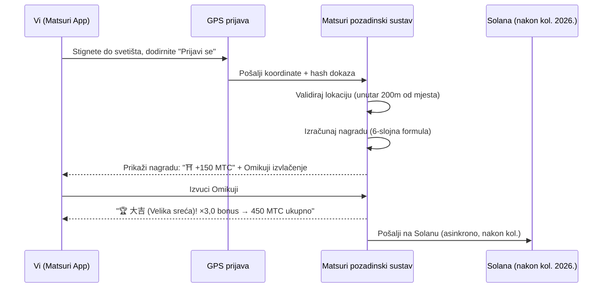
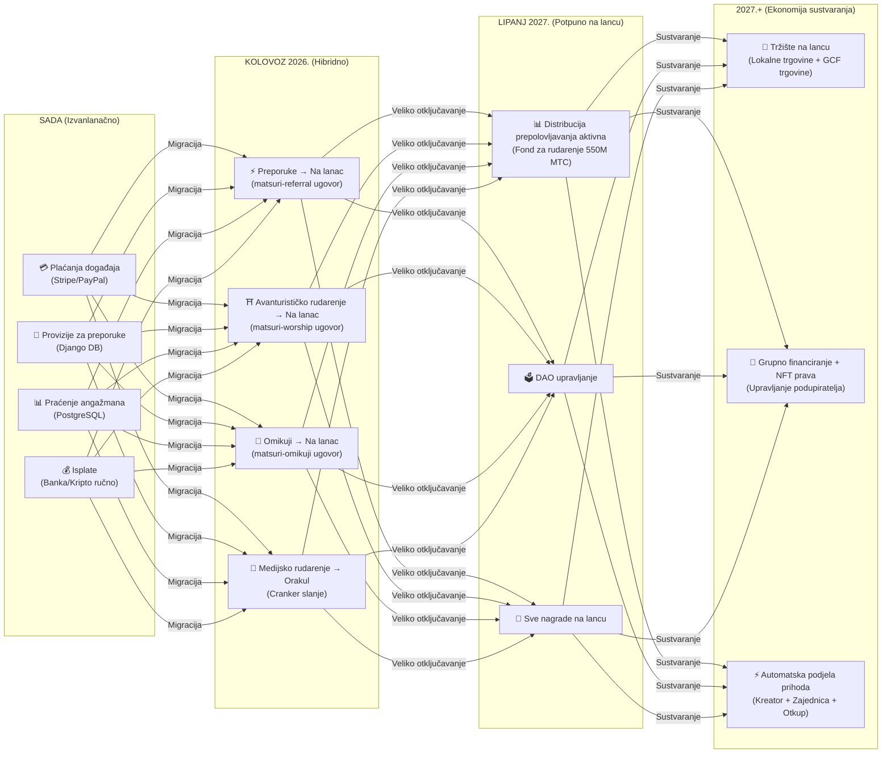

# 💎 Kako zaraditi i koristiti MTC

> **Zaradite akcijom. Potrošite na iskustvo. Držite za rast.**
> MTC nije samo špekulativni token — teče kroz stvarnu ekonomiju gdje svaka akcija stvara i hvata vrijednost.

:::tip Šira slika
MTC ima **potpunu cirkularnu ekonomiju**: zarađujete ga stvarnim aktivnostima, trošite na stvarna iskustva, a njegova vrijednost raste kako se ekosustav širi. Ova stranica pokazuje točno kako.
:::

---

## Životni ciklus MTC-a



---

## Kako zaraditi MTC

### 1. 📖 Medijsko rudarenje — Čitajte, slušajte i gledajte na J-Times

Otvorite **J-Times aplikaciju** i konzumirajte sadržaj o japanskoj kulturi. Svaka završena akcija automatski zarađuje MTC.

| Akcija | Kriterij završetka | Nagrada |
| :--- | :--- | :---: |
| **Pročitajte članak** | Pomaknite se do 75% dubine | MTC |
| **Slušajte podcast** | Reprodukcija do kraja | MTC |
| **Pogledajte video** | Napustite ekran detalja nakon gledanja | MTC |
| **Podijelite sadržaj** | Prikaz lista dijeljenja | MTC |
| **Riješite kviz** | Položite test razumijevanja | MTC (trenutno) |

:::info Podrška za izvanmrežni rad
Nema interneta kod ruralnog svetišta? Nema problema. J-Times bilježi vašu aktivnost lokalno i **automatski sinkronizira kad se vratite na mrežu** (izvanmrežni red s 7-dnevnim zadržavanjem). Nikad ne gubite zarađeni MTC.
:::

**Kako to funkcionira ispod haube:**
1. `EngagementTracker` u aplikaciji detektira događaje završetka
2. Akcije se stavljaju u lokalni red (čak i izvanmrežno)
3. Pri ponovnom uspostavljanju mreže, akcije se grupiraju i šalju Django API-ju
4. API validira i kreditira MTC na vaše stanje
5. Nakon kolovoza 2026.: akcije će se slati na lanac putem Cranker orakula

---

### 2. ⛩️ Avanturističko rudarenje — Posjetite sveta mjesta s Matsuri aplikacijom

Otvorite **Matsuri aplikaciju**, pronađite svetište ili hram na Karti svetih mjesta, odite tamo i prijavite se. Što manje posjećeno mjesto, to više zarađujete.

**Tijek korak po korak:**



**Množitelji nagrada — zašto ruralna područja plaćaju više:**

| Vrsta mjesta | Primjeri | Množitelj |
| :--- | :--- | :---: |
| 🏙️ **Glavna** | Sensoji, Kiyomizu-dera, Fushimi Inari | ×1 |
| 🌆 **Regionalna** | Prefekturalna ichinomiya, regionalna velika svetišta | ×2 |
| 🏞️ **Ruralna** | Povijesna seoska svetišta | ×5 |
| ⛰️ **Granična** | Planinski hramovi, sveta mjesta na udaljenim otocima | ×10 |

**Plus dodatni bonusi:**
- **Pionirski bonus** — prvi posjetitelj dana zarađuje najviše (harmonijski pad)
- **Bonus uzastopnosti** — posjećujte uzastopne dane za do +50%
- **Omikuji** — nasumično izvlačenje sudbine: 大吉 (Velika sreća) = ×3,0, 吉 (Sreća) = ×1,5, 小吉 (Mala sreća) = ×1,2
- **Sponzorirani signali** — općine polažu MTC za pojačanje određenih mjesta

> **Primjer:** Posjetite udaljeno planinsko svetište (×10) kao 2. posjetitelj dana, s uzastopnošću od 5 dana (+10%), i izvučete 吉 (Sreća) (×1,5) = osnovna nagrada pojačana **16,5×**.

---

### 3. 🤝 Društveno rudarenje — Preporučite prijatelje i izgradite svoju mrežu

Podijelite svoj kod za preporuku. Kad vaša mreža obavlja transakcije, zarađujete automatski.

| Sloj | Odnos | Provizija |
| :---: | :--- | :---: |
| **L1** | Vi → Prijatelj (izravno) | **20%** |
| **L2** | Prijatelj → Njihov prijatelj | **5%** |
| **L3** | 3. stupanj | **5%** |
| **L4** | 4. stupanj | **5%** |

**Kako En-Mining bodovanje funkcionira:**

```
Vaš rezultat = (Izravne preporuke × 30%) + (Obujam transakcija mreže × 70%)
           × Toku staking množitelj (1,0× – 10,0×)
           × Pojačanje titule (+5% po rangiranoj sezoni, maks. +50%)
```

> **Ključni uvid:** 70% vašeg rezultata dolazi od **stvarne ekonomske aktivnosti** u vašoj mreži, ne samo od registracija. Pozivanje 1.000 ljudi koji nikad ne potroše zarađuje manje od pozivanja 10 aktivnih potrošača.

:::warning Trenutno izvanlanačno → Prelazak na lanac kolovoz 2026.
Provizije za preporuke trenutno se prate u Djangu (PostgreSQL) i isplaćuju putem bankovne doznake ili kripta. Od **kolovoza 2026.**, cijeli sustav provizija za preporuke migrirat će na **Matsuri Referral pametni ugovor** na Solani — čineći isplate pouzdanima bez povjerenja, trenutnima i provjerljivima na lancu.
:::

---

### 4. 🎪 Rudarenje kreatora i vodiča — Organizirajte događaje, stvarajte sadržaj

Ako ste GCF član, vodič ili kreator sadržaja:

| Aktivnost | Kako zarađujete |
| :--- | :--- |
| **Vodite turu** | Provizija vodiča (postavljena po događaju) + napojnice |
| **Prodajte ulaznice za događaje** | Udio prihoda putem EventPurchase |
| **Objavite tečaj** | Naknada po upisu |
| **Stvarajte podcast epizode** | Prihod od pretplate |
| **Pokrenite kampanju grupnog financiranja** | Doprinosi temeljeni na Solani |

**Sustav napojnica:** Nakon svakog događaja, gosti mogu dati napojnicu vodičima (u stilu Ubera). Napojnice se obrađuju putem Stripea i prate se na javnoj rang-listi.

---

### 5. 🏦 Rudarenje likvidnošću — Osigurajte likvidnost na Raydium

Osigurajte MTC/SOL likvidnost na Raydium DEX-u i zarađujte nagrade.

| Stavka | Detalji |
| :--- | :--- |
| **Ciljani APY** | 50% (poticaj za ranu likvidnost) |
| **DEX** | Raydium (Solana) |
| **Tko** | Svatko tko drži MTC i SOL |

---

### 6. 🎲 Omikuji bonus — Množitelj sreće

Svaka prijava avanturističkog rudarenja uključuje besplatno Omikuji (sudbina) izvlačenje. Ovaj množitelj se primjenjuje povrh svih ostalih bonusa.

| Sudbina | Vjerojatnost | Množitelj |
| :--- | :---: | :---: |
| 🏆 **大吉** (Velika sreća) | 5% | ×3,0 |
| ✨ **吉** (Sreća) | 15% | ×1,5 |
| 🌸 **小吉** (Mala sreća) | 30% | ×1,2 |
| 🍃 **末吉** (Buduća sreća) | 35% | ×1,0 |
| 💀 **凶** (Nesreća) | 15% | ×1,0 |

Rezultat se određuje **protokolom urezivanja i otkrivanja otpornim na manipulaciju** na Solani. Čak ni poslužitelj ne može promijeniti vaš rezultat nakon faze urezivanja.

---

## Gdje potrošiti MTC

| Slučaj korištenja | Prednost | Dostupno |
| :--- | :--- | :---: |
| **🎫 Rezervirajte iskustva** | Plaćajte ture, događaje i kulturne aktivnosti s MTC-om | ✅ Sada |
| **🏷️ Popust** | 5–10% popusta u odnosu na cijene u jenima kad plaćate s MTC-om | ✅ Sada |
| **🔑 Ekskluzivni pristup** | NFT-zaštićeni događaji, VIP ceremonije, privatne ture | ✅ Sada |
| **📈 Toku staking** | Zaključajte MTC za pojačanje množitelja rudarenja (1,0× → 10,0×) | 🔜 Kol. 2026. |
| **🗳️ DAO upravljanje** | Glasajte o riznici, nadogradnjama protokola i certifikaciji mjesta | 🔜 2027. |
| **🛍️ Partnerske trgovine** | Plaćajte u sudjelujućim trgovinama i restoranima | 🔜 Širi se |

:::info MTC kao sredstvo plaćanja
U Matsuri aplikaciji, MTC je prvorazredni način plaćanja uz kreditne kartice i Solana Pay. Nije potrebna konverzija — odaberite "Plati s MTC-om" pri naplati i stanje se odmah odbija.
:::

### Primjer: Dan u MTC ekonomiji

> **Jutro:** Pročitajte 3 J-Times članka u vlaku → zaradite MTC.
> **Poslijepodne:** Posjetite ruralno svetište s Matsuri aplikacijom → prijavite se, izvucite 吉 (Sreća) (×1,5) → zaradite više MTC-a.
> **Večer:** Iskoristite zarađeni MTC za rezervaciju kulturne ture po Golden Gaiu od ¥9.000 s 10% popusta (platite ekvivalent od ¥8.100).
> **Rezultat:** Vaša kulturna znatiželja financirala je stvarno iskustvo — a vodič, svetište i zajednica svi su primili izravnu isplatu. Nijedan OTA nije uzeo 20% provizije.

### Ekonomska održivost

:::warning Što se događa kad se fond za rudarenje isprazni?
Fond od 550M MTC s prepolovljavanjem dizajniran je da traje **desetljećima** (20 epoha × 2 godine = 40 godina teoretski). No čak i nakon što se fond iscrpi:

- **Naknade za transakcije** od aktivnosti na lancu nastavljaju nagrađivati sudionike mreže
- **Protokol otkupa** (20–25% poslovnog prihoda) stvara trajni pritisak kupnje
- **Toku staking** zaključava cirkulirajuću ponudu, smanjujući pritisak prodaje
- **Stvarni poslovni prihod** (događaji, članstva, tečajevi) održava ekosustav neovisno o distribuciji tokena

MTC je podržan **stvarnom ekonomijom** — ne samo emisijama tokena.
:::

---

## Plan migracije na lanac

Matsuri ekonomija postupno se prebacuje s izvanlanačnog sustava (Django/PostgreSQL) na lanac (Solana pametni ugovori). Ova tranzicija čini sve operacije **pouzdanima bez povjerenja, provjerljivima i bez dozvola**.



| Faza | Vremenski okvir | Što prelazi na lanac |
| :--- | :--- | :--- |
| **Faza 1 (Sada)** | Aktivno | MTC token (SPL), Raydium LP, Solana Pay verifikacija |
| **Faza 2 (Kol. 2026.)** | Implementacija pametnih ugovora na mainnet | Provizije za preporuke, nagrade avanturističkog rudarenja, Omikuji izvlačenja, medijsko rudarenje putem orakula |
| **Faza 3 (Lip. 2027.)** | Veliko otključavanje | Distribucija prepolovljavanja 550M MTC, DAO upravljanje, potpuna decentralizacija |
| **Faza 4 (2027.+)** | Ekonomija sustvaranja | Tržište na lancu (lokalne trgovine + GCF trgovine), grupno financiranje s NFT pravima, automatska podjela prihoda kreatorima + zajednici + otkup |

:::warning Zašto nije sve na lancu danas?
Prebacivanje svega na lanac prije **profesionalne sigurnosne revizije** (planirane za Q2 2026.) bilo bi neodgovorno. Trenutni hibridni pristup omogućuje nam sigurno iteriranje dok se pripremamo za operacije na lancu bez potrebe za povjerenjem. Izvanlanačne nagrade su i dalje provjerljive — svaka transakcija ima `solana_signature` kao dokaz poravnanja.
:::

---

**[▶ Dalje: Mobilne aplikacije](/docs/mobile-apps)** ｜ **[◀ Prethodno: Ekosustav i rudarenje](/docs/ecosystem)**
