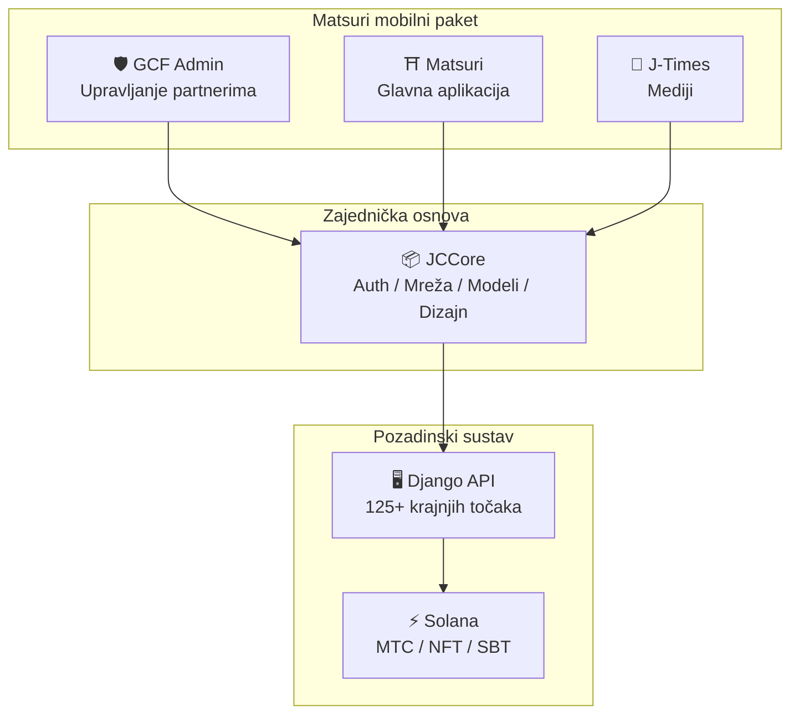
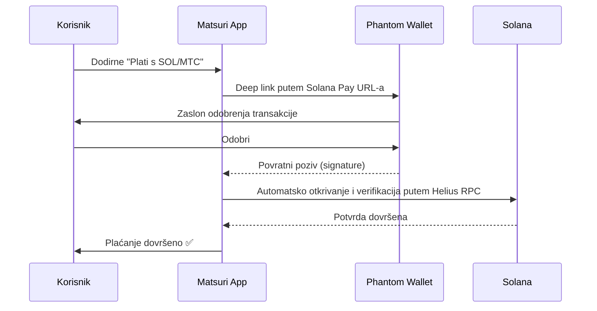
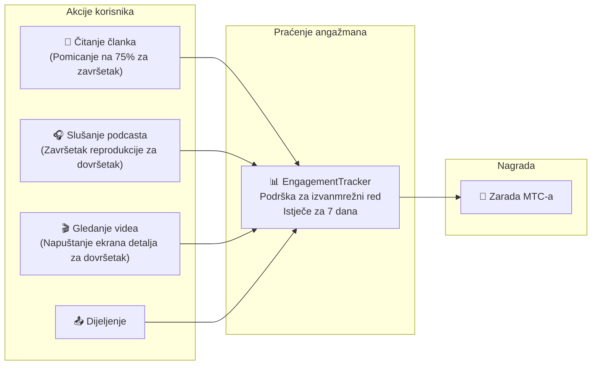
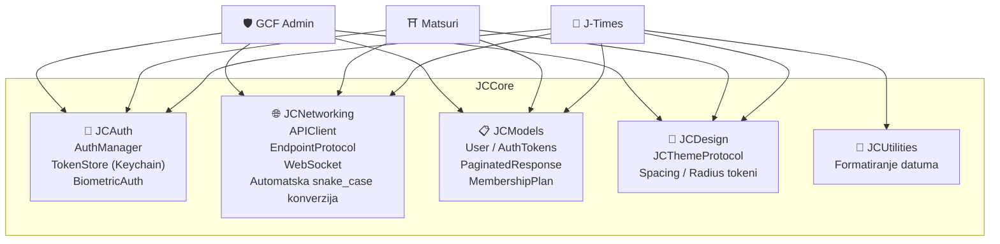

# 📱 Paket mobilnih aplikacija

> **Tri nativne iOS aplikacije pokrivaju svaki sloj Matsuri ekosustava.**
> U potpunosti izgrađene sa Swift 6 / iOS 17+. Ujedinjena autentikacija, umrežavanje i dizajn putem zajedničke **JCCore** biblioteke.

:::tip Zašto je ovo važno za investitore
Većina Web3 projekata ima web stranicu i whitepaper. Matsuri ima **3 produkcijske iOS aplikacije s 827+ automatiziranih testova**, zajedničku infrastrukturu i nativnu Solana integraciju. Ovo je rijetka dubina izvedbe u prostoru tokena.
:::

---

## Pregled aplikacija

| Aplikacija | Namjena | Status | Jezici |
| :--- | :--- | :---: | :--- |
| **GCF Admin** | Upravljanje partnerima i operacijama | ✅ Objavljena | 🇯🇵🇬🇧🇨🇳🇹🇭🇳🇴 |
| **Matsuri** | Aplikacija za krajnje korisnike | 🔜 Kraj travnja 2026. | 🇯🇵🇬🇧🇨🇳🇹🇭🇳🇴 |
| **J-Times** | Kulturni mediji i učenje | 🔜 Kraj travnja 2026. | 🇯🇵🇬🇧 |

---

## 1. 🛡️ GCF Admin — Aplikacija za upravljanje partnerima

:::info Status: Objavljena na App Storeu (v1.0)
Aplikacija za poslovnu administraciju namijenjena GCF (Global Community Friends) članovima. Sve funkcije web administratorskog sučelja objedinjene u mobilnoj aplikaciji.
:::

  
  
  

### Što možete raditi s ovom aplikacijom

| Kategorija | Funkcija |
| :--- | :--- |
| **📊 Nadzorna ploča** | KPI kartice, grafovi prodaje, brze akcije |
| **👥 Upravljanje članovima** | Popis, detalji, uređivanje, upravljanje stupnjevima |
| **💰 Upravljanje prihodima** | Praćenje provizija, upravljanje MTC isplatama, upravljanje isplatama |
| **📝 Upravljanje sadržajem** | Kreiranje, uređivanje i objava događaja, članaka, podcasta i videa |
| **🎫 Slotovi za vodiče** | Upravljanje mjestima vodiča, praćenje prihoda |
| **🖼️ NFT nadzorna ploča** | Founder's Collection, potvrda na lancu, NFT prijenos |
| **⛩️ Upravljanje svetim mjestima** | CRUD mjesta, postavljanje signala |
| **🎲 Postavke AR rudarenja** | Tablice vjerojatnosti Omikuji, upravljanje parametrima nagrada |
| **📊 Analitika** | Izvješća o pogreškama, analiza korištenja |
| **🔗 Preporuke** | Generiranje prilagođenih QR kodova, upravljanje programom preporuka |

### Tehničke specifikacije

| Stavka | Detalji |
| :--- | :--- |
| **Arhitektura** | Clean Architecture + MVVM + `@Observable` (iOS 17) |
| **Jezik / SDK** | Swift 6.0 / Xcode 16+ / iOS 17.0+ |
| **API integracija** | 125+ krajnjih točaka |
| **Testovi** | 226 testova / 45 testnih klasa |
| **Lokalizacija** | 5 jezika (JP, EN, ZH, TH, NO) / 957+ ključeva prijevoda |
| **Swift Concurrency** | Usklađenost sa Strict Concurrency / nula upozorenja pri izgradnji |

### QR kod integracija

GCF Admin omogućuje generiranje prilagođenih QR kodova s Matsuri logom. Višenamjenski za pozivnice na događaje, linkove preporuka, zahtjeve za plaćanje i još mnogo toga.

---

## 2. ⛩️ Matsuri — Glavna aplikacija

:::info Status: Planirana objava krajem travnja 2026. (v3.0)
Glavna aplikacija namijenjena svim korisnicima. Rezervacija događaja, plaćanje, Web3 novčanik, AR rudarenje — sve u jednoj aplikaciji.
:::

  
  
  

### Što možete raditi s ovom aplikacijom

| Kategorija | Funkcija |
| :--- | :--- |
| **🎪 Rezervacija događaja** | Pretraživanje, rezervacija, Stripe plaćanje, upravljanje QR ulaznicama |
| **💳 4 načina plaćanja** | Kreditna kartica / Spremljena kartica / MTC stanje / Kriptovaluta (SOL/MTC) |
| **👛 Web3 novčanik** | Prikaz MTC stanja, slanje i primanje, povijest transakcija |
| **🖼️ NFT galerija** | Popis posjedovanih NFT/SBT, potvrda na lancu |
| **🗺️ Karta svetih mjesta** | Kartografski prikaz svetišta i hramova, prijava |
| **🎲 AR rudarenje** | WebAR Omikuji iskustvo, zarađivanje MTC-a |
| **💬 Chat** | Razmjena poruka s kontekstualnim izbornikom |
| **⭐ Lista želja** | Spremanje omiljenih događaja i iskustava |
| **🔍 Napredna pretraga** | Podrška za glasovno pretraživanje |
| **🤝 Preporuke** | Sudjelovanje u programu preporuka, praćenje nagrada |
| **📊 GCF nadzorna ploča** | Pojednostavljeno sučelje za upravljanje za GCF članove |

### Phantom Wallet integracija — Kripto plaćanje bez unosa

> **Bez kopiranja adresa.** Phantom Wallet se automatski otvara, korisnik odobrava, i plaćanje je dovršeno. Potpisi transakcija automatski se otkrivaju putem Helius RPC — najglatkije kripto plaćanje na tržištu.

:::tip Zašto je ovo važno
Većina Web3 aplikacija prisiljava korisnike da kopiraju adrese novčanika, ručno unose iznose i čekaju potvrde. Matsuri Solana Pay integracija svodi to na **jedan dodir** — uspoređujući korisničko iskustvo s Apple Pay dok se poravnanje odvija na lancu.
:::

### Tehničke specifikacije

| Stavka | Detalji |
| :--- | :--- |
| **Arhitektura** | Clean Architecture + MVVM + Swift Concurrency |
| **Jezik / SDK** | Swift 6.0 / Xcode 16+ / iOS 17.0+ |
| **Plaćanje** | Stripe PaymentSheet + MTC Balance + Phantom (Solana Pay) |
| **API integracija** | 72 krajnje točke / 16 kategorija |
| **Testovi** | 230+ (Model, ViewModel, Network, Security, DeepLink, E2E) |
| **Lokalizacija** | 5 jezika (JP, EN, ZH, TH, NO) / 406 ključeva prijevoda |
| **Broj ViewModela** | 25 (potpuni MVVM — nula izravnih API poziva iz View-a) |
| **Autentikacija** | Apple Sign In / Google Sign In (PKCE) |

---

## 3. 📰 J-Times — Aplikacija za kulturne medije

:::info Status: Planirana objava krajem travnja 2026.
Medijska platforma koja prenosi dubine japanske kulture. Čitajte članke, slušajte podcaste, gledajte videa — svaka akcija zarađuje MTC.
:::

  

### Što možete raditi s ovom aplikacijom

| Kategorija | Funkcija |
| :--- | :--- |
| **📖 Članci** | Parallax hero, ukrašena prva slova, traka napretka čitanja, bogati sadržaj (Markdown, tablice, citati) |
| **🎧 Podcasti** | Pregledavanje serija, player s prikazom valova, tajmer za spavanje, AirPlay, kontrole na zaključanom zaslonu |
| **🎬 Videi** | Adaptivni grid/prikaz popisa, kratki videi (TikTok stil, dvostruki dodir) |
| **🔍 Pretraga** | Višestruki filteri, trending oznake, glasovno pretraživanje |
| **🧭 Otkrivanje** | Istaknuti karusel, urednički odabiri, popularno ovog tjedna |
| **📚 Knjižnica** | Favoriti, povijest (po datumu), preuzimanja, popisi za reprodukciju |
| **🎵 Audio player** | Mini player (kontrole potezom), puni player (valovi, tekstovi, ponavljanje) |
| **👤 Članstvo** | Usporedba funkcija 3 stupnja (Free / Premium / Pro), obnova kupnje |

### Medijsko rudarenje — Čitanje, slušanje i gledanje postaju rudarenje

> **Bilježi se čak i izvanmrežno.** Čak i ako čitate članak u planini bez signala, angažman se automatski šalje kad se vratite na mrežu i MTC se dodjeljuje.

### Sustav dizajna — Četiri stupa japanske estetike

J-Times koristi jedinstveni sustav dizajna koji prenosi tradicionalnu japansku estetiku u moderno korisničko sučelje.

| Stup | Koncept | Primjena u UI-ju |
| :--- | :--- | :--- |
| **墨 (Sumi)** | Topli neutralni sivi tonovi | Boje pozadine, hijerarhija teksta |
| **朱 (Shu)** | Japanska crvena (#C53030) | Naglasna boja, važne akcije |
| **間 (Ma)** | Razmak na mreži od 4pt | Razmaci, osjećaj disanja |
| **紙 (Kami)** | Suptilna tekstura, glass-morphism | Površine kartica, izraz dubine |

### Tehničke specifikacije

| Stavka | Detalji |
| :--- | :--- |
| **Arhitektura** | Clean Architecture + MVVM + Swift Concurrency |
| **Jezik / SDK** | Swift 6.0 / Xcode 16+ / iOS 17.0+ |
| **Vanjske ovisnosti** | **Nula** — samo Appleovi nativni okviri |
| **API integracija** | 40+ krajnjih točaka |
| **Testovi** | 371 test / 20 datoteka |
| **Lokalizacija** | 2 jezika (JP, EN) / 310+ ključeva prijevoda |
| **Izvanmrežna podrška** | ContentCache (50 MB) + ImageDiskCache (200 MB) + upravitelj preuzimanja |
| **Autentikacija** | Apple Sign In / Google Sign In (PKCE) |

---

## Zajednička osnova: JCCore biblioteka

Swift Package biblioteka koju dijele sve tri aplikacije.

| Modul | Uloga |
| :--- | :--- |
| **JCAuth** | Upravljanje tokenima temeljeno na Keychainu, biometrijska autentikacija (Face ID / Touch ID) |
| **JCNetworking** | Tipski siguran API klijent, WebSocket, automatska JSON snake_case konverzija |
| **JCModels** | Zajednički modeli podataka između aplikacija (User, AuthTokens, itd.) |
| **JCDesign** | Protokol teme, dizajnerski tokeni (razmaci, zaobljeni kutovi) |
| **JCUtilities** | Pomoćne funkcije za datume i stringove |

---

## Sigurnost i privatnost

| Stavka | Implementacija |
| :--- | :--- |
| **Autentikacijski tokeni** | Šifrirano pohranjeni u iOS Keychain (TokenStore) |
| **Biometrijska autentikacija** | Dvofaktorska autentikacija putem Face ID / Touch ID |
| **API komunikacija** | HTTPS + Certificate Pinning |
| **Privatni ključevi novčanika** | Privatni ključevi se ne pohranjuju u aplikaciji — delegirano na Phantom Wallet |
| **AR rudarenje** | Slike s kamere se ne šalju poslužitelju (VisionProof) |
| **Izvanmrežni podaci** | SwiftData šifriranje + automatski rok isteka |
| **Swift Concurrency** | Prevencija stanja utrke putem Actor izolacije |

---

## Kvaliteta razvoja

Ukupno **827+ automatiziranih testova** implementirano u 3 aplikacije.

| Aplikacija | Broj testova | Područje pokrivenosti |
| :--- | :---: | :--- |
| **GCF Admin** | 226 | Model, ViewModel, Repository, API, Lokalizacija, Navigacija |
| **Matsuri** | 230+ | Model, ViewModel, Network, Security, DeepLink, Regresija, Performanse, E2E |
| **J-Times** | 371 | Model, ViewModel, API, Repository, Navigacija, Lokalizacija, Sigurnost, Performanse |

---

**[▶ Dalje: Plan razvoja i tim](/docs/roadmap)** ｜ **[◀ Prethodno: Ekosustav i rudarenje](/docs/ecosystem)**
