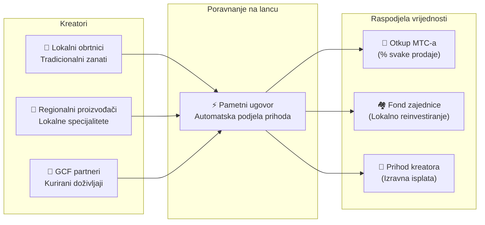

# 🗓️ Plan razvoja i upravljanje

> **Put prema sigurnosti.**
> Ovo nije kratkoročna špekulativna igra.
> **Razvoj osnovne platforme je već završen** — nalazimo se u fazi skaliranja.

---

## Strateške prekretnice

### 🔥 Faza 1: Buđenje (2026. H1 — Sada)

**Tema: Temelji i generiranje novčanog toka**

Proizvod je izgrađen. Fokus je sada na monetizaciji putem financijskog sustava koji vodi CEO i osiguravanju početne likvidnosti.

| Status | Prekretnica | Detalji |
| :---: | :--- | :--- |
| ✅ | **Lansiranje proizvoda** | Matsuri web aplikacija i GCF Admin nadzorna ploča aktivne |
| ✅ | **Plaćanja i rast** | 4 načina plaćanja (Stripe, PayPal, Solana Pay, MTC) + sustav preporuka |
| ✅ | **Lansiranje medija** | J-Times (Web i podcast) + tržište tečajeva aktivno |
| ✅ | **Geneza** | MTC Token Generation Event na Solani (ponuda od 900M, ovlasti opozvane) |
| ✅ | **Likvidnost** | Početni LP fond kreiran na Raydium |
| ✅ | **Mobilne aplikacije** | GCF Admin iOS aplikacija objavljena na App Storeu |
| ✅ | **Pozadinska infrastruktura** | 80+ modela, 100+ API-ja, 15+ automatiziranih zadataka, 841 test |
| ✅ | **Analitika** | Potpuno praćenje sesija, konverzijski lijevci, A/B testiranje |
| 🔜 | **Lansiranje mobilnih aplikacija** | Matsuri i J-Times iOS aplikacije (travanj 2026.) |
| ⬜ | **Program poticaja** | Pokretanje rudarenja likvidnošću s ciljanim APY od 20% |
| ⬜ | **Pokretanje sustava** | Solana MEV / arbitražni bot u produkciji |
| ⬜ | **VIP regrutiranje** | Odabir prvih 20 GCF VIP članova |

### 🚀 Faza 2: Ekspanzija (2026. H2)

**Tema: Stvarna imovina i avanturističko rudarenje**

Iskoristite završenu web aplikaciju za širenje fizičkih baza i značajke "Hodočašće".

| Status | Prekretnica | Detalji |
| :---: | :--- | :--- |
| ⬜ | **Objava značajke** | Avanturističko rudarenje (Hodočašće) uživo |
| ⬜ | **Globalna ekspanzija** | Partnerske baze i VIP događaji širom Azije (Tajland, Tajvan, itd.) |
| ⬜ | **Upravljanje imovinom** | Portfelj nekretnina, kapitala i kriptovaluta od poslovnog prihoda |
| ⬜ | **Cilj** | AUM ekosustava od **¥1 milijarde (~$6,5 M)** |

### 🌊 Faza 3: Cirkulacija (2027.+)

**Tema: Masovno usvajanje, ekonomija sustvaranja i decentralizacija**

Javno lansiranje, tržište na lancu i puni rad ekosustava.

| Status | Prekretnica | Detalji |
| :---: | :--- | :--- |
| ⬜ | **Svečano otvaranje** | Matsuri aplikacija dostupna diljem svijeta |
| ⬜ | **Veliko otključavanje (1. lip. 2027.)** | Otpuštanje zaključavanja osnivača + fond za rudarenje (550M MTC) aktivan + početak ciklusa prepolovljavanja |
| ⬜ | **Tržište sustvaranja** | Lokalne specijalizirane trgovine + GCF partnerske trgovine — poravnanje na lancu s automatskim otkupom MTC-a |
| ⬜ | **Grupno financiranje s NFT pravima** | Korisnici financiraju kulturne projekte na Solani. Podupiratelji dobivaju NFT-ove koji predstavljaju vlasništvo, udio u prihodima ili upravljačka prava nad financiranim projektom |
| ⬜ | **Poravnanje trgovina na lancu** | Sve transakcije na tržištu poravnavaju se putem pametnih ugovora — postotak svake prodaje automatski se slijeva u fond za otkup MTC-a |
| ⬜ | **Cilj** | AUM ekosustava od **¥10 milijardi (~$65 M)** |
| ⬜ | **DAO tranzicija** | Djelomični prijenos odlučivanja na GCF zajednicu |

#### 🏪 Vizija tržišta sustvaranja

Krajnji izraz "Kulturnog OS-a" — decentralizirano tržište gdje **kreatori kulture i ljubitelji kulture izravno trguju**, bez izrabljivačkih posrednika.

| Značajka | Opis | Status |
| :--- | :--- | :---: |
| **🏺 Lokalne specijalizirane trgovine** | Obrtnici i regionalni proizvođači prodaju izravno globalnoj publici. Plaćanje MTC-om = 5–10% popusta | ⬜ Vizija |
| **🎫 Grupno financiranje + NFT prava** | Financirajte kulturni projekt (obnova svetišta, oživljavanje festivala, obrtnička radionica). Primite NFT koji predstavlja vaš doprinos — s potencijalnim udjelom u prihodima ili upravljačkim pravima | ⬜ Vizija |
| **⚡ Poravnanje na lancu** | Svaka transakcija na tržištu poravnava se putem Solana pametnih ugovora. Prihod se automatski dijeli: isplata kreatoru + fond zajednice + otkup MTC-a — bez ručnog računovodstva | ⬜ Vizija |
| **🗳️ Upravljanje podupiratelja** | Vlasnici NFT-ova glasaju o tome kako financirani projekti raspodjeljuju resurse — pravo sustvaranje, ne samo donacija | ⬜ Vizija |

:::info Zašto je ovo važno
Danas turisti kupuju suvenire u trgovinama koje plaćaju najamninu platformskim vlasnicima. Sutra, **obrtnik u ruralnom Kyotu prodaje izravno obožavatelju u Kopenhagenu** — a postotak te prodaje automatski jača MTC ekonomiju. To je "zamašnjak" u svom najpotpunijem izrazu.
:::

---

## 👤 Tim

### Ko Takahashi — Osnivač / CEO i glavni arhitekt

  

| Stavka | Detalji |
| :--- | :--- |
| **Uloga** | Voditelj cijelog projekta. Dizajnira i gradi temeljni financijski algoritam (Solana MEV Bot) |
| **Vizija** | Tvorac kulturnog OS-a "Izvezi kulturu, uvezi bogatstvo" |
| **Etos** | Danju piše kod, noću vodi bar u Golden Gaiu — definicija "vlastite kože u igri" |

### Jon Anders Jensen — Suosnivač

| Stavka | Detalji |
| :--- | :--- |
| **Uloga** | Suosnivač i strateške operacije |
| **Baza** | Norveška / Japan |

### Ryunosuke Honda

| Stavka | Detalji |
| :--- | :--- |
| **Uloga** | Ključni član tima |

### 🌏 GCF zajednica — Globalni doprinositelji razvoju

Matsuri Protocol ne grade samo osnivači.
**GCF članovi diljem svijeta** doprinose testiranjem, povratnim informacijama, prevođenjem i regionalnom ekspanzijom.

| Domena | Tim |
| :--- | :--- |
| **💼 Globalne financije** | Mreže privatnih investitora širom Azije |
| **⚙️ Inženjering** | Distribuirani inženjerski ceh za blockchain i mobilni razvoj |
| **🏮 Operacije** | Duboki kanal s lokalnim zajednicama u Shinjuku Golden Gaiu i velikim turističkim čvorištima |
| **🌐 Zajednica** | Multinacionalni GCF članovi u Japanu, Norveškoj, Tajlandu, Tajvanu i šire |

:::tip Zajedno gradite infrastrukturu kulture
Pridružite se GCF-u i postanite surazvojnik Matsuri Protocola.
Doprinos nije samo pisanje koda — predstavljanje lokalnih svetih mjesta, prevođenje dokumentacije, organiziranje događaja — sve pomaže širenju ovog protokola u svijet.
:::

---

## 🏛️ Upravljanje (DAO)

Matsuri Protocol će postupno prijeći u **Decentraliziranu autonomnu organizaciju (DAO).**
GCF članovi (Platinum / Gold) imat će **pravo glasa** o ključnim odlukama:

| Glasovanje | Opseg |
| :--- | :--- |
| **💰 Raspodjela riznice** | Koje nove projekte ili marketinške inicijative financirati |
| **⚙️ Nadogradnje protokola** | Fino podešavanje naknada i krivulja nagrada za rudarenje |
| **⛩️ Kulturna certifikacija** | Koja svetkovina i svetišta certificirati kao "službena hodočasnička mjesta" i financirati |

:::info Pridružite se revoluciji
Ne gradimo samo aplikaciju.
Gradimo **kulturnu ekonomiju bez granica.**
:::

---

**[◀ Povratak na vrh Whitepapera](/docs/intro)** ｜ **[Pratite nas na X](https://x.com/matsuri_dao_jp)**
