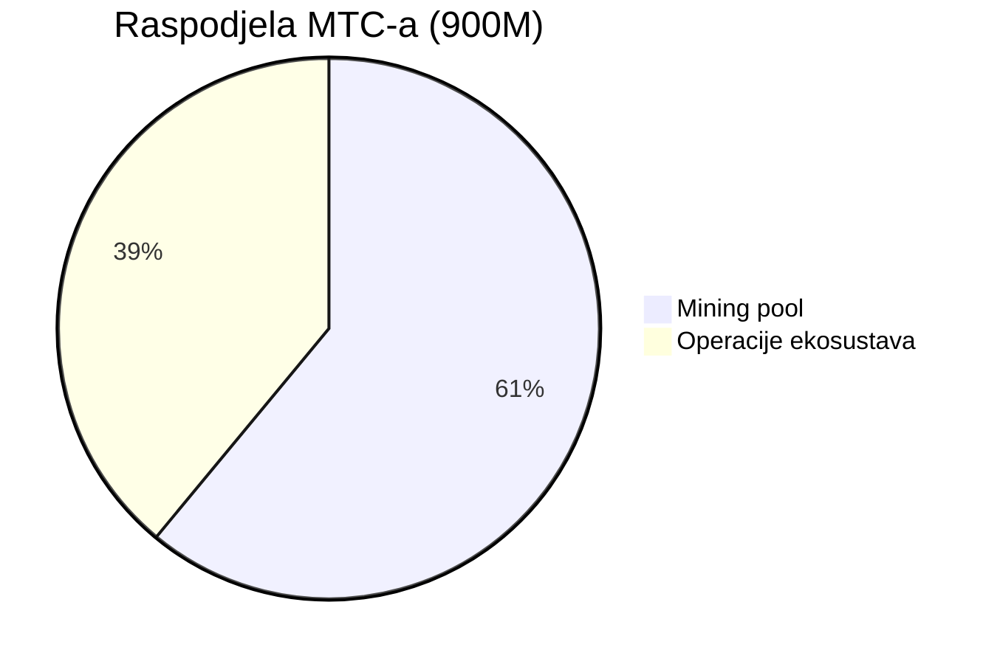
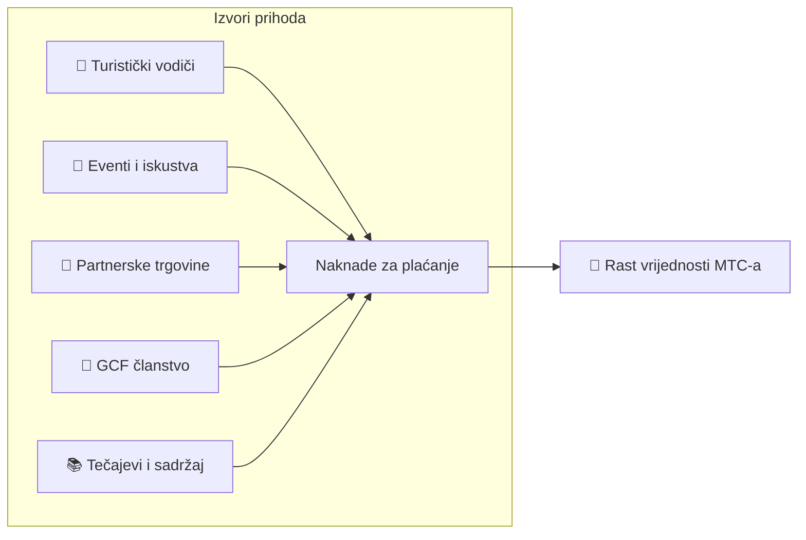

# 💰 Tokenomika — ekonomski dizajn MTC-a

> **Povjerenje je urezano u kod.**
> Ekonomski dizajn MTC-a nije obećanje čovjeka, nego jamstvo matematike i blockchaina.


> **„Ekonomija u kojoj sila ne može promijeniti status quo" — to je tokenomika MTC-a.**

Matsuri Coin (MTC) počiva na jednom uvjerenju:
**pravilo koje ne može mijenjati ni operativni tim najveće je jamstvo sigurnosti za investitora.**

Ponuda zaključana zauvijek. Nova emisija i zamrzavanje sredstava nemogući. Rast poslovanja odražava se u cijeni na razini formule —
to nije „obećanje", nego **činjenica** urezana u blockchain.

Na ovoj stranici u potpunosti objavljujemo ekonomski mehanizam MTC-a.

---

## Specifikacije tokena

Radi sigurnosti investitora trajno smo se **odrekli** „mint" ovlasti i „freeze" ovlasti na Solani.
Daljnja emisija MTC-a i zamrzavanje sredstava sada su nemogući. **Potpuno trustless.**

| Stavka | Detalji |
| :--- | :--- |
| **Naziv tokena** | Matsuri Coin |
| **Ticker** | MTC |
| **Lanac** | Solana |
| **Mint adresa** | `DRENpzmRWM4TwECrCPCfS1k5VBPmanhQg9bcCWP8EZXF` [Solscan →](https://solscan.io/token/DRENpzmRWM4TwECrCPCfS1k5VBPmanhQg9bcCWP8EZXF) |
| **Ukupna ponuda** | **900 milijuna** (900 000 000 MTC) fiksno |
| **Mint ovlast** | 🚫 Odreknuto ([provjerljivo on-chain](https://solscan.io/token/DRENpzmRWM4TwECrCPCfS1k5VBPmanhQg9bcCWP8EZXF)) |
| **Freeze ovlast** | 🚫 Odreknuto ([provjerljivo on-chain](https://solscan.io/token/DRENpzmRWM4TwECrCPCfS1k5VBPmanhQg9bcCWP8EZXF)) |
| **Upravljanje lock-om** | Streamflow Finance (verificirano) |

:::info Zašto je to važno
Odricanje mint ovlasti znači da „operativni tim ne može tiskati i razvodniti vaš udio". Odricanje freeze ovlasti znači da „nitko ne može zamrznuti vaš wallet". To je srž „trustlessa".
:::

---

## Raspodjela tokena

900M MTC dijeli se ovako.



| Kategorija | Udio | Kom. | Svrha |
| :--- | :---: | :--- | :--- |
| **⛏️ Mining pool** | **61%** | 550 milijuna | Pool nagrada za doprinositelje. Otključava se u lipnju 2027., prepolovljava se svake dvije godine. Raspodjela prema bodovima doprinosa |
| **🌐 Operacije ekosustava** | **39%** | 350 milijuna | Marketing, GCF distribucija, pogon, pool likvidnosti (LP), razvoj, oglašavanje, organizacija eventa itd. |

:::note O emisiji mining poola
550M MTC ne izdaje se odjednom. Po **halving rasporedu svake dvije godine** postupno se emitira i raspodjeljuje prema bodovima doprinosa. Pravila emisije i raspodjele postupno se implementiraju kao pametni ugovori u drugoj polovici 2026. i tada su on-chain provjerljiva.
:::

:::note O udjelu za operacije ekosustava
39% je višenamjenska riznica potrebna za rast ekosustava. Konkretne namjene uključuju marketing, početnu distribuciju GCF članovima, dodavanje u Raydium pool likvidnosti, nagrade razvojnom timu, oglašavanje, organizaciju kulturnih eventa itd. Transparentnost korištenja postat će predmet upravljanja zajednice nakon prelaska na DAO.
:::

---

## Struktura prihoda

Vrijednost MTC-a nosi **prihod iz stvarnog poslovanja**. Ne špekulacija – temelj je stvarna ekonomska aktivnost.



| Izvor prihoda | Sadržaj |
| :--- | :--- |
| **🏯 Iskustva i vodiči** | Naknade za plaćanje od turističkih vodiča i kulturnih iskustava |
| **🤝 GCF članstvo** | Članarine |
| **📚 Sadržaj** | Naknade za tečajeve, medijske pretplate |
| **🏪 Tržnica** | Naknade za transakcije iz partnerskih trgovina (postupno širenje) |

:::tip Rast podržan realnom potražnjom
Što više dolazi turista, to više strane valute ulazi, a ekosustav raste. Vrijednost MTC-a određuje ne špekulacija, nego **broj ljudi koji doživljavaju kulturu**.
:::

---

## Trenutačni poslovni rezultati

MTC ekonomija još je u ranoj fazi, ali stvarna aktivnost već je u tijeku.

| Pokazatelj | Rezultat |
| :--- | :--- |
| **Održani eventi** | 50+ (testno) |
| **GCF Platinum članovi** | 20 prijavljenih (od 50) |
| **GCF Gold članovi** | Upisi kreću sada |
| **Web platforma** | U pogonu. Okuplja testne korisnike i radi |
| **iOS aplikacija** | Razvoj završen, objava u travnju 2026. |

:::note Iskreno
Još nemamo „velike uspješne rezultate". 50 eventa i testni pogon — to je sadašnja realnost. Ali proizvod radi, zajednica postoji, i stojimo na pragu ozbiljne ekspanzije.
:::

---

## Buyback protokol

„Kad bude viška, operativni tim će ga staviti u džep" — to ne radimo.
Fiksni postotak poslovnog prihoda namijenjen je otkupu MTC-a s tržišta.

| Izvor prihoda | Postotak | Akcija |
| :--- | :---: | :--- |
| **Prihod Matsuri HQ-a** (vodiči, eventi) | **20%** | **Otkup** s tržišta i dodavanje u pool likvidnosti |
| **GCF članstvo** (članarine) | **25%** | **Otkup** s tržišta |

:::info Trenutačni status buybacka
Buyback protokol **kreće u rad** kako poslovni prihod postaje značajan. U početku se izvodi off-chain (ručno), a od druge polovice 2026. postupno prelazi na automatsku izvedbu pametnim ugovorom. Nakon migracije cijela se povijest može provjeriti na blockchainu.
:::

Buyback nije „jednom ćemo to učiniti". To je pravilo programirano kao protokol. Svaki put kad prihod poraste, MTC se automatski povlači s tržišta — **strukturna sigurnost** za investitore.

---

## Logika cijene

Mehanizam cijene MTC-a ne počiva na željama, nego na **matematici AMM formule (automated market maker)**.

```
Cijena = likvidnost (SOL) ÷ ponuda (MTC)
```

| Korak | Što se događa | Rezultat |
| :---: | :--- | :--- |
| **①** | Poslovni prihod (SOL) ubrizgava se u pool | **Brojnik raste** |
| **②** | Tim sredstvima otkupljuje MTC s tržišta i spaljuje ga | **Nazivnik pada** |
| **③** | Brojnik↑ × nazivnik↓ | **Uvjeti za rast rijetkosti su postavljeni** |

:::info Opis mehanizma, ne jamstvo cijene
Formula opisuje strukturu: „ako se poslovni prihod nastavi i buyback izvršava, ravnoteža ponude i potražnje pomiče se u smjeru rijetkosti". Stvarnu cijenu određuju mnogi čimbenici: ponuda i potražnja na tržištu, vanjsko okruženje, likvidnost itd.
:::

---

## Halving raspored

**550 milijuna MTC (oko 61% ukupne ponude)** koji se oslobađa 1. lipnja 2027. ne prodaje se na tržištu, nego se čuva kao **pool nagrada za doprinositelje**.

Koristimo **halving svake dvije godine** — brže od Bitcoinova četverogodišnjeg ciklusa.
Svake dvije godine količina emisije prepolovljuje se, a nagrade teorijski traju desetljećima.

| Razdoblje | Postotak | Količina | Kumulativno |
| :--- | :---: | :--- | :---: |
| **1. razdoblje** 2027. – 2029. | **50%** | oko 275M | 50% |
| **2. razdoblje** 2029. – 2031. | **25%** | oko 137M | 75% |
| **3. razdoblje** 2031. – 2033. | **12,5%** | oko 68M | 87,5% |
| **4. razdoblje** 2033. – 2035. | **6,25%** | oko 34M | 93,75% |
| **5. razdoblje i dalje** | Halving se nastavlja | Opada | → 100% asimptotski |

<small>*※ Matematički nikad ne doseže 100%, količina teži nuli. Isto načelo kao kod Bitcoina.*</small>

:::tip Što ranije doprinesete, to više MTC-a dobivate
Zbog halving mehanizma prvo razdoblje (2027.–2029.) najbogatije je MTC-om, a po svakoj epohi količina emisije pada. To znači **oni koji bodove doprinosa grade od početka dobivaju najviše MTC-a**.

Primjeri aktivnosti koje daju bodove doprinosa:
- Kreiranje eventa i broj privučenih korisnika
- Vođenje popularnih tura
- Regrutiranje i razvoj izvrsnih vodiča
- Pregledi i dijeljenje J-Times sadržaja
- Broj check-inova na svetim mjestima

Nagrada se ne određuje prema „redoslijedu upisa", nego prema **„koliko ste doprinijeli"**.
:::

---

:::note Sljedeća stranica
Kad razumijete ekonomski dizajn MTC-a, sljedeći je korak pogledati **kako sudjelovati kao partner**.
**[GCF članstvo →](/docs/gcf)**
:::
