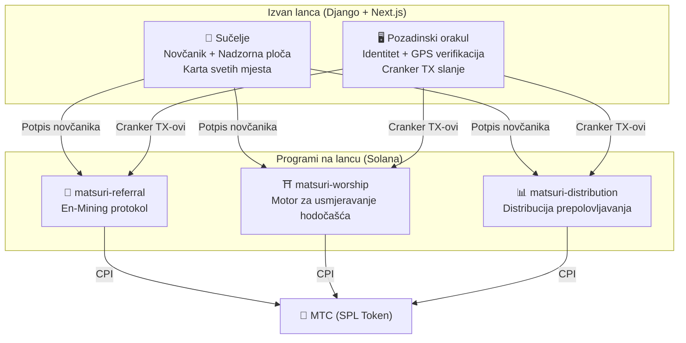
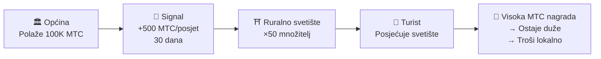
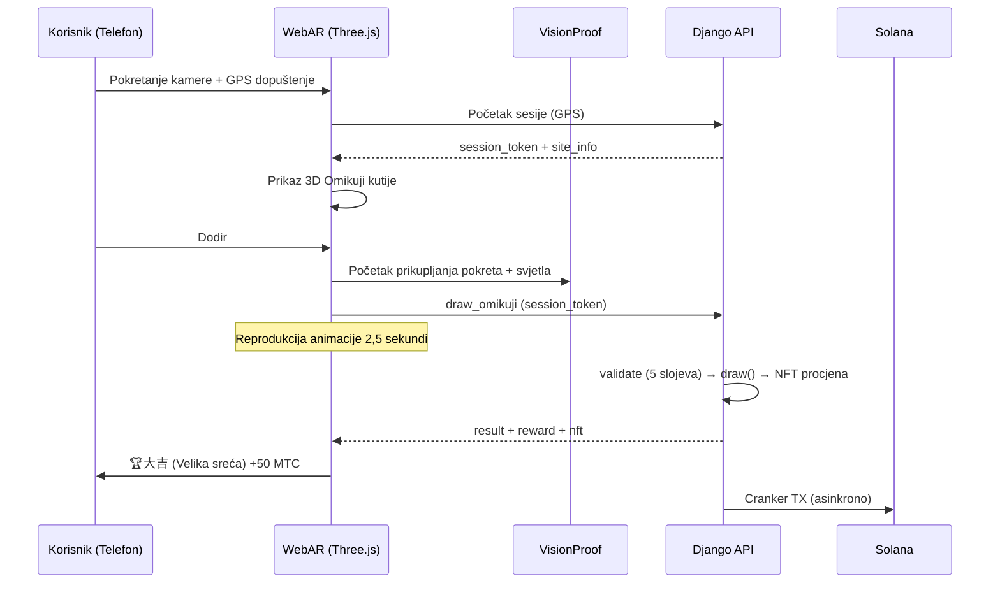
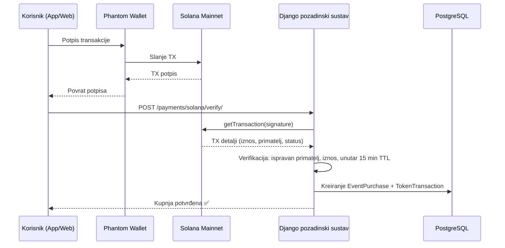

# ⚡ Pametni ugovori — Arhitektura otvorenog koda

> **Bez povjerenja po dizajnu.**
> Sva logika nagrada, stabla preporuka i rasporedi prepolovljavanja provode se **na lancu** putem provjerljivih Rust programa.
> Izvorni kod: [GitHub](https://github.com/Cootakahashi/matsuri-contracts)

| Specifikacija | Detalji |
| :--- | :--- |
| **Okvir** | Anchor 0.32.1 (Rust) |
| **Lanac** | Solana Mainnet-beta |
| **Programi** | 4 (Distribution, Referral, Worship, Omikuji) |
| **Izgradnja** | Optimizirano izdanje s LTO, provjere prekoračenja omogućene |
| **Matematika** | Čisti `math.rs` moduli — nula nuspojava, 128-bitni međurezultati |

---

## Pregled

Matsuri implementira **tri Anchor (Rust) programa** na Solani, od kojih svaki upravlja posebnim stupom ekosustava:



---

## 1. 📣 En-Mining (縁マイニング) protokol

**Namjena:** Hibridni motor rasta koji nagrađuje i *širinu* (doseg preporuka) i *dubinu* (ekonomski utjecaj). Ne samo affiliate sustav — potpuni protokol rudarenja gdje stvarna ekonomska aktivnost generira vrijednost na lancu.

### Dizajn bodovanja

Doprinos bodova temelji se na dvije ponderirane komponente:

| Komponenta | Težina | Namjena |
| :--- | :---: | :--- |
| **Širina** (broj preporuka) | 30% | Doseg mreže — koliko ljudi dovodite |
| **Dubina** (volumen poravnanja) | 70% | Ekonomski utjecaj — stvarne kupnje, ne samo registracije |

Bodovi se akumuliraju s vremenom i pretvaraju u MTC na svakoj epohi prepolovljavanja. Planirani su dodatni mehanizmi pojačanja:

| Pojačanje | Opis | Status |
| :--- | :--- | :---: |
| **Toku (徳) staking** | Zaključajte MTC za pojačanje vašeg doprinosa bodova (do ~50% pojačanja). Razine i točni množitelji bit će kalibrirani na temelju rasporeda otpuštanja fonda prepolovljavanja | ⬜ Koeficijenti TBD |
| **Sezonska rangiranja** | Najbolji izvođači svake epohe zarađuju titulu **Evangelist** (trajni SBT) i pojačanje bodova. Točni postoci bit će određeni putem upravljanja | ⬜ Koeficijenti TBD |

:::info Progresivni dizajn parametara
Koeficijenti pojačanja (razine stakinga, bonusi rangiranja) namjerno su ostavljeni prilagodljivima. Bit će finalizirani na temelju stvarnih podataka ekosustava — ukupnog broja aktivnih korisnika, stope otpuštanja fonda prepolovljavanja i ciljeva stabilnosti cijena — zatim zaključani u pametne ugovore. Ovaj pristup osigurava **pravednu distribuciju** bez pretjeranog obećavanja fiksnih povrata.
:::

### Obrana od Sybil napada (3 sloja)

| Sloj | Mehanizam | Gdje |
| :--- | :--- | :--- |
| **Identitetska provjera** | X/Twitter OAuth + SMS | Izvan lanca (Django) |
| **Provjera na lancu** | Samo profili s `is_verified = true` zarađuju | Pametni ugovor |
| **Težinsko bodovanje dubine** | 70% bodova = stvarna plaćanja → botovi ne zarađuju ništa | Motor bodovanja |

---

## 2. ⛩️ Motor za usmjeravanje hodočašća (巡礼分散エンジン)

**Namjena:** Svjetski prvi **ReFi protokol koji rješava pretjerani turizam koristeći ekonomiku tokena.** Posjetite sveta mjesta → zaradite MTC. No evo trika: *manje posjećena mjesta plaćaju eksponencijalno više.*

:::tip Ključni uvid
Ovo je "obrnuto dinamičko određivanje cijena u stilu Ubera" — pretrpana mjesta se kažnjavaju, granična mjesta se pojačavaju. Turisti se sami usmjeravaju prema manje posjećenim lokacijama jer **je to profitabilnije.**
:::

### Načela dizajna nagrada

Doprinos bodova za svaki posjet određen je višestrukim čimbenicima:

| Čimbenik | Načelo | Učinak |
| :--- | :--- | :--- |
| **Popularnost mjesta** | Manje posjećena mjesta zarađuju više bodova | Usmjerava turiste od pretrpanih područja |
| **Vrijeme posjeta** | Raniji posjetitelji dana zarađuju više bodova | Potiče posjete izvan vršnih sati |
| **Regionalna razina** | Ruralna i granična mjesta rangiraju se najviše | Potiče regionalnu revitalizaciju |
| **Učestalost posjeta** | Redoviti posjetitelji akumuliraju bonus bodove | Nagrađuje dosljedni angažman |
| **Omikuji sudbina** | Nasumično izvlačenje bonusa pri svakoj prijavi | Zabavni sloj gamifikacije |
| **Sponzorirana pojačanja** | Općine mogu pojačati određena mjesta | B2B/B2G model prihoda |

:::info Koeficijenti su prilagodljivi
Točni množitelji za svaki čimbenik (npr. koliko više ruralno mjesto zarađuje u odnosu na glavno mjesto) bit će **kalibrirani na temelju rasporeda fonda prepolovljavanja** i stvarnih podataka o korištenju, a zatim postupno zaključani u pametne ugovore. Načelo dizajna je fiksno — koeficijenti se razvijaju s ekosustavom.
:::

### Sponzorirani signali (B2B/B2G)

Općine, željezničke tvrtke i turistički uredi mogu **položiti MTC** za stvaranje vremenski ograničenih zona visoke nagrade na određenim mjestima.



> **B2B model prihoda:** Sponzori plaćaju MTC za usmjeravanje turista. Pritisak kupnje MTC-a → vrijednost tokena. Svi pobjeđuju.

---

## 3. 📊 Distribucija prepolovljavanja

**Namjena:** Fond od 550M MTC za rudarenje distribuira se kroz desetljeća putem **dvogodišnjeg ciklusa prepolovljavanja** — brže od Bitcoinovog četverogodišnjeg ciklusa.

### Raspored prepolovljavanja

```
Ukupni fond: 550.000.000 MTC

Epoha 0 (2027.–2029.):  275.000.000 MTC  (50%)
Epoha 1 (2029.–2031.):  137.500.000 MTC  (25%)
Epoha 2 (2031.–2033.):   68.750.000 MTC  (12,5%)
Epoha 3 (2033.–2035.):   34.375.000 MTC  (6,25%)
        ...              ...
∑ → 550.000.000 MTC (asimptotski ukupno)
```

### Formula individualne nagrade

```
vaša_nagrada = proračun_epohe × (vaš_rezultat / ukupni_rezultat)
```

Sva aritmetika koristi **128-bitnu međuračunicu** — matematički je nemoguće da dođe do prekoračenja.

### Izvori bodova učinka

| Aktivnost | Težina bodova |
| :--- | :--- |
| **Provedene sesije vodstva** | Visoka |
| **Prodaja ulaznica za događaje** | Visoka |
| **Aktivnost mreže preporuka** | Srednja |
| **Posjeti rudarenja hodočašćem** | Srednja |
| **Medijski angažman** | Niska |

:::info Napredovanje epohe bez dozvole
Instrukciju `advance_epoch` može pozvati **bilo tko** — administrator nije potreban. Sistemski sat određuje kada se epohe mijenjaju, osiguravajući rad bez potrebe za povjerenjem čak i ako tim nestane.
:::

---

## Matematički moduli (jezgra otvorenog koda)

Svi programi odvajaju matematiku bodovanja/nagrada u **čiste, provjerljive `math.rs` module** sa:

- **Nula nuspojava** — bez I/O, bez alokacija, bez vanjskih poziva
- **Dokumentirane formule** — LaTeX notacija u rustdoc-u
- **Analiza prekoračenja** — u128 međuvrijednosti s dokazanim granicama
- **Sveobuhvatni testovi** — rubni slučajevi, granični uvjeti, verifikacija omjera
- **Prilagodljivi koeficijenti** — parametri nagrada dizajnirani su za ažuriranje putem upravljanja, omogućujući postupnu kalibraciju kako ekosustav raste

---

## 4. 🎴 AR rudarenje — WebAR Omikuji rudarenje

**Namjena:** AR iskustvo temeljeno na pregledniku koje generira virtualnu Omikuji kutiju u stvarnom prostoru — rudarite MTC bez preuzimanja aplikacije. Svjetski prva WebAR × blockchain infrastruktura koja spaja šintoističku duhovnost s najsuvremenijom tehnologijom.

:::info Kako se ovo povezuje s mobilnim aplikacijama
Matsuri iOS aplikacija koristi Kartu svetih mjesta za GPS prijavu. Nakon prijave, **WebAR Omikuji** se otvara u pregledničkom sloju (Three.js) — nije potrebna posebna aplikacija. Rezultat se vraća u sustav nagrada Matsuri aplikacije. I nativno i web iskustvo rade zajedno besprijekorno.
:::

### Arhitektura



### Optimistično korisničko sučelje (nula čekanja)

| Korak | Vrijeme | Obrada |
|---------|------|------|
| Dodir → Početak animacije | 0 ms | Trenutna reprodukcija animacije na frontendu |
| API draw_omikuji | ~50 ms | Izvlačenje u Djangu + NFT procjena |
| Završetak animacije | 2500 ms | Rezultat već utvrđen → prikaz |
| Solana TX | ~400 ms | Slanje u pozadini |

### Postavke vjerojatnosti Omikuji (GCF Admin)

Basis Points (10000 = 100%) za preciznu kontrolu s korakom od 0,01%. Prilagodljivo putem GCF Admin sučelja.

| Razina | Rijetkost | Bonus | NFT |
|------|-----------|---------|-----|
| 🏆 大吉 | Rijetko | Najviši bonus | ✅ |
| ✨ 吉 | Neobično | Visoki bonus | Opcionalno |
| 🌸 小吉 | Uobičajeno | Mali bonus | — |
| 🍃 末吉 | Uobičajeno | Sudjelovanje zabilježeno | — |
| 💀 凶 | Neobično | Sudjelovanje zabilježeno | — |

Vjerojatnosti i koeficijenti nagrada bit će postupno utvrđeni na temelju veličine ekosustava i količine otpuštanja prepolovljavanja, te implementirani u pametne ugovore.

### ZK-Proof of Vision (5-slojna verifikacija)

Višeslojna eliminacija lažiranja GPS-a i replay napada. Slikovni podaci se ne šalju radi zaštite privatnosti.

| Sloj | Sadržaj verifikacije | Bodovi |
|-------|---------|------|
| Vremenski | Trajanje sesije 5-120 sekundi | /20 |
| Pokret | Varijanca žiroskopa 0,005-0,5 (prirodnost držanja rukom) | /20 |
| Svjetlo | Koherentnost ambijentnog svjetla × doba dana | /20 |
| HMAC | Verifikacija potpisa proof_hash | /20 |
| Otisak | Jedinstvenost uređaja | /20 |
| **Ukupno** | **Prag za prolaz** | **60/100** |

### Dizajn nagrada

Nagrade se bilježe kao **doprinos bodova** na temelju vrste mjesta, rezultata omikuji, regionalne razine i drugih čimbenika. Konkretni koeficijenti bit će postupno utvrđeni u skladu s rasporedom otpuštanja prepolovljavanja i rastom ekosustava, te implementirani u pametne ugovore.

---

## NFT / SBT kolekcija

Matsuri Protocol izdaje neprenosive **Soulbound tokene (SBT-ove)** i ograničene izdanja **NFT-ova** putem Metaplex Core na Solani.

<div style={{display: 'flex', gap: '1.5rem', justifyContent: 'center', alignItems: 'center', flexWrap: 'wrap', margin: '2rem 0'}}>
  
  
</div>

| Vrsta | Prenosivo | Namjena |
| :--- | :---: | :--- |
| **Founder NFT** | Ne (SBT) | Dokaz člana osnivača — trajno pojačanje bodova |
| **Evangelist NFT** | Ne (SBT) | Postignuće sezonskog rangiranja — pojačanje bodova |
| **Goshuin NFT** | Ne (SBT) | Dokaz prijave hodočašća — ekskluzivno za lokaciju |
| **Omikuji NFT** | Ne (SBT) | Dokaz sudbine 大吉 (Velika sreća) — rijedak kolekcionarski primjerak |

---

## Verifikacija plaćanja (Na lancu ↔ Izvan lanca)

Platforma verificira Solana transakcije na lancu prije odobravanja kupnji — ne na temelju povjerenja, već **kriptografski verificirano.**



| Provjera verifikacije | Detalji |
| :--- | :--- |
| **Primatelj** | Mora odgovarati `SOLANA_ADMIN_WALLET` |
| **Iznos** | Mora odgovarati očekivanoj cijeni (SOL ili MTC) |
| **TTL** | Transakcija mora biti unutar 15 minuta |
| **Jedinstvenost** | `solana_signature` ima jedinstveni indeks — nema dvostruke potrošnje |
| **Status** | Potrebna potvrda na lancu |

---

## Sigurnosni model (Otvoreni kod)

Ovi ugovori su **potpuno otvorenog koda.** Sigurnost se oslanja na matematičke garancije, ne na skrivanje.

| Načelo | Implementacija |
| :--- | :--- |
| **PDA-Only trezori** | Trezori tokena kontrolirani su programski izvedenim adresama (PDA) — nijedan ljudski ključ ih ne može isprazniti |
| **Provjerena aritmetika** | Svaki izračun koristi `checked_*` operacije — prekoračenje je nemoguće |
| **Odvojenost ovlasti** | Admin (multisig) ≠ Cranker (ograničene operacije) ≠ Korisnik (vlastito skrbništvo) |
| **Hitna pauza** | Admin može trenutno pauzirati sve programe; ne može ukrasti sredstva |
| **Nepromjenjiva tokenomika** | Faktor prepolovljavanja, ukupni fond i trajanje epohe postavljeni su jednom i ne mogu se mijenjati |
| **Čisti matematički moduli** | Logika bodovanja/nagrada odvojena u provjerljive, testabilne matematičke biblioteke |
| **Vision Proof** | 5-slojna zaštita protiv lažiranja bez prijenosa podataka s kamere (očuvanje privatnosti) |

### Sigurnost izvan lanca (Django pozadinski sustav)

| Sloj | Implementacija |
| :--- | :--- |
| **Autentikacija** | JWT temeljen na kolačićima (HttpOnly + Secure + SameSite=Lax), 1h pristup / 30d osvježavanje |
| **Šifriranje** | Bankovni podaci šifrirani Fernet šifrom, neuspješno dešifriranje vraća prazan rječnik |
| **Ograničenje stope** | Anonimni: 30/min, Autenticirani: 100/min, Prijava: 10/min, Registracija: 5/sat |
| **Sigurnost plaćanja** | PCI usklađenost (bez pohrane podataka s kartice), verifikacija potpisa Stripe/PayPal webhookova |
| **Privatnost podataka** | GDPR izvoz podataka, automatsko brisanje neverificiranih računa nakon 7 dana |
| **CORS** | Eksplicitna lista dopuštenih izvora (bez wildcardova u produkciji) |

---

## Status revizije i verifikacije

Transparentnost je nepobitna. Ovo je trenutno stanje verifikacije od strane trećih strana:

| Stavka | Status | Detalji |
| :--- | :---: | :--- |
| **Izvorni kod** | ✅ Otvoreni kod | [GitHub: matsuri-contracts](https://github.com/Cootakahashi/matsuri-contracts) |
| **MTC token** | ✅ Verificiran | SPL Token na Solana Mainnetu — ovlasti izdavanja i zamrzavanja trajno opozvane |
| **Revizija pametnih ugovora** | 🔜 Planirana Q2 2026. | Profesionalna sigurnosna revizija od strane neovisne tvrtke |
| **Sigurnost pozadinskog sustava** | ✅ Produkcija | Ograničenje stope, šifrirano skladištenje, PCI usklađena plaćanja, 841+ testova |
| **Mobilne aplikacije** | ✅ Testirane | 827+ automatiziranih testova u 3 iOS aplikacije |

:::warning Napomena o transparentnosti
Pametni ugovori još nisu prošli formalnu reviziju treće strane. Kod je otvorenog koda za pregled zajednice, a profesionalna revizija zakazana je za Q2 2026. prije implementacije programa za rudarenje na mainnet. Do tada se sva distribucija nagrada obrađuje izvan lanca s verifikacijom poravnanja na lancu.
:::

---

**[◀ Povratak na plan razvoja](/docs/roadmap)** ｜ **[Pogledajte izvorni kod](https://github.com/Cootakahashi/matsuri-contracts)**
