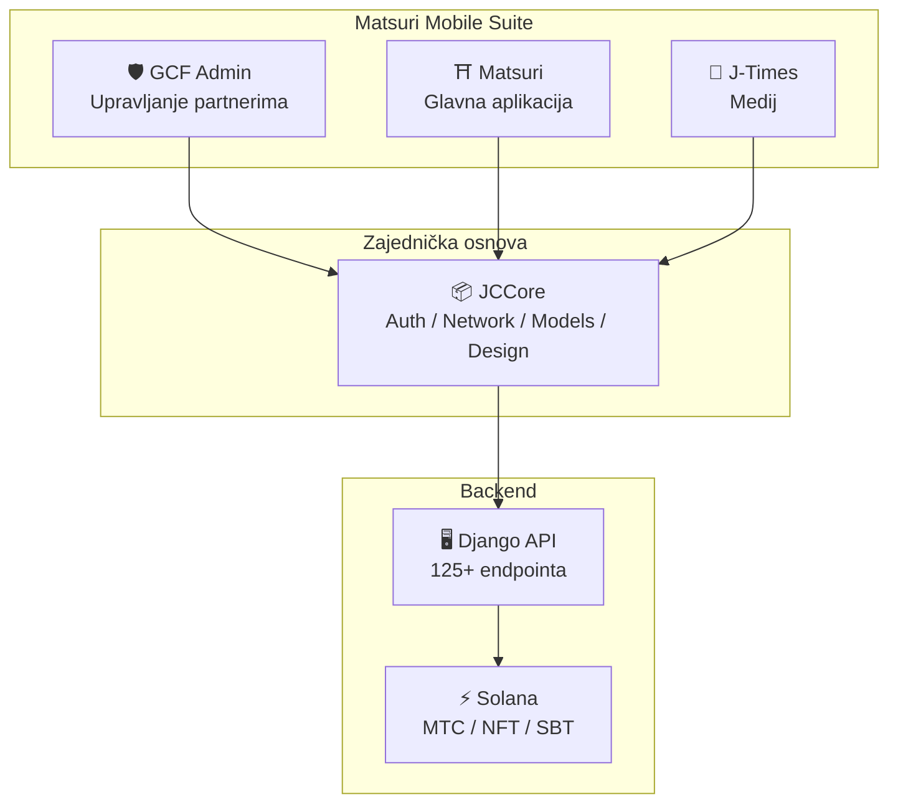
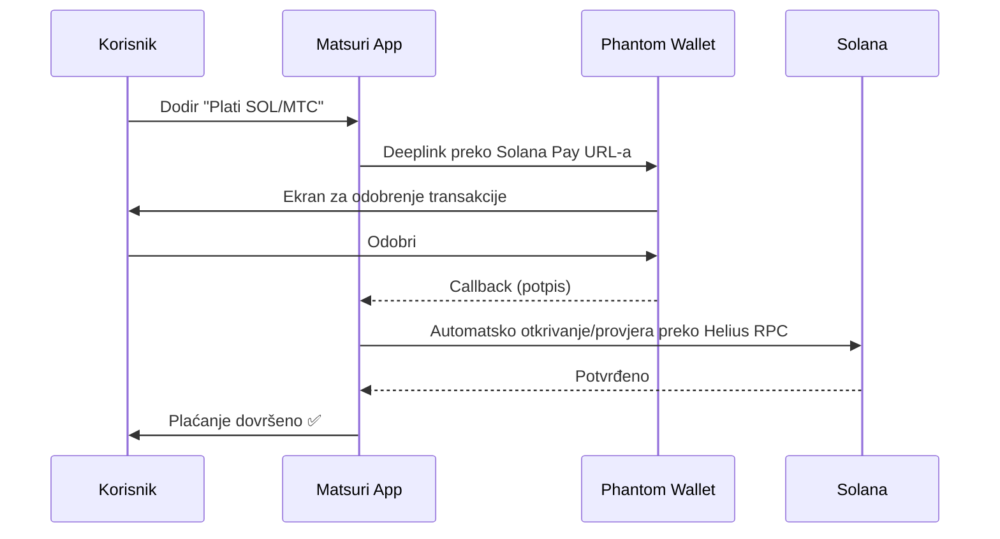
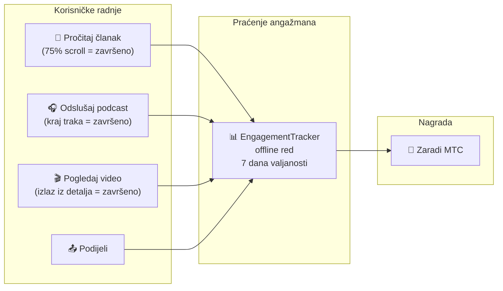
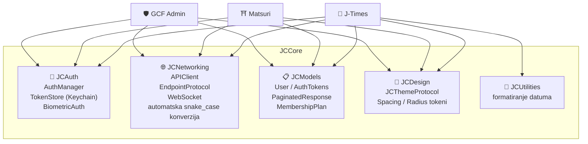
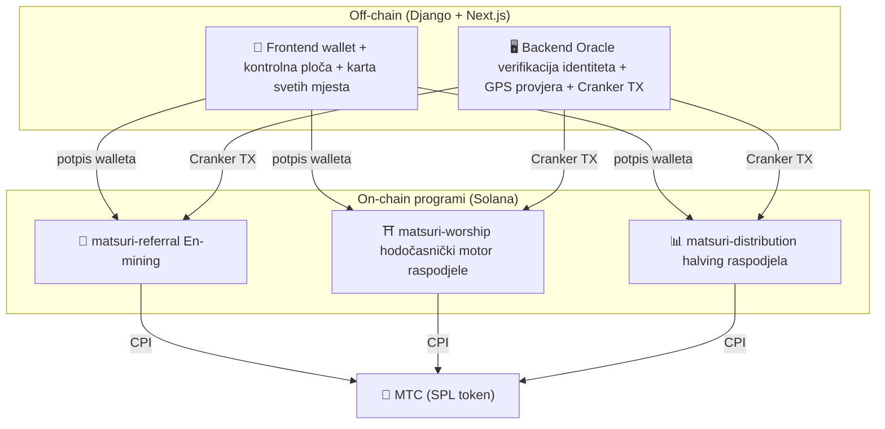
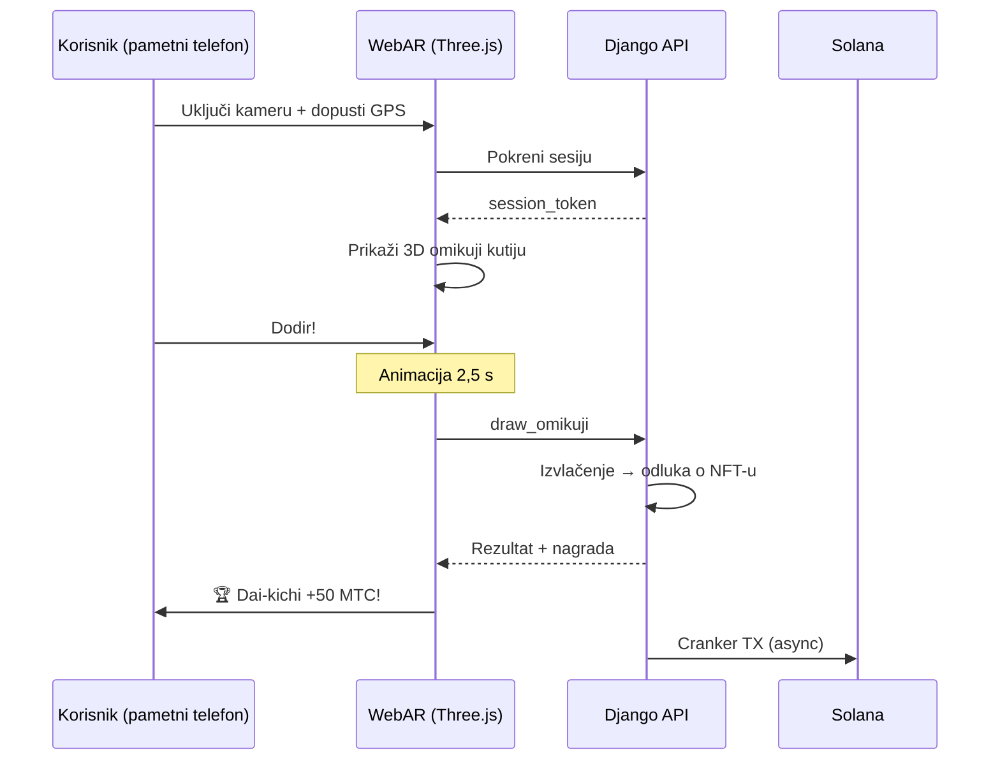

import useBaseUrl from '@docusaurus/useBaseUrl';

# 🔧 Proizvod i tehnologija — ono što radi dokazuje sve

> **Ono što radi, dokazuje sve.**
> Naša misija nisu samo riječi. Web platforma već je u pogonu, iOS aplikacije su u završnoj fazi.

Web aplikacija i admin ploča **u produkciji su**. Tri native iOS aplikacije su dovršene i objavljuju se u travnju 2026. Pametni ugovori na Solani su open source i javno dostupni — ne govorimo u konceptima, nego kroz **kod koji radi i proizvode tik pred vratima**.

---

## Pregled aplikacija

| Aplikacija | Namjena | Status | Jezici |
| :--- | :--- | :---: | :--- |
| **GCF Admin** | Upravljanje partnerima / alat za pogon | ✅ Objavljena | 🇯🇵🇬🇧🇨🇳🇹🇭🇳🇴 |
| **Matsuri** | Glavna aplikacija za obične korisnike | ✅ Objavljena | 🇯🇵🇬🇧🇨🇳🇹🇭🇳🇴 |
| **J-Times** | Kulturni medij i učenje | 🔜 Travanj 2026. | 🇯🇵🇬🇧 |

---

## 1. 🛡️ GCF Admin — aplikacija za upravljanje partnerima

:::info Status: objavljena u App Storeu (v1.0)
Poslovna aplikacija za GCF (Global Community Friends) članove. Sva funkcionalnost web admin-a sažeta je u mobilnoj aplikaciji.
:::

  

  
  
  

### Što aplikacija omogućuje

| Kategorija | Funkcija |
| :--- | :--- |
| **📊 Kontrolna ploča** | KPI kartice, grafovi prihoda, brze akcije |
| **👥 Upravljanje članovima** | Popis, detalji, uređivanje, upravljanje tierom |
| **💰 Zarada** | Praćenje provizija, MTC isplate, upravljanje isplatama |
| **📝 Upravljanje sadržajem** | Kreiranje, uređivanje i objava eventa, članaka, podcasta, videa |
| **🎫 Vodičke slotove** | Upravljanje vodičkim slotovima, praćenje prihoda |
| **🖼️ NFT kontrolna ploča** | Founder's Collection, on-chain provjera, prijenos NFT-a |
| **⛩️ Upravljanje svetim mjestima** | CRUD za lokacije, postavljanje beacona |
| **🎲 AR mining postavke** | Tablica vjerojatnosti za omikuji, parametri nagrada |
| **📊 Analitika** | Izvještaji o pogreškama, analiza korištenja |
| **🔗 Referral** | Generiranje prilagođenih QR kodova, program preporuka |

### Tehničke specifikacije

| Stavka | Detalji |
| :--- | :--- |
| **Arhitektura** | Clean Architecture + MVVM + `@Observable` (iOS 17) |
| **Jezik / SDK** | Swift 6.0 / Xcode 16+ / iOS 17.0+ |
| **API integracija** | 125+ endpointa |
| **Testovi** | 226 testova / 45 test klasa |
| **Lokalizacija** | 5 jezika (JA/EN/ZH/TH/NO) / 957+ prijevodnih ključeva |
| **Swift Concurrency** | Strict Concurrency-compliant / nula upozorenja pri buildu |

### QR kod integracija

U GCF Adminu mogu se generirati prilagođeni QR kodovi s Matsuri logotipom. Koriste se za pozive na evente, preporučne poveznice, zahtjeve za plaćanje itd.

---

## 2. ⛩️ Matsuri — glavna aplikacija

:::info Status: objavljena u App Storeu (v3.0)
Glavna aplikacija za obične korisnike. Rezervacija eventa, plaćanje, Web3 wallet, AR mining — sve u jednoj aplikaciji. **Sada dostupna u App Storeu.**
:::

  

  
  
  

### Što aplikacija omogućuje

| Kategorija | Funkcija |
| :--- | :--- |
| **🎪 Rezervacija eventa** | Pretraga, rezervacija, Stripe plaćanje, QR ulaznice |
| **💳 Četiri načina plaćanja** | Kreditne kartice / pohranjene kartice / MTC saldo / kripto (SOL/MTC) |
| **👛 Web3 wallet** | MTC saldo, slanje/primanje, povijest transakcija |
| **🖼️ NFT galerija** | Popis NFT/SBT-ova, on-chain provjera |
| **🗺️ Karta svetih mjesta** | Karta svetišta i hramova, check-in |
| **🎲 AR mining** | WebAR omikuji iskustvo, zarada MTC-a |
| **💬 Chat** | Poruke s kontekstnim izbornikom |
| **⭐ Wishlista** | Spremanje omiljenih eventa i iskustava |
| **🔍 Napredna pretraga** | Glasovna pretraga podržana |
| **🤝 Referral** | Sudjelovanje u programu preporuka, praćenje nagrada |
| **📊 GCF kontrolna ploča** | Lagani admin za GCF članove |

### Integracija s Phantom Walletom — kripto plaćanje bez upisivanja

>**Korisnik ne kopira adrese.** Phantom Wallet se automatski otvara, odobrite, i plaćanje je gotovo. Potpis automatski otkriva Helius RPC.

### Tehničke specifikacije

| Stavka | Detalji |
| :--- | :--- |
| **Arhitektura** | Clean Architecture + MVVM + Swift Concurrency |
| **Jezik / SDK** | Swift 6.0 / Xcode 16+ / iOS 17.0+ |
| **Plaćanje** | Stripe PaymentSheet + MTC Balance + Phantom (Solana Pay) |
| **API integracija** | 72 endpointa / 16 kategorija |
| **Testovi** | 230+ (Model, ViewModel, Network, Security, DeepLink, E2E) |
| **Lokalizacija** | 5 jezika (JA/EN/ZH/TH/NO) / 406 prijevodnih ključeva |
| **ViewModels** | 25 (puni MVVM — nula izravnih API poziva iz Viewa) |
| **Autentikacija** | Apple Sign In / Google Sign In (PKCE) |

---

## 3. 📰 J-Times — medijska aplikacija za kulturu

:::info Status: krajem travnja 2026.
Medijska platforma koja prenosi dubine japanske kulture. Čitajte članke, slušajte podcaste, gledajte video — svaka radnja donosi MTC.
:::

  

  
  

### Što aplikacija omogućuje

| Kategorija | Funkcija |
| :--- | :--- |
| **📖 Članci** | Parallax hero, drop-cap, progres čitanja, bogat sadržaj (Markdown, tablice, citati) |
| **🎧 Podcasti** | Serije, waveform player, sleep timer, AirPlay, lockscreen kontrole |
| **🎬 Video** | Adaptivni grid/lista, shortsi (TikTok stil, dupli tap) |
| **🔍 Pretraga** | Multi-filter, trending tagovi, glasovna pretraga |
| **🧭 Discovery** | Featured karuseli, staff picks, hit tjedna |
| **📚 Biblioteka** | Favoriti, povijest (po datumu), preuzimanja, playliste |
| **🎵 Audio player** | Mini player (swipe), puni player (waveform, lyrics, loop) |
| **👤 Članstvo** | 3 tiera (Free / Premium / Pro), usporedba, obnova kupnje |

### Media Mining — čitanje, slušanje i gledanje postaju mining

>**Registrira se i offline.** Čak i ako članak čitate u svetištu u planini bez signala, angažman se automatski šalje kad se mreža vrati i MTC se dodjeljuje.

### Dizajnerski sustav — japanska estetska „četiri stupa"

J-Times koristi vlastiti dizajnerski sustav koji klasičnu japansku estetiku prevodi u moderni UI.

| Stup | Koncept | Primjena u UI-u |
| :--- | :--- | :--- |
| **Sumi (墨)** | Topla neutralna siva | Boja pozadine, hijerarhija teksta |
| **Shu (朱)** | Japanska crvena (#C53030) | Naglasak, važne akcije |
| **Ma (間)** | Prostor na 4pt mreži | Spacing, dah |
| **Kami (紙)** | Fina tekstura, glasmorfizam | Površina kartica, dubina |

### Tehničke specifikacije

| Stavka | Detalji |
| :--- | :--- |
| **Arhitektura** | Clean Architecture + MVVM + Swift Concurrency |
| **Jezik / SDK** | Swift 6.0 / Xcode 16+ / iOS 17.0+ |
| **Vanjske ovisnosti** | **Nula** — isključivo Appleovi frameworkovi |
| **API integracija** | 40+ endpointa |
| **Testovi** | 371 test / 20 datoteka |
| **Lokalizacija** | 2 jezika (JA/EN) / 310+ prijevodnih ključeva |
| **Offline** | ContentCache (50MB) + ImageDiskCache (200MB) + upravitelj preuzimanja |
| **Autentikacija** | Apple Sign In / Google Sign In (PKCE) |

---

## Zajednička osnova: JCCore biblioteka

Swift Package biblioteka koju dijele sve tri aplikacije.

| Modul | Uloga |
| :--- | :--- |
| **JCAuth** | Upravljanje tokenima na Keychainu, biometrijska autentikacija (Face ID / Touch ID) |
| **JCNetworking** | Tipizirani API klijent, WebSocket, automatska JSON snake_case konverzija |
| **JCModels** | Zajednički modeli podataka kroz aplikacije (User, AuthTokens itd.) |
| **JCDesign** | Theme protokol, dizajn tokeni (spacing, radius) |
| **JCUtilities** | Utiliti za datum i tekst |

---

## Sigurnost i privatnost

| Stavka | Implementacija |
| :--- | :--- |
| **Auth token** | Šifrirano pohranjen u iOS Keychainu (TokenStore) |
| **Biometrija** | Dvofaktorska autentikacija preko Face ID / Touch ID |
| **API komunikacija** | HTTPS + Certificate Pinning |
| **Privatni ključ walleta** | Aplikacija ne pohranjuje privatni ključ — delegirano Phantom Walletu |
| **AR mining** | Slike kamere ne šalju se serveru (VisionProof) |
| **Offline podaci** | SwiftData enkripcija + automatski istek |
| **Swift Concurrency** | Actor izolacija sprječava race condition |

---

## Kvaliteta razvoja

### Mobilne aplikacije: ukupno **preko 827 automatiziranih testova** kroz sve tri aplikacije.

| Aplikacija | Testovi | Područje pokrivenosti |
| :--- | :---: | :--- |
| **GCF Admin** | 226 | Model, ViewModel, Repository, API, Localization, Navigation |
| **Matsuri** | 230+ | Model, ViewModel, Network, Security, DeepLink, Regression, Performance, E2E |
| **J-Times** | 371 | Model, ViewModel, API, Repository, Navigation, Localization, Security, Performance |

### Pametni ugovori: testovi se postupno proširuju

Za Rust programe na Solani krećemo s unit testovima core logike (matematičkih modula), a pokrivenost se postupno širi prema sigurnosnom auditu (Q2–Q3 2026.).

---

## Pametni ugovori — open source dizajn

>**Dizajnirano za trustless.**
> Izračun nagrada, stablo preporuka, halving raspored — sva logika izvršava se **on-chain** i svatko je može auditirati.
> Izvorni kod: [GitHub](https://github.com/Cootakahashi/matsuri-contracts)

---

### Contributors

| Član | Uloga |
| :--- | :--- |
| **Ko Takahashi** | Founder / Lead Developer — arhitektura, pametni ugovori, full-stack razvoj |

> 🌏**Ubuduće će GCF članovi i razvojne zajednice iz cijelog svijeta također sudjelovati u zajedničkom razvoju.**
> Matsuri Protocol počiva na načelima transparentnosti i zajedničkog vlasništva, kako bi mogao trajno funkcionirati kao „infrastruktura kulture".

---

### Opća struktura

Matsuri deploya **tri Anchor programa (Rust)** na Solani, svaki nosi jedan stup ekosustava.

---

### 1. 📣 En-mining (縁マイニング — mining veza)

**Svrha:** hibridni motor rasta koji nagrađuje i „širinu" (mreža preporuka) i „dubinu" (ekonomski učinak). Ne samo affiliate, nego potpuni mining protokol u kojemu stvarna ekonomska aktivnost stvara on-chain vrijednost.

#### Dizajn bodovanja

Bodovi doprinosa temelje se na dvije ponderirane komponente:

| Komponenta | Težina | Svrha |
| :--- | :---: | :--- |
| **Širina** (broj preporuka) | 30% | Doseg mreže — koliko je ljudi dovedeno |
| **Dubina** (volumen transakcija) | 70% | Ekonomski učinak — stvarne kupnje, ne samo registracije |

Bodovi se akumuliraju s vremenom i pretvaraju u MTC po halving epohi. Planirani su dodatni mehanizmi boosta:

| Boost | Opis | Status |
| :--- | :--- | :---: |
| **Toku (徳) staking** | Zaključajte MTC i pojačajte bodove doprinosa (do oko 50%). Tier i točan multiplikator prilagođavaju se halving rasporedu | ⬜ Koeficijent tbd |
| **Sezonska ljestvica** | Top izvođači u svakoj epohi dobivaju titulu **Evangelist** (trajni SBT) i boost bodova. Točan udio određuje governance | ⬜ Koeficijent tbd |

:::info Progresivni dizajn parametara
Boost koeficijenti (staking tier, ranking bonus) namjerno su prilagodljivi. Zaključavaju se u pametnim ugovorima na temelju stvarnih podataka ekosustava — broj aktivnih korisnika, emisija iz halving poola, ciljevi stabilnosti cijene — i jamče **pravednu raspodjelu** bez obećavanja fiksnih prinosa.
:::

#### Anti-sybil obrana (3 sloja)

| Sloj | Mehanizam | Gdje |
| :--- | :--- | :--- |
| **ID-gate** | X/Twitter OAuth + SMS | Off-chain (Django) |
| **On-chain-gate** | Nagradu dobivaju samo profili s `is_verified = true` | Pametni ugovor |
| **Ponderiranje dubine** | 70% bodova = stvarno plaćanje → botovi ne zarade ništa | Motor bodovanja |

---

### 2. ⛩️ Hodočasnički motor raspodjele (Worship Routing Engine)

**Svrha:** prvi **ReFi protokol** na svijetu koji token ekonomijom rješava preturizam. Zaradite MTC posjećujući sveta mjesta. Ključ je: *što manje posjetitelja, to eksponencijalno veća nagrada.*

:::tip Ključni uvid
„Obrnuto Uber surge cijenjenje" — pretrpana mjesta kažnjavaju se, a frontier mjesta dobivaju boost. Turisti dobrovoljno odlaze na manje posjećena mjesta **jer se to više isplati**.
:::

#### Načelo dizajna nagrada

Bodovi doprinosa po posjetu određuju se iz nekoliko faktora:

| Faktor | Načelo | Učinak |
| :--- | :--- | :--- |
| **Popularnost mjesta** | Manje posjetitelja = više bodova | Razbija koncentraciju turista |
| **Vrijeme posjeta** | Raniji posjet u danu = više bodova | Potiče posjete izvan vrhunca |
| **Tier regije** | Lokalna i frontier na vrhu | Pokreće regionalnu revitalizaciju |
| **Učestalost posjeta** | Redoviti posjetitelji akumuliraju bonus bodove | Nagrađuje trajan angažman |
| **Omikuji sreća** | Nasumični bonus po check-inu | Zabavna gamifikacija |
| **Sponzorirani boost** | Općine mogu boostati određene lokacije | B2B/B2G prihodi |

:::info Koeficijenti su podesivi
Točni multiplikatori (npr. koliko lokalna mjesta zarađuju više od glavnih) prilagođavaju se prema **halving rasporedu** i stvarnim podacima korištenja i postupno se zaključavaju u pametnim ugovorima. Dizajnersko načelo je fiksno — koeficijenti evoluiraju s ekosustavom.
:::

---

### 3. 📊 Halving raspodjela (Halving Distribution)

**Svrha:** inspirirano Bitcoinom, raspodjela MTC-a automatski se prepolovljuje po epohi prema fiksnom rasporedu. Matematički zajamčena rijetkost.

| Instrukcija | Opis |
| :--- | :--- |
| `initialize` | Inicijalizacija pool-a raspodjele |
| `register_miner` | Registracija minera |
| `update_score` | Ažuriranje bodova |
| `advance_epoch` | Prelazak u novu epohu (izvršava halving) |
| `claim_distribution` | Preuzimanje nagrada iz raspodjele |

---

### 4. 🎴 AR mining — WebAR omikuji iskustvo

**Svrha:** iskustvo u kojemu se AR omikuji pojavljuje u fizičkom prostoru kroz preglednik pametnog telefona, i MTC se mina. **Bez preuzimanja aplikacije.** Prva infrastruktura u svijetu u kojoj se duhovnost shinta susreće s najmodernijom tehnologijom i blockchainom.

#### Arhitektura

#### Vjerojatnost omikujija (GCF admin)

Basis Points (10000 = 100%) daju preciznost 0,01%. Podesivo iz GCF admina.

| Klasa | Rijetkost | Bonus | NFT |
|------|-----------|---------|-----|
| 🏆 Dai-kichi | Rijetko | Maksimalni bonus | ✅ |
| ✨ Kichi | Uncommon | Visoki bonus | Opcionalno |
| 🌸 Shō-kichi | Common | Mali bonus | — |
| 🍃 Sue-kichi | Common | Zapis o sudjelovanju | — |
| 💀 Kyō | Uncommon | Zapis o sudjelovanju | — |

Vjerojatnosti i koeficijenti nagrada postupno se utvrđuju prema veličini ekosustava i količini emisije iz halvinga, i implementiraju u pametne ugovore.

#### ZK-Proof of Vision (sigurnost u 5 slojeva)

Višeslojna obrana od GPS falsifikata i replay napada. **Radi zaštite privatnosti, slike kamere nikad se ne šalju serveru.**

| Sloj | Što se provjerava | Bodovi |
| :--- | :--- | :--- |
| Temporal | Trajanje sesije 5-120 s | /20 |
| Motion | Prirodnost žiroskopa (detekcija podrhtavanja ruke) | /20 |
| Light | Okolno svjetlo × doba dana | /20 |
| HMAC | Provjera potpisa proof_hash | /20 |
| Fingerprint | Jedinstvenost uređaja | /20 |
| **Ukupno** | **PASS kod 60/100 i više** | |

#### Dizajn nagrada

Nagrada se bilježi kao **bodovi doprinosa** na temelju vrste mjesta, rezultata omikujija, tiera regije itd. Točne koeficijente postupno utvrđujemo prema halving rasporedu i rastu ekosustava, i implementiramo u pametne ugovore.

---

### Pure Math Modules (auditabilna core logika)

Svi programi izdvajaju bodovanje i izračun nagrada u **čiste, auditabilne `math.rs` module**:

- **Nula nuspojava** — bez I/O, bez alokacija, bez vanjskih poziva
- **Dokumentirane formule** — LaTeX-stil notacija u rustdocu
- **Analiza overflowa** — u128 međuvrijednosti s dokazanim rasponom
- **Sveobuhvatni testovi** — edge caseovi, granični uvjeti, provjera omjera
- **Podesivi koeficijenti** — parametri nagrada mogu se ažurirati preko governancea i prilagoditi rastu ekosustava

---

### Sigurnosni model

Ugovori su **potpuno open source**. Sigurnost ne počiva na nepreglednosti, nego na matematičkom jamstvu.

| Načelo | Implementacija |
| :--- | :--- |
| **PDA-bazirani vaultovi** | Token vaultovi upravljaju se PDA adresama — ne mogu se povući ljudskim ključem |
| **Checked aritmetika** | Svi izračuni koriste `checked_*` — overflow je nemoguć |
| **Podjela uloga** | Admin (multisig) ≠ Cranker (ograničene operacije) ≠ korisnik (samoupravljanje) |
| **Hitno zaustavljanje** | Admin može pauzirati program, ali **samo pri sigurnosnim prijetnjama**. Nema mogućnosti premještanja ili oduzimanja sredstava — pauza je „štit", a ne alat za promjenu pravila |
| **Nepromjenjiva tokenomika** | Stopa halvinga, ukupni pool, trajanje epohe zaključani su nakon postavljanja |
| **Čisti matematički moduli** | Logika nagrada/bodovanja je izolirana, testirana matematička biblioteka |
| **Vision Proof** | 5 slojeva protiv varanja – bez slanja podataka kamere (privatnost) |

---

**[▶ Sljedeće: Roadmap i tim](/docs/roadmap)**｜**[◀ Prethodno: Tokenomika](/docs/tokenomics)**
