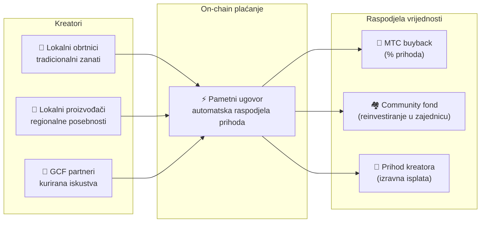

# 🗓️ Roadmap i tim

>**Onima koji su pročitali dovde — vizija, ekonomski dizajn i tehnički temelj su spremni.**
> Nismo kratkoročni špekulativni projekt.
>**Ključni razvoj platforme je završen**, i ulazimo u fazu širenja.

---

## Strateški miljokazi

### 🔥 Faza 1: Buđenje (prva polovica 2026. ── sada)

**Tema: Gradnja temelja i uspostava priljeva gotovine**

Web platforma je u pogonu. iOS aplikacije (Matsuri, J-Times) izlaze u travnju 2026. Fokusiramo se na monetizaciju i ranu likvidnost preko financijskog sustava pod direktnom ovlasti CEO-a.

| Status | Miljokaz | Detalji |
| :---: | :--- | :--- |
| ✅ | **Web platforma u pogonu** | Matsuri web aplikacija i GCF admin (web) live |
| ✅ | **Plaćanje i rast** | Funkcija plaćanja MTC-om i airdrop za preporuke implementirani |
| ✅ | **Mediji u pogonu** | Distribucijska osnova za J-Times (web + podcast) |
| ✅ | **Genesis** | MTC token izdan na Solani |
| ✅ | **Likvidnost osigurana** | Početni pool likvidnosti kreiran na Raydiumu |
| ⬜ | **Poticaji kreću** | Mining likvidnosti s ciljanim APY-om 20% |
| ⬜ | **On-chain plaćanje** | Produkcijska provjera Solana Paya |
| ⬜ | **VIP regrutacija** | Izbor 20 ranih GCF VIP članova |

### 🚀 Faza 2: Ekspanzija (druga polovica 2026.)

**Tema: Real assets i adventure mining**

Dovršenu web aplikaciju koristimo u potpunosti te širimo fizičke baze i hodočasničke funkcije.

| Status | Miljokaz | Detalji |
| :---: | :--- | :--- |
| ⬜ | **Nova funkcija** | Adventure mining (hodočašće) se implementira i objavljuje |
| ⬜ | **Međunarodno** | Partnerstva i VIP eventi u Aziji (Tajland, Tajvan itd.) |
| ⬜ | **Upravljanje imovinom** | Portfelj nekretnina, dionica, kripta |
| ⬜ | **Cilj postignut** | Ukupni AUM ekosustava: **1 milijarda ¥** |

### 🌊 Faza 3: Cirkulacija (2027+)

**Tema: Masovno širenje, sustvaralačka ekonomija, decentralizacija**

Faza općeg otvaranja, on-chain tržnice i potpunog ekosustava.

| Status | Miljokaz | Detalji |
| :---: | :--- | :--- |
| ⬜ | **Grand Opening** | Matsuri aplikacija službeno objavljena globalno |
| ⬜ | **Grand Unlock (1.6.2027.)** | Osnivački lock-up se oslobađa + mining pool (550M MTC) aktivan + kreće halving ciklus |
| ⬜ | **Sustvaralačka tržnica** | Regionalne posebnosti + GCF partnerske trgovine ── on-chain plaćanja s automatskim MTC buybackom |
| ⬜ | **Crowdfunding (s NFT pravima)** | Korisnici ulažu u kulturne projekte na Solani. Podupiratelji dobivaju NFT koji predstavlja vlasništvo, udio u prihodu i governance |
| ⬜ | **On-chain plaćanja** | Sve transakcije na tržnici izvršavaju pametni ugovori ── udio u prihodu automatski se šalje u MTC buyback pool |
| ⬜ | **Cilj postignut** | Ukupni AUM ekosustava: **10 milijardi ¥ (~65 mil. $)** |
| ⬜ | **Prelazak na DAO** | Dio ovlasti odlučivanja prenosi se GCF zajednici |

#### 🏪 Vizija sustvaralačke tržnice

„Kulturni OS" u svom ultimativnom obliku ── **decentralizirana tržnica** na kojoj kreatori kulture i ljubitelji kulture izravno trguju bez iskorištavajućih posrednika.

| Funkcija | Opis | Status |
| :--- | :--- | :---: |
| **🏺 Regionalne posebnosti** | Obrtnici i lokalni proizvođači izravno prodaju kupcima u cijelom svijetu. 5–10% popust pri plaćanju MTC-om | ⬜ Vizija |
| **🎫 Crowdfunding + NFT prava** | Ulažite u kulturne projekte (obnova svetišta, povratak festivala, obrtničke radionice). Dobijate NFT kao dokaz doprinosa, eventualno s udjelom u prihodu i governanceom | ⬜ Vizija |
| **⚡ On-chain plaćanje** | Sve transakcije tržnice izvršavaju se u Solana pametnim ugovorima. Prihod se automatski dijeli: isplata kreatorima + community fond + MTC buyback ── bez ručnog računovodstva | ⬜ Vizija |
| **🗳️ Governance podupiratelja** | NFT vlasnici glasuju o raspodjeli resursa u projektima koje su podržali ── ne samo donacija, nego pravo sustvaranje | ⬜ Vizija |

:::info Zašto je to važno
Danas turisti kupuju suvenire u trgovinama koje plaćaju najamninu platformi. Sutra **obrtnik u japanskoj provinciji prodaje izravno obožavatelju u Kopenhagenu**, a udio u prihodu automatski jača MTC ekonomiju. To je zamašnjak u najzrelijoj formi.
:::

---

## 👤 Tim

### Ko Takahashi ── osnivač / CEO i glavni arhitekt

| Stavka | Detalji |
| :--- | :--- |
| **Uloga** | Cjelokupna odgovornost za projekt. Dizajn platforme, pametni ugovori, full-stack razvoj |
| **Vizija** | Predlagač kulturnog OS-a koji „izvozi kulturu i uvozi bogatstvo" |
| **Stil** | Sam piše kod, sam je na terenu (Golden Gai) – „skin in the game" |

### Jon Anders Jensen ── direktor / GCF i event operations

| Stavka | Detalji |
| :--- | :--- |
| **Uloga** | Vodi GCF zajednicu. Dizajnira pogon eventa i tura, vodi rad na terenu |
| **Snage** | Međunarodna perspektiva i povjerenje među GCF članovima – nosi „cirkulaciju ljudi" u ekosustavu |

### Ryunosuke Honda ── direktor / ambasador regionalnih kultura

| Stavka | Detalji |
| :--- | :--- |
| **Uloga** | Most između japanskih regionalnih kultura i Matsuri ekosustava |
| **Snage** | Otkriva lokalne kulturne resurse i unosi ih na Matsuri platformu kako bi stvorio „Deep Japan" iskustva |

### 🌏 GCF zajednica ── razvojni članovi razasuti po svijetu

Matsuri Protocol ne gradi samo osnivački tim.
**GCF članovi iz cijelog svijeta** doprinose razvoju protokola kroz testiranje, feedback, prijevode i lokalno širenje.

| Područje | Postavka |
| :--- | :--- |
| **💼 Globalno financiranje** | Mreža privatnih investitora u Aziji |
| **⚙️ Engineering** | Decentralizirani tim blockchain i mobilnih developera |
| **🏮 Operations** | Jaki kanali u Shinjuku Golden Gaiu i drugim turističkim destinacijama |
| **🌐 Zajednica** | Višenacionalni GCF članovi u Japanu, Norveškoj, Tajlandu, Tajvanu itd. |

:::tip Infrastrukturu kulture gradimo svi
Ako ste u GCF-u, i vi ste sudioni suradnji na Matsuri Protocolu.
Nije riječ samo o pisanju koda. Predstaviti lokalno sveto mjesto, prevesti dokumentaciju, organizirati event —
sve to širi protokol u svijetu.
:::

---

## 🏛️ Governance (DAO)

Matsuri Protocol postupno se kreće od centralizacije prema **decentraliziranoj autonomnoj organizaciji (DAO)**.
GCF članovi (Platinum/Gold) ubuduće će imati **pravo glasa** o sljedećim važnim temama.

| Tema glasanja | Sadržaj |
| :--- | :--- |
| **💰 Raspodjela kapitala** | U koja nova poslovna područja ili marketing treba uložiti poslovni prihod |
| **⚙️ Ažuriranja protokola** | Fino podešavanje naknada aplikacije i mining nagrada |
| **⛩️ Kulturna certifikacija** | Koji festivali i svetišta certificiraju se kao „službena hodočasnička mjesta" i dobivaju podršku |

:::info Pridružite se revoluciji
Ne gradimo samo aplikaciju.
Gradimo **kulturnu ekonomiju bez granica**.
:::

---

**[◀ Prethodno: Proizvod i tehnologija](/docs/product-tech)**｜**[⛩️ Povratak na početak whitepapera](/docs/intro)**
