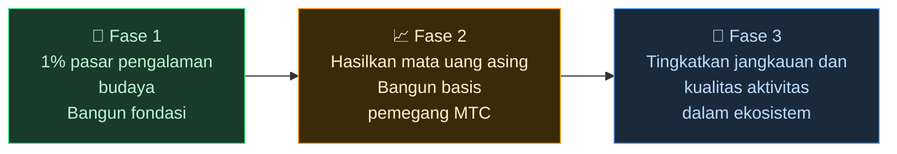

# 🌏 Tantangan & Solusi — kebenaran tidak nyaman, dan harapan

> **Misinya indah. Realitas menghalanginya.**

---

## Tetapi ada kebenaran tidak nyaman yang menghalangi misi ini

:::info Pasar ¥10 triliun (~66 miliar $), dan energinya tak sampai ke orang yang membawa budaya
Pasar inbound Jepang tumbuh ke arah **¥10 triliun (~66 miliar $) per tahun**.
Namun sangat sedikit dari manfaat itu yang sampai ke lapangan.
:::

### Pasar yang dibidik MTC

Kami tidak mencoba mengambil seluruh ¥10 triliun sekaligus.

Target pertama kami di dalam pasar tersebut adalah segmen **pengalaman budaya, pemandu, dan tur lokal.** Kami menetapkan **1% dari segmen tersebut (sekitar ¥100 miliar / ~660 juta $)** sebagai target awal: mulai kecil, tumbuh kuat.

| Fase | Strategi | Tujuan |
| :--- | :--- | :--- |
| **Mulai kecil** | Fokus pada pengalaman budaya dan tur berpemandu. Bangun rekam jejak dan tumbuh dari mulut ke mulut | Membangun basis pendapatan |
| **Tumbuh kuat** | Bawa masuk mata uang asing (pendapatan inbound) dan buktikan mekanisme berbagi pendapatan dengan pemegang MTC | Membangun kepercayaan pada ekonomi MTC |
| **Naikkan kualitas** | Setelah mencapai skala tertentu, berhenti mengejar pertumbuhan demi pertumbuhan; perdalam kualitas pengalaman, jangkauan aktivitas, dan komunitas dalam ekosistem | Ekonomi budaya yang berkelanjutan |

> **Tumbuh melalui kualitas orang yang terlibat dan kedalaman pengalaman, bukan melalui volume.** Itulah strategi ekspansi MTC.

Platform-platform Web2 telah membawa kegembiraan perjalanan ke orang di seluruh dunia, dan kami tulus berterima kasih atas apa yang mereka bangun. Tetapi struktur tersentralisasi membawa efek samping yang tak terhindarkan.

Algoritma yang memutuskan apa yang terlihat. Operator dipaksa berlomba untuk penempatan. Satu ulasan bisa membuat penjualan berayun liar. Tarif komisi berubah seenaknya platform — dan orang di lapangan hidup dalam ketakutan tetap akan terpilih, atau menghilang.

Yang dihasilkan struktur ini adalah perpecahan antar operator, dan kengerian akan aturan yang tak terlihat.
Toko sebelah menjadi rival; memagari pelanggan lebih masuk akal daripada bekerja sama. Pelancong pun hanya melihat opsi yang dibuat datar menjadi "jumlah bintang" dan "peringkat," dan pengalaman yang benar-benar berharga terkubur.

:::danger Tiga masalah yang dirasakan lapangan
💸 **Pendapatan keluar** — sebagian besar pendapatan mengalir keluar negara sebagai komisi ke OTA dan perantara luar negeri

😤 **Kelelahan lokal** — hanya beban overtourism yang tertinggal; pendapatan yang penting tak pernah kembali ke komunitas

🚧 **Tembok pengalaman** — hanya tur yang dihomogenisasi yang dipilih algoritma yang muncul, dan pengunjung tak pernah bertemu "Jepang yang asli"
:::

> **Orang Jepang berjuang, pelancong tak pernah bertemu hal yang asli, dan kekayaan lenyap ke dalam platform.**

---

## Jadi bagaimana kita mengubahnya?

Hari ini, teknologi untuk mengubah struktur ini dari akarnya akhirnya tiba.

:::tip Smart contracts — aturan bersama yang tak bisa ditulis ulang
Tarif komisi dan kondisi diukir ke dalam kode. Tak seorang pun bisa mengubahnya seenaknya. Semua orang beroperasi di bawah aturan yang sama, secara otomatis.
:::

:::tip Blockchain — transparansi yang benar-benar bisa kamu lihat
Setiap transaksi dicatat di ledger publik yang bisa diverifikasi siapa saja. Era data yang terkunci di dalam korporasi sudah berakhir.
:::

:::tip Solana — settlement 0,4 detik, biaya ~0,0003 $
Tak ada tumpukan biaya perantara, tak ada settlement berhari-hari. Orang terhubung langsung dengan orang.
:::

:::tip AI — biaya manajemen sendiri pun melarut
Lompatan produktivitas yang eksplosif membuat struktur biaya yang dibutuhkan untuk menjalankan platform raksasa menjadi hal masa lalu.
:::

Kita tak lagi berada di era di mana orang membutuhkan perantara untuk terhubung.

Dengan teknologi ini kami membebaskan ekonomi inbound dari monopoli dan mengembalikan pendapatan kepada orang-orang di lapangan di Jepang dan luar negeri.
Dan tak hanya di Jepang — kami membangun **struktur untuk melindungi dan menghubungkan budaya-budaya dunia.**

---

**[◀ Sebelumnya: Visi & Misi](/docs/vision)** | **[▶ Berikutnya: Masa depan yang dibayangkan MTC](/docs/future)**
