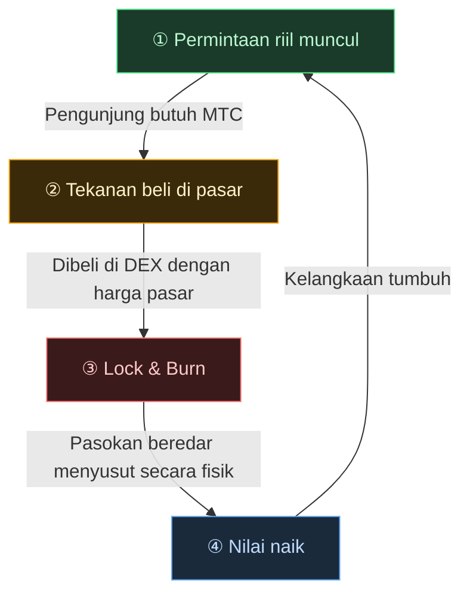

# 🔄 Roda gila ekonomi — loop pertumbuhan dan OS budaya

> **Semakin pengunjung menikmati Jepang, semakin banyak permintaan yang dihasilkan ekosistem.**
> Mekanisme penawaran-permintaan ini adalah jantung yang berdetak dari proyek.

---

## Mekanisme penawaran-permintaan MTC

Berdasarkan desain Matsuri Protocol, **permintaan riil yang naik menciptakan tekanan beli dan, dikombinasikan dengan pasokan yang menyusut, menetapkan kondisi bagi nilai untuk naik.**
Ini bukan sentimen — ini **mekanisme penawaran dan permintaan.**

Mekanisme tersebut berjalan pada **loop empat langkah** di bawah ini.

| Langkah | Nama | Mekanisme |
| :---: | :--- | :--- |
| **①** | **Permintaan riil muncul** | Pengunjung butuh MTC untuk memesan pemandu atau membeli ticket NFT |
| **②** | **Tekanan beli di pasar** | MTC dibeli dengan harga pasar di DEX (decentralized exchange). Tekanan beli kuat berdasarkan konsumsi, bukan spekulasi |
| **③** | **Lock & Burn** | Sebagian MTC yang digunakan dalam settlement langsung dikunci atau dibakar oleh smart contract. Pasokan beredar turun secara fisik |
| **④** | **Kelangkaan naik** | Permintaan beli tumbuh, pasokan jual menyusut. Pergeseran keseimbangan penawaran-permintaan membuat tiap token lebih langka |

---

---

:::note Visi di balik persamaan ini
Gambaran lebih besar — "OS budaya" yang ada di balik roda gila — dieksplorasi secara rinci di halaman berikutnya, [Masa depan yang dibayangkan MTC](/docs/future).
:::

---

**[◀ Sebelumnya: Tantangan & Solusi](/docs/challenges)** | **[▶ Berikutnya: Masa depan yang dibayangkan MTC](/docs/future)**
