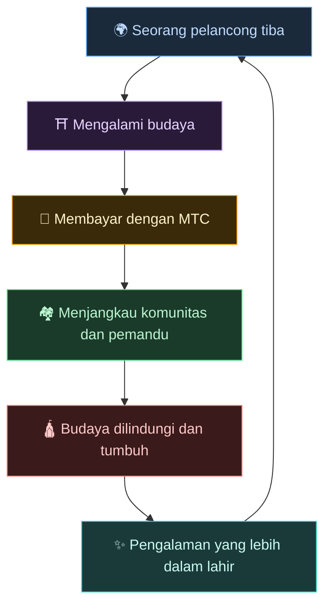
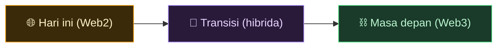
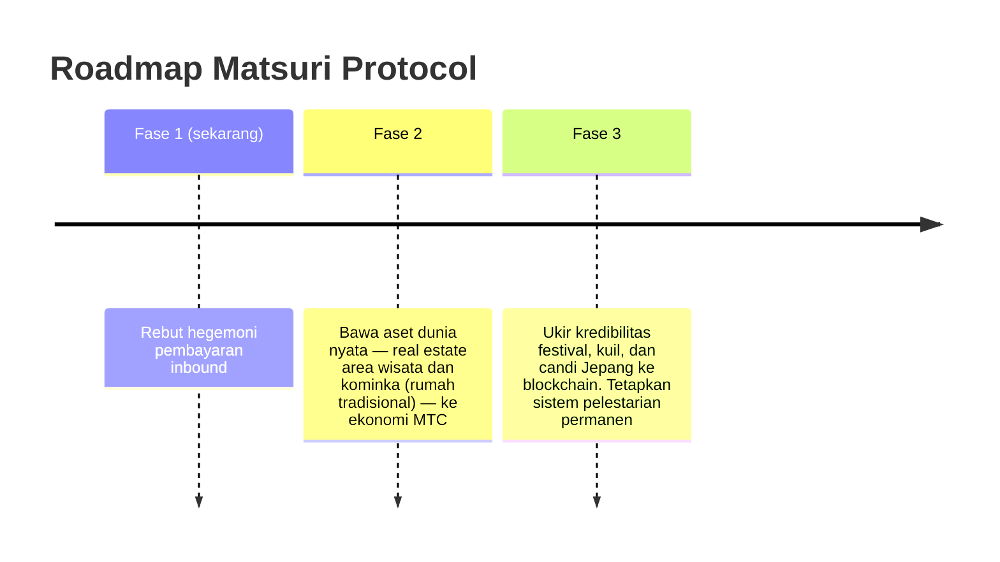

# 🌀 Masa depan yang dibayangkan MTC — ekonomi di mana setiap bentuk keterlibatan beredar

> **Orang yang mengalami, orang yang menyampaikan, orang yang melindungi — setiap perasaan beredar sebagai ekonomi dan membawa budaya ke generasi berikutnya.**

---

## Peredaran yang ingin kami wujudkan

MTC bukan token untuk spekulasi.

Pelancong bertemu budaya Jepang dan tergerak.
Pemandu menyampaikan perasaan itu dan diberi imbalan.
Komunitas berkembang dan terus melindungi budayanya.
Dan budaya itu menarik pelancong berikutnya.

Peredaran inilah alasan utama keberadaan MTC.

---

## Ekonomi di mana ketiga sisi diberi imbalan

Dalam model pariwisata lama, pelancong membayar, platform mengambil keuntungan, dan tak ada yang tersisa di lapangan.
Dalam ekonomi MTC, semua yang terlibat diberi imbalan.

| Siapa yang terlibat | Apa yang terjadi | Bagaimana mereka diberi imbalan |
| :--- | :--- | :--- |
| **🌍 Mereka yang mengalami** | Bertemu budaya Jepang, membayar dalam MTC | Lebih murah daripada yen dan akses nyata ke pengalaman autentik. Tetap terhubung melalui MTC bahkan setelah pulang |
| **⛩️ Mereka yang menyampaikan** | Menyelenggarakan acara sebagai pemandu, menerbitkan di J-Times | Imbalan langsung, tanpa perantara yang mengambil dari atas. Semakin kamu bertindak, semakin banyak MTC yang kamu hasilkan |
| **🏘️ Mereka yang melindungi** | Sebagai komunitas lokal, memelihara dan mewariskan budaya | Pendapatan tiba langsung. Komunitas berkembang berkelanjutan alih-alih menderita overtourism |

---

## Semakin luas ekonomi, semakin kuat budaya

Ekonomi MTC dimulai dengan memesan pengalaman, dan meluas ke setiap bagian kehidupan.

- **Pengalaman** — pengalaman budaya autentik, penambangan kunjungan kuil
- **Sandang, pangan, papan** — penginapan, toko, masakan, mode
- **Proyek kreasi bersama** — crowdfunding untuk berinvestasi dalam melindungi budaya
- **Pemahaman internasional lintas budaya** — ruang pertukaran dan saling pengertian lintas batas

Semakin luas ekonomi tumbuh, semakin tebal aliran MTC yang melaluinya, dan semakin besar kekuatannya menopang budaya.
Ini bukan sekadar model bisnis. Ini adalah **sistem penopang kehidupan untuk budaya.**

---

## Dari Web2 ke Web3 — bertahap, tanpa paksaan

Kami tidak mengatakan "letakkan semuanya di blockchain" sejak hari pertama.

Kebanyakan orang hari ini masih asing dengan Web3. Justru karena itulah kami merancangnya untuk **mulai dengan bentuk yang sudah orang kenal, dan biarkan mereka merasakan manfaat Web3 secara bertahap.**

| Fase | Pengalaman pengguna | Apa yang terjadi di bawahnya |
| :--- | :--- | :--- |
| **Hari ini** | Pesan dan bayar seperti aplikasi web biasa. Kartu kredit cukup | Django + Stripe. Tak perlu wallet untuk mulai |
| **Transisi** | Hasilkan dan gunakan MTC di dalam aplikasi. Koneksi wallet hanya satu ketukan | Skor off-chain bertahap berpindah on-chain |
| **Masa depan** | Setiap transaksi dan hak tercatat transparan on-chain. Kontribusimu terbukti selamanya | Ekonomi sepenuhnya otomatis dan anti-rusak yang ditenagai smart contracts |

:::tip Web3 tak harus sulit
Tak ada setup wallet, tak ada manajemen seed phrase di awal. Saat kamu menggunakan aplikasi, kamu secara alami melangkah ke Web3. **Sebelum kamu menyadarinya, kamu sudah menjadi warga Web3.** Itulah pengalaman yang kami rancang.
:::

---

## Ekonomi yang bergerak dengan empati, bukan paksaan

Dan ekonomi ini berjalan di atas smart contracts.
Aturan tak bisa ditulis ulang sepihak seenaknya — **ekonomi di mana status quo tak bisa diubah dengan paksa.**

Di atas fondasi itu, kami belajar dari kebijaksanaan kuno dan terus menciptakan nilai baru. 温故知新, lalu kreasi.

> **Dunia di mana kehidupan bisa terjalin di sekitar budaya, bahkan tanpa yen atau dolar.**
>
> Bukan mengoutsource arti mata uang kepada orang lain, tetapi menghasilkan dan membelanjakan nilai melalui "keterlibatanmu" sendiri.
> Itulah kebebasan yang ingin diberikan MTC.

---

## 🏁 Tujuan akhir: "OS budaya"

Tujuan utama kami bukan sekadar aplikasi pembayaran.
Tujuannya adalah mengubah **budaya itu sendiri menjadi OS (lapisan fondasi).**

> Kami melindungi kebijaksanaan kuno dengan blockchain terbaru.
> Itulah masa depan yang sedang digambar Matsuri Protocol.

---

:::note Akhir bagian Kisah
Jika kamu sudah membaca sampai sini, sekarang kamu seharusnya memahami mengapa MTC ada.
Berikutnya adalah **[Praktik]** — mari kita lihat apa yang sebenarnya bisa kamu lakukan dengan MTC.
:::

**[◀ Sebelumnya: Roda gila ekonomi](/docs/flywheel)** | **[▶ Berikutnya: Ekosistem](/docs/ecosystem)**
