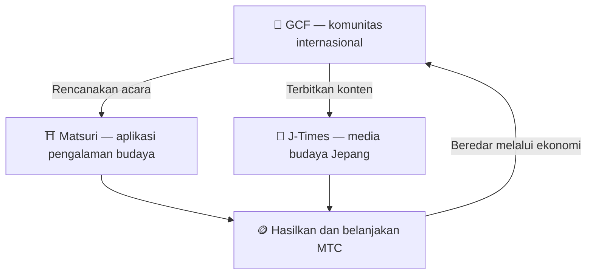

# 🏗️ Ekosistem MTC — ekonomi di mana pengalaman, media, dan komunitas beredar

> **Tiga "tempat" untuk mewujudkan misi.**
> Tempat untuk mengalami, tempat untuk belajar, tempat untuk terhubung — masing-masing berdiri sendiri, dan MTC menghubungkannya menjadi satu ekonomi yang beredar.

MTC bukan sekadar token. Tiga produk dan komunitas internasional bekerja bersama untuk membangun ekonomi yang melindungi budaya.

:::tip 🤝 GCF — komunitas internasional yang menggerakkan ekosistem
Tempat berkumpul bagi orang-orang yang mencintai budaya Jepang, lintas batas. GCF merekrut pemandu, dan pemandu GCF tersebut menjalankan pengalaman di Matsuri. Mereka juga menerbitkan konten yang menarik di J-Times — aktivitas komunitas adalah mesin yang menggerakkan seluruh ekosistem.
:::

:::tip ⛩️ Matsuri — aplikasi pengalaman budaya
Mulai dengan pemesanan pengalaman budaya dan berkembang bertahap ke **penginapan**, **toko**, dan **crowdfunding**. Ekonomi tumbuh dari pengalaman ke sandang, pangan, papan, dan investasi kreasi bersama.

**Penambangan kunjungan kuil (seichi junrei — ziarah suci)** — hasilkan MTC dengan secara fisik mengunjungi kuil, candi, dan landmark budaya. Pelancong mengalir alami dari hotspot terkenal ke permata lokal yang tersembunyi, menyelesaikan overtourism dan merevitalisasi area regional sekaligus.
:::

:::tip 📰 J-Times — media budaya Jepang
Platform media yang menyampaikan pesona budaya Jepang ke dunia. Kamu menghasilkan MTC melalui keterlibatan seperti membaca dan membagikan artikel.
:::

---

## 🤝 Penambangan sosial (terhubung dan hasilkan)

**Terikat ke dashboard admin GCF — versi web aktif (aplikasi iOS dijadwalkan April 2026).**

Anggota GCF menerima akses ke antarmuka **GCF admin web** khusus.

| Fitur | Apa yang bisa kamu lakukan |
| :--- | :--- |
| **🎪 Buat acara** | Rencanakan dan terbitkan acara dan tur kamu sendiri |
| **📢 Distribusikan konten** | Terbitkan dan sebarkan artikel dan konten J-Times |
| **📊 Pelacakan referral** | Lacak aktivitas dan pendapatan pengguna yang dirujuk secara real-time |

:::info Imbalan otomatis
Setiap kali teman yang kamu rujuk melakukan pembayaran, sistem **secara otomatis** menyetorkan imbalan (bagi hasil) ke walletmu.
:::

---

## 🎓 Ekonomi creator (cipta dan hasilkan)

Kamu tak hanya mengonsumsi konten — di Matsuri, **siapa pun** bisa menciptakan dan memonetisasinya.

| Platform | Apa yang bisa creator lakukan | Model pendapatan |
| :--- | :--- | :--- |
| **📚 Marketplace kursus** | Terbitkan kursus video / teks tentang budaya, bahasa, atau kerajinan Jepang | Biaya per pendaftaran (bagi hasil creator) |
| **🎙️ Studio podcast** | Produksi seri audio yang didistribusikan via Spotify, Apple Podcasts, dan RSS | Episode khusus pelanggan |
| **🤝 Crowdfunding** | Luncurkan kampanye penggalangan dana berbasis Solana untuk proyek budaya | Pelacakan kontribusi on-chain |
| **🛍️ Toko pengguna** | Buka toko pribadi di dalam platform (kerajinan, barang) | Penjualan langsung dengan sistem produk / ulasan |

:::tip Bantuan produksi bertenaga AI
Penyelenggara acara bisa menggunakan **asisten AI bawaan (GPT-4 Turbo)** di dashboard admin untuk menulis deskripsi acara, menerjemahkan otomatis ke 5 bahasa, dan menghasilkan metadata yang dioptimalkan SEO.
:::

---

  

*Pertemuan komunitas di Golden Gai — koneksi menjadi kekuatan penambangan.*

---

:::note Halaman berikutnya
Untuk melihat bagaimana penambangan sebenarnya bekerja dan cara menghasilkan, lanjut ke **[Menambang & menghasilkan →](/docs/mining)**.
:::
