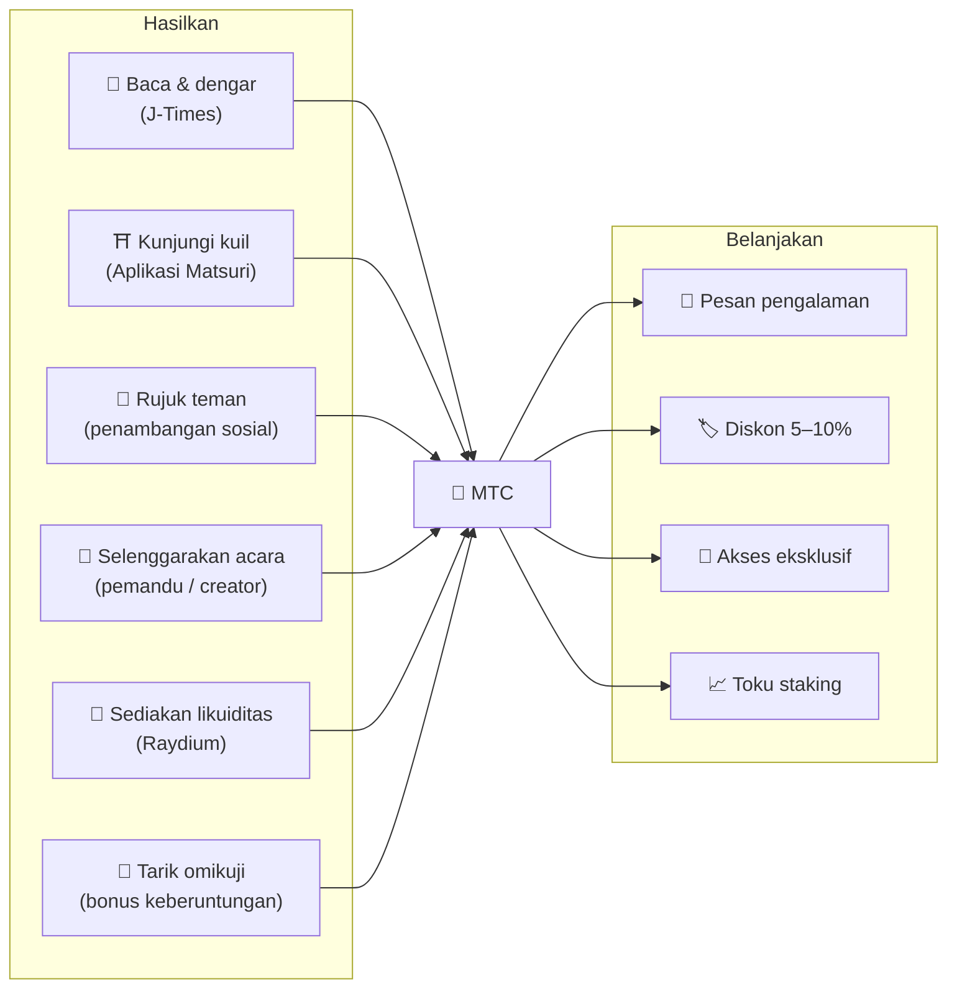
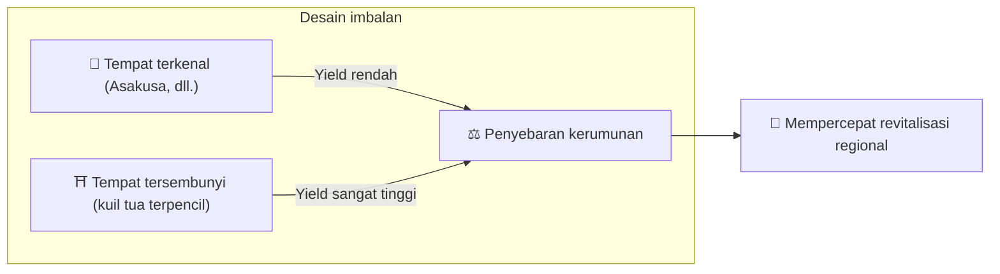
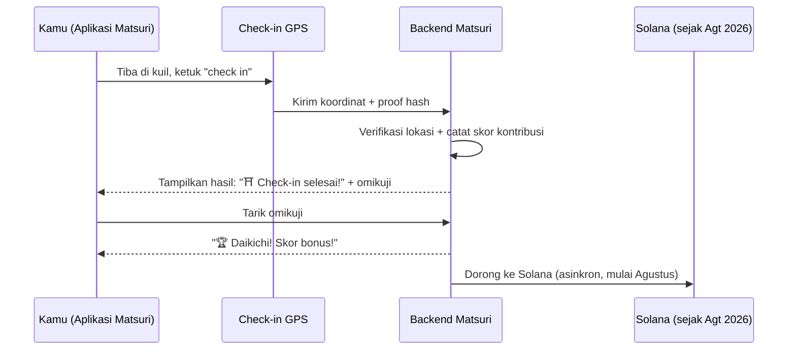
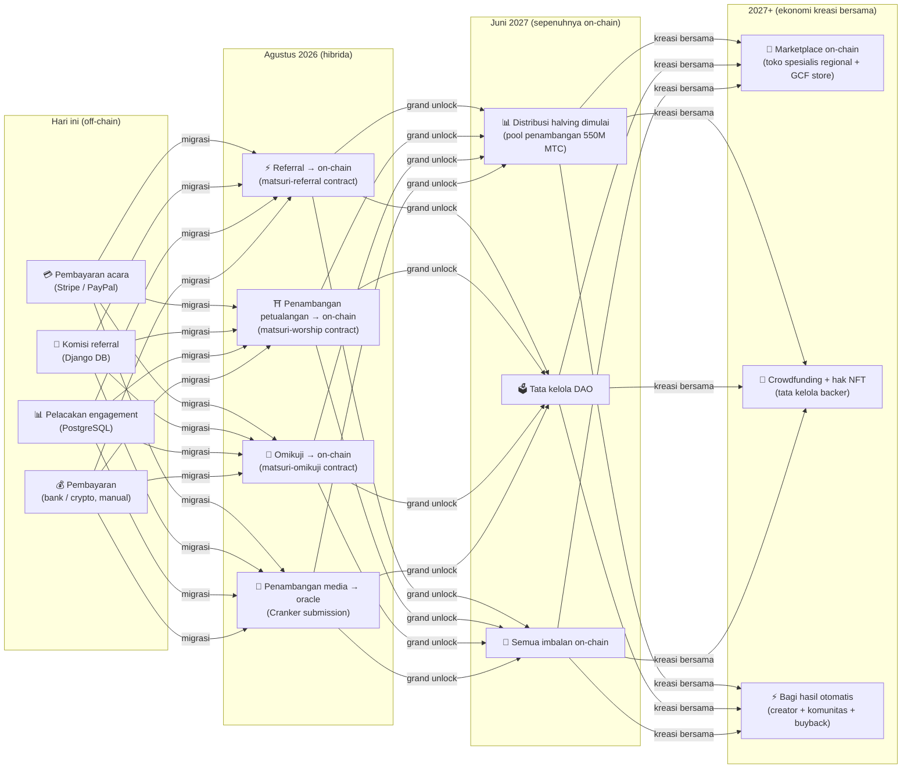

import useBaseUrl from '@docusaurus/useBaseUrl';

# ⛏️ Lima pilar penambangan dan cara menghasilkan

> **Setiap bentuk "keterlibatan" dalam budaya menjadi nilai.**
> Membaca, berjalan, terhubung, mencipta, mendukung — setiap tindakanmu menghasilkan MTC.

<small>*Apa itu "penambangan"? — Di Bitcoin dan jaringan serupa, komputer melakukan kalkulasi besar dan menerima koin baru sebagai imbalan; ini disebut "penambangan." Dengan MTC, yang melakukan penambangan bukanlah daya komputasi, tetapi **tindakanmu sendiri** — membaca artikel, mengunjungi kuil, menyelenggarakan acara. Alih-alih menggali emas, keterlibatan dengan budaya menghasilkan MTC. Itulah arti "penambangan" di sini.*</small>

> Hasilkan melalui tindakan. Belanjakan untuk pengalaman. Pegang dan saksikan ia tumbuh.

MTC bukan token spekulatif. Ia beredar melalui ekonomi nyata di mana setiap tindakan menghasilkan nilai dan menangkapnya. Aplikasi web dan dashboard admin **sudah aktif**. Skor kontribusi saat ini dicatat off-chain (di Django) dan akan berpindah on-chain bertahap mulai Agustus 2026.

:::tip Gambaran besar
MTC memiliki **ekonomi yang sepenuhnya tertutup**: kamu menghasilkan melalui aktivitas nyata, kamu membelanjakan untuk pengalaman nyata, dan nilai tumbuh saat ekosistem tumbuh. Halaman ini menjelaskan mekaniknya secara rinci.
:::

---

## Siklus hidup MTC

---

## Lima pilar penambangan

### 1. 📖 Penambangan media (baca, dengar, jawab — dan hasilkan)

**Terikat ke platform media resmi "J-Times"**

Pengetahuan dramatis menaikkan kualitas perjalanan. Buka **aplikasi J-Times** dan nikmati konten tentang budaya Jepang. Selain teks dan audio, kami memberi imbalan **pemeriksaan pemahaman (kuis)**. Setiap tindakan yang selesai otomatis mengkredit MTC kepadamu.

| Tindakan | Syarat selesai | Imbalan tipikal |
| :--- | :--- | :---: |
| **📰 Baca artikel** | Gulir hingga 75% | 2–30 MTC |
| **🎧 Dengar podcast** | Putar hingga akhir | 2–30 MTC |
| **🎬 Tonton video** | Tutup layar detail setelah menonton | 2–30 MTC |
| **📤 Bagikan konten** | Buka share sheet | 2–30 MTC |
| **✅ Jawab kuis** | Lulus tes pemahaman | 2–30 MTC |

<small>*Jumlah imbalan bervariasi sesuai jenis konten, panjang, dan keseimbangan pasokan keseluruhan ekosistem.*</small>

:::tip Momen luang menjadi penambangan
Perjalanan dan istirahat berubah menjadi waktu yang menghasilkan imbalan.
:::

:::info Dukungan offline
Tak ada internet di kuil terpencil? Tak masalah. J-Times mencatat aktivitas secara lokal dan **otomatis sinkron begitu kamu online lagi** (retensi antrean offline 7 hari). Kamu tak akan kehilangan MTC yang sudah kamu hasilkan.
:::

**Apa yang terjadi di balik layar:**
1. Aplikasi J-Times mendeteksi tindakanmu (baca, selesai menonton, bagikan, dll.)
2. Mencatatnya secara lokal bahkan offline (disimpan 7 hari)
3. Mengirimnya ke server untuk verifikasi saat jaringan kembali
4. Mencerminkannya di saldomu sebagai skor kontribusi
5. Mulai Agustus 2026: skor terverifikasi dicatat on-chain via oracle dan menjadi terverifikasi di blockchain

---

### 2. ⛩️ Penambangan petualangan (jalan dan hasilkan)

**Proyek "Junrei" — smart contract selesai, deploy mainnet Agustus 2026**

Fitur generasi berikutnya yang menggunakan GPS dan insentif token untuk membentuk "aliran orang" fisik. Peta tempat suci **sudah aktif** di aplikasi web Matsuri. Skor kontribusi saat ini dicatat off-chain; distribusi imbalan on-chain dimulai setelah deploy smart contract Agustus 2026.

>**Karena kamu menghasilkan lebih banyak, kamu pergi ke pedesaan.**
> Logika ekonomi sederhana ini melarutkan overtourism dan mempercepat revitalisasi regional.

**Cara check-in bekerja:**

  
  

    
<strong>Worship Mining</strong> — check in dekat kuil, deteksi energi dengan kamera AR, tarik omikuji untuk MTC bonus. Pengganda tier berkisar dari 1,0× (Major) hingga 10,0× (Hidden Gem).

  

**Prinsip inti — semakin sedikit pengunjung, semakin banyak yang kamu hasilkan:**

| Jenis tempat | Contoh | Imbalan tipikal (per check-in) |
| :--- | :--- | :---: |
| 🏙️ **Major** | Sensōji, Kiyomizudera, Fushimi Inari | 30–50 MTC |
| 🌆 **Pusat regional** | Ichinomiya tiap prefektur, kuil agung regional | 50–100 MTC |
| 🏞️ **Regional** | Kuil regional bersejarah | 100–150 MTC |
| ⛰️ **Frontier** | Candi gunung, tempat suci pulau | 150–200 MTC |

<small>*Nilai di atas adalah estimasi imbalan dasar. Pengganda omikuji bisa menaikkannya beberapa kali lipat.*</small>

**Faktor skor tambahan:**
- **Pengganda omikuji** — bonus acak pada setiap check-in. Daikichi mengganda imbalan beberapa kali lipat
- **Frekuensi kunjungan** — pengunjung reguler menumpuk lebih banyak seiring waktu
- **Tempat yang disponsori** — kotamadya bisa mem-boost tempat tertentu

:::info Skor kontribusi → MTC
Aktivitasmu terakumulasi sebagai **skor kontribusi**. Pada setiap epoch halving (mulai Juni 2027), skor dikonversi menjadi MTC dari pool penambangan 550M. Semakin besar kontribusimu kepada komunitas, semakin banyak MTC yang kamu terima. Koefisien boost yang tepat diselesaikan bertahap dan diimplementasikan dalam smart contracts — ini menjamin distribusi adil yang selaras dengan ukuran pool sebenarnya.
:::

---

### 3. 🤝 Penambangan sosial (terhubung dan hasilkan)

Kamu menghasilkan MTC hanya dengan memperkenalkan teman.

#### Imbalan referral untuk pengguna reguler

Sederhana. Saat seorang teman mendaftar via link referralmu, kamu menerima **300 MTC per referral langsung.**

| Syarat | Imbalan |
| :--- | :--- |
| Teman yang kamu rujuk mendaftar | **300 MTC** |

Itu saja. Tidak ada imbalan multi-tier.

#### Imbalan referral agen GCF

[Anggota GCF](/docs/gcf) adalah **agen resmi** yang bertanggung jawab atas ekspansi ekosistem dan memiliki struktur imbalan yang lebih dalam.

| Lapisan | Hubungan | Komisi |
| :---: | :--- | :---: |
| **L1** | Referral langsung | **20%** |
| **L2** | Referral mereka | **5%** |
| **L3** | Tier ketiga | **5%** |
| **L4** | Tier keempat | **5%** |

:::note Tentang program agen GCF
Imbalan multi-tier ini hanya berlaku untuk agen resmi yang memegang keanggotaan GCF (hanya undangan). Pengguna reguler hanya menerima referral langsung (300 MTC).
Komisi agen GCF dihitung berdasarkan **aktivitas ekonomi nyata** (pembelian pengalaman, partisipasi acara, dll.) dari rujukan mereka. Sekadar mengumpulkan orang tidak menghasilkan imbalan.
:::

**Bagaimana skor En-Mining bekerja (untuk agen GCF):**

Skor kontribusi dihitung dari dua komponen:
- **Lebar jaringan** (30%) — berapa banyak orang yang kamu bawa
- **Aktivitas ekonomi** (70%) — pembelian nyata dari jaringan referralmu

Skor terakumulasi seiring waktu dan dikonversi menjadi MTC pada tiap epoch halving.

#### Dashboard admin GCF — versi web aktif

Anggota GCF menerima akses ke dashboard admin khusus.

| Fitur | Apa yang bisa kamu lakukan |
| :--- | :--- |
| **🎪 Buat acara** | Rencanakan dan terbitkan acara dan tur kamu sendiri |
| **📢 Distribusikan konten** | Terbitkan dan sebarkan artikel dan konten J-Times |
| **📊 Pelacakan referral** | Lacak aktivitas dan pendapatan pengguna yang dirujuk secara real-time |

:::warning Saat ini off-chain → bermigrasi on-chain pada Agustus 2026
Komisi referral saat ini dilacak di Django (PostgreSQL) dan dibayarkan via transfer bank atau crypto. Mulai **Agustus 2026**, mereka pindah ke **smart contract Matsuri Referral** di Solana, membawa pembayaran on-chain yang dapat diaudit.
:::

  

*Pertemuan komunitas di Golden Gai — koneksi menjadi kekuatan penambangan.*

---

### 4. 🎓 Penambangan creator & pemandu (cipta dan hasilkan)

Kamu tak hanya mengonsumsi konten — di Matsuri, **siapa pun** bisa menciptakan dan memonetisasinya. Jika kamu anggota GCF, pemandu, atau creator konten, ini cara kamu menghasilkan.

| Aktivitas | Cara kamu menghasilkan |
| :--- | :--- |
| **🗺️ Selenggarakan tur** | Komisi pemandu (ditetapkan per acara) + tip |
| **🎫 Jual tiket acara** | Bagi hasil via EventPurchase |
| **📚 Terbitkan kursus** | Biaya per pendaftaran (bagi hasil creator) |
| **🎙️ Produksi episode podcast** | Pendapatan langganan |
| **🤝 Luncurkan kampanye crowdfunding** | Pelacakan kontribusi on-chain berbasis Solana |
| **🛍️ Buka toko pengguna** | Penjualan langsung kerajinan dan barang |

**Sistem tip:** setelah acara, tamu bisa memberi tip kepada pemandu (gaya Uber). Tip diproses via Stripe dan dilacak di papan peringkat publik.

:::tip Bantuan produksi bertenaga AI
Penyelenggara acara bisa menggunakan **asisten AI bawaan (GPT-4 Turbo)** di dashboard admin untuk menulis deskripsi acara, menerjemahkan otomatis ke 5 bahasa, dan menghasilkan metadata yang dioptimalkan SEO.
:::

---

### 5. 🏦 Penambangan likuiditas (setor dan hasilkan)

>**Jadilah bank.**

Sediakan likuiditas MTC/SOL di Raydium DEX dan dukung infrastruktur perdagangan ekosistem tahap awal. Penyedia likuiditas awal diperlakukan sebagai "founding partners" dalam program imbalan khusus.

| Item | Detail |
| :--- | :--- |
| **Memenuhi syarat** | Siapa pun yang memegang MTC dan SOL |
| **APY target** | **20%** (insentif likuiditas awal, ditetapkan sebagai premi risiko) |
| **DEX** | Raydium (Solana) |
| **Tujuan** | Mengamankan likuiditas tahap awal dan membangun lingkungan perdagangan stabil |

---

## 🎲 Bonus omikuji

Setiap check-in penambangan petualangan datang dengan tarikan Omikuji (lembar keberuntungan) gratis. Itu adalah smart contract bergaya omikuji yang berjalan **gratis (hanya gas)** saat penyelesaian check-in.

| Keberuntungan | Pengganda imbalan | Bonus tambahan |
| :--- | :---: | :--- |
| 🏆 **Daikichi (berkah agung)** | Dasar × pengganda tertinggi | NFT Goshuin |
| ✨ **Kichi (berkah)** | Dasar × pengganda tinggi | — |
| 🌸 **Shōkichi (berkah kecil)** | Dasar × pengganda kecil | — |
| 🍃 **Suekichi (berkah masa depan)** | Dasar × 1,0 | — |
| 💀 **Kyō (kutukan)** | Dasar × 1,0 | — |

Probabilitas dan pengganda bisa disesuaikan dari dashboard admin GCF dan dikelola oleh operator sesuai keseimbangan pasokan MTC seluruh ekosistem. Hasil ditentukan oleh **protokol commit-reveal anti-rusak** di Solana — tak seorang pun bisa mengubah hasil setelah fase commit.

<small>*Bahkan pada hasil kyō kamu masih menerima imbalan dasar. Desain memberi imbalan pada tindakan check-in itu sendiri.*</small>

:::note Ini bukan judi
Tak ada uang yang dipertaruhkan. Itu hanyalah bonus acak di atas **tindakan "telah berkunjung".** Mengumpulkan set NFT tertentu bisa membuka hak bergabung dengan acara khusus.
:::

---

## Untuk apa MTC

| Use case | Manfaat | Ketersediaan |
| :--- | :--- | :---: |
| **🎫 Pesan pengalaman** | Bayar tur, acara, dan aktivitas budaya dalam MTC | ✅ Tersedia |
| **🏷️ Diskon** | Diskon 5–10% dari harga yen saat membayar dalam MTC | ✅ Tersedia |
| **🔑 Akses eksklusif** | Acara gated NFT, ritual khusus VIP, tur pribadi | ✅ Tersedia |
| **📈 Toku staking** | Kunci MTC untuk mem-boost skor kontribusimu (boost hingga ~50%) | 🔜 Agustus 2026 |
| **🗳️ Tata kelola DAO** | Vote tentang treasury, peningkatan protokol, dan akreditasi tempat | 🔜 2027 |
| **🛍️ Toko mitra** | Bayar di toko dan restoran mitra | 🔜 Berkembang |

:::info MTC sebagai metode pembayaran
Di dalam Matsuri App, MTC adalah metode pembayaran kelas satu di samping kartu kredit dan Solana Pay. Tak ada langkah konversi — pilih "Bayar dengan MTC" di checkout dan saldomu langsung didebet.
:::

### Tentang konversi MTC

:::warning Penting: kami tidak menyediakan layanan konversi / pertukaran MTC
Matsuri tidak terdaftar sebagai bursa aset crypto, jadi **kami tidak menukarkan MTC ke mata uang fiat (yen, dolar, dll.) secara langsung, dalam keadaan apa pun.**

Jika kamu ingin mengonversi MTC ke aset crypto lain atau fiat, kamu bisa melakukannya sendiri:
1. Pegang MTC di wallet yang kompatibel Solana seperti **Phantom Wallet**
2. Swap MTC → SOL di **Raydium (DEX)**
3. Konversi SOL ke fiat di bursa tersentralisasi (CEX)

Kami juga sedang mempertimbangkan listing CEX di masa depan, di mana jalur konversi yang lebih mudah akan tersedia.
:::

---

## Contoh: satu hari dalam ekonomi MTC

> **Pagi:** kamu membaca tiga artikel J-Times di kereta → menghasilkan MTC.
> **Siang:** kamu mengunjungi kuil regional via Aplikasi Matsuri → check in, tarik kichi (×1,5) → menghasilkan lebih banyak MTC.
> **Malam:** dengan MTC kamu memesan tur budaya Shinjuku Golden Gai ¥9.000 (~63 $) dengan diskon 10% (bayar setara ¥8.100 / ~57 $).
> **Hasil:** keingintahuanmu menjadi pengalaman nyata, dan pemandu, kuil, serta komunitas menerima pembayaran langsung. Tak ada OTA yang mengambil 20%.

---

## Keberlanjutan ekonomi

:::warning Apa yang terjadi saat pool penambangan habis?
Pool halving 550M MTC dirancang untuk bertahan **selama puluhan tahun**. Karena tingkat pelepasan dibagi dua tiap dua tahun, secara matematis ia tak pernah mencapai 100%, dan imbalan terus berlanjut di horizon yang sangat panjang (lihat [Tokenomics](/docs/tokenomics)). Bahkan setelah pelepasan menjadi sangat kecil:

- **Biaya transaksi** terus memberi imbalan kepada peserta jaringan dari aktivitas on-chain
- **Protokol buyback** (20–25% pendapatan bisnis) menghasilkan tekanan beli yang stabil
- **Toku staking** mengunci pasokan beredar dan meredam tekanan jual
- **Pendapatan bisnis nyata** (acara, keanggotaan, kursus) menopang ekosistem secara independen dari distribusi token

MTC didukung oleh **ekonomi nyata** — bukan sekadar emisi token.
:::

---

## Roadmap migrasi on-chain

Ekonomi Matsuri bermigrasi bertahap dari off-chain (Django/PostgreSQL) ke on-chain (smart contracts Solana). Melalui migrasi ini, semua operasi menjadi **trustless, dapat diaudit, dan permissionless**.

| Fase | Jadwal | Apa yang go on-chain |
| :--- | :--- | :--- |
| **Fase 1 (sekarang)** | Aktif | Token MTC (SPL), Raydium LP, verifikasi Solana Pay |
| **Fase 2 (Agustus 2026)** | Deploy mainnet smart contract | Komisi referral, imbalan penambangan petualangan, tarikan Omikuji, penambangan media berbasis oracle |
| **Fase 3 (Juni 2027)** | Grand unlock | Distribusi halving 550M MTC, tata kelola DAO, desentralisasi penuh |
| **Fase 4 (2027+)** | Ekonomi kreasi bersama | Marketplace on-chain (toko spesialis regional + GCF store), crowdfunding dengan hak NFT, bagi hasil otomatis ke creator + komunitas + buyback |

:::warning Mengapa kami tidak meletakkan semuanya on-chain sekarang?
**Kami tidak mengaktifkan fitur on-chain apa pun yang menggerakkan dana pengguna sampai audit keamanan selesai.** Itu prinsip kami.

Status saat ini:
- **Risiko terhadap dana pengguna: tidak ada** — semua imbalan dan skor saat ini dikelola off-chain (Django). Tidak ada fitur smart contract yang menggerakkan dana pengguna yang aktif
- **Jadwal audit: Q2–Q3 2026** — kontrak akan di-deploy ke mainnet satu per satu, hanya setelah lulus audit keamanan profesional
- **Penyelesaian audit adalah prasyarat untuk deploy** — kami tak akan pernah mengaktifkan smart contract tanpa audit di mainnet

Imbalan yang dihasilkan dalam periode off-chain tetap dapat diverifikasi — setiap transaksi mencakup `solana_signature` sebagai bukti settlement.
:::

---

**[▶ Berikutnya: Tokenomics](/docs/tokenomics)** | **[◀ Sebelumnya: Ekosistem](/docs/ecosystem)**
