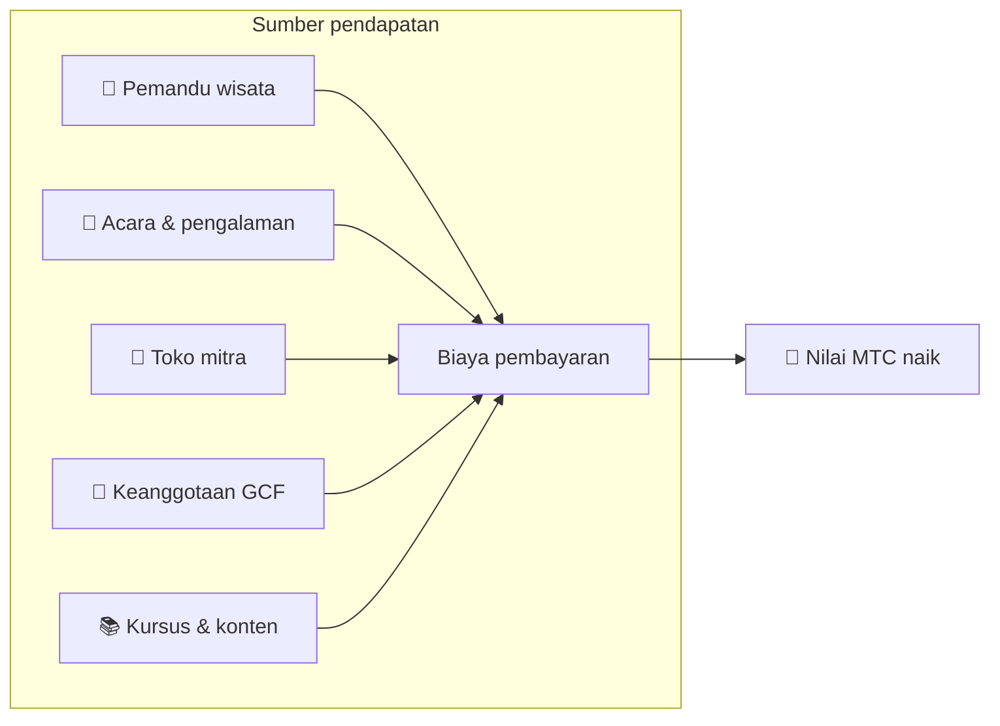

# 💰 Tokenomics — desain ekonomi MTC

> **Kepercayaan diukir ke dalam kode.**
> Desain ekonomi MTC dijamin bukan oleh janji seseorang, melainkan oleh matematika dan blockchain.


> **"Ekonomi di mana status quo tak bisa diubah dengan paksa" — itulah tokenomics MTC.**

Desain ekonomi Matsuri Coin (MTC) berdiri di atas satu keyakinan:
**aturan yang bahkan operator pun tak bisa rusak adalah jaminan terkuat yang mungkin bagi investor.**

Pasokan dipatok permanen. Penerbitan tambahan dan pembekuan dana tak mungkin. Pertumbuhan bisnis tercermin dalam harga pada tingkat persamaan —
bukan "janji," melainkan **fakta** yang diukir ke dalam blockchain.

Halaman ini secara terbuka mengungkapkan semua mekanik ekonomi MTC.

---

## Spesifikasi token

Untuk menjamin keamanan investor, kami telah secara permanen **melepas** baik "mint authority" maupun "freeze authority" di Solana.
Penerbitan tambahan secara permanen tak mungkin. Dana tak bisa dibekukan. Itu adalah **desain yang sepenuhnya trustless.**

| Item | Detail |
| :--- | :--- |
| **Nama token** | Matsuri Coin |
| **Ticker** | MTC |
| **Chain** | Solana |
| **Alamat mint** | `DRENpzmRWM4TwECrCPCfS1k5VBPmanhQg9bcCWP8EZXF` [Solscan →](https://solscan.io/token/DRENpzmRWM4TwECrCPCfS1k5VBPmanhQg9bcCWP8EZXF) |
| **Pasokan total** | **900 juta** (900.000.000 MTC), tetap |
| **Mint authority** | 🚫 Dilepas ([dapat diverifikasi on-chain](https://solscan.io/token/DRENpzmRWM4TwECrCPCfS1k5VBPmanhQg9bcCWP8EZXF)) |
| **Freeze authority** | 🚫 Dilepas ([dapat diverifikasi on-chain](https://solscan.io/token/DRENpzmRWM4TwECrCPCfS1k5VBPmanhQg9bcCWP8EZXF)) |
| **Manajemen lock** | Streamflow Finance (terverifikasi) |

:::info Mengapa ini penting
Melepas mint authority berarti "operator tak bisa mencetak lebih banyak token dan mendilusi bagianmu." Melepas freeze authority berarti "tak seorang pun bisa membekukan walletmu." Ini adalah fondasi trustlessness.
:::

---

## Alokasi token

900M MTC dialokasikan sebagai berikut.

<div className="mtc-alloc">
  <div className="mtc-alloc__donut" role="img" aria-label="Alokasi MTC: 61% Pool Penambangan, 39% Operasi Ekosistem">
    <div className="mtc-alloc__hole">
      <span className="mtc-alloc__total">900M</span>
      <span className="mtc-alloc__unit">MTC</span>
    </div>
  </div>
  <div className="mtc-alloc__legend">
    <div className="mtc-alloc__row mtc-alloc__row--mining">
      <span className="mtc-alloc__dot"></span>
      <span className="mtc-alloc__pct">61%</span>
      <span className="mtc-alloc__amount">⛏️ 550M MTC</span>
    </div>
    <div className="mtc-alloc__row mtc-alloc__row--ecosystem">
      <span className="mtc-alloc__dot"></span>
      <span className="mtc-alloc__pct">39%</span>
      <span className="mtc-alloc__amount">🌐 350M MTC</span>
    </div>
  </div>
</div>

| Kategori | Bagian | Jumlah | Tujuan |
| :--- | :---: | :--- | :--- |
| **⛏️ Pool penambangan** | **61%** | 550 juta | Pool imbalan untuk kontributor. Dibuka kunci Juni 2027, dilepas pada siklus halving dua tahun. Didistribusikan menurut skor kontribusi |
| **🌐 Operasi ekosistem** | **39%** | 350 juta | Pemasaran, distribusi GCF, beban operasional, pendanaan liquidity pool (LP), biaya pengembangan, iklan, penyelenggaraan acara, dan lainnya |

:::note Bagaimana pool penambangan dilepas
550M MTC tidak dilepas sekaligus. Ia mengikuti jadwal halving dua tahun dan **didistribusikan secara bertahap menurut skor kontribusi.** Aturan pelepasan dan distribusi akan diimplementasikan sebagai smart contracts secara bertahap mulai akhir 2026, dan menjadi dapat diverifikasi on-chain.
:::

:::note Tentang alokasi operasi ekosistem
Alokasi operasi 39% adalah dana multi-tujuan yang dibutuhkan untuk menumbuhkan ekosistem. Penggunaan konkret meliputi aktivitas pemasaran, distribusi awal kepada anggota GCF, penyediaan likuiditas ke pool Raydium, kompensasi tim pengembangan, iklan, dan pendanaan acara pengalaman budaya. Transparansi penggunaan akan tunduk pada tata kelola komunitas setelah perpindahan ke DAO.
:::

---

## Struktur pendapatan

Yang menopang nilai MTC adalah **pendapatan dari aktivitas bisnis nyata.** Bukan spekulasi — aktivitas ekonomi nyata mendukung nilai token.



| Sumber pendapatan | Detail |
| :--- | :--- |
| **🏯 Pengalaman & pemandu** | Biaya pembayaran dari pemandu wisata dan acara pengalaman budaya |
| **🤝 Keanggotaan GCF** | Biaya keanggotaan |
| **📚 Konten** | Biaya pendaftaran kursus, langganan media |
| **🏪 Marketplace** | Biaya transaksi dari toko mitra (berkembang bertahap) |

:::tip Pertumbuhan didukung oleh permintaan nyata
Semakin banyak pengunjung inbound yang tiba, semakin banyak mata uang asing mengalir masuk dan semakin besar ekosistem tumbuh. Nilai MTC ditetapkan bukan oleh spekulasi tetapi oleh **jumlah orang yang mengalami budaya.**
:::

---

## Traksi bisnis saat ini

Ekonomi MTC masih dini, tetapi aktivitas nyata telah dimulai.

| Metrik | Status |
| :--- | :--- |
| **Acara diselenggarakan** | 50+ (operasi uji coba) |
| **Anggota GCF Platinum** | 20 dari 50 kursi terisi |
| **Anggota GCF Gold** | Rekrutmen segera dibuka |
| **Platform web** | Aktif, saat ini mengumpulkan dan melayani pengguna uji coba |
| **Aplikasi iOS** | Pengembangan selesai, dijadwalkan rilis April 2026 |

:::note Pernyataan jujur
Kami belum memiliki rekam jejak "kesuksesan besar." 50 acara dan operasi uji coba — itulah realitas hari ini. Tetapi produk berjalan, komunitas ada, dan kami berada di fase scaling up dari sini secara serius.
:::

---

## Protokol buyback

Kami tidak sekadar mengantongi keuntungan.
Persentase tetap dari pendapatan bisnis dialokasikan untuk **membeli kembali MTC dari pasar.**

| Sumber pendapatan | Alokasi | Tindakan |
| :--- | :---: | :--- |
| **Pendapatan Matsuri HQ** (pemandu, acara) | **20%** | **Buyback** dari pasar + tambahan liquidity pool |
| **Keanggotaan GCF** (biaya keanggotaan) | **25%** | **Buyback** dari pasar |

:::info Status buyback hari ini
Protokol buyback akan **mulai beroperasi** seiring meningkatnya pendapatan bisnis. Awalnya berjalan off-chain (manual); ia bermigrasi bertahap ke eksekusi otomatis oleh smart contract mulai akhir 2026. Setelah on-chain, riwayat eksekusi penuh dari buyback akan dapat diverifikasi di blockchain oleh siapa pun.
:::

Buyback bukan janji "suatu saat." Mereka adalah aturan yang diprogram sebagai protokol. Setiap kali pendapatan bisnis naik, MTC otomatis diserap dari pasar — **jaminan struktural** untuk investor.

---

## Logika pembentukan harga

Mekanisme harga naik MTC didasarkan bukan pada harapan, melainkan pada **persamaan AMM (automated market maker).**

```
Harga = Likuiditas (SOL) ÷ Pasokan (MTC)
```

| Langkah | Apa yang terjadi | Hasil |
| :---: | :--- | :--- |
| **①** | Pendapatan bisnis (SOL) disuntikkan ke pool | **Pembilang naik** |
| **②** | Dana tersebut membeli kembali MTC dari pasar dan membakarnya | **Penyebut turun** |
| **③** | Pembilang ↑ × penyebut ↓ | **Kondisi untuk kelangkaan yang naik terpenuhi** |

:::info Deskripsi mekanisme, bukan jaminan harga
Persamaan ini menggambarkan desain struktural: jika pendapatan bisnis berlanjut dan buyback dieksekusi, keseimbangan penawaran-permintaan bergerak ke arah kelangkaan. Harga aktual bergantung pada permintaan pasar, kondisi eksternal, likuiditas, dan banyak faktor lain.
:::

---

## Jadwal halving

**550 juta MTC (sekitar 61% pasokan total)** yang terbuka pada 1 Juni 2027 tak akan dilepas ke pasar. Mereka dicadangkan sebagai **pool imbalan untuk kontributor.**

Kami telah mengadopsi **siklus halving dua tahun**, lebih cepat dari siklus empat tahun Bitcoin.
Tingkat pelepasan dibagi dua setiap dua tahun, menjaga imbalan mengalir secara teori selama puluhan tahun.

| Periode | Bagian pelepasan | Jumlah dilepas | Kumulatif |
| :--- | :---: | :--- | :---: |
| **Periode 1** 2027–2029 | **50%** | ~275M | 50% |
| **Periode 2** 2029–2031 | **25%** | ~137M | 75% |
| **Periode 3** 2031–2033 | **12,5%** | ~68M | 87,5% |
| **Periode 4** 2033–2035 | **6,25%** | ~34M | 93,75% |
| **Periode 5 dan seterusnya** | Lanjut halving | Berkurang | → asimtot ke 100% |

<small>*Secara matematis ia tak pernah mencapai 100%, dan pelepasan secara asimtot mendekati nol. Prinsip yang sama dengan Bitcoin.*</small>

:::tip Semakin awal kamu berkontribusi, semakin banyak MTC yang kamu terima
Karena halving, periode 1 (2027–2029) memiliki jumlah pelepasan terbesar, dan tiap epoch berikutnya melepas lebih sedikit per acara. Dengan kata lain, **mereka yang membangun skor kontribusi lebih awal menerima lebih banyak MTC.**

Contoh aktivitas yang dihitung untuk skor kontribusi:
- Rekam jejak pembuatan dan kehadiran acara
- Menjalankan kursus berpemandu yang populer
- Merujuk dan mengembangkan pemandu yang luar biasa
- Tampilan dan share konten J-Times
- Check-in ziarah tempat suci

Imbalan ditentukan bukan oleh "urutan bergabung" melainkan oleh **"jumlah dan kualitas kontribusi".**
:::

---

:::note Halaman berikutnya
Sekarang setelah kamu memahami desain ekonomi MTC, mari kita lihat **cara bergabung sebagai mitra.**
**[Keanggotaan GCF →](/docs/gcf)**
:::
