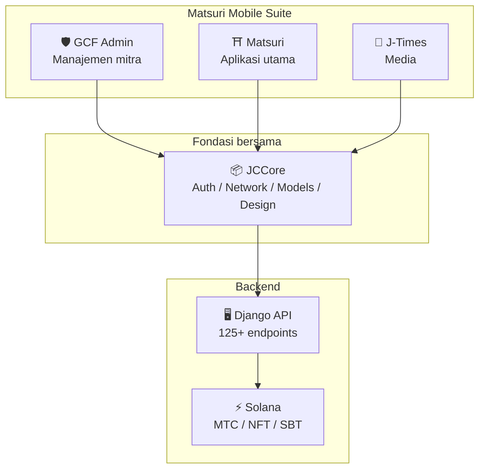
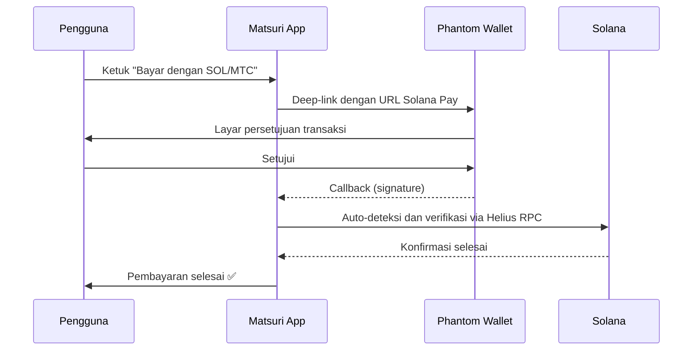
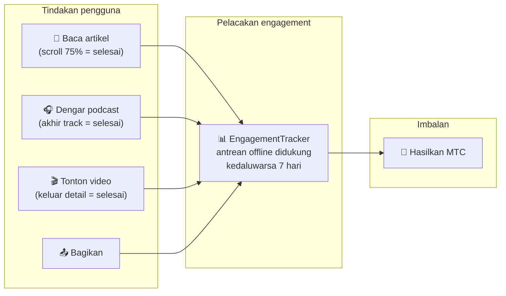
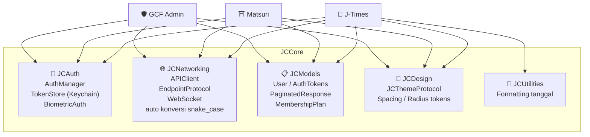
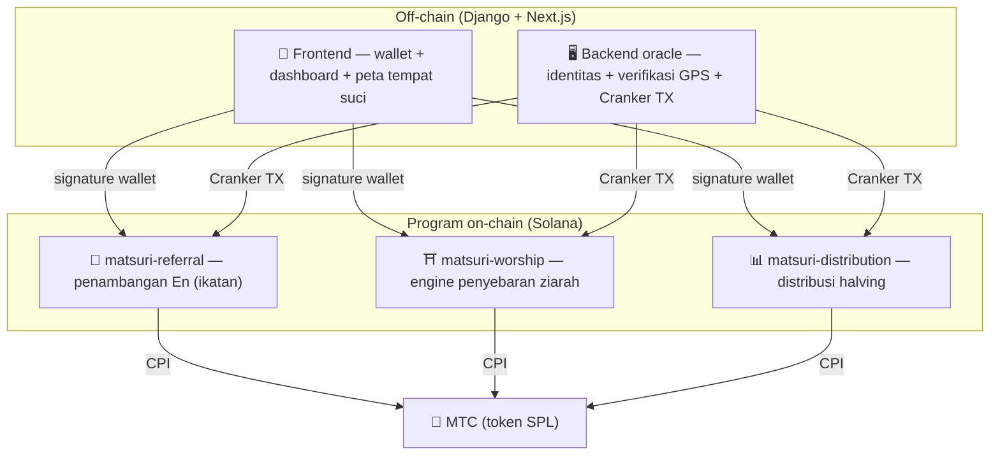
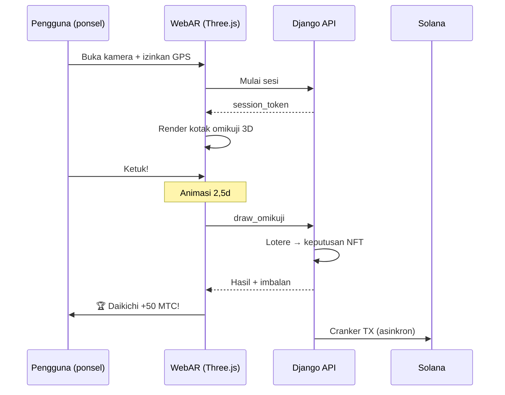

import useBaseUrl from '@docusaurus/useBaseUrl';

# 🔧 Produk & teknologi — yang berjalan membuktikan segalanya

> **Yang berjalan membuktikan segalanya.**
> Misi kami bukan sekadar kata-kata. Platform web sudah aktif, dan aplikasi iOS berada di tahap akhir.

Aplikasi web dan dashboard admin **sedang dalam produksi**. Tiga aplikasi iOS native telah selesai dan dirilis selama April–Mei 2026 (Matsuri awal Mei). Smart contracts di Solana adalah open source — kami berbicara bukan dalam konsep, melainkan dalam **kode yang berjalan dan produk yang akan segera mendarat.**

---

## Tinjauan aplikasi

| Aplikasi | Tujuan | Status | Bahasa didukung |
| :--- | :--- | :---: | :--- |
| **GCF Admin** | Manajemen mitra dan tooling operasional | ✅ Dirilis | 🇯🇵🇬🇧🇨🇳🇹🇭🇳🇴 |
| **Matsuri** | Aplikasi konsumen utama | ✅ Dirilis | 🇯🇵🇬🇧🇨🇳🇹🇭🇳🇴 |
| **J-Times** | Media budaya dan pembelajaran | ✅ Dirilis | 🇯🇵🇬🇧 |

---

## 1. 🛡️ GCF Admin — aplikasi manajemen mitra

:::info Status: dirilis di App Store (v1.0)
Aplikasi manajemen operasional untuk anggota GCF (Global Community Friends). Seluruh fungsionalitas layar admin web, dipadatkan di mobile.
:::

  

  
  
  

### Apa yang bisa dilakukan aplikasi

| Kategori | Fitur |
| :--- | :--- |
| **📊 Dashboard** | Kartu KPI, grafik pendapatan, aksi cepat |
| **👥 Manajemen anggota** | Daftar, detail, pengeditan, manajemen tingkat |
| **💰 Manajemen pendapatan** | Pelacakan komisi, manajemen penarikan MTC, manajemen pembayaran |
| **📝 Manajemen konten** | Buat, edit, dan terbitkan acara, artikel, podcast, dan video |
| **🎫 Slot pemandu** | Kelola slot pemandu dan lacak pendapatan |
| **🖼️ Dashboard NFT** | Founder's Collection, verifikasi on-chain, transfer NFT |
| **⛩️ Manajemen tempat suci** | CRUD tempat, konfigurasi beacon |
| **🎲 Konfigurasi penambangan AR** | Tabel probabilitas Omikuji, manajemen parameter imbalan |
| **📊 Analytics** | Laporan error, analitik penggunaan |
| **🔗 Referral** | Pembuatan QR kustom, manajemen program referral |

### Spesifikasi teknis

| Item | Detail |
| :--- | :--- |
| **Arsitektur** | Clean Architecture + MVVM + `@Observable` (iOS 17) |
| **Bahasa / SDK** | Swift 6.0 / Xcode 16+ / iOS 17.0+ |
| **Integrasi API** | 125+ endpoints |
| **Tests** | 226 tests / 45 kelas test |
| **Lokalisasi** | 5 bahasa (JP/EN/CN/TH/NO) / 957+ kunci terjemahan |
| **Swift Concurrency** | Patuh Strict Concurrency / nol peringatan build |

### Integrasi kode QR

GCF Admin bisa membuat kode QR kustom merek Matsuri. Use case serbaguna — undangan acara, link referral, permintaan pembayaran, dan lainnya.

---

## 2. ⛩️ Matsuri — aplikasi utama

:::info Status: dirilis di App Store (v3.0)
Aplikasi utama untuk pengguna reguler. Pemesanan acara, pembayaran, wallet Web3, penambangan AR — semua selesai dalam satu aplikasi. **Sekarang aktif di App Store.**
:::

  

  
  
  

### Apa yang bisa dilakukan aplikasi

| Kategori | Fitur |
| :--- | :--- |
| **🎪 Pemesanan acara** | Pencarian, pemesanan, pembayaran Stripe, manajemen QR tiket |
| **💳 Empat metode pembayaran** | Kartu kredit / kartu tersimpan / saldo MTC / crypto (SOL/MTC) |
| **👛 Wallet Web3** | Lihat saldo MTC, kirim/terima, riwayat transaksi |
| **🖼️ Galeri NFT** | Daftar NFT/SBT yang dipegang, verifikasi on-chain |
| **🗺️ Peta tempat suci** | Tampilan peta kuil dan candi, check-in |
| **🎲 Penambangan AR** | Pengalaman omikuji WebAR, hasilkan MTC |
| **💬 Chat** | Pesan dengan menu konteks |
| **⭐ Wishlist** | Simpan acara dan pengalaman favorit |
| **🔍 Pencarian lanjutan** | Pencarian suara didukung |
| **🤝 Referral** | Bergabung dengan program referral, lacak imbalan |
| **📊 Dashboard GCF** | Tampilan admin ringan untuk anggota GCF |

### Integrasi Phantom Wallet — pembayaran crypto tanpa input

>**Tak perlu copy-paste alamat.** Phantom Wallet otomatis diluncurkan dan pembayaran selesai dengan satu persetujuan. Signature transaksi otomatis terdeteksi melalui Helius RPC.

### Spesifikasi teknis

| Item | Detail |
| :--- | :--- |
| **Arsitektur** | Clean Architecture + MVVM + Swift Concurrency |
| **Bahasa / SDK** | Swift 6.0 / Xcode 16+ / iOS 17.0+ |
| **Pembayaran** | Stripe PaymentSheet + MTC Balance + Phantom (Solana Pay) |
| **Integrasi API** | 72 endpoints / 16 kategori |
| **Tests** | 230+ (Model, ViewModel, Network, Security, DeepLink, E2E) |
| **Lokalisasi** | 5 bahasa (JP/EN/CN/TH/NO) / 406 kunci terjemahan |
| **ViewModels** | 25 (sepenuhnya MVVM — nol panggilan API langsung dari Views) |
| **Autentikasi** | Apple Sign In / Google Sign In (PKCE) |

---

## 3. 📰 J-Times — aplikasi media budaya

:::info Status: dirilis — aktif di App Store
Platform media yang menyampaikan kedalaman budaya Jepang. Baca artikel, dengar podcast, tonton video — setiap tindakan menghasilkan MTC.
:::

  

  
  

### Apa yang bisa dilakukan aplikasi

| Kategori | Fitur |
| :--- | :--- |
| **📖 Artikel** | Hero parallax, drop caps, bilah progres baca, konten kaya (Markdown, tabel, kutipan) |
| **🎧 Podcast** | Penjelajahan seri, pemutar gelombang, sleep timer, AirPlay, kontrol layar kunci |
| **🎬 Video** | Tampilan grid/daftar adaptif, video pendek (gaya TikTok, double-tap) |
| **🔍 Pencarian** | Multi-filter, tag tren, pencarian suara |
| **🧭 Discovery** | Carousel unggulan, pilihan staf, weekly top |
| **📚 Library** | Favorit, riwayat (per tanggal), unduhan, playlist |
| **🎵 Pemutar audio** | Mini player (kontrol swipe), pemutar penuh (gelombang, lirik, ulang) |
| **👤 Keanggotaan** | Perbandingan fitur di 3 tingkat (Free / Premium / Pro), pemulihan pembelian |

### Media Mining — membaca, mendengar, dan menonton sebagai penambangan

>**Dicatat bahkan offline.** Baca artikel di kuil gunung di mana tak ada sinyal — saat jaringan kembali, engagement otomatis dikirimkan dan MTC dikreditkan.

### Sistem desain — "empat pilar" estetika Jepang

J-Times menggunakan sistem desain orisinal yang membawa estetika Jepang tradisional ke UI modern.

| Pilar | Konsep | Penerapan UI |
| :--- | :--- | :--- |
| **墨 (sumi — tinta)** | Abu netral hangat | Latar belakang, hierarki teks |
| **朱 (shu — vermilion)** | Merah Jepang (#C53030) | Warna aksen, aksi penting |
| **間 (ma — ruang)** | Ruang negatif pada grid 4pt | Spasi, ruang bernapas |
| **紙 (kami — kertas)** | Tekstur halus, glassmorphism | Permukaan kartu, kedalaman |

### Spesifikasi teknis

| Item | Detail |
| :--- | :--- |
| **Arsitektur** | Clean Architecture + MVVM + Swift Concurrency |
| **Bahasa / SDK** | Swift 6.0 / Xcode 16+ / iOS 17.0+ |
| **Dependensi eksternal** | **Nol** — hanya framework first-party Apple |
| **Integrasi API** | 40+ endpoints |
| **Tests** | 371 tests / 20 file |
| **Lokalisasi** | 2 bahasa (JP/EN) / 310+ kunci terjemahan |
| **Dukungan offline** | ContentCache (50MB) + ImageDiskCache (200MB) + manajer unduhan |
| **Autentikasi** | Apple Sign In / Google Sign In (PKCE) |

---

## Fondasi bersama: pustaka JCCore

Pustaka Swift Package yang dibagi di ketiga aplikasi.

| Modul | Peran |
| :--- | :--- |
| **JCAuth** | Manajemen token berbasis Keychain, autentikasi biometrik (Face ID / Touch ID) |
| **JCNetworking** | Klien API yang aman tipe, WebSocket, konversi otomatis JSON snake_case |
| **JCModels** | Model data umum di seluruh aplikasi (User, AuthTokens, dll.) |
| **JCDesign** | Protokol tema, design tokens (spacing, corner radius) |
| **JCUtilities** | Utilitas tanggal dan string |

---

## Keamanan dan privasi

| Item | Implementasi |
| :--- | :--- |
| **Token autentikasi** | Dienkripsi dan disimpan di iOS Keychain (TokenStore) |
| **Autentikasi biometrik** | Dua faktor via Face ID / Touch ID |
| **Komunikasi API** | HTTPS + certificate pinning |
| **Kunci privat wallet** | Tak pernah disimpan di aplikasi — didelegasikan ke Phantom Wallet |
| **Penambangan AR** | Gambar kamera tak dikirim ke server (VisionProof) |
| **Data offline** | Enkripsi SwiftData + kedaluwarsa otomatis |
| **Swift Concurrency** | Isolasi actor mencegah race conditions |

---

## Kualitas pengembangan

### Aplikasi mobile: **827+ test otomatis** di ketiga aplikasi.

| Aplikasi | Tests | Area cakupan |
| :--- | :---: | :--- |
| **GCF Admin** | 226 | Model, ViewModel, Repository, API, Lokalisasi, Navigasi |
| **Matsuri** | 230+ | Model, ViewModel, Network, Security, DeepLink, Regression, Performance, E2E |
| **J-Times** | 371 | Model, ViewModel, API, Repository, Navigasi, Lokalisasi, Security, Performance |

### Smart contracts: tests berkembang bertahap

Untuk program Rust di Solana, kami telah memulai dengan unit tests untuk logika inti (modul math), dan memperluas cakupan test bertahap dalam persiapan audit keamanan (Q2–Q3 2026).

---

## Smart contracts — desain open source

>**Filosofi desain trustless.**
> Perhitungan imbalan, pohon referral, jadwal halving — setiap potong logika berjalan **on-chain** dan dapat diaudit oleh siapa pun.
> Sumber: [GitHub](https://github.com/Cootakahashi/matsuri-contracts)

---

### Kontributor

| Anggota | Peran |
| :--- | :--- |
| **Ko Takahashi** | Founder / Lead Developer — arsitektur, smart contracts, pengembangan full-stack |

> 🌏**Ke depan, anggota GCF dan komunitas pengembang seluruh dunia juga akan bergabung dalam upaya pengembangan bersama.**
> Sebagai "infrastruktur budaya" yang dibangun untuk bertahan, Matsuri Protocol dibangun di atas transparansi dan kepemilikan bersama.

---

### Struktur keseluruhan

Matsuri men-deploy **tiga program Anchor (Rust)** di Solana, masing-masing membawa salah satu pilar ekosistem.

---

### 1. 📣 En-Mining (縁 — ikatan / koneksi)

**Tujuan:** Engine pertumbuhan hibrida yang memberi imbalan baik "lebar" (jaringan referral) dan "kedalaman" (dampak ekonomi). Bukan pemasaran afiliasi sederhana, melainkan protokol penambangan lengkap di mana aktivitas ekonomi dunia nyata menghasilkan nilai on-chain.

#### Desain skoring

Skor kontribusi didasarkan pada dua komponen berbobot:

| Komponen | Bobot | Tujuan |
| :--- | :---: | :--- |
| **Lebar** (jumlah referral) | 30% | Jangkauan jaringan — berapa banyak orang yang kamu bawa |
| **Kedalaman** (volume pembayaran) | 70% | Dampak ekonomi — pembelian nyata, bukan sekadar pendaftaran |

Skor terakumulasi seiring waktu dan dikonversi menjadi MTC pada tiap epoch halving. Mekanisme boost tambahan direncanakan:

| Boost | Deskripsi | Status |
| :--- | :--- | :---: |
| **Toku (徳 — kebajikan) staking** | Kunci MTC untuk mem-boost skor kontribusi (boost hingga ~50%). Tingkat dan pengganda yang tepat dikalibrasi terhadap jadwal pelepasan pool halving | ⬜ Koefisien TBD |
| **Peringkat musim** | Pemain top tiap epoch mendapatkan gelar **Evangelist** (SBT permanen) dan boost skor. Tarif yang tepat ditentukan oleh tata kelola | ⬜ Koefisien TBD |

:::info Desain parameter progresif
Koefisien boost (tingkat staking, bonus peringkat) sengaja dapat disesuaikan. Mereka akan difinalisasi dan dikunci ke smart contracts berdasarkan data ekosistem aktual — total pengguna aktif, tingkat pelepasan pool halving, tujuan stabilitas harga. Pendekatan ini menjamin **distribusi adil** tanpa terlalu menjanjikan return tetap.
:::

#### Pertahanan anti-sybil (tiga lapis)

| Lapis | Mekanisme | Lokasi |
| :--- | :--- | :--- |
| **Gerbang identitas** | OAuth X/Twitter + SMS | Off-chain (Django) |
| **Gerbang on-chain** | Hanya profil dengan `is_verified = true` yang menghasilkan imbalan | Smart contract |
| **Pembobotan kedalaman** | 70% skor = pembayaran nyata → bot tak menghasilkan apa pun | Engine skoring |

---

### 2. ⛩️ Engine penyebaran ziarah (Worship Routing Engine)

**Tujuan:** **Protokol ReFi** pertama di dunia yang menyelesaikan overtourism menggunakan ekonomi token. Kunjungi tempat suci untuk menghasilkan MTC. Twist kritis: *semakin sedikit pengunjung di sebuah tempat, semakin banyak imbalan yang kamu dapatkan secara eksponensial.*

:::tip Wawasan inti
"Penetapan harga surge Uber terbalik" — tempat-tempat ramai dihukum, tempat frontier di-boost. Wisatawan secara sukarela bergerak ke tempat yang kurang dikunjungi **karena mereka lebih menguntungkan.**
:::

#### Prinsip desain imbalan

Skor kontribusi untuk setiap kunjungan ditentukan oleh banyak faktor:

| Faktor | Prinsip | Efek |
| :--- | :--- | :--- |
| **Popularitas tempat** | Lebih sedikit pengunjung = skor lebih tinggi | Sebarkan turis dari area ramai |
| **Waktu kunjungan** | Pengunjung lebih awal pada hari tertentu menghasilkan lebih | Dorong kunjungan off-peak |
| **Tingkat regional** | Tempat regional dan frontier berperingkat tertinggi | Mendorong revitalisasi regional |
| **Frekuensi kunjungan** | Pengunjung reguler menumpuk skor bonus | Memberi imbalan engagement berkelanjutan |
| **Keberuntungan omikuji** | Tarikan bonus acak per check-in | Elemen gamification yang menyenangkan |
| **Boost yang disponsori** | Kotamadya bisa mem-boost tempat tertentu | Model pendapatan B2B/B2G |

:::info Koefisien dapat disesuaikan
Pengganda yang tepat untuk setiap faktor (misalnya, seberapa lebih banyak yang dihasilkan tempat regional dibandingkan tempat major) disetel berdasarkan **jadwal pool halving** dan data penggunaan nyata, dan dikunci ke smart contracts secara bertahap. Prinsip desain tetap — koefisien berkembang dengan ekosistem.
:::

---

### 3. 📊 Distribusi halving

**Tujuan:** Terinspirasi oleh jadwal halving Bitcoin, distribusi MTC otomatis halving per epoch. Kelangkaan dijamin secara matematis.

| Instruksi | Deskripsi |
| :--- | :--- |
| `initialize` | Inisialisasi pool distribusi |
| `register_miner` | Daftarkan penambang |
| `update_score` | Perbarui skor |
| `advance_epoch` | Majukan epoch (eksekusi halving) |
| `claim_distribution` | Klaim imbalan distribusi |

---

### 4. 🎴 Penambangan AR — pengalaman omikuji WebAR

**Tujuan:** Buat omikuji AR muncul di ruang nyata, hanya menggunakan browser ponsel, dan tambang MTC melaluinya. **Tak perlu unduhan aplikasi.** Infrastruktur WebAR × blockchain pertama di dunia, memadukan spiritualitas Shinto dengan teknologi terdepan.

#### Arsitektur

#### Konfigurasi probabilitas Omikuji (admin GCF)

Basis Points (10000 = 100%) dengan presisi 0,01%. Dapat disesuaikan dari layar admin GCF.

| Tingkat | Kelangkaan | Bonus | NFT |
|------|-----------|---------|-----|
| 🏆 Daikichi | Langka | Bonus maksimum | ✅ |
| ✨ Kichi | Tidak umum | Bonus tinggi | Opsional |
| 🌸 Shōkichi | Umum | Bonus kecil | — |
| 🍃 Suekichi | Umum | Catatan partisipasi | — |
| 💀 Kyō | Tidak umum | Catatan partisipasi | — |

Probabilitas dan koefisien imbalan akan difinalisasi bertahap berdasarkan ukuran ekosistem dan jumlah pelepasan halving, dan diimplementasikan dalam smart contracts.

#### ZK-Proof of Vision (keamanan 5 lapis)

Menghapus spoofing GPS dan serangan replay dalam beberapa lapis. **Untuk melindungi privasi, gambar kamera tak pernah dikirim ke server.**

| Lapis | Apa yang diverifikasi | Bobot |
| :--- | :--- | :--- |
| Temporal | Waktu sesi 5–120d | /20 |
| Motion | Naturalitas gyro (deteksi getaran tangan) | /20 |
| Light | Konsistensi cahaya sekitar × waktu hari | /20 |
| HMAC | Verifikasi signature proof_hash | /20 |
| Fingerprint | Keunikan perangkat | /20 |
| **Total** | **60/100 atau lebih = PASS** | |

#### Desain imbalan

Imbalan dicatat sebagai **skor kontribusi** berdasarkan banyak faktor termasuk jenis tempat, hasil omikuji, dan tingkat regional. Koefisien spesifik difinalisasi bertahap selaras dengan jadwal pelepasan halving dan pertumbuhan ekosistem, dan diimplementasikan dalam smart contracts.

---

### Modul math murni (logika inti yang dapat diaudit)

Setiap program mengisolasi perhitungan skor dan imbalan ke dalam **modul `math.rs` murni yang dapat diaudit:**

- **Nol efek samping** — tak ada I/O, tak ada alokasi memori, tak ada panggilan eksternal
- **Formula didokumentasi** — notasi gaya LaTeX di dalam rustdoc
- **Analisis overflow** — antara u128 dengan rentang terbukti
- **Tests komprehensif** — kasus tepi, kondisi batas, verifikasi rasio
- **Koefisien dapat disesuaikan** — parameter imbalan dirancang dapat diperbarui melalui tata kelola, memungkinkan kalibrasi bertahap saat ekosistem tumbuh

---

### Model keamanan

Kontrak ini **sepenuhnya open source.** Keamanan didasarkan pada jaminan matematis, bukan kekaburan.

| Prinsip | Implementasi |
| :--- | :--- |
| **Vault hanya PDA** | Vault token dikontrol oleh PDA (program-derived addresses) — tak ada kunci manusia yang bisa menarik |
| **Aritmatika checked** | Semua perhitungan menggunakan aritmatika `checked_*` — overflow tak mungkin |
| **Pemisahan otoritas** | Admin (multisig) ≠ Cranker (aksi terbatas) ≠ Pengguna (self-custody) |
| **Pause darurat** | Admin bisa mem-pause program hanya sebagai respons terhadap ancaman keamanan. Tetapi **tak ada pergerakan atau penyitaan dana yang mungkin** — pause adalah "perisai untuk melindungi," bukan cara mengubah aturan |
| **Tokenomics tak berubah** | Tingkat halving, total pool, dan panjang epoch tak bisa diubah setelah konfigurasi awal |
| **Modul math murni** | Logika imbalan/skoring berada di pustaka math terpisah yang dapat di-test |
| **Vision Proof** | Deteksi spoof 5 lapis yang tak pernah mentransmisikan data kamera (menjaga privasi) |

---

**[▶ Berikutnya: Roadmap & tim](/docs/roadmap)** | **[◀ Sebelumnya: Tokenomics](/docs/tokenomics)**
