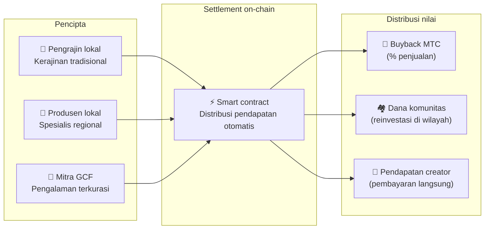

import useBaseUrl from '@docusaurus/useBaseUrl';

# 🗓️ Roadmap & tim

>**Kepada mereka yang telah membaca sejauh ini — visi, desain ekonomi, dan fondasi teknis semua sudah pada tempatnya.**
> Kami bukan proyek spekulatif jangka pendek.
>**Pengembangan platform utama sudah selesai,** dan kami memasuki fase scaling-up.

---

## Tonggak strategis

### 🔥 Fase 1: Kebangkitan (paruh pertama 2026 — sekarang)

**Tema: fondasi dan arus kas**

Platform web aktif, dan ketiga aplikasi iOS (GCF Admin, J-Times, Matsuri) sekarang aktif di App Store sejak April 2026. Kami fokus pada monetisasi melalui sistem keuangan yang dipimpin CEO dan mengamankan likuiditas awal.

| Status | Tonggak | Detail |
| :---: | :--- | :--- |
| ✅ | **Platform web aktif** | Aplikasi web Matsuri dan dashboard admin GCF (web) berjalan |
| ✅ | **Pembayaran dan pertumbuhan** | Fungsi pembayaran MTC dan fungsi airdrop referral diimplementasikan |
| ✅ | **Peluncuran media** | Basis distribusi J-Times (web & podcast) dibangun |
| ✅ | **Genesis** | Token MTC diterbitkan di chain Solana |
| ✅ | **Likuiditas terjamin** | Liquidity pool awal di Raydium dibuat |
| ⬜ | **Insentif dimulai** | Peluncuran liquidity mining dengan target APY 20% |
| ⬜ | **Pembayaran on-chain** | Verifikasi Solana Pay masuk produksi |
| ⬜ | **Rekrutmen VIP** | Seleksi 20 anggota VIP GCF awal selesai |

### 🚀 Fase 2: Ekspansi (paruh kedua 2026)

**Tema: aset nyata dan penambangan petualangan**

Kami sepenuhnya memanfaatkan webapp yang sudah selesai, memperluas basis fisik dan fitur "ziarah".

| Status | Tonggak | Detail |
| :---: | :--- | :--- |
| ⬜ | **Rilis fitur baru** | Implementasi dan rilis penambangan petualangan (ziarah) |
| ⬜ | **Ekspansi luar negeri** | Pengembangan basis mitra di Asia (Thailand, Taiwan, dll.) & acara VIP |
| ⬜ | **Manajemen aset** | Bangun portfolio real estate, ekuitas, dan crypto |
| ⬜ | **Target** | Skala aset seluruh ekosistem **¥1 miliar (~6,5 juta $)** |

### 🌊 Fase 3: Sirkulasi (sejak 2027)

**Tema: adopsi massal, ekonomi kreasi bersama, desentralisasi**

Buka untuk publik, marketplace on-chain, dan operasi ekosistem penuh.

| Status | Tonggak | Detail |
| :---: | :--- | :--- |
| ⬜ | **Grand opening** | Rilis resmi Matsuri App di seluruh dunia |
| ⬜ | **Great unlock (1/6/2027)** | Lockup founder unlock + pool penambangan (550M) aktif + siklus halving dimulai |
| ⬜ | **Marketplace kreasi bersama** | Toko spesialis regional + toko mitra GCF — pembayaran on-chain dengan buyback MTC otomatis |
| ⬜ | **Crowdfunding (hak NFT)** | Pengguna mendanai proyek budaya di Solana. Backer menerima NFT yang merepresentasikan kepemilikan, bagi hasil, dan hak tata kelola |
| ⬜ | **Pembayaran on-chain** | Semua transaksi marketplace diselesaikan oleh smart contract — persentase tetap dari penjualan otomatis dirutekan ke pool buyback MTC |
| ⬜ | **Target** | Skala aset seluruh ekosistem **¥10 miliar (~65 juta $)** |
| ⬜ | **Transisi DAO** | Bertahap mengalihkan otoritas pengambilan keputusan ke komunitas GCF |

#### 🏪 Konsep marketplace kreasi bersama

Ekspresi tertinggi dari "OS budaya" — marketplace terdesentralisasi di mana **pencipta budaya dan pencinta budaya bertransaksi langsung**, tanpa perantara ekstraktif.

| Fitur | Deskripsi | Status |
| :--- | :--- | :---: |
| **🏺 Toko spesialis regional** | Pengrajin dan produsen lokal menjual langsung ke pelanggan di seluruh dunia. Diskon 5–10% saat membayar dalam MTC | ⬜ Konsep |
| **🎫 Crowdfunding + hak NFT** | Danai proyek budaya (restorasi kuil, kebangkitan festival, lokakarya pengrajin). Terima NFT yang membuktikan kontribusimu dan dapat memberikan bagi hasil atau hak tata kelola | ⬜ Konsep |
| **⚡ Settlement on-chain** | Setiap transaksi marketplace diselesaikan via smart contract Solana. Pendapatan auto-split: pembayaran creator + dana komunitas + buyback MTC — tak perlu pembukuan manual | ⬜ Konsep |
| **🗳️ Tata kelola backer** | Pemegang NFT memilih bagaimana proyek yang mereka danai mengalokasikan sumber daya — bukan sekadar donasi, melainkan kreasi bersama nyata | ⬜ Konsep |

:::info Mengapa ini penting
Hari ini, turis membeli oleh-oleh dari toko yang membayar "sewa" ke tuan tanah mereka — platform. Besok, **seorang pengrajin pedesaan di Kyoto akan menjual langsung ke fan di Kopenhagen**, dan sebagian dari penjualan itu akan otomatis memperkuat ekonomi MTC. Ini adalah roda gila dalam bentuknya yang paling lengkap.
:::

---

## 👤 Tim

  

### Ko Takahashi — founder / CEO & lead architect

| Item | Detail |
| :--- | :--- |
| **Peran** | Kepemimpinan proyek keseluruhan. Desain platform, smart contracts, pengembangan full-stack |
| **Visi** | Pengusung "OS budaya" yang "mengekspor budaya dan mengimpor kekayaan" |
| **Sikap** | Menulis kode sendiri dan berdiri di lapangan sendiri (Golden Gai) — praktisi "skin in the game" |

  

### Jon Anders Jensen — direktur / operasi GCF & acara

| Item | Detail |
| :--- | :--- |
| **Peran** | Operasi GCF. Merancang operasi acara dan tur dan bekerja di lapangan |
| **Kekuatan** | Mendukung aliran "manusia" ekosistem melalui perspektif internasional dan hubungan terpercaya dengan anggota GCF |

  

### Ryunosuke Honda — direktur / duta budaya regional

| Item | Detail |
| :--- | :--- |
| **Peran** | Jembatan antara budaya regional dan komunitas di seluruh Jepang dan ekosistem Matsuri |
| **Kekuatan** | Menemukan aset budaya regional dan membawanya ke platform Matsuri untuk menyampaikan pengalaman "Deep Japan" |

### 🌏 Komunitas GCF — anggota pengembangan tersebar di seluruh dunia

Matsuri Protocol tidak dibangun oleh tim pendiri sendiri.
**Anggota GCF di seluruh dunia** berkontribusi pada evolusi protokol melalui pengujian, umpan balik, terjemahan, dan deployment regional.

| Area | Struktur |
| :--- | :--- |
| **💼 Keuangan global** | Kemitraan dengan jaringan investor swasta di seluruh Asia |
| **⚙️ Engineering** | Tim engineering terdistribusi di blockchain dan pengembangan aplikasi mobile |
| **🏮 Operasi** | Pipeline kuat dengan komunitas lokal di Shinjuku Golden Gai dan destinasi wisata utama |
| **🌐 Komunitas** | Basis anggota GCF multinasional termasuk Jepang, Norwegia, Thailand, dan Taiwan |

:::tip Infrastruktur budaya yang kita bangun bersama
Jika kamu bergabung dengan GCF, kamu juga menjadi co-developer Matsuri Protocol.
Menulis kode bukan satu-satunya bentuk kontribusi. Memperkenalkan tempat suci di daerahmu, menerjemahkan dokumentasi, merencanakan acara —
semuanya adalah kekuatan yang membawa protokol ini ke dunia.
:::

---

## 🏛️ Tata kelola (DAO)

Matsuri Protocol bermigrasi bertahap dari sentralisasi ke **DAO (organisasi otonom terdesentralisasi)**.
Anggota GCF (Platinum / Gold) pada akhirnya akan memegang **hak suara** atas hal-hal kunci berikut.

| Item suara | Konten |
| :--- | :--- |
| **💰 Alokasi dana** | Bisnis baru dan pemasaran apa untuk menginvestasikan pendapatan bisnis |
| **⚙️ Pembaruan protokol** | Penyetelan halus tarif biaya app dan tarif imbalan penambangan |
| **⛩️ Akreditasi budaya** | Festival dan kuil mana yang akan diakreditasi sebagai "tempat ziarah resmi" dan didukung secara finansial |

:::info Bergabunglah dengan revolusi
Kami tidak hanya membangun aplikasi.
Kami sedang membangun **ekonomi budaya tanpa batas.**
:::

---

**[◀ Sebelumnya: Produk & teknologi](/docs/product-tech)** | **[⛩️ Kembali ke puncak whitepaper](/docs/intro)**
