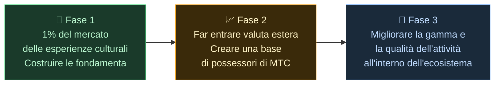

# 🌏 Problemi e soluzioni — verità scomode e speranza

> **La missione è bella. La realtà le si frappone.**

---

## Ma ci sono verità scomode che ostacolano questa missione

:::info Un mercato da 10.000 miliardi di yen (~66 miliardi di dollari), e la sua energia non raggiunge chi porta avanti la cultura
Il mercato inbound giapponese si sta avvicinando ai **10.000 miliardi di yen (~66 miliardi di dollari) all'anno**.
Eppure, di quel beneficio, sul territorio ne arriva ben poco.
:::

### Il mercato a cui punta MTC

Non stiamo cercando di conquistare tutti i 10.000 miliardi di yen in un colpo solo.

Il nostro primo obiettivo, all'interno di quel mercato, è il **segmento delle esperienze culturali, delle guide e dei tour locali.** Consideriamo come traguardo iniziale l'**1% di quel segmento (circa 100 miliardi di yen / ~660 milioni di dollari)**: partire piccoli, crescere solidi.

| Fase | Strategia | Obiettivo |
| :--- | :--- | :--- |
| **Partire piccoli** | Concentrarsi su esperienze culturali e tour guidati. Consolidare il track record e crescere con il passaparola | Consolidare una base di ricavi |
| **Crescere solidi** | Attirare valuta estera (ricavi inbound) e dimostrare il meccanismo di condivisione dei ricavi con i possessori di MTC | Costruire fiducia nell'economia di MTC |
| **Alzare la qualità** | Raggiunta una certa scala, smettere di rincorrere la crescita fine a sé stessa; approfondire la qualità dell'esperienza, la gamma di attività e la community nell'ecosistema | Un'economia culturale sostenibile |

> **Crescere attraverso la qualità delle persone coinvolte e la profondità dell'esperienza, non attraverso i volumi.** È questa la strategia di espansione di MTC.

Le piattaforme Web2 hanno portato la gioia del viaggio a persone in tutto il mondo, e siamo sinceramente grati per ciò che hanno costruito. Ma una struttura centralizzata comporta effetti collaterali inevitabili.

Sono gli algoritmi a decidere cosa viene visto. Gli operatori sono costretti a competere per la visibilità. Una singola recensione può far oscillare drasticamente le vendite. Le commissioni cambiano a piacimento della piattaforma — e chi lavora sul territorio vive nel timore costante di essere scelto o di sparire.

Ciò che questa struttura produce è divisione tra operatori e angoscia verso regole invisibili.
Il negozio accanto diventa un rivale; chiudere i clienti nel proprio recinto ha più senso che cooperare. Anche i viaggiatori vedono soltanto opzioni appiattite su «numero di stelle» e «classifiche», mentre le esperienze davvero preziose vengono sepolte.

:::danger Tre problemi che il territorio si porta dietro
💸 **Fuga dei ricavi** — la maggior parte delle entrate esce dal Paese sotto forma di commissioni verso OTA e intermediari esteri

😤 **Esaurimento locale** — rimane solo il peso del sovraturismo; i ricavi che contano davvero non tornano alla comunità

🚧 **Muro dell'esperienza** — compaiono soltanto tour omologati scelti dagli algoritmi e i visitatori non incontrano mai il «vero Giappone»
:::

> **I giapponesi faticano, i viaggiatori non incontrano mai l'autenticità e la ricchezza sparisce nelle piattaforme.**

---

## E allora come possiamo cambiarlo?

Oggi è finalmente arrivata la tecnologia capace di cambiare questa struttura alla radice.

:::tip Smart contract — regole condivise che non si possono riscrivere
Commissioni e condizioni sono scolpite nel codice. Nessuno può cambiarle a proprio piacimento. Tutti operano sotto la stessa regola, in modo automatico.
:::

:::tip Blockchain — una trasparenza che si può davvero vedere
Ogni transazione è registrata su un libro mastro pubblico che chiunque può verificare. L'era dei dati chiusi dentro un'azienda è finita.
:::

:::tip Solana — regolamento in 0,4 secondi, commissioni di ~0,0003 dollari
Niente più pile di commissioni intermedie, niente più regolamenti di giorni. Le persone si connettono direttamente con le persone.
:::

:::tip AI — il costo stesso della gestione si dissolve
Un salto esplosivo di produttività sta rendendo obsoleta la struttura di costo necessaria per far girare le grandi piattaforme.
:::

Non siamo più in un'era in cui le persone hanno bisogno di intermediari per connettersi.

Con questa tecnologia liberiamo l'economia inbound dal monopolio e restituiamo i ricavi a chi lavora sul territorio, in Giappone e all'estero.
E non solo in Giappone — costruiamo **una struttura che protegga e metta in comunicazione le culture del mondo.**

---

**[◀ Precedente: Vision e missione](/docs/vision)** | **[▶ Successiva: Il futuro che MTC immagina](/docs/future)**
