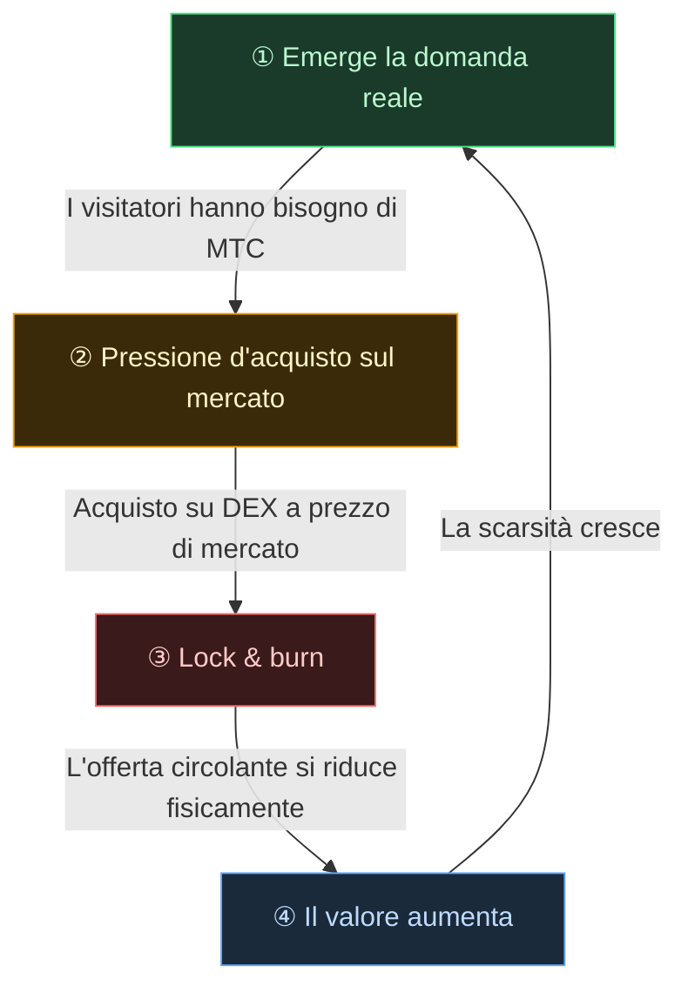

# 🔄 Il flywheel economico — un ciclo di crescita e un OS culturale

> **Più i visitatori si godono il Giappone, più l'ecosistema genera domanda.**
> Questo meccanismo di domanda e offerta è il cuore pulsante del progetto.

---

## Il meccanismo di domanda e offerta di MTC

Per design del Matsuri Protocol, **il crescere della domanda reale genera pressione d'acquisto e, combinato con un'offerta che si restringe, crea le condizioni perché il valore aumenti.**
Non è una questione di sentiment — è un **meccanismo di domanda e offerta.**

Questo meccanismo si dispiega nel **ciclo a quattro tappe** che segue.

| Tappa | Nome | Meccanismo |
| :---: | :--- | :--- |
| **①** | **Emerge la domanda reale** | I visitatori hanno bisogno di MTC per prenotare una guida o acquistare un ticket NFT |
| **②** | **Pressione d'acquisto sul mercato** | MTC viene acquistato a prezzo di mercato su un DEX (exchange decentralizzato). Una forte pressione d'acquisto basata sul consumo, non sulla speculazione |
| **③** | **Lock & burn** | Una quota degli MTC utilizzati per il pagamento viene istantaneamente bloccata o bruciata via smart contract. L'offerta circolante diminuisce fisicamente |
| **④** | **La scarsità aumenta** | La domanda in acquisto cresce, l'offerta in vendita si restringe. Lo spostamento dell'equilibrio domanda-offerta rende ogni token più raro |

---

---

:::note La vision dietro questa equazione
Il quadro più ampio — l'«OS culturale» che si trova al di là del flywheel — è esplorato in dettaglio nella pagina successiva, [Il futuro che MTC immagina](/docs/future).
:::

---

**[◀ Precedente: Problemi e soluzioni](/docs/challenges)** | **[▶ Successiva: Il futuro che MTC immagina](/docs/future)**
