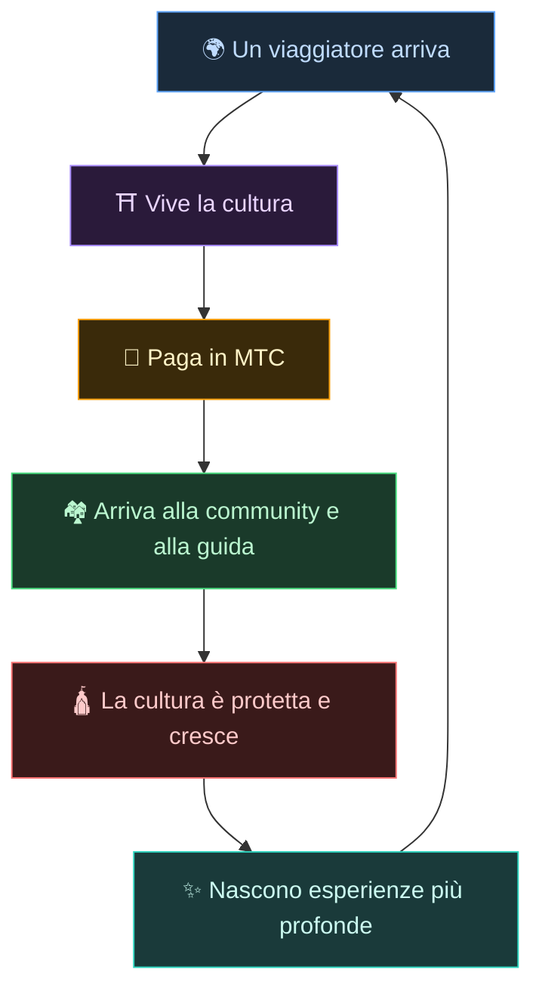
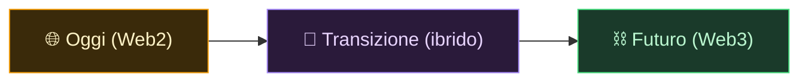
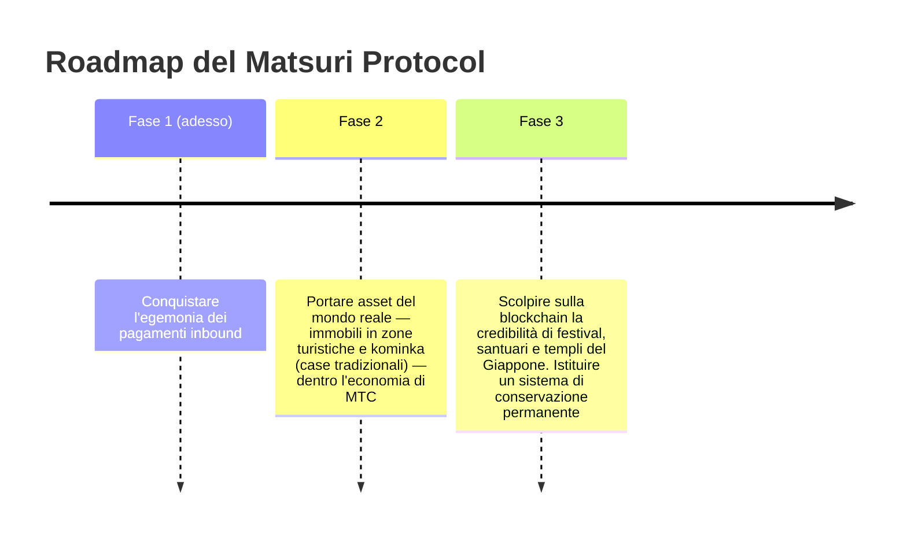

# 🌀 Il futuro che MTC immagina — un'economia in cui ogni forma di partecipazione circola

> **Chi la vive, chi la trasmette, chi la protegge — ogni emozione circola come economia e porta la cultura alla generazione successiva.**

---

## La circolazione che vogliamo far accadere

MTC non è un token per la speculazione.

Il viaggiatore incontra la cultura giapponese e ne resta colpito.
La guida trasmette quell'emozione e viene ricompensata.
La comunità prospera e continua a proteggere la propria cultura.
E quella cultura attira il viaggiatore successivo.

Questa circolazione è la ragione stessa per cui MTC esiste.

---

## Un'economia in cui tutte e tre le parti vengono ricompensate

Nel vecchio modello di turismo, il viaggiatore paga, la piattaforma si prende il profitto e sul territorio non resta nulla.
Nell'economia di MTC, tutti coloro che sono coinvolti vengono ricompensati.

| Chi è coinvolto | Cosa accade | Come viene ricompensato |
| :--- | :--- | :--- |
| **🌍 Chi vive la cultura** | Incontra la cultura giapponese, paga in MTC | Più economico dello yen e accesso reale a esperienze autentiche. Resta connesso tramite MTC anche dopo il rientro a casa |
| **⛩️ Chi la trasmette** | Organizza eventi come guida, pubblica su J-Times | Ricompense dirette, senza intermediari che si prendono la parte grossa. Più si agisce, più MTC si guadagna |
| **🏘️ Chi la protegge** | Come comunità locale, custodisce e tramanda la cultura | I ricavi arrivano direttamente. Le comunità prosperano in modo sostenibile invece di subire il sovraturismo |

---

## Più l'economia si allarga, più la cultura si rafforza

L'economia di MTC parte dalla prenotazione di esperienze e si estende a ogni parte della vita.

- **Esperienza** — esperienze culturali autentiche, mining del pellegrinaggio ai luoghi sacri
- **Vestiario, cibo, alloggio** — guesthouse, negozi, cucina, moda
- **Progetti di co-creazione** — crowdfunding per investire nella protezione della cultura
- **Comprensione internazionale interculturale** — spazi di scambio e comprensione reciproca oltre i confini

Più l'economia si allarga, più il flusso di MTC che la attraversa si fa denso, più grande diventa la sua capacità di sostenere la cultura.
Non è solo un modello di business. È un **sistema di sostegno vitale per la cultura.**

---

## Dal Web2 al Web3 — per gradi, senza forzare

Non stiamo dicendo «mettiamo tutto sulla blockchain» dal primo giorno.

La maggior parte delle persone, oggi, non ha ancora familiarità con il Web3. Proprio per questo lo abbiamo progettato in modo da **partire da forme già conosciute, lasciando che i benefici del Web3 si facciano sentire poco a poco.**

| Fase | Esperienza utente | Cosa succede sotto il cofano |
| :--- | :--- | :--- |
| **Oggi** | Si prenota e si paga come in una qualsiasi web app. La carta di credito va benissimo | Django + Stripe. Per iniziare non serve alcun wallet |
| **Transizione** | Si guadagna e si usa MTC dentro l'app. La connessione del wallet è a portata di tap | I punteggi off-chain migrano gradualmente on-chain |
| **Futuro** | Ogni transazione e ogni diritto vengono registrati con trasparenza on-chain. Il vostro contributo è comprovato per sempre | Un'economia completamente automatizzata e a prova di manomissione, alimentata dagli smart contract |

:::tip Il Web3 non deve essere difficile
All'inizio non serve alcuna configurazione del wallet, né la gestione di una seed phrase. Man mano che usate l'app, entrate in modo naturale nel Web3. **Senza nemmeno accorgervene, siete già cittadini del Web3.** È questa l'esperienza che stiamo progettando.
:::

---

## Un'economia che si muove sull'empatia, non sulla forza

E questa economia gira sugli smart contract.
Le regole non possono essere riscritte unilateralmente a capriccio di qualcuno — **un'economia in cui lo status quo non può essere cambiato con la forza.**

Su queste fondamenta impariamo dalla saggezza antica e continuiamo a creare nuovo valore. 温故知新, e poi creazione.

> **Un mondo in cui la vita può tenersi insieme intorno alla cultura, anche senza yen né dollari.**
>
> Non delegare a qualcun altro il significato del denaro, ma generare e spendere valore attraverso la propria «partecipazione».
> Questa è la libertà che MTC vuole offrire.

---

## 🏁 L'approdo finale: l'«OS culturale»

Il nostro obiettivo ultimo non è una semplice app di pagamenti.
È trasformare **la cultura stessa in un OS (uno strato fondante).**

> Proteggiamo la saggezza antica con la blockchain più recente.
> È il futuro che il Matsuri Protocol sta tracciando.

---

:::note Fine della parte narrativa
Se siete arrivati fin qui, dovreste ora capire perché esiste MTC.
Segue la **[parte pratica]** — vediamo cosa si può fare concretamente con MTC.
:::

**[◀ Precedente: Flywheel economico](/docs/flywheel)** | **[▶ Successiva: Ecosistema](/docs/ecosystem)**
