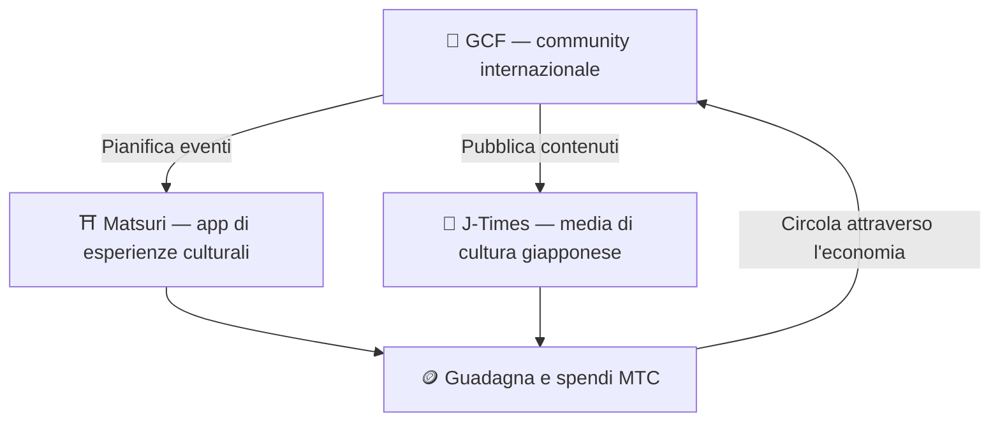

# 🏗️ L'ecosistema di MTC — un'economia in cui esperienza, media e community circolano

> **Tre «luoghi» per rendere reale la missione.**
> Un luogo per vivere, un luogo per imparare, un luogo per connettersi — ciascuno sta in piedi da solo, e MTC li collega in un'unica economia in circolazione.

MTC non è solo un token. Tre prodotti e una community internazionale lavorano insieme per costruire un'economia che protegge la cultura.

:::tip 🤝 GCF — la community internazionale che anima l'ecosistema
Un punto di incontro, al di là dei confini, per chi ama la cultura giapponese. GCF recluta guide, e quelle guide GCF conducono esperienze su Matsuri. Pubblicano inoltre contenuti di qualità su J-Times — l'attività della community è il motore che fa muovere l'intero ecosistema.
:::

:::tip ⛩️ Matsuri — app di esperienze culturali
Parte dalla prenotazione di esperienze culturali e si espande per gradi a **guesthouse**, **negozi** e **crowdfunding**. L'economia cresce dalle esperienze fino al vestiario, al cibo, all'alloggio e agli investimenti di co-creazione.

**Mining del pellegrinaggio (seichi junrei — pellegrinaggio sacro)** — guadagna MTC visitando fisicamente santuari, templi e luoghi culturali di riferimento. I viaggiatori si spostano in modo naturale dalle mete più famose ai gioielli locali nascosti, risolvendo il sovraturismo e rivitalizzando le aree regionali nello stesso momento.
:::

:::tip 📰 J-Times — media di cultura giapponese
Una piattaforma media che porta il fascino della cultura giapponese nel mondo. Si guadagna MTC attraverso l'interazione, ad esempio leggendo e condividendo articoli.
:::

---

## 🤝 Social mining (connetti e guadagna)

**Integrato con la dashboard admin GCF — versione web attiva (app iOS prevista per aprile 2026).**

I membri GCF ricevono l'accesso a una **dashboard web dedicata GCF admin**.

| Funzione | Cosa si può fare |
| :--- | :--- |
| **🎪 Creare eventi** | Pianificare e pubblicare i propri eventi e tour |
| **📢 Distribuire contenuti** | Pubblicare e diffondere articoli e contenuti di J-Times |
| **📊 Tracciamento referral** | Seguire in tempo reale l'attività e i ricavi degli utenti referenziati |

:::info Ricompense automatiche
Ogni volta che un amico referenziato effettua un pagamento, il sistema **deposita automaticamente** una ricompensa (quota di ricavi) sul vostro wallet.
:::

---

## 🎓 Creator economy (crea e guadagna)

Non si è solo consumatori di contenuti — su Matsuri, **chiunque** può crearli e monetizzarli.

| Piattaforma | Cosa possono fare i creator | Modello di ricavo |
| :--- | :--- | :--- |
| **📚 Marketplace di corsi** | Pubblicare corsi video / testuali su cultura, lingua o artigianato giapponese | Tariffa per iscrizione (quota al creator) |
| **🎙️ Studio podcast** | Produrre serie audio distribuite via Spotify, Apple Podcasts e RSS | Episodi solo in abbonamento |
| **🤝 Crowdfunding** | Lanciare campagne di raccolta fondi su Solana per progetti culturali | Tracciamento on-chain dei contributi |
| **🛍️ Shop utente** | Aprire uno shop personale dentro la piattaforma (artigianato, prodotti) | Vendita diretta con sistema di prodotti / recensioni |

:::tip Assistenza alla produzione potenziata dall'AI
Gli organizzatori di eventi possono usare l'**assistente AI integrato (GPT-4 Turbo)** nella dashboard admin per scrivere le descrizioni degli eventi, tradurre automaticamente in 5 lingue e generare metadati ottimizzati SEO.
:::

---

  

*Meetup della community a Golden Gai — la connessione diventa potenza di mining.*

---

:::note Pagina successiva
Per vedere come funziona davvero il mining e come guadagnare, proseguite con **[Mining e modi di guadagnare →](/docs/mining)**.
:::
