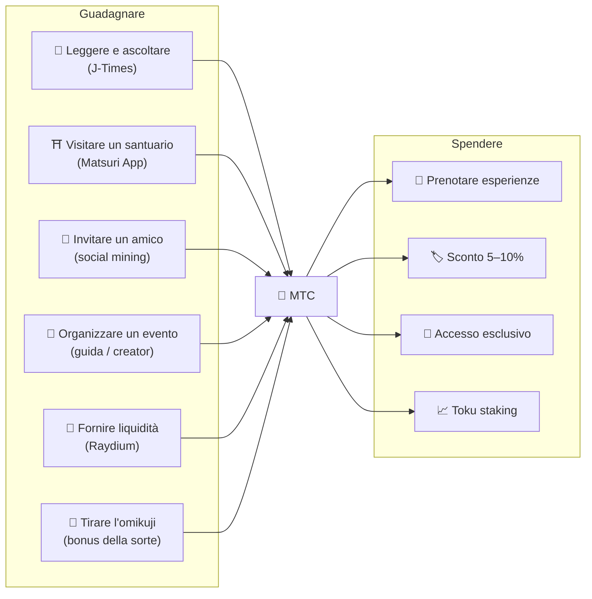
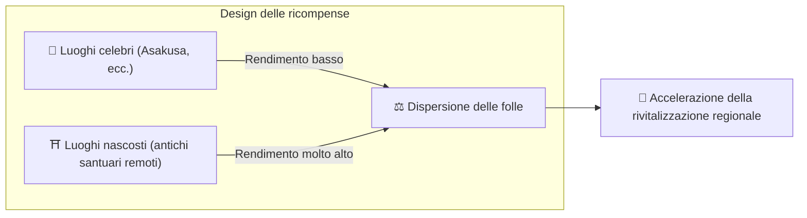
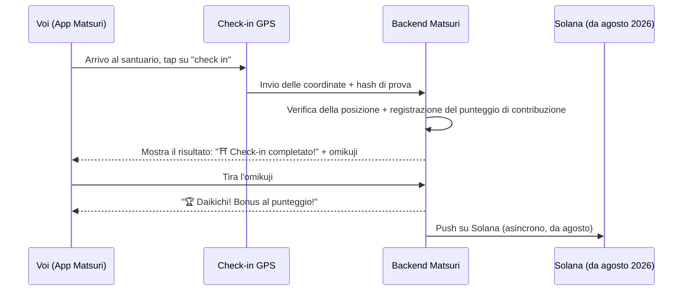
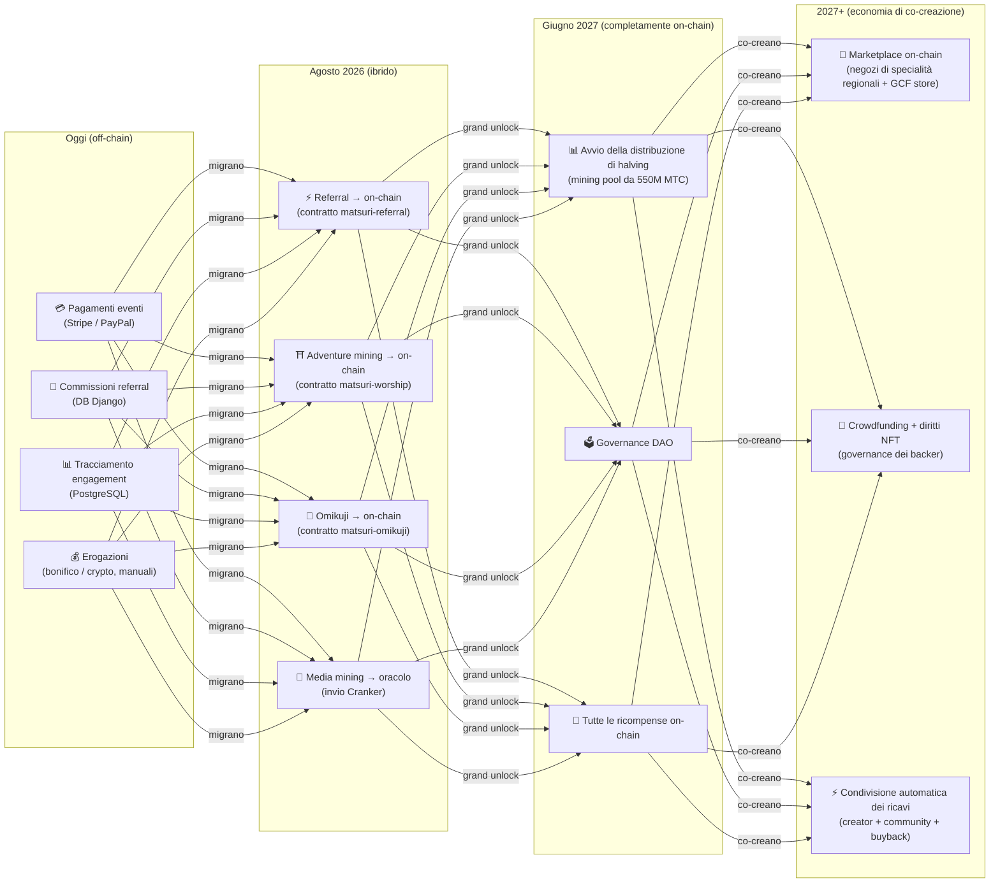

import useBaseUrl from '@docusaurus/useBaseUrl';

# ⛏️ I cinque pilastri del mining e come guadagnare

> **Ogni forma di «partecipazione» alla cultura diventa valore.**
> Leggere, camminare, connettersi, creare, sostenere — ogni vostro gesto produce MTC.

<small>*Che cos'è il «mining»? — In Bitcoin e reti analoghe, i computer eseguono calcoli enormi e ricevono nuove monete come ricompensa; è questo che si chiama «mining». Con MTC ciò che fa mining non è la potenza di calcolo, ma **le vostre stesse azioni** — leggere un articolo, visitare un santuario, organizzare un evento. Al posto di scavare in cerca d'oro, è la partecipazione alla cultura a produrre MTC. È questo il significato di «mining» qui.*</small>

> Guadagnare attraverso l'azione. Spenderlo in esperienza. Custodirlo e vederlo crescere.

MTC non è un token speculativo. Circola attraverso un'economia reale in cui ogni azione produce e trattiene valore. La web app e la dashboard admin sono **già attive**. I punteggi di contribuzione sono attualmente registrati off-chain (in Django) e migreranno on-chain per gradi a partire da agosto 2026.

:::tip Il quadro d'insieme
MTC ha un'**economia a ciclo completamente chiuso**: si guadagna con attività reali, si spende in esperienze reali e il valore cresce al crescere dell'ecosistema. Questa pagina spiega i meccanismi in dettaglio.
:::

---

## Il ciclo di vita di MTC

---

## I cinque pilastri del mining

### 1. 📖 Media mining (leggi, ascolta, rispondi — e guadagna)

**Integrato con la piattaforma media ufficiale «J-Times»**

La conoscenza alza drasticamente la qualità di un viaggio. Aprite l'**app J-Times** e godetevi i contenuti sulla cultura giapponese. Oltre al testo e all'audio, premiamo anche le **verifiche di comprensione (quiz)**. Ogni azione completata accredita automaticamente MTC sul vostro saldo.

| Azione | Condizione di completamento | Ricompensa tipica |
| :--- | :--- | :---: |
| **📰 Leggere un articolo** | Scroll fino al 75% | 2–30 MTC |
| **🎧 Ascoltare un podcast** | Riproduzione fino alla fine | 2–30 MTC |
| **🎬 Guardare un video** | Chiusura della schermata di dettaglio dopo la visione | 2–30 MTC |
| **📤 Condividere contenuto** | Apertura del menu di condivisione | 2–30 MTC |
| **✅ Rispondere a un quiz** | Superamento del test di comprensione | 2–30 MTC |

<small>*L'entità della ricompensa varia in base al tipo di contenuto, alla sua lunghezza e all'equilibrio complessivo dell'offerta nell'ecosistema.*</small>

:::tip I ritagli di tempo diventano mining
Il tragitto in treno e le pause si trasformano in tempo che genera ricompense.
:::

:::info Supporto offline
Niente internet in un santuario remoto? Nessun problema. J-Times registra l'attività in locale e la **sincronizza in automatico non appena si torna online** (conservazione in coda offline per 7 giorni). Non perderete gli MTC che avete guadagnato.
:::

**Cosa accade dietro le quinte:**
1. L'app J-Times rileva la vostra azione (lettura, visione completata, condivisione, ecc.)
2. La registra in locale anche offline (conservata per 7 giorni)
3. La invia al server per la verifica quando la rete torna disponibile
4. La riflette nel vostro saldo come punteggio di contribuzione
5. Da agosto 2026: i punteggi verificati vengono registrati on-chain tramite un oracolo e diventano verificabili sulla blockchain

---

### 2. ⛩️ Adventure mining (cammina e guadagna)

**Progetto «Junrei» — smart contract completato, deployment su mainnet ad agosto 2026**

Una funzione di nuova generazione che usa GPS e incentivi in token per modellare il «flusso fisico delle persone». La mappa dei luoghi sacri è **già attiva** nella web app Matsuri. I punteggi di contribuzione sono attualmente registrati off-chain; la distribuzione on-chain delle ricompense inizia dopo il deployment degli smart contract di agosto 2026.

>**Poiché si guadagna di più, ci si sposta verso la campagna.**
> Questa semplice logica economica dissolve il sovraturismo e accelera la rivitalizzazione regionale.

**Come funziona il check-in:**

  
  

    
<strong>Worship Mining</strong> — si fa check-in vicino a un santuario, si rileva l'energia con la fotocamera AR, si tira l'omikuji per un bonus in MTC. I moltiplicatori di livello vanno da 1,0× (Major) a 10,0× (Hidden Gem).

  

**Principio guida — meno visitatori, più si guadagna:**

| Tipo di luogo | Esempi | Ricompensa tipica (per check-in) |
| :--- | :--- | :---: |
| 🏙️ **Major** | Sensōji, Kiyomizudera, Fushimi Inari | 30–50 MTC |
| 🌆 **Hub regionale** | L'Ichinomiya di ogni prefettura, grandi santuari regionali | 50–100 MTC |
| 🏞️ **Regionale** | Santuari storici regionali | 100–150 MTC |
| ⛰️ **Di frontiera** | Templi di montagna, luoghi sacri insulari | 150–200 MTC |

<small>*I valori sopra riportati sono stime della ricompensa base. I moltiplicatori dell'omikuji possono aumentarli di diverse volte.*</small>

**Ulteriori fattori di punteggio:**
- **Moltiplicatore omikuji** — un bonus casuale a ogni check-in. Il Daikichi moltiplica la ricompensa più volte
- **Frequenza di visita** — i visitatori abituali accumulano di più nel tempo
- **Luoghi sponsorizzati** — i comuni possono potenziare luoghi specifici

:::info Punteggio di contribuzione → MTC
La vostra attività si accumula come **punteggio di contribuzione**. A ogni epoca di halving (a partire da giugno 2027), i punteggi vengono convertiti in MTC attingendo al mining pool da 550M. Maggiore è il vostro contributo alla community, più MTC ricevete. I coefficienti di boost esatti vengono finalizzati per gradi e implementati negli smart contract — questo garantisce una distribuzione equa, allineata con la reale dimensione del pool.
:::

---

### 3. 🤝 Social mining (connetti e guadagna)

Si guadagna MTC semplicemente presentando degli amici.

#### Ricompense referral per utenti normali

È semplice. Quando un amico si registra tramite il vostro link di invito, ricevete **300 MTC per ogni referral diretto.**

| Condizione | Ricompensa |
| :--- | :--- |
| Un amico da voi invitato si registra | **300 MTC** |

Tutto qui. Non esistono ricompense multi-livello.

#### Ricompense referral per gli agenti GCF

I [membri GCF](/docs/gcf) sono **agenti ufficiali** responsabili dell'espansione dell'ecosistema e dispongono di una struttura di ricompense più articolata.

| Livello | Relazione | Commissione |
| :---: | :--- | :---: |
| **L1** | Referral diretto | **20%** |
| **L2** | I loro referral | **5%** |
| **L3** | Terzo livello | **5%** |
| **L4** | Quarto livello | **5%** |

:::note Sul programma agenti GCF
Questa struttura di ricompensa multi-livello si applica soltanto agli agenti ufficiali titolari di un'adesione GCF (solo su invito). Gli utenti normali ricevono solo il referral diretto (300 MTC).
Le commissioni degli agenti GCF sono calcolate in base all'**effettiva attività economica** (acquisti di esperienze, partecipazione a eventi, ecc.) dei loro referral. Il mero reclutamento di persone non genera ricompense.
:::

**Come funziona il punteggio En-Mining (per gli agenti GCF):**

Il punteggio di contribuzione si calcola da due componenti:
- **Ampiezza della rete** (30%) — quante persone avete portato
- **Attività economica** (70%) — acquisti reali dalla vostra rete di referral

I punteggi si accumulano nel tempo e vengono convertiti in MTC a ogni epoca di halving.

#### Dashboard admin GCF — versione web attiva

I membri GCF ricevono l'accesso alla dashboard admin dedicata.

| Funzione | Cosa si può fare |
| :--- | :--- |
| **🎪 Creare eventi** | Pianificare e pubblicare i propri eventi e tour |
| **📢 Distribuire contenuti** | Pubblicare e diffondere articoli e contenuti di J-Times |
| **📊 Tracciamento referral** | Seguire in tempo reale l'attività e i ricavi degli utenti referenziati |

:::warning Attualmente off-chain → migrazione on-chain ad agosto 2026
Le commissioni da referral sono oggi tracciate in Django (PostgreSQL) e pagate tramite bonifico bancario o crypto. Da **agosto 2026** passano allo **smart contract Matsuri Referral** su Solana, con erogazioni on-chain e verificabili.
:::

  

*Meetup della community a Golden Gai — la connessione diventa potenza di mining.*

---

### 4. 🎓 Creator & guide mining (crea e guadagna)

Non si è solo consumatori di contenuti — su Matsuri, **chiunque** può crearli e monetizzarli. Se siete membri GCF, guide o creator, ecco come si guadagna.

| Attività | Come si guadagna |
| :--- | :--- |
| **🗺️ Organizzare un tour** | Commissione di guida (impostata per evento) + mance |
| **🎫 Vendere biglietti di eventi** | Quota di ricavi tramite EventPurchase |
| **📚 Pubblicare un corso** | Tariffa per iscrizione (quota al creator) |
| **🎙️ Produrre episodi podcast** | Ricavi da abbonamento |
| **🤝 Lanciare una campagna crowdfunding** | Tracciamento on-chain dei contributi su Solana |
| **🛍️ Aprire uno shop utente** | Vendita diretta di artigianato e prodotti |

**Sistema di mance:** al termine di un evento, gli ospiti possono lasciare una mancia alla guida (in stile Uber). Le mance sono gestite tramite Stripe e tracciate su una classifica pubblica.

:::tip Assistenza alla produzione potenziata dall'AI
Gli organizzatori di eventi possono usare l'**assistente AI integrato (GPT-4 Turbo)** nella dashboard admin per scrivere le descrizioni degli eventi, tradurre automaticamente in 5 lingue e generare metadati ottimizzati SEO.
:::

---

### 5. 🏦 Liquidity mining (deposita e guadagna)

>**Diventa la banca.**

Fornisci liquidità MTC/SOL sul DEX Raydium e sostieni l'infrastruttura di trading dei primi tempi dell'ecosistema. I primi fornitori di liquidità sono trattati come «partner fondatori» in un programma di ricompense speciale.

| Elemento | Dettaglio |
| :--- | :--- |
| **Chi può partecipare** | Chiunque detenga MTC e SOL |
| **APY obiettivo** | **20%** (incentivo iniziale sulla liquidità, impostato come premio di rischio) |
| **DEX** | Raydium (Solana) |
| **Scopo** | Assicurare la liquidità delle fasi iniziali e costruire un ambiente di trading stabile |

---

## 🎲 Bonus omikuji

Ogni check-in di adventure mining è accompagnato da un'estrazione gratuita di Omikuji (un responso della sorte). È uno smart contract in stile omikuji eseguito **gratuitamente (solo gas)** al completamento del check-in.

| Responso | Moltiplicatore di ricompensa | Bonus extra |
| :--- | :---: | :--- |
| 🏆 **Daikichi (grande benedizione)** | Base × moltiplicatore massimo | Goshuin NFT |
| ✨ **Kichi (benedizione)** | Base × moltiplicatore alto | — |
| 🌸 **Shōkichi (piccola benedizione)** | Base × moltiplicatore piccolo | — |
| 🍃 **Suekichi (benedizione futura)** | Base × 1,0 | — |
| 💀 **Kyō (maledizione)** | Base × 1,0 | — |

Probabilità e moltiplicatori possono essere regolati dalla dashboard admin GCF e sono gestiti dall'operatore in base all'equilibrio complessivo dell'offerta di MTC nell'ecosistema. I risultati sono determinati da un **protocollo commit-reveal a prova di manomissione** su Solana — nessuno può modificare l'esito dopo la fase di commit.

<small>*Anche con un responso kyō si riceve comunque la ricompensa base. Il design premia l'azione stessa del check-in.*</small>

:::note Non è gioco d'azzardo
Non si scommette denaro. È semplicemente un bonus casuale che si aggiunge all'**azione di «aver visitato».** Completare determinate collezioni di NFT può sbloccare il diritto di partecipare a eventi speciali.
:::

---

## A cosa serve MTC

| Uso | Beneficio | Disponibilità |
| :--- | :--- | :---: |
| **🎫 Prenotare esperienze** | Pagare in MTC tour, eventi e attività culturali | ✅ Disponibile |
| **🏷️ Sconto** | 5–10% di sconto sul prezzo in yen pagando in MTC | ✅ Disponibile |
| **🔑 Accesso esclusivo** | Eventi a gating NFT, rituali solo per VIP, tour privati | ✅ Disponibile |
| **📈 Toku staking** | Bloccare MTC per potenziare il punteggio di contribuzione (fino a ~50% di boost) | 🔜 Agosto 2026 |
| **🗳️ Governance DAO** | Votare su tesoreria, aggiornamenti di protocollo e accreditamento dei luoghi | 🔜 2027 |
| **🛍️ Shop partner** | Pagare presso negozi e ristoranti partner | 🔜 In espansione |

:::info MTC come metodo di pagamento
Dentro la Matsuri App, MTC è un metodo di pagamento di prima classe a pari livello con carte di credito e Solana Pay. Nessun passaggio di conversione — scegliete «Paga con MTC» al checkout e il saldo viene addebitato all'istante.
:::

### Sulla conversione di MTC

:::warning Importante: non offriamo servizi di conversione / cambio di MTC
Matsuri non è registrata come società di exchange di cripto-asset e quindi **non cambia MTC in valuta fiat (yen, dollari, ecc.) direttamente, in nessuna circostanza.**

Se volete convertire MTC in altre crypto o in fiat, potete farlo autonomamente:
1. Custodite MTC in un wallet compatibile con Solana, ad esempio **Phantom Wallet**
2. Fate lo swap MTC → SOL su **Raydium (DEX)**
3. Convertite SOL in fiat su un exchange centralizzato (CEX)

Stiamo inoltre valutando listing su CEX in futuro: a quel punto saranno disponibili percorsi di conversione più semplici.
:::

---

## Esempio: una giornata nell'economia di MTC

> **Mattina:** leggete tre articoli di J-Times in treno → guadagnate MTC.
> **Pomeriggio:** visitate un santuario regionale tramite l'app Matsuri → check-in, estrazione di un kichi (×1,5) → altri MTC.
> **Sera:** con i vostri MTC prenotate un tour culturale nella Golden Gai di Shinjuku da 9.000 yen (~63 dollari) al 10% di sconto (pagate l'equivalente di 8.100 yen / ~57 dollari).
> **Risultato:** la vostra curiosità si è trasformata in esperienza reale e la guida, il santuario e la community hanno ricevuto il pagamento direttamente. Nessuna OTA ha trattenuto il 20%.

---

## Sostenibilità economica

:::warning Cosa succede quando il mining pool si esaurisce?
Il pool di halving da 550M MTC è progettato per durare **decenni**. Poiché il tasso di rilascio si dimezza ogni due anni, matematicamente non raggiunge mai il 100%, e le ricompense proseguono su un orizzonte molto lungo (vedi [Tokenomics](/docs/tokenomics)). Anche quando i rilasci diventeranno estremamente piccoli:

- **Le commissioni di transazione** continueranno a ricompensare i partecipanti alla rete tramite l'attività on-chain
- **Il protocollo di buyback** (20–25% dei ricavi di business) produce una pressione d'acquisto costante
- **Il Toku staking** blocca l'offerta circolante e allenta la pressione in vendita
- **I ricavi reali del business** (eventi, abbonamenti, corsi) sostengono l'ecosistema indipendentemente dalla distribuzione del token

MTC è sostenuto da un'**economia reale** — non solo dalle emissioni di token.
:::

---

## Roadmap di migrazione on-chain

L'economia di Matsuri migra per gradi dall'off-chain (Django/PostgreSQL) all'on-chain (smart contract Solana). Attraverso questa migrazione, tutte le operazioni diventano **trustless, verificabili e permissionless**.

| Fase | Tempistica | Cosa va on-chain |
| :--- | :--- | :--- |
| **Fase 1 (oggi)** | Attiva | Token MTC (SPL), LP su Raydium, verifica Solana Pay |
| **Fase 2 (agosto 2026)** | Deployment degli smart contract su mainnet | Commissioni referral, ricompense di adventure mining, estrazioni Omikuji, media mining basato su oracolo |
| **Fase 3 (giugno 2027)** | Grand unlock | Distribuzione di halving dei 550M MTC, governance DAO, decentralizzazione completa |
| **Fase 4 (2027+)** | Economia di co-creazione | Marketplace on-chain (negozi di specialità regionali + GCF store), crowdfunding con diritti NFT, condivisione automatica dei ricavi tra creator, community e buyback |

:::warning Perché non mettere tutto on-chain subito?
**Non attiviamo alcuna funzione on-chain che muova fondi degli utenti prima del completamento dell'audit di sicurezza.** È il nostro principio.

Stato attuale:
- **Rischio per i fondi degli utenti: nullo** — oggi tutte le ricompense e i punteggi sono gestiti off-chain (Django). Nessuna funzione di smart contract che muova fondi degli utenti è attiva
- **Calendario dell'audit: Q2–Q3 2026** — i contratti saranno deployati su mainnet uno alla volta, soltanto dopo aver superato audit di sicurezza professionali
- **Il completamento dell'audit è un prerequisito per il deployment** — non attiveremo mai su mainnet uno smart contract non auditato

Le ricompense maturate nel periodo off-chain restano comunque verificabili — ogni transazione include un `solana_signature` come prova del regolamento.
:::

---

**[▶ Successiva: Tokenomics](/docs/tokenomics)** | **[◀ Precedente: Ecosistema](/docs/ecosystem)**
