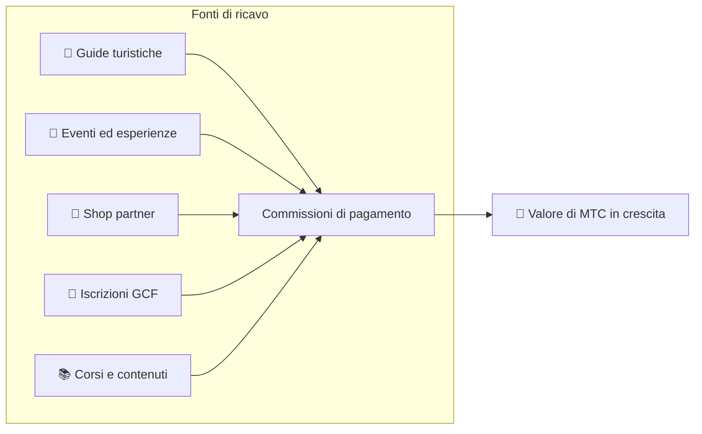

# 💰 Tokenomics — il design economico di MTC

> **La fiducia è scolpita nel codice.**
> Il design economico di MTC non è garantito dalla promessa di qualcuno, ma dalla matematica e dalla blockchain.


> **«Un'economia in cui lo status quo non può essere cambiato con la forza» — è questa la tokenomics di MTC.**

Il design economico di Matsuri Coin (MTC) poggia su una sola convinzione:
**una regola che nemmeno l'operatore può alterare è la garanzia più solida possibile per l'investitore.**

L'offerta è fissata in modo permanente. Emissioni aggiuntive e congelamenti di fondi sono impossibili. La crescita del business si riflette sul prezzo al livello di un'equazione —
non una «promessa», ma un **fatto** inciso nella blockchain.

Questa pagina espone apertamente tutti i meccanismi economici di MTC.

---

## Specifiche del token

Per garantire la sicurezza degli investitori, abbiamo **rinunciato in modo permanente** sia al «mint authority» sia al «freeze authority» su Solana.
L'emissione aggiuntiva è impossibile per sempre. I fondi non possono essere congelati. È un **design completamente trustless.**

| Elemento | Dettaglio |
| :--- | :--- |
| **Nome del token** | Matsuri Coin |
| **Ticker** | MTC |
| **Chain** | Solana |
| **Mint address** | `DRENpzmRWM4TwECrCPCfS1k5VBPmanhQg9bcCWP8EZXF` [Solscan →](https://solscan.io/token/DRENpzmRWM4TwECrCPCfS1k5VBPmanhQg9bcCWP8EZXF) |
| **Offerta totale** | **900 milioni** (900.000.000 MTC), fissa |
| **Mint authority** | 🚫 Rinunciata ([verificabile on-chain](https://solscan.io/token/DRENpzmRWM4TwECrCPCfS1k5VBPmanhQg9bcCWP8EZXF)) |
| **Freeze authority** | 🚫 Rinunciata ([verificabile on-chain](https://solscan.io/token/DRENpzmRWM4TwECrCPCfS1k5VBPmanhQg9bcCWP8EZXF)) |
| **Gestione dei lock** | Streamflow Finance (verificata) |

:::info Perché tutto questo conta
Rinunciare al mint authority significa che «l'operatore non può coniare altri token e diluire la vostra quota». Rinunciare al freeze authority significa che «nessuno può congelare il vostro wallet». È questo il fondamento della trustlessness.
:::

---

## Allocazione del token

I 900M MTC sono allocati come segue.

<div className="mtc-alloc">
  <div className="mtc-alloc__donut" role="img" aria-label="Allocazione di MTC: 61% Mining Pool, 39% Operazioni dell'ecosistema">
    <div className="mtc-alloc__hole">
      <span className="mtc-alloc__total">900M</span>
      <span className="mtc-alloc__unit">MTC</span>
    </div>
  </div>
  <div className="mtc-alloc__legend">
    <div className="mtc-alloc__row mtc-alloc__row--mining">
      <span className="mtc-alloc__dot"></span>
      <span className="mtc-alloc__pct">61%</span>
      <span className="mtc-alloc__amount">⛏️ 550M MTC</span>
    </div>
    <div className="mtc-alloc__row mtc-alloc__row--ecosystem">
      <span className="mtc-alloc__dot"></span>
      <span className="mtc-alloc__pct">39%</span>
      <span className="mtc-alloc__amount">🌐 350M MTC</span>
    </div>
  </div>
</div>

| Categoria | Quota | Quantità | Scopo |
| :--- | :---: | :--- | :--- |
| **⛏️ Mining pool** | **61%** | 550 milioni | Pool di ricompense per i contributori. Sbloccato a giugno 2027, rilasciato su un ciclo di halving biennale. Distribuito in base al punteggio di contribuzione |
| **🌐 Operazioni dell'ecosistema** | **39%** | 350 milioni | Marketing, distribuzione GCF, spese operative, liquidità del pool (LP), costi di sviluppo, pubblicità, organizzazione di eventi e altro ancora |

:::note Come viene rilasciato il mining pool
I 550M MTC non sono rilasciati tutti in una volta. Seguono un calendario di halving biennale e vengono **distribuiti per gradi in base al punteggio di contribuzione.** Le regole di rilascio e di distribuzione saranno implementate negli smart contract per gradi a partire dalla fine del 2026 e diverranno verificabili on-chain.
:::

:::note Sull'allocazione per le operazioni dell'ecosistema
Il 39% dedicato alle operazioni è un fondo multi-uso necessario a far crescere l'ecosistema. Gli impieghi concreti comprendono l'attività di marketing, la distribuzione iniziale ai membri GCF, l'apporto di liquidità al pool Raydium, la retribuzione del team di sviluppo, la pubblicità e il finanziamento di eventi di esperienza culturale. La trasparenza sull'uso sarà soggetta alla governance della community dopo la transizione a DAO.
:::

---

## Struttura dei ricavi

A sostenere il valore di MTC sono **i ricavi di un'attività reale.** Non speculazione — è un'attività economica reale a sostenere il valore del token.



| Fonte di ricavo | Dettaglio |
| :--- | :--- |
| **🏯 Esperienze e guide** | Commissioni di pagamento di guide turistiche ed eventi di esperienza culturale |
| **🤝 Iscrizione GCF** | Quote associative |
| **📚 Contenuti** | Tariffe di iscrizione ai corsi, abbonamenti media |
| **🏪 Marketplace** | Commissioni sulle transazioni degli shop partner (in espansione per gradi) |

:::tip Una crescita sostenuta dalla domanda reale
Più visitatori inbound arrivano, più valuta estera entra e più grande cresce l'ecosistema. Il valore di MTC non è deciso dalla speculazione, ma **dal numero di persone che vivono la cultura.**
:::

---

## Trazione attuale del business

L'economia di MTC è ancora agli inizi, ma un'attività reale è già partita.

| Metrica | Stato |
| :--- | :--- |
| **Eventi organizzati** | 50+ (operatività di prova) |
| **Membri GCF Platinum** | 20 posti occupati su 50 |
| **Membri GCF Gold** | Apertura delle iscrizioni in arrivo |
| **Piattaforma web** | Attiva, attualmente raccoglie e serve utenti di test |
| **App iOS** | Sviluppo completato, uscita prevista ad aprile 2026 |

:::note Una dichiarazione onesta
Non abbiamo ancora un track record di «grande successo». 50 eventi e operatività di prova — è questa la realtà di oggi. Ma il prodotto gira, la community esiste e siamo nella fase in cui si passa davvero a scalare.
:::

---

## Protocollo di buyback

Non ci limitiamo a intascare i profitti.
Una percentuale fissa dei ricavi del business è destinata al **riacquisto di MTC dal mercato.**

| Fonte di ricavo | Allocazione | Azione |
| :--- | :---: | :--- |
| **Ricavi Matsuri HQ** (guide, eventi) | **20%** | **Buyback** dal mercato + immissioni nel pool di liquidità |
| **Iscrizione GCF** (quote associative) | **25%** | **Buyback** dal mercato |

:::info Stato attuale del buyback
Il protocollo di buyback **entrerà in operazione** man mano che i ricavi del business cresceranno. Inizialmente gira off-chain (manualmente); migra per gradi all'esecuzione automatica via smart contract a partire dalla fine del 2026. Una volta on-chain, l'intero storico delle esecuzioni di buyback sarà verificabile sulla blockchain da chiunque.
:::

I buyback non sono una promessa «un giorno». Sono una regola programmata come protocollo. Ogni volta che i ricavi salgono, MTC viene automaticamente assorbito dal mercato — una **tranquillità strutturale** per l'investitore.

---

## Logica di formazione del prezzo

Il meccanismo di valorizzazione di MTC non si basa sulla speranza, ma sull'**equazione di un AMM (automated market maker).**

```
Prezzo = Liquidità (SOL) ÷ Offerta (MTC)
```

| Passo | Cosa accade | Risultato |
| :---: | :--- | :--- |
| **①** | I ricavi del business (SOL) vengono immessi nel pool | **Il numeratore sale** |
| **②** | Quei fondi riacquistano MTC dal mercato e lo bruciano | **Il denominatore scende** |
| **③** | Numeratore ↑ × denominatore ↓ | **Si creano le condizioni per una scarsità crescente** |

:::info Descrizione di un meccanismo, non garanzia di prezzo
Questa equazione descrive un design strutturale: se i ricavi del business proseguono e i buyback vengono eseguiti, l'equilibrio domanda-offerta si muove verso la scarsità. Il prezzo effettivo dipende dalla domanda di mercato, dalle condizioni esterne, dalla liquidità e da molti altri fattori.
:::

---

## Calendario di halving

I **550 milioni di MTC (circa il 61% dell'offerta totale)** che si sbloccano il 1° giugno 2027 non verranno scaricati sul mercato. Sono riservati come **pool di ricompense per i contributori.**

Abbiamo adottato un **ciclo di halving biennale**, più rapido del ciclo di quattro anni di Bitcoin.
Il tasso di rilascio si dimezza ogni due anni, mantenendo le ricompense in flusso, in teoria, per decenni.

| Periodo | Quota di rilascio | Quantità rilasciata | Cumulato |
| :--- | :---: | :--- | :---: |
| **Periodo 1** 2027–2029 | **50%** | ~275M | 50% |
| **Periodo 2** 2029–2031 | **25%** | ~137M | 75% |
| **Periodo 3** 2031–2033 | **12,5%** | ~68M | 87,5% |
| **Periodo 4** 2033–2035 | **6,25%** | ~34M | 93,75% |
| **Periodo 5 in poi** | Halving continuo | In diminuzione | → asintoto al 100% |

<small>*Matematicamente non raggiunge mai il 100%, e i rilasci si avvicinano asintoticamente allo zero. Stesso principio di Bitcoin.*</small>

:::tip Prima contribuite, più MTC ricevete
A causa dell'halving, il periodo 1 (2027–2029) ha la quantità di rilascio maggiore, e ogni epoca successiva rilascia meno per singolo evento. In altre parole, **chi accumula punteggio di contribuzione presto riceve più MTC.**

Esempi di attività che contano ai fini del punteggio di contribuzione:
- Track record di creazione e partecipazione ad eventi
- Gestione di corsi guidati di successo
- Reclutamento e sviluppo di guide eccellenti
- Visualizzazioni e condivisioni di contenuti J-Times
- Check-in di pellegrinaggio ai luoghi sacri

Le ricompense non sono determinate dall'«ordine di ingresso» ma dalla **«quantità e qualità della contribuzione».**
:::

---

:::note Pagina successiva
Ora che avete compreso il design economico di MTC, vediamo **come partecipare in qualità di partner.**
**[Iscrizione GCF →](/docs/gcf)**
:::
