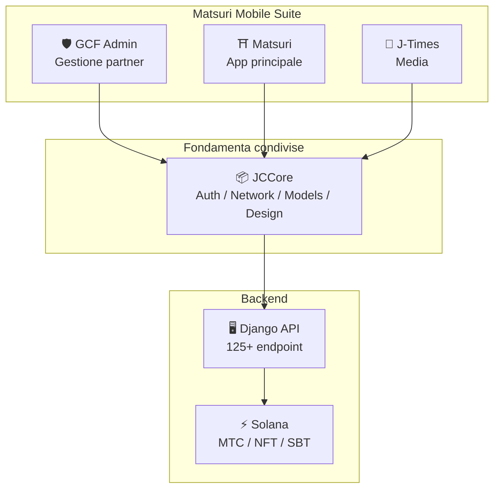
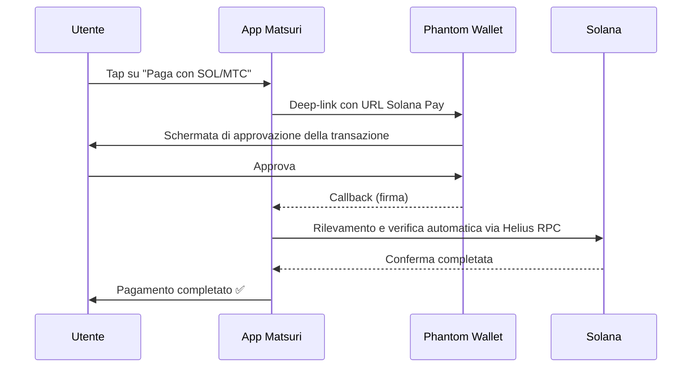
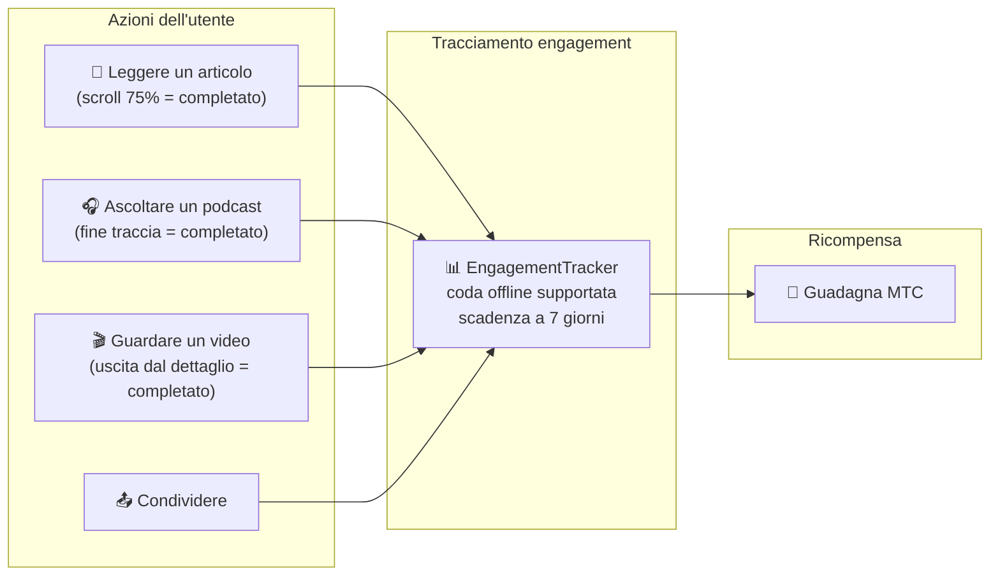
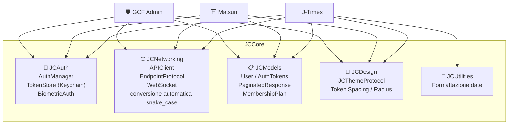
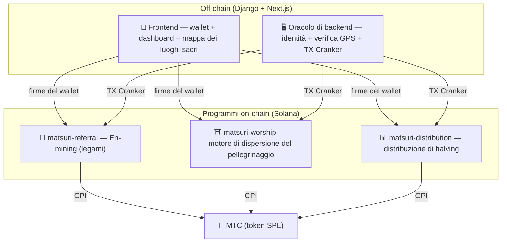
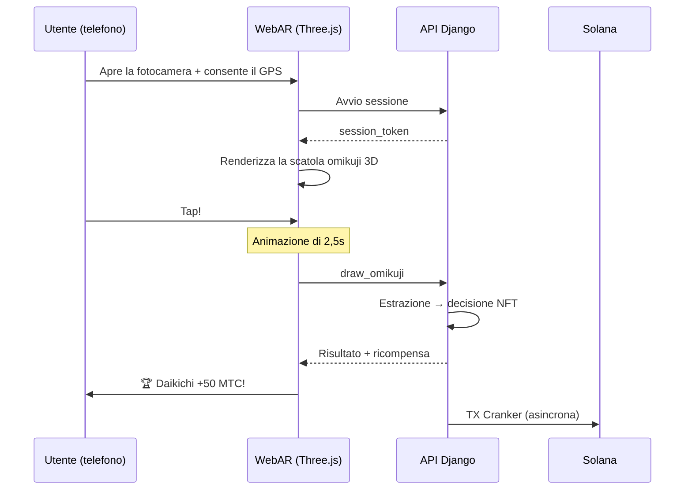

import useBaseUrl from '@docusaurus/useBaseUrl';

# 🔧 Prodotto e tecnologia — ciò che gira dimostra tutto

> **Ciò che gira dimostra tutto.**
> La nostra missione non vive di parole. La piattaforma web è già attiva e le app iOS sono nella fase finale.

La web app e la dashboard admin sono **in produzione**. Tre app iOS native sono state completate e vengono rilasciate tra aprile e maggio 2026 (Matsuri a inizio maggio). Gli smart contract su Solana sono open source — non parliamo per concetti, ma con **codice che gira e un prodotto pronto a toccare terra.**

---

## Panoramica delle app

| App | Scopo | Stato | Lingue supportate |
| :--- | :--- | :---: | :--- |
| **GCF Admin** | Gestione partner e strumenti operativi | ✅ Rilasciata | 🇯🇵🇬🇧🇨🇳🇹🇭🇳🇴 |
| **Matsuri** | App consumer principale | ✅ Rilasciata | 🇯🇵🇬🇧🇨🇳🇹🇭🇳🇴 |
| **J-Times** | Media culturale e apprendimento | ✅ Rilasciata | 🇯🇵🇬🇧 |

---

## 1. 🛡️ GCF Admin — app di gestione partner

:::info Stato: rilasciata sull'App Store (v1.0)
Un'app di gestione operativa per i membri GCF (Global Community Friends). Tutte le funzionalità della schermata web admin, consolidate su mobile.
:::

  

  
  
  

### Cosa può fare l'app

| Categoria | Funzionalità |
| :--- | :--- |
| **📊 Dashboard** | Schede KPI, grafici dei ricavi, azioni rapide |
| **👥 Gestione membri** | Lista, dettagli, modifica, gestione dei livelli |
| **💰 Gestione ricavi** | Tracciamento commissioni, gestione dei prelievi di MTC, gestione delle erogazioni |
| **📝 Gestione contenuti** | Creazione, modifica e pubblicazione di eventi, articoli, podcast e video |
| **🎫 Slot guide** | Gestione degli slot per le guide e tracciamento dei ricavi |
| **🖼️ Dashboard NFT** | Founder's Collection, verifica on-chain, trasferimenti di NFT |
| **⛩️ Gestione luoghi sacri** | CRUD dei luoghi, configurazione dei beacon |
| **🎲 Configurazione AR mining** | Tabelle di probabilità dell'omikuji, gestione dei parametri di ricompensa |
| **📊 Analytics** | Report di errore, analisi di utilizzo |
| **🔗 Referral** | Generazione di QR code personalizzati, gestione del programma referral |

### Specifiche tecniche

| Elemento | Dettaglio |
| :--- | :--- |
| **Architettura** | Clean Architecture + MVVM + `@Observable` (iOS 17) |
| **Linguaggio / SDK** | Swift 6.0 / Xcode 16+ / iOS 17.0+ |
| **Integrazione API** | 125+ endpoint |
| **Test** | 226 test / 45 classi di test |
| **Localizzazione** | 5 lingue (JP/EN/CN/TH/NO) / 957+ chiavi di traduzione |
| **Swift Concurrency** | Conforme a Strict Concurrency / zero warning in compilazione |

### Integrazione QR code

GCF Admin può generare QR code personalizzati con il brand Matsuri. Casi d'uso versatili — inviti a eventi, link di referral, richieste di pagamento e altro.

---

## 2. ⛩️ Matsuri — app principale

:::info Stato: rilasciata sull'App Store (v3.0)
L'app principale per gli utenti normali. Prenotazione eventi, pagamento, wallet Web3, AR mining — tutto si conclude in un'unica app. **Ora disponibile sull'App Store.**
:::

  

  
  
  

### Cosa può fare l'app

| Categoria | Funzionalità |
| :--- | :--- |
| **🎪 Prenotazione eventi** | Ricerca, prenotazione, pagamento Stripe, gestione QR dei biglietti |
| **💳 Quattro metodi di pagamento** | Carta di credito / carta salvata / saldo MTC / crypto (SOL/MTC) |
| **👛 Wallet Web3** | Visualizzazione saldo MTC, invio/ricezione, cronologia delle transazioni |
| **🖼️ Galleria NFT** | Lista di NFT/SBT detenuti, verifica on-chain |
| **🗺️ Mappa dei luoghi sacri** | Vista mappa di santuari e templi, check-in |
| **🎲 AR mining** | Esperienza omikuji WebAR, guadagna MTC |
| **💬 Chat** | Messaggistica con menu contestuali |
| **⭐ Wishlist** | Salva eventi ed esperienze preferiti |
| **🔍 Ricerca avanzata** | Ricerca vocale supportata |
| **🤝 Referral** | Iscrizione al programma referral, tracciamento delle ricompense |
| **📊 Dashboard GCF** | Vista admin leggera per i membri GCF |

### Integrazione Phantom Wallet — pagamenti crypto a zero inserimenti

>**Nessun copia-incolla di indirizzi.** Phantom Wallet si avvia automaticamente e il pagamento si conclude con una sola approvazione. La firma della transazione viene rilevata automaticamente tramite Helius RPC.

### Specifiche tecniche

| Elemento | Dettaglio |
| :--- | :--- |
| **Architettura** | Clean Architecture + MVVM + Swift Concurrency |
| **Linguaggio / SDK** | Swift 6.0 / Xcode 16+ / iOS 17.0+ |
| **Pagamenti** | Stripe PaymentSheet + MTC Balance + Phantom (Solana Pay) |
| **Integrazione API** | 72 endpoint / 16 categorie |
| **Test** | 230+ (Model, ViewModel, Network, Security, DeepLink, E2E) |
| **Localizzazione** | 5 lingue (JP/EN/CN/TH/NO) / 406 chiavi di traduzione |
| **ViewModel** | 25 (MVVM completo — zero chiamate API dirette dalle View) |
| **Autenticazione** | Apple Sign In / Google Sign In (PKCE) |

---

## 3. 📰 J-Times — app di media culturale

:::info Stato: rilasciata — attiva sull'App Store
Una piattaforma media che trasmette la profondità della cultura giapponese. Leggere articoli, ascoltare podcast, guardare video — ogni azione fa guadagnare MTC.
:::

  

  
  

### Cosa può fare l'app

| Categoria | Funzionalità |
| :--- | :--- |
| **📖 Articoli** | Hero parallax, capolettera, barra di avanzamento della lettura, contenuti ricchi (Markdown, tabelle, citazioni) |
| **🎧 Podcast** | Navigazione per serie, player a forma d'onda, sleep timer, AirPlay, controlli da lock screen |
| **🎬 Video** | Vista adattiva a griglia/lista, video brevi (in stile TikTok, doppio tap) |
| **🔍 Ricerca** | Multi-filtro, tag di tendenza, ricerca vocale |
| **🧭 Discovery** | Feature carousel, scelte della redazione, top settimanale |
| **📚 Libreria** | Preferiti, cronologia (per data), download, playlist |
| **🎵 Player audio** | Mini player (controllato a swipe), player intero (forma d'onda, testi, ripetizione) |
| **👤 Iscrizione** | Confronto tra 3 livelli (Free / Premium / Pro), ripristino acquisti |

### Media Mining — leggere, ascoltare e guardare come forme di mining

>**Registrato anche offline.** Leggi un articolo in un santuario di montagna dove il segnale non arriva — quando la rete torna, l'engagement viene inviato in automatico e gli MTC vengono accreditati.

### Design system — i «quattro pilastri» dell'estetica giapponese

J-Times utilizza un design system originale che porta l'estetica giapponese tradizionale in un'interfaccia moderna.

| Pilastro | Concetto | Applicazione UI |
| :--- | :--- | :--- |
| **墨 (sumi — inchiostro)** | Grigio neutro caldo | Sfondo, gerarchia del testo |
| **朱 (shu — vermiglio)** | Rosso giapponese (#C53030) | Colore di accento, azioni importanti |
| **間 (ma — spazio)** | Spazio negativo su una griglia di 4pt | Spaziature, respiro |
| **紙 (kami — carta)** | Texture sottile, glassmorphism | Superfici delle card, profondità |

### Specifiche tecniche

| Elemento | Dettaglio |
| :--- | :--- |
| **Architettura** | Clean Architecture + MVVM + Swift Concurrency |
| **Linguaggio / SDK** | Swift 6.0 / Xcode 16+ / iOS 17.0+ |
| **Dipendenze esterne** | **Zero** — solo framework di prima parte Apple |
| **Integrazione API** | 40+ endpoint |
| **Test** | 371 test / 20 file |
| **Localizzazione** | 2 lingue (JP/EN) / 310+ chiavi di traduzione |
| **Supporto offline** | ContentCache (50MB) + ImageDiskCache (200MB) + download manager |
| **Autenticazione** | Apple Sign In / Google Sign In (PKCE) |

---

## Fondamenta condivise: la libreria JCCore

Una libreria Swift Package condivisa tra tutte e tre le app.

| Modulo | Ruolo |
| :--- | :--- |
| **JCAuth** | Gestione dei token basata su Keychain, autenticazione biometrica (Face ID / Touch ID) |
| **JCNetworking** | Client API type-safe, WebSocket, conversione automatica JSON in snake_case |
| **JCModels** | Modelli dati comuni tra le app (User, AuthTokens, ecc.) |
| **JCDesign** | Protocollo tema, design token (spaziature, raggio degli angoli) |
| **JCUtilities** | Utility per date e stringhe |

---

## Sicurezza e privacy

| Elemento | Implementazione |
| :--- | :--- |
| **Token di autenticazione** | Cifrati e memorizzati nell'iOS Keychain (TokenStore) |
| **Autenticazione biometrica** | Due fattori via Face ID / Touch ID |
| **Comunicazione API** | HTTPS + certificate pinning |
| **Chiave privata del wallet** | Mai memorizzata nell'app — delegata a Phantom Wallet |
| **AR mining** | Le immagini della fotocamera non vengono inviate al server (VisionProof) |
| **Dati offline** | Cifratura SwiftData + scadenza automatica |
| **Swift Concurrency** | L'isolamento via actor previene le race condition |

---

## Qualità dello sviluppo

### App mobile: **827+ test automatizzati** tra le tre app.

| App | Test | Area di copertura |
| :--- | :---: | :--- |
| **GCF Admin** | 226 | Model, ViewModel, Repository, API, Localizzazione, Navigazione |
| **Matsuri** | 230+ | Model, ViewModel, Network, Security, DeepLink, Regressione, Performance, E2E |
| **J-Times** | 371 | Model, ViewModel, API, Repository, Navigazione, Localizzazione, Security, Performance |

### Smart contract: test in espansione graduale

Per i programmi Rust su Solana siamo partiti da test unitari per la logica di base (i moduli matematici) e stiamo ampliando la copertura dei test per gradi, in preparazione dell'audit di sicurezza (Q2–Q3 2026).

---

## Smart contract — design open source

>**Una filosofia di design trustless.**
> Calcolo delle ricompense, alberi referral, calendario di halving — ogni pezzo di logica gira **on-chain** ed è verificabile da chiunque.
> Source: [GitHub](https://github.com/Cootakahashi/matsuri-contracts)

---

### Contributor

| Membro | Ruolo |
| :--- | :--- |
| **Ko Takahashi** | Founder / Lead Developer — architettura, smart contract, sviluppo full-stack |

> 🌏**D'ora in avanti, anche i membri GCF e una community di sviluppatori mondiale si uniranno allo sforzo di sviluppo comune.**
> Pensato come «infrastruttura culturale» destinata a durare, il Matsuri Protocol si fonda sulla trasparenza e sulla co-proprietà.

---

### Struttura d'insieme

Matsuri deploya **tre programmi Anchor (Rust)** su Solana, ognuno dei quali porta uno dei pilastri dell'ecosistema.

---

### 1. 📣 En-Mining (縁 — legami / connessione)

**Scopo:** un motore di crescita ibrido che ricompensa tanto l'«ampiezza» (rete referral) quanto la «profondità» (impatto economico). Non semplice affiliate marketing, bensì un vero e proprio protocollo di mining in cui l'attività economica del mondo reale genera valore on-chain.

#### Design del punteggio

Il punteggio di contribuzione si basa su due componenti pesate:

| Componente | Peso | Scopo |
| :--- | :---: | :--- |
| **Ampiezza** (numero di referral) | 30% | Copertura di rete — quante persone avete portato |
| **Profondità** (volume dei pagamenti) | 70% | Impatto economico — acquisti reali, non semplici iscrizioni |

I punteggi si accumulano nel tempo e vengono convertiti in MTC a ogni epoca di halving. Sono previsti ulteriori meccanismi di boost:

| Boost | Descrizione | Stato |
| :--- | :--- | :---: |
| **Toku (徳 — virtù) staking** | Bloccare MTC per potenziare il punteggio di contribuzione (fino a ~50% di boost). Livelli e moltiplicatori esatti sono tarati rispetto al calendario di rilascio del pool di halving | ⬜ Coefficienti da definire |
| **Season ranking** | I migliori di ogni epoca guadagnano il titolo di **Evangelist** (SBT permanente) e un boost di punteggio. I tassi esatti sono determinati dalla governance | ⬜ Coefficienti da definire |

:::info Design dei parametri progressivo
I coefficienti di boost (livelli di staking, bonus di ranking) sono intenzionalmente modulabili. Saranno finalizzati e bloccati negli smart contract sulla base dei dati reali dell'ecosistema — utenti attivi totali, tasso di rilascio del pool di halving, obiettivi di stabilità del prezzo. Questo approccio garantisce una **distribuzione equa** senza promettere rendimenti fissi irrealistici.
:::

#### Difesa anti-sybil (tre livelli)

| Livello | Meccanismo | Posizione |
| :--- | :--- | :--- |
| **Gate di identità** | X/Twitter OAuth + SMS | Off-chain (Django) |
| **Gate on-chain** | Solo i profili con `is_verified = true` ricevono ricompense | Smart contract |
| **Ponderazione sulla profondità** | Il 70% del punteggio = pagamenti reali → i bot non guadagnano nulla | Motore di scoring |

---

### 2. ⛩️ Motore di dispersione del pellegrinaggio (Worship Routing Engine)

**Scopo:** il primo **protocollo ReFi** al mondo che risolve il sovraturismo usando la token economics. Visitare i luoghi sacri per guadagnare MTC. La svolta cruciale: *meno visitatori in un luogo, esponenzialmente più ricompensa si ottiene.*

:::tip Insight di fondo
«Surge pricing inverso à la Uber» — i luoghi affollati sono penalizzati, i luoghi di frontiera sono potenziati. I turisti si spostano volontariamente verso i luoghi meno visitati **perché sono più redditizi.**
:::

#### Principi di design delle ricompense

Il punteggio di contribuzione per ogni visita è determinato da più fattori:

| Fattore | Principio | Effetto |
| :--- | :--- | :--- |
| **Popolarità del luogo** | Meno visitatori = punteggio più alto | Disperdere i turisti lontano dalle aree affollate |
| **Momento della visita** | I primi visitatori di una data giornata guadagnano di più | Incoraggiare visite fuori picco |
| **Livello regionale** | I luoghi regionali e di frontiera sono ai vertici | Trainare la rivitalizzazione regionale |
| **Frequenza di visita** | I visitatori abituali accumulano un bonus al punteggio | Premiare l'impegno continuativo |
| **Responso dell'omikuji** | Estrazione casuale di un bonus a ogni check-in | Elemento ludico di gamification |
| **Boost sponsorizzato** | I comuni possono potenziare luoghi specifici | Modello di ricavo B2B/B2G |

:::info I coefficienti sono modulabili
I moltiplicatori esatti di ciascun fattore (ad esempio, quanto guadagna in più un luogo regionale rispetto a uno maggiore) vengono tarati in base al **calendario del pool di halving** e ai dati reali d'uso, per poi essere bloccati negli smart contract per gradi. I principi di design sono fissi — i coefficienti evolvono con l'ecosistema.
:::

---

### 3. 📊 Distribuzione di halving

**Scopo:** ispirata al calendario di halving di Bitcoin, la distribuzione di MTC si dimezza automaticamente a ogni epoca. Scarsità garantita matematicamente.

| Istruzione | Descrizione |
| :--- | :--- |
| `initialize` | Inizializza il pool di distribuzione |
| `register_miner` | Registra un miner |
| `update_score` | Aggiorna un punteggio |
| `advance_epoch` | Avanza l'epoca (esegue l'halving) |
| `claim_distribution` | Richiede la ricompensa di distribuzione |

---

### 4. 🎴 AR mining — esperienza omikuji in WebAR

**Scopo:** far apparire un omikuji AR nello spazio reale, usando soltanto un browser del telefono, e fare mining di MTC attraverso di esso. **Nessun download di app richiesto.** La prima infrastruttura al mondo di WebAR × blockchain, che fonde spiritualità shintoista e tecnologia di punta.

#### Architettura

#### Configurazione delle probabilità dell'omikuji (GCF admin)

Basis Point (10000 = 100%) con precisione allo 0,01%. Regolabile dalla schermata admin di GCF.

| Grado | Rarità | Bonus | NFT |
|------|-----------|---------|-----|
| 🏆 Daikichi | Raro | Bonus massimo | ✅ |
| ✨ Kichi | Non comune | Bonus alto | Opzionale |
| 🌸 Shōkichi | Comune | Bonus piccolo | — |
| 🍃 Suekichi | Comune | Registrazione della partecipazione | — |
| 💀 Kyō | Non comune | Registrazione della partecipazione | — |

Probabilità e coefficienti di ricompensa saranno finalizzati per gradi in base alla dimensione dell'ecosistema e alle quantità di rilascio dell'halving, e implementati negli smart contract.

#### ZK-Proof of Vision (sicurezza a 5 livelli)

Elimina su più livelli lo spoofing del GPS e gli attacchi replay. **Per proteggere la privacy, le immagini della fotocamera non vengono mai inviate al server.**

| Livello | Cosa si verifica | Peso |
| :--- | :--- | :--- |
| Temporale | Durata della sessione 5–120s | /20 |
| Movimento | Naturalezza del giroscopio (rilevamento delle vibrazioni in presa manuale) | /20 |
| Luce | Coerenza tra luce ambientale × ora del giorno | /20 |
| HMAC | Verifica della firma proof_hash | /20 |
| Fingerprint | Unicità del dispositivo | /20 |
| **Totale** | **60/100 o più = PASS** | |

#### Design delle ricompense

Le ricompense sono registrate come **punteggio di contribuzione** sulla base di più fattori, tra cui il tipo di luogo, l'esito dell'omikuji e il livello regionale. I coefficienti specifici sono finalizzati per gradi, in linea con il calendario di rilascio dell'halving e con la crescita dell'ecosistema, e implementati negli smart contract.

---

### Moduli di pura matematica (logica di base verificabile)

Ogni programma isola la logica di scoring e il calcolo delle ricompense in un **modulo `math.rs` puro e verificabile:**

- **Zero side effect** — niente I/O, niente allocazione di memoria, niente chiamate esterne
- **Formule documentate** — notazione in stile LaTeX all'interno di rustdoc
- **Analisi dell'overflow** — intermedi u128 con intervalli dimostrati
- **Test esaustivi** — casi limite, condizioni di confine, verifica dei rapporti
- **Coefficienti modulabili** — i parametri di ricompensa sono progettati per essere aggiornabili tramite governance, permettendo una calibrazione graduale al crescere dell'ecosistema

---

### Modello di sicurezza

Questi contratti sono **completamente open source.** La sicurezza si basa su garanzie matematiche, non sull'opacità.

| Principio | Implementazione |
| :--- | :--- |
| **Vault solo PDA** | I vault dei token sono controllati da PDA (program-derived address) — nessuna chiave umana può prelevare |
| **Aritmetica verificata** | Tutti i calcoli usano aritmetica `checked_*` — l'overflow è impossibile |
| **Separazione delle autorità** | Admin (multisig) ≠ Cranker (azioni limitate) ≠ Utente (auto-custodia) |
| **Pausa di emergenza** | L'admin può mettere in pausa il programma soltanto in risposta a una minaccia di sicurezza. Ma **nessun movimento o confisca di fondi è possibile** — la pausa è uno «scudo di protezione», non un modo per cambiare le regole |
| **Tokenomics immutabile** | Tasso di halving, pool totale e durata delle epoche non possono essere modificati dopo la configurazione iniziale |
| **Moduli di pura matematica** | La logica di ricompensa/scoring vive in una libreria matematica separata e testabile |
| **Vision Proof** | Rilevamento dello spoofing a 5 livelli che non trasmette mai i dati della fotocamera (privacy-preserving) |

---

**[▶ Successiva: Roadmap e team](/docs/roadmap)** | **[◀ Precedente: Tokenomics](/docs/tokenomics)**
