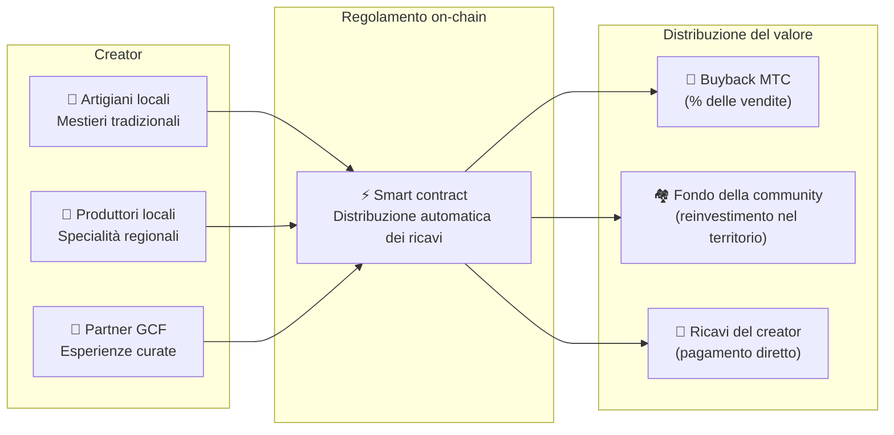

import useBaseUrl from '@docusaurus/useBaseUrl';

# 🗓️ Roadmap e team

>**A chi è arrivato fin qui — vision, design economico e fondamenta tecniche sono tutti al loro posto.**
> Non siamo un progetto speculativo di breve periodo.
>**Lo sviluppo della piattaforma principale è già completo,** e stiamo entrando nella fase in cui si scala.

---

## Milestone strategiche

### 🔥 Fase 1: Risveglio (prima metà del 2026 — ora)

**Tema: fondamenta e cash flow**

La piattaforma web è attiva e tutte e tre le app iOS (GCF Admin, J-Times, Matsuri) sono ora disponibili sull'App Store (aprile 2026). Ci concentriamo sulla monetizzazione attraverso un sistema finanziario guidato dal CEO e sull'assicurare la liquidità iniziale.

| Stato | Milestone | Dettaglio |
| :---: | :--- | :--- |
| ✅ | **Piattaforma web attiva** | La web app di Matsuri e la dashboard admin GCF (web) sono operative |
| ✅ | **Pagamenti e crescita** | Funzionalità di pagamento in MTC e funzionalità di airdrop per referral implementate |
| ✅ | **Lancio del media** | Base di distribuzione di J-Times (web e podcast) costruita |
| ✅ | **Genesis** | Token MTC emesso sulla chain Solana |
| ✅ | **Liquidità assicurata** | Pool di liquidità iniziale creato su Raydium |
| ⬜ | **Inizio degli incentivi** | Avvio del liquidity mining con APY target del 20% |
| ⬜ | **Pagamenti on-chain** | La verifica Solana Pay passa in produzione |
| ⬜ | **Reclutamento VIP** | Selezione dei primi 20 membri VIP GCF completata |

### 🚀 Fase 2: Espansione (seconda metà del 2026)

**Tema: asset reali e adventure mining**

Sfruttiamo appieno la webapp già completata, espandendo le basi fisiche e la funzionalità di «pellegrinaggio».

| Stato | Milestone | Dettaglio |
| :---: | :--- | :--- |
| ⬜ | **Rilascio di nuove funzionalità** | Implementazione e rilascio dell'adventure mining (pellegrinaggio) |
| ⬜ | **Espansione internazionale** | Sviluppo di basi partner in Asia (Thailandia, Taiwan, ecc.) ed eventi VIP |
| ⬜ | **Gestione degli asset** | Costruzione di un portafoglio di immobili, azioni e crypto |
| ⬜ | **Obiettivo** | Scala degli asset dell'ecosistema pari a **1 miliardo di yen (~6,5M dollari)** |

### 🌊 Fase 3: Circolazione (dal 2027 in poi)

**Tema: adozione di massa, economia di co-creazione, decentralizzazione**

Apertura al pubblico, marketplace on-chain e operatività piena dell'ecosistema.

| Stato | Milestone | Dettaglio |
| :---: | :--- | :--- |
| ⬜ | **Grand opening** | Rilascio ufficiale mondiale dell'app Matsuri |
| ⬜ | **Great unlock (1/6/2027)** | Sblocco del lockup dei founder + attivazione del mining pool (550M) + avvio del ciclo di halving |
| ⬜ | **Marketplace di co-creazione** | Negozi di specialità regionali + partner store GCF — pagamenti on-chain con buyback automatico di MTC |
| ⬜ | **Crowdfunding (diritti NFT)** | Gli utenti finanziano progetti culturali su Solana. I backer ricevono NFT che rappresentano diritti di proprietà, di quota sui ricavi e di governance |
| ⬜ | **Pagamenti on-chain** | Tutte le transazioni del marketplace regolate tramite smart contract — una percentuale fissa delle vendite viene automaticamente incanalata nel pool di buyback MTC |
| ⬜ | **Obiettivo** | Scala degli asset dell'ecosistema pari a **10 miliardi di yen (~65M dollari)** |
| ⬜ | **Transizione DAO** | Trasferire gradualmente l'autorità decisionale alla community GCF |

#### 🏪 Il concept del marketplace di co-creazione

L'espressione ultima dell'«OS culturale» — un marketplace decentralizzato in cui **creatori di cultura e amanti della cultura si scambiano direttamente**, senza intermediari estrattivi.

| Funzione | Descrizione | Stato |
| :--- | :--- | :---: |
| **🏺 Shop di specialità regionali** | Artigiani e produttori locali vendono direttamente ai clienti di tutto il mondo. 5–10% di sconto pagando in MTC | ⬜ Concept |
| **🎫 Crowdfunding + diritti NFT** | Finanziare progetti culturali (restauro di santuari, rinascita di festival, laboratori di artigianato). Ricevere NFT che attestano il contributo e possono conferire quote sui ricavi o diritti di governance | ⬜ Concept |
| **⚡ Regolamento on-chain** | Ogni transazione del marketplace si regola via smart contract su Solana. I ricavi si dividono in automatico: pagamento al creator + fondo della community + buyback MTC — nessuna contabilità manuale richiesta | ⬜ Concept |
| **🗳️ Governance dei backer** | I possessori di NFT votano su come i progetti da loro finanziati allocano le risorse — non mera donazione, ma vera co-creazione | ⬜ Concept |

:::info Perché tutto questo conta
Oggi i turisti acquistano souvenir in negozi che pagano «affitto» al loro padrone di casa — la piattaforma. Domani, **un artigiano della campagna di Kyoto venderà direttamente a un appassionato di Copenaghen**, e una quota di quella vendita rafforzerà automaticamente l'economia di MTC. È il flywheel nella sua forma più completa.
:::

---

## 👤 Team

  

### Ko Takahashi — founder / CEO & lead architect

| Elemento | Dettaglio |
| :--- | :--- |
| **Ruolo** | Leadership complessiva del progetto. Design della piattaforma, smart contract, sviluppo full-stack |
| **Vision** | Sostenitore dell'«OS culturale» che «esporta cultura e importa ricchezza» |
| **Postura** | Scrive il codice in prima persona e si tiene sul campo (Golden Gai) — un praticante dello «skin in the game» |

  

### Jon Anders Jensen — director / GCF ed event operations

| Elemento | Dettaglio |
| :--- | :--- |
| **Ruolo** | Operatività di GCF. Progetta l'operatività di eventi e tour e lavora sul campo |
| **Punti di forza** | Sostiene il flusso «umano» dell'ecosistema attraverso una prospettiva internazionale e relazioni di fiducia con i membri GCF |

  

### Ryunosuke Honda — director / ambasciatore della cultura regionale

| Elemento | Dettaglio |
| :--- | :--- |
| **Ruolo** | Ponte tra le culture e le comunità regionali di tutto il Giappone e l'ecosistema Matsuri |
| **Punti di forza** | Scopre beni culturali regionali e li porta sulla piattaforma Matsuri per offrire esperienze di «Deep Japan» |

### 🌏 Community GCF — membri di sviluppo sparsi per il mondo

Il Matsuri Protocol non è costruito solo dal team fondatore.
**I membri GCF in tutto il mondo** contribuiscono all'evoluzione del protocollo attraverso test, feedback, traduzioni e implementazione locale.

| Area | Struttura |
| :--- | :--- |
| **💼 Finanza globale** | Partnership con reti di investitori privati in tutta l'Asia |
| **⚙️ Ingegneria** | Un team di ingegneri distribuito tra sviluppo blockchain e sviluppo mobile |
| **🏮 Operations** | Pipeline solide con le community locali di Shinjuku Golden Gai e delle principali mete turistiche |
| **🌐 Community** | Una base di membri GCF multinazionale che include Giappone, Norvegia, Thailandia e Taiwan |

:::tip Un'infrastruttura culturale che costruiamo insieme
Se entrate in GCF, diventate anche voi co-sviluppatori del Matsuri Protocol.
Scrivere codice non è l'unica forma di contributo. Presentare luoghi sacri della vostra zona, tradurre la documentazione, pianificare eventi —
tutto questo è forza che porta questo protocollo nel mondo.
:::

---

## 🏛️ Governance (DAO)

Il Matsuri Protocol migra gradualmente dalla centralizzazione a una **DAO (organizzazione autonoma decentralizzata)**.
I membri GCF (Platinum / Gold) deterranno poi **diritti di voto** sulle seguenti materie chiave.

| Oggetto del voto | Contenuto |
| :--- | :--- |
| **💰 Allocazione dei fondi** | In quali nuove attività e in quale marketing investire i ricavi del business |
| **⚙️ Aggiornamenti di protocollo** | Messa a punto delle commissioni dell'app e dei tassi di ricompensa del mining |
| **⛩️ Accreditamento culturale** | Quali festival e santuari accreditare come «luoghi di pellegrinaggio ufficiali» e sostenere finanziariamente |

:::info Unitevi alla rivoluzione
Non stiamo costruendo semplicemente un'app.
Stiamo costruendo un'**economia culturale senza confini.**
:::

---

**[◀ Precedente: Prodotto e tecnologia](/docs/product-tech)** | **[⛩️ Torna alla home del whitepaper](/docs/intro)**
