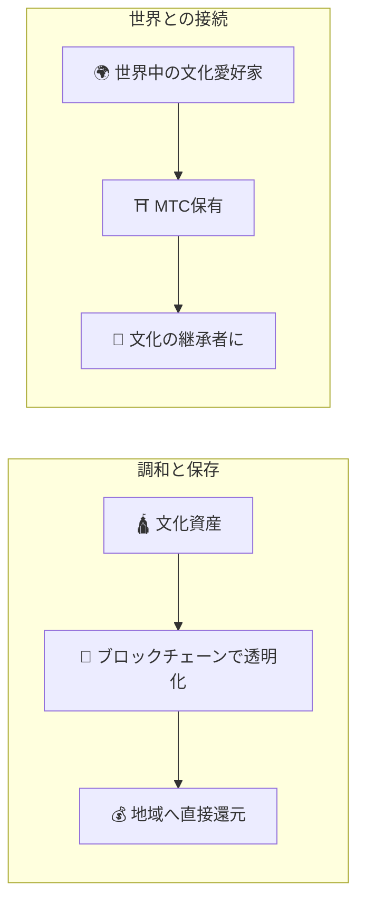

# ⛩️ Matsuri Coinへようこそ

> **調和のためのコード。平和のための価値。**
> 分断された世界に、和の架け橋を。MTCは、競争から共創へと導く、平和への道しるべ。

**Matsuri Coin（MTC）** は、Solanaブロックチェーン上に構築された分散型ユーティリティトークンです。
日本の精神的資産——「ディープ・ジャパン」——をグローバル経済圏へと接続する **「文化OS」** として設計されました。

私たちは、単なる決済手段を作っているのではありません。
日本と世界をつなぐ「架け橋」となり、文化を愛する人々が国境を越えて手を取り合う、**新しい共創の仕組み**を構築しています。

---

## 🎯 私たちの志

:::info 10兆円の市場エネルギーを、文化の未来へつなぐ
日本のインバウンド市場は年間 **10兆円** 規模へ成長しています。
しかし、ここには **「不都合な真実」** が潜んでいます。
:::

### 現状の課題

| 課題 | 実態 |
| :--- | :--- |
| 💸 **収益の流出** | 海外OTA（予約プラットフォーム）や仲介業者への手数料として、収益の大部分が国外へ流出 |
| 😤 **地域の疲弊** | オーバーツーリズムによる混雑と現場の負担だけが残り、肝心の収益は地域に還元されない |
| 🚧 **体験の壁** | 効率化されたパッケージツアーでは「本当の日本」と深く繋がることができない |

> **「日本人は苦労し、旅行者は本当の姿を知らず、富はプラットフォームへ消える。」**

私たちはWeb3の技術で、この歪んだ構造を終わらせます。
あなたが支払った対価が、透明性を持って **直接** 地域や伝統の保護に届く世界を実現します。

---

## 🏗️ 「文化」×「テクノロジー」のハイブリッドモデル

多くのプロジェクトは「経済的利益」のみを追求し、文化を消耗品として扱ってきました。
MTCは **「文化を守るための経済」** という、本来あるべきハイブリッドな構造を実現します。

| 柱 | 内容 |
| :--- | :--- |
| **🛕 調和と保存** | 観光客の支払いが、ブロックチェーンの透明性を通じて地域の文化保存や職人の支援へ確実に届く。外部資本による搾取ではなく、地域コミュニティ（GCF）が主権を持って文化を守り育てる |
| **🌍 世界との接続** | 国境や為替の壁を越え、世界中から日本の「和の心」を支援できるインフラ。MTC保有は日本の精神性や歴史の一部を共有し、その継承者の一人となること |

---

## 💎 なぜMTCを使うべきか？

MTCのエコシステムは、参加者に **「精神的な充足」** と **「経済的な実利」** の双方を提供します。

### ✨ 体験の価値

| メリット | 詳細 |
| :--- | :--- |
| **🎌 意味のある体験** | 通常の観光ではアクセスできない「ディープ・ジャパン」への扉が開かれる。禁足地への参拝や、非公開の神事への招待など |
| **🌐 世界との絆** | 帰国後もMTCを通じて日本との繋がりを維持。「また帰ってくる場所」がある安心感 |
| **⚖️ 公正な取引** | スマートコントラクトが中間搾取を排除。感謝（対価）がダイレクトにサービス提供者や地域へ届く |

### 💰 経済的なメリット

| メリット | 詳細 |
| :--- | :--- |
| **🏷️ 優待レート** | MTC払いで常に日本円価格の **5%〜10%OFF**。例: 3万円のツアー → 実質2.7万円相当 |
| **🔑 限定アクセス権** | 一見さんお断りの店や限定イベントの予約権（チケットNFT）はMTCホルダー限定 |
| **🛡️ 為替リスク回避** | 来日前にMTCを購入すれば、旅行中の為替変動を気にせず体験価値を確保 |

---

## ⚡ なぜSolanaなのか？

「観光という実需」と「高頻度取引という金融」の両立に、**Solana以外の選択肢は存在しませんでした。**

| 比較項目 | Ethereum | Solana |
| :--- | :---: | :---: |
| **送金手数料** | 数百〜数千円 | **約0.04円** |
| **処理速度** | 12秒〜数分 | **0.4秒** |
| **秒間処理能力** | 約15件 | **数千件** |

:::tip お賽銭の経済合理性
神社で「お賽銭（100円）」を投げる感覚のマイクロ決済を実現するには、**1円未満の手数料** しか許容されません。これを実現できるのはSolanaだけです。
:::

---

:::note 準備は整いました
MTCは、文化を消費するだけの「観光」を終わらせ、共に未来を創る **「共創」の旅** へと誘います。
:::

**[▶ ビジョン: なぜ今やるのか？](/docs/vision)** ｜ **[▶ GCF（VIP会員）に参加する](/docs/economy)**